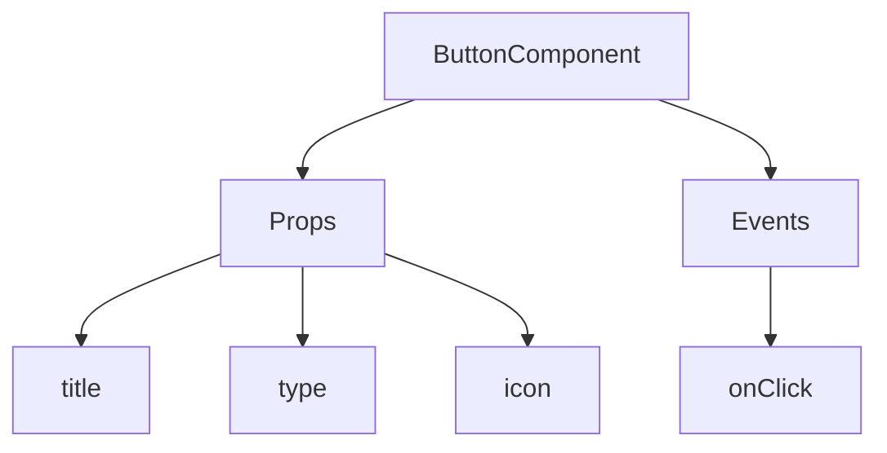
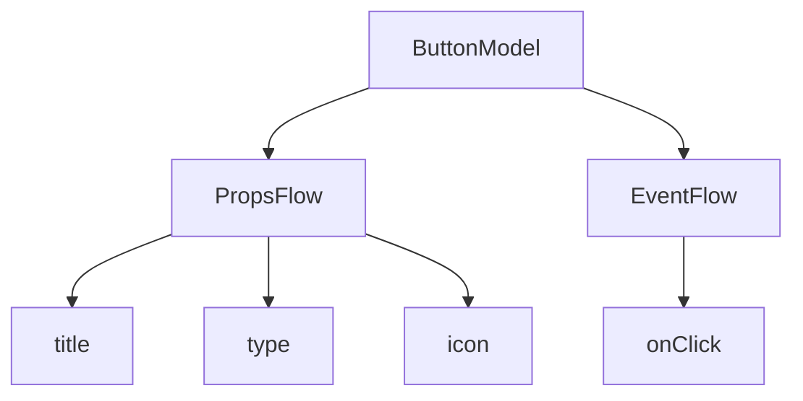

# Guida rapida: Creare un componente pulsante orchestrabile

In React, di solito renderizziamo un componente pulsante in questo modo:

```tsx pure
import { Button } from 'antd';

export default function App() {
  return <Button type="primary">Primary Button</Button>;
}
```

Sebbene il codice qui sopra sia semplice, si tratta di un **componente statico** e non può soddisfare le esigenze di una piattaforma no-code in termini di configurabilità e capacità di orchestrazione.

Nel FlowEngine di NocoBase, possiamo costruire rapidamente componenti che supportano la configurazione e sono guidati dagli eventi utilizzando **FlowModel + FlowDefinition**, ottenendo capacità no-code più potenti.

---

## Primo passo: Renderizzare il componente utilizzando FlowModel

<code src="./demos/quickstart-1-basic.tsx"></code>

### 🧠 Concetti chiave

- `FlowModel` è il modello di componente centrale in FlowEngine, che incapsula la logica del componente, il rendering e le capacità di configurazione.
- Ogni componente UI può essere istanziato e gestito in modo uniforme tramite `FlowModel`.

### 📌 Passi di implementazione

#### 1. Creare una classe modello personalizzata

```tsx pure
class MyModel extends FlowModel {
  render() {
    return <Button {...this.props} />;
  }
}
```

#### 2. Creare un'istanza del modello

```ts
const model = this.flowEngine.createModel({
  uid: 'my-model',
  use: 'MyModel',
  props: {
    type: 'primary',
    children: 'Primary Button',
  },
});
```

#### 3. Renderizzare utilizzando `<FlowModelRenderer />`

```tsx pure
<FlowModelRenderer model={model} />
```

---
:::tip Avviso di traduzione IA
Questa documentazione è stata tradotta automaticamente dall'IA.
:::


## Secondo passo: Aggiungere PropsFlow per rendere configurabili le proprietà del pulsante

<code src="./demos/quickstart-2-register-propsflow.tsx"></code>

### 💡 Perché usare PropsFlow?

L'utilizzo di Flow anziché di props statiche consente di ottenere per le proprietà:
- Configurazione dinamica
- Modifica visuale
- Replay e persistenza dello stato

### 🛠 Modifiche chiave

#### 1. Definire il Flow per le proprietà del pulsante

```tsx pure

const buttonSettings = defineFlow({
  key: 'buttonSettings',
  
  title: 'Impostazioni pulsante',
  steps: {
    setProps: {
      title: 'Configurazione generale',
      uiSchema: {
        title: {
          type: 'string',
          title: 'Titolo pulsante',
          'x-decorator': 'FormItem',
          'x-component': 'Input',
        },
        type: {
          type: 'string',
          title: 'Tipo',
          'x-decorator': 'FormItem',
          'x-component': 'Select',
          enum: [
            { label: 'Primario', value: 'primary' },
            { label: 'Predefinito', value: 'default' },
            { label: 'Pericolo', value: 'danger' },
            { label: 'Tratteggiato', value: 'dashed' },
            { label: 'Link', value: 'link' },
            { label: 'Testo', value: 'text' },
          ],
        },
        icon: {
          type: 'string',
          title: 'Icona',
          'x-decorator': 'FormItem',
          'x-component': 'Select',
          enum: [
            { label: 'Cerca', value: 'SearchOutlined' },
            { label: 'Aggiungi', value: 'PlusOutlined' },
            { label: 'Elimina', value: 'DeleteOutlined' },
            { label: 'Modifica', value: 'EditOutlined' },
            { label: 'Impostazioni', value: 'SettingOutlined' },
          ],
        },
      },
      defaultParams: {
        type: 'primary',
      },
      // Funzione handler dello step, imposta le proprietà del modello
      handler(ctx, params) {
        ctx.model.setProps('children', params.title);
        ctx.model.setProps('type', params.type);
        ctx.model.setProps('icon', params.icon ? React.createElement(icons[params.icon]) : undefined);
      },
    },
  },
});

MyModel.registerFlow(buttonSettings);
```

#### 2. Utilizzare `stepParams` al posto delle `props` statiche

```diff
const model = this.flowEngine.createModel({
  uid: 'my-model',
  use: 'MyModel',
- props: {
-   type: 'primary',
-   children: 'Primary Button',
- },
+ stepParams: {
+   buttonSettings: {
+     general: {
+       title: 'Pulsante Primario',
+       type: 'primary',
+     },
+   },
+ },
});
```

> ✅ L'utilizzo di `stepParams` è l'approccio raccomandato in FlowEngine, poiché evita problemi con dati non serializzabili (come i componenti React).

#### 3. Abilitare l'interfaccia di configurazione delle proprietà

```diff
- <FlowModelRenderer model={model} />
+ <FlowModelRenderer model={model} showFlowSettings />
```

---

## Terzo passo: Supportare il flusso di eventi del pulsante (EventFlow)

<code src="./demos/quickstart-3-register-eventflow.tsx"></code>

### 🎯 Scenario: Mostrare una finestra di dialogo di conferma dopo aver cliccato il pulsante

#### 1. Ascoltare l'evento onClick

Aggiungere onClick in modo non invasivo

```diff
const myPropsFlow = defineFlow({
  key: 'buttonSettings',
  steps: {
    general: {
      // ... omesso
      handler(ctx, params) {
        // ... omesso
+       ctx.model.setProps('onClick', (event) => {
+         ctx.model.dispatchEvent('click', { event });
+       });
      },
    },
  },
});
```

#### 2. Definire il flusso di eventi

```ts
const myEventFlow = defineFlow({
  key: 'clickSettings',
  on: 'click',
  title: 'Evento pulsante',
  steps: {
    confirm: {
      title: 'Configurazione azione di conferma',
      uiSchema: {
        title: {
          type: 'string',
          title: 'Titolo del prompt della finestra di dialogo',
          'x-decorator': 'FormItem',
          'x-component': 'Input',
        },
        content: {
          type: 'string',
          title: 'Contenuto del prompt della finestra di dialogo',
          'x-decorator': 'FormItem',
          'x-component': 'Input.TextArea',
        },
      },
      defaultParams: {
        title: 'Conferma azione',
        content: 'Ha cliccato il pulsante, vuole confermare?',
      },
      async handler(ctx, params) {
        // Finestra di dialogo
        const confirmed = await ctx.modal.confirm({
          title: params.title,
          content: params.content,
        });
        // Messaggio
        await ctx.message.info(`Ha cliccato il pulsante, risultato della conferma: ${confirmed ? 'Confermato' : 'Annullato'}`);
      },
    },
  },
});
MyModel.registerFlow(myEventFlow);
```

**Note aggiuntive:**
- EventFlow consente di configurare in modo flessibile il comportamento del pulsante tramite un flusso, ad esempio mostrando finestre di dialogo, messaggi, effettuando chiamate API, ecc.
- Può registrare diversi flussi di eventi per diversi eventi (come `onClick`, `onMouseEnter`, ecc.) per soddisfare requisiti aziendali complessi.

#### 3. Configurare i parametri del flusso di eventi

Quando crea il modello, può configurare i parametri predefiniti per il flusso di eventi tramite `stepParams`:

```ts
const model = this.flowEngine.createModel({
  uid: 'my-model',
  use: 'MyModel',
  stepParams: {
    buttonSettings: {
      general: {
        title: 'Pulsante Primario',
        type: 'primary',
      },
    },
    clickSettings: {
      confirm: {
        title: 'Conferma azione',
        content: 'Ha cliccato il pulsante, vuole confermare?',
      },
    },
  },
});
```

---

## Confronto modelli: ReactComponent vs FlowModel

Flow non modifica il modo in cui i componenti vengono implementati. Si limita ad aggiungere il supporto per PropsFlow ed EventFlow a un ReactComponent, consentendo così di configurare e orchestrare visivamente le proprietà e gli eventi del componente.


### ReactComponent



### FlowModel



## Riepilogo

Attraverso i tre passi precedenti, abbiamo completato un componente pulsante che supporta la configurazione e l'orchestrazione degli eventi, con i seguenti vantaggi:

- 🚀 Configurazione visuale delle proprietà (come titolo, tipo, icona)
- 🔄 Le risposte agli eventi possono essere gestite da un flusso (ad esempio, clic per mostrare una finestra di dialogo)
- 🔧 Supporta estensioni future (come logica condizionale, binding di variabili, ecc.)

Questo modello è applicabile anche a qualsiasi componente UI, come moduli, elenchi e grafici. Nel FlowEngine di NocoBase, **tutto è orchestrabile**.