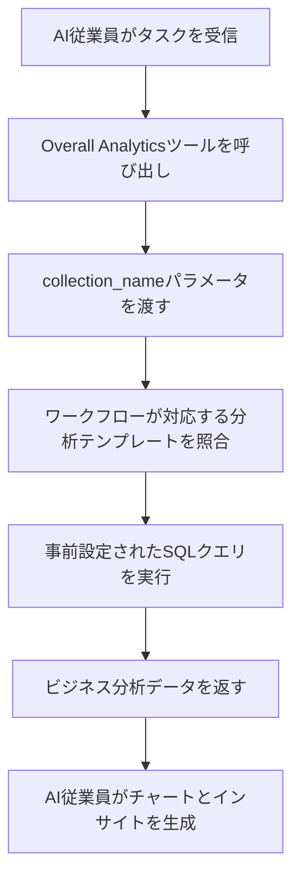

:::tip
このドキュメントはAIによって翻訳されました。不正確な情報については、[英語版](/en)をご参照ください
:::


# ロールと権限

## イントロダクション

AI従業員の権限管理には、2つのレベルがあります：

1.  **AI従業員のアクセス権限**：どのユーザーがどのAI従業員を使用できるかを制御します。
2.  **データアクセス権限**：AI従業員がデータを処理する際に、どのように権限管理を適用するかを制御します。

このドキュメントでは、これら2種類の権限の設定方法と動作原理について詳しく説明します。

---

## AI従業員のアクセス権限の設定

### ロールが使用できるAI従業員を設定する

`User & Permissions`ページに移動し、`Roles & Permissions`タブをクリックして、ロール設定ページに入ります。


ロールを選択し、`Permissions`タブをクリックし、次に`AI employees`タブをクリックすると、AI従業員プラグインで管理されているAI従業員のリストが表示されます。

AI従業員リストの`Available`列のチェックボックスをクリックして、現在のロールがそのAI従業員にアクセスできるかどうかを制御します。


## データアクセス権限

AI従業員がデータを処理する際、権限管理の方法は使用されるツールの種類によって異なります：

### システム内蔵のデータクエリツール（ユーザー権限に従う）


以下のツールは、**現在のユーザーのデータ権限に厳密に従って**データにアクセスします：

| ツール名 | 説明 |
| --- | --- |
| **Data source query** | データソース、コレクション、フィールドを使用してデータベースをクエリします |
| **Data source records counting** | データソース、コレクション、フィールドを使用してレコード総数をカウントします |

**動作原理:**

AI従業員がこれらのツールを呼び出すと、システムは以下の処理を行います：
1.  現在ログインしているユーザーのIDを識別します。
2.  そのユーザーに**ロールと権限**で設定されたデータアクセスルールを適用します。
3.  ユーザーが閲覧権限を持つデータのみを返します。

**シナリオ例:**

営業担当者Aが自身が担当する顧客データしか閲覧できないとします。彼がAI従業員Vizを使って顧客を分析する場合：
- Vizは`Data source query`を呼び出して顧客コレクションをクエリします。
- システムは営業担当者Aのデータ権限フィルタリングルールを適用します。
- Vizは営業担当者Aがアクセス権を持つ顧客データのみを閲覧・分析できます。

これにより、**AI従業員がユーザー自身のデータアクセス境界を超えることはない**と保証されます。

---

### ワークフローによるカスタムビジネスツール（独立した権限ロジック）

ワークフローを通じてカスタマイズされたビジネスクエリツールの権限管理は、**ユーザー権限から独立しており**、ワークフローのビジネスロジックによって決定されます。

これらのツールは通常、以下のような用途で使用されます：
- 固定のビジネス分析プロセス
- 事前設定された集計クエリ
- 権限の境界を越えた統計分析

#### 例1：Overall Analytics（総合的なビジネス分析）


CRMデモでは、`Overall Analytics`はテンプレートベースのビジネス分析エンジンです：

| 特徴 | 説明 |
| --- | --- |
| **実装方法** | ワークフローが事前設定されたSQLテンプレートを読み取り、読み取り専用クエリを実行します |
| **権限管理** | 現在のユーザー権限に制限されず、テンプレートで定義された固定のビジネスデータを出力します |
| **利用シナリオ** | 特定のビジネスオブジェクト（リード、商談、顧客など）に対して標準化された全体分析を提供します |
| **セキュリティ** | すべてのクエリテンプレートは管理者によって事前設定・レビューされ、動的なSQL生成を回避します |

**ワークフロー:**



**主な特徴:**
- このツールを呼び出すどのユーザーも**同じビジネス視点**を得られます。
- データ範囲はビジネスロジックによって定義され、ユーザー権限によるフィルタリングは受けません。
- 標準化されたビジネス分析レポートの提供に適しています。

#### 例2：SQL Execution（高度な分析ツール）


CRMデモでは、`SQL Execution`はより柔軟ですが、厳格な管理が必要なツールです：

| 特徴 | 説明 |
| --- | --- |
| **実装方法** | AIがSQL文を生成し実行することを許可します |
| **権限管理** | ワークフローによってアクセスが制御され、通常は管理者に限定されます |
| **利用シナリオ** | 高度なデータ分析、探索的クエリ、クロスコレクション集計分析 |
| **セキュリティ** | ワークフローで読み取り専用操作（SELECT）に制限し、タスク設定を通じて利用可能性を制御する必要があります |

**セキュリティに関する推奨事項:**

1.  **利用範囲の制限**：管理ブロックのタスクでのみ有効にするように設定します。
2.  **プロンプトによる制約**：タスクのプロンプトでクエリ範囲とコレクション名を明確に限定します。
3.  **ワークフローでの検証**：ワークフローでSQL文を検証し、SELECT操作のみが実行されるようにします。
4.  **監査ログ**：実行されたすべてのSQL文を記録し、追跡を容易にします。

**設定例:**

```markdown
タスクプロンプトの制約:
- CRM関連のコレクション（leads, opportunities, accounts, contacts）のみクエリ可能
- SELECTクエリのみ実行可能
- 時間範囲は直近1年間に限定
- 結果は1000レコード以下に制限
```

---

## 権限設計の推奨事項

### ビジネスシナリオに応じた権限戦略の選択

| ビジネスシナリオ | 推奨ツールタイプ | 権限戦略 | 理由 |
| --- | --- | --- | --- |
| 営業担当者が自身の顧客を閲覧 | システム内蔵クエリツール | ユーザー権限に従う | データ分離を確保し、ビジネスセキュリティを保護するため |
| 部門マネージャーがチームデータを閲覧 | システム内蔵クエリツール | ユーザー権限に従う | 部門のデータ範囲が自動的に適用されるため |
| 経営幹部が全社的なビジネス分析を閲覧 | ワークフローカスタムツール / Overall Analytics | 独立したビジネスロジック | 標準化された全体的な視点を提供するため |
| データアナリストが探索的クエリを実行 | SQL Execution | 利用可能な対象を厳格に制限 | 柔軟性が必要だが、アクセス範囲を制御する必要があるため |
| 一般ユーザーが標準レポートを閲覧 | Overall Analytics | 独立したビジネスロジック | 分析基準が固定されており、基盤となる権限を気にする必要がないため |

### 多層防御戦略

機密性の高いビジネスシナリオでは、多層的な権限管理を採用することをお勧めします：

1.  **AI従業員アクセス層**：どのロールがどのAI従業員を使用できるかを制御します。
2.  **タスク可視性層**：ブロック設定を通じてタスクが表示されるかどうかを制御します。
3.  **ツール認可層**：ワークフローでユーザーのIDと権限を検証します。
4.  **データアクセス層**：ユーザー権限またはビジネスロジックを通じてデータ範囲を制御します。

**例:**

```
シナリオ：財務部門のみがAIを使用して財務分析を行える

- AI従業員の権限：「Finance Analyst」AI従業員には財務ロールのみがアクセス可能
- タスク設定：財務分析タスクは財務モジュールにのみ表示
- ツール設計：財務ワークフローツールがユーザーの部門を検証
- データ権限：財務コレクションへのアクセス権限は財務ロールにのみ付与
```

---

## よくある質問

### Q: AI従業員はどのデータにアクセスできますか？

**A:** 使用されるツールの種類によります：
- **システム内蔵クエリツール**：現在のユーザーが閲覧権限を持つデータにのみアクセスできます。
- **ワークフローカスタムツール**：ワークフローのビジネスロジックによって決定され、ユーザー権限に制限されない場合があります。

### Q: AI従業員による機密データの漏洩を防ぐにはどうすればよいですか？

**A:** 多層防御を採用します：
1.  AI従業員のロールアクセス権限を設定し、誰が使用できるかを制限します。
2.  システム内蔵ツールについては、ユーザーのデータ権限による自動フィルタリングに依存します。
3.  カスタムツールについては、ワークフローでビジネスロジックの検証を実装します。
4.  機密性の高い操作（SQL Executionなど）は管理者にのみ認可します。

### Q: 特定のAI従業員にユーザー権限の制限を回避させたい場合はどうすればよいですか？

**A:** ワークフローカスタムビジネスツールを使用します：
- 特定のビジネスクエリロジックを実装するワークフローを作成します。
- ワークフローでデータ範囲とアクセスルールを制御します。
- AI従業員が使用できるようにツールを設定します。
- AI従業員のアクセス権限を通じて、誰がこの機能を呼び出せるかを制御します。

### Q: Overall AnalyticsとSQL Executionの違いは何ですか？

**A:**

| 比較項目 | Overall Analytics | SQL Execution |
| --- | --- | --- |
| 柔軟性 | 低（事前設定されたテンプレートのみ使用可能） | 高（動的にクエリを生成可能） |
| セキュリティ | 高（すべてのクエリが事前にレビュー済み） | 中（制約と検証が必要） |
| 対象ユーザー | 一般的なビジネスユーザー | 管理者または上級アナリスト |
| メンテナンスコスト | 分析テンプレートのメンテナンスが必要 | メンテナンス不要だが、監視が必要 |
| データ一貫性 | 強（標準化された指標） | 弱（クエリ結果が一致しない可能性あり） |

---

## ベストプラクティス

1.  **デフォルトでユーザー権限に従う**：明確なビジネス要件がない限り、ユーザー権限に従うシステム内蔵ツールを優先的に使用します。
2.  **標準分析のテンプレート化**：一般的な分析シナリオについては、Overall Analyticsパターンを使用して標準化された機能を提供します。
3.  **高度なツールの厳格な管理**：SQL Executionのような高権限ツールは、少数の管理者にのみ認可します。
4.  **タスクレベルの分離**：機密性の高いタスクを特定のブロックに設定し、ページアクセス権限を通じて分離を実現します。
5.  **監査と監視**：AI従業員のデータアクセス行動を記録し、異常な操作を定期的にレビューします。

---