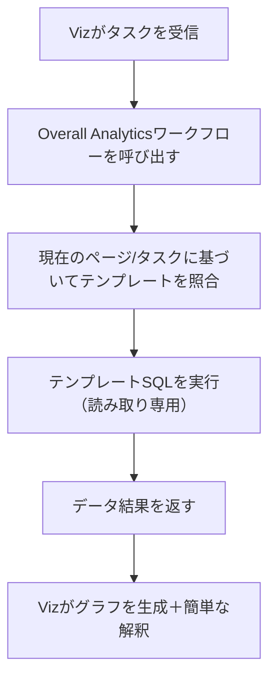

:::tip
このドキュメントはAIによって翻訳されました。不正確な情報については、[英語版](/en)をご参照ください
:::


# AIエージェント・Viz：CRMシナリオ設定ガイド

> CRMの例を参考に、AIインサイトアナリストがビジネスを真に理解し、その潜在能力を最大限に引き出す方法を学びましょう。

## 1. はじめに：Vizを「データを見る」から「ビジネスを理解する」へ

NocoBaseシステムにおいて、**Viz**は組み込みのAIインサイトアナリストです。
Vizは、ページコンテキスト（リード、商談、アカウントなど）を認識し、トレンドグラフ、ファネルグラフ、KPIカードを生成できます。
しかし、デフォルトでは、Vizは最も基本的なクエリ機能しか持っていません。

| ツール                      | 機能説明          | セキュリティ |
| ----------------------- | ------------- | -------- |
| Get Collection Names    | コレクションリストを取得 | ✅ 安全    |
| Get Collection Metadata | フィールド構造を取得    | ✅ 安全    |

これらのツールはVizに「構造を認識させる」だけであり、まだ「内容を真に理解させる」ことはできません。
Vizにインサイトを生成させ、異常を発見させ、トレンドを分析させるには、**より適切な分析ツールを拡張する**必要があります。

公式のCRMデモでは、2つの方法を使用しています。

*   **Overall Analytics（汎用分析エンジン）**：テンプレート化され、安全で再利用可能なソリューションです。
*   **SQL Execution（特化分析エンジン）**：より高い自由度を提供しますが、リスクも大きくなります。

これら2つが唯一の選択肢というわけではありません。これらはむしろ**設計パラダイム**のようなものです。

> その原理に従って、ご自身のビジネスにより適した実装を作成できます。

---

## 2. Vizの構造：安定したペルソナ＋柔軟なタスク

Vizを拡張する方法を理解するには、まずその内部が階層的に設計されていることを理解する必要があります。

| 階層       | 説明                                    | 例     |
| -------- | ------------------------------------- | ------ |
| **ロール定義** | Vizのペルソナと分析方法：理解 → クエリ → 分析 → 可視化 | 固定     |
| **タスク定義** | 特定のビジネスシナリオに合わせたプロンプトとツールの組み合わせ | 変更可能 |
| **ツール設定** | Vizが外部データソースやワークフローを呼び出すための橋渡し | 自由に置き換え可能 |

このような階層設計により、Vizは安定した個性（一貫した分析ロジック）を維持し、
同時に、さまざまなビジネスシナリオ（CRM、病院管理、チャネル分析、生産運用など）に迅速に適応できます。

## 3. パターン1：テンプレート化された分析エンジン（推奨）

### 3.1 原理の概要

**Overall Analytics**は、CRMデモにおけるコア分析エンジンです。
これは、**データ分析テンプレートコレクション（data_analysis）**を介してすべてのSQLクエリを管理します。
VizはSQLを直接記述するのではなく、**定義済みのテンプレートを呼び出して**結果を生成します。

実行フローは以下の通りです。



これにより、Vizは数秒で安全かつ標準化された分析結果を生成でき、
管理者はすべてのSQLテンプレートを一元的に管理およびレビューできます。

---

### 3.2 テンプレートコレクションの構造（data_analysis）

| フィールド名                                         | タイプ       | 説明              | 例                                                 |
| ------------------------------------------------- | -------- | --------------- | -------------------------------------------------- |
| **id**                                            | Integer  | 主キー            | 1                                                  |
| **name**                                          | Text     | 分析テンプレート名      | Leads Data Analysis                                |
| **collection**                                    | Text     | 対応するコレクション    | Lead                                               |
| **sql**                                           | Code     | 分析SQLステートメント（読み取り専用） | `SELECT stage, COUNT(*) FROM leads GROUP BY stage` |
| **description**                                   | Markdown | テンプレートの説明または定義 | "段階別のリード数"                                        |
| **createdAt / createdBy / updatedAt / updatedBy** | システムフィールド | 監査情報          | 自動生成                                               |

#### CRMデモにおけるテンプレート例

| 名前                             | コレクション  | 説明              |
| -------------------------------- | ----------- | --------------- |
| Account Data Analysis            | Account     | アカウントデータ分析    |
| Contact Data Analysis            | Contact     | 連絡先データ分析      |
| Leads Data Analysis              | Lead        | リードトレンド分析    |
| Opportunity Data Analysis        | Opportunity | 商談ステージファネル    |
| Task Data Analysis               | Todo Tasks  | TODOタスクのステータス統計 |
| Users (Sales Reps) Data Analysis | Users       | 営業担当者のパフォーマンス比較 |

---

### 3.3 このパターンの利点

| 観点       | 利点                                 |
| -------- | ---------------------------------- |
| **セキュリティ** | すべてのSQLが保存されレビューされるため、直接クエリが生成されるのを防ぎます。 |
| **保守性**   | テンプレートは一元的に管理され、統一的に更新されます。       |
| **再利用性** | 同じテンプレートを複数のタスクで再利用できます。         |
| **移植性**   | 同じコレクション構造があれば、他のシステムへ簡単に移行できます。   |
| **ユーザーエクスペリエンス** | ビジネスユーザーはSQLを気にする必要がなく、分析リクエストを発行するだけです。 |

> 📘 この `data_analysis` コレクションは、この名前である必要はありません。
> 重要なのは、**分析ロジックをテンプレートとして保存し**、ワークフローによって一元的に呼び出すことです。

---

### 3.4 Vizにそれを使用させる方法

タスク定義で、Vizに明確に指示できます。

```markdown
Vizさん、

現在のモジュールのデータを分析してください。

**優先事項：** Overall Analyticsツールを使用し、テンプレートコレクションから分析結果を取得してください。
**一致するテンプレートが見つからない場合：** テンプレートが不足していることを伝え、管理者に追記を提案してください。

出力要件：
- 各結果に対して個別のグラフを生成してください。
- グラフの下に2〜3文の簡単な説明を付けてください。
- データを作成したり、仮定を立てたりしないでください。
```

これにより、Vizは自動的にワークフローを呼び出し、テンプレートコレクションから最適なSQLを照合してグラフを生成します。

---

## 4. パターン2：特化型SQLエグゼキューター（注意して使用）

### 4.1 適用シナリオ

探索的分析、一時的なクエリ、または複数コレクションのJOIN集計が必要な場合、Vizに**SQL Execution**ツールを呼び出させることができます。

このツールの特徴は以下の通りです。

*   Vizが直接`SELECT`クエリを生成できます。
*   システムが実行し、結果を返します。
*   Vizが分析と可視化を担当します。

タスク例：

> "過去90日間の地域別リードコンバージョン率の変化トレンドを分析してください。"

この場合、Vizは以下を生成する可能性があります。

```sql
SELECT region, COUNT(id) AS leads, SUM(converted)::float/COUNT(id) AS rate
FROM leads
WHERE created_at > now() - interval '90 day'
GROUP BY region;
```

---

### 4.2 リスクと保護に関する推奨事項

| リスクポイント             | 保護戦略                               |
| -------------------- | ---------------------------------- |
| 書き込み操作の生成         | `SELECT`に強制的に制限する                 |
| 無関係なコレクションへのアクセス | コレクション名が存在するか検証する             |
| 大規模コレクションでのパフォーマンスリスク | 時間範囲を制限し、LIMIT句で行数を制限する      |
| 操作の追跡可能性           | クエリログと監査を有効にする                 |
| ユーザー権限の制御         | 管理者のみがこのツールを使用できるようにする       |

> 一般的な推奨事項：
>
> *   一般ユーザーはテンプレート化された分析（Overall Analytics）のみを有効にするべきです。
> *   管理者または上級アナリストのみがSQL Executionを使用できるようにするべきです。

---

## 5. 独自の「Overall Analytics」を構築したい場合

以下は、NocoBaseに依存せず、どのシステムにも適用できるシンプルな汎用アプローチです。

### ステップ1：テンプレートコレクションを設計する

コレクション名は任意です（例：`analysis_templates`）。
`name`、`sql`、`collection`、`description`のフィールドが含まれていれば十分です。

### ステップ2：「テンプレート取得→実行」サービスまたはワークフローを作成する

ロジック：

1.  タスクまたはページコンテキスト（例：現在のコレクション）を受信する。
2.  テンプレートを照合する。
3.  テンプレートSQLを実行する（読み取り専用）。
4.  標準化されたデータ構造（rows + fields）を返す。

### ステップ3：AIにこのインターフェースを呼び出させる

タスクプロンプトは次のように記述できます。

```
まずテンプレート分析ツールを呼び出してください。テンプレート内に一致する分析がない場合は、SQLエグゼキューターを使用してください。
すべてのクエリが読み取り専用であることを確認し、結果を表示するグラフを生成してください。
```

> これにより、あなたのAIエージェントシステムはCRMデモと同様の分析能力を持つことになりますが、完全に独立しており、カスタマイズ可能です。

---

## 6. ベストプラクティスと設計に関する推奨事項

| 推奨事項                     | 説明                                     |
| ---------------------- | -------------------------------------- |
| **テンプレート化された分析を優先する** | 安全で、安定しており、再利用可能です。                   |
| **SQL Executionは補完的にのみ使用する** | 内部デバッグまたは一時的なクエリに限定されます。           |
| **1つのグラフに1つの主要なポイント** | 出力を明確にし、過度な混雑を避けます。                   |
| **テンプレートの命名を明確にする**     | ページ/ビジネスドメインに対応した命名を行う。例：`Leads-Stage-Conversion` |
| **説明は簡潔かつ明確に**         | 各グラフに2〜3文の要約を添えます。                 |
| **テンプレートがない場合は説明する**   | 空白の出力ではなく、「対応するテンプレートが見つかりませんでした」とユーザーに伝えます。 |

---

## 7. CRMデモからあなたのシナリオへ

病院CRM、生産製造、倉庫物流、教育募集など、どのような分野であっても、
以下の3つの質問に答えられれば、Vizはあなたのシステムで価値を発揮できます。

| 質問                 | 例                     |
| ------------------ | -------------------- |
| **1. 何を分析したいですか？** | リードトレンド / 成約ステージ / 設備稼働率 |
| **2. データはどこにありますか？** | どのコレクション、どのフィールド     |
| **3. どのように提示したいですか？** | 折れ線、ファネル、円グラフ、比較表   |

これらの内容を定義したら、あとは次のことを行うだけです。

*   分析ロジックをテンプレートコレクションに書き込む。
*   タスクプロンプトをページにアタッチする。
*   Vizがあなたのレポート分析を「引き継ぐ」ことができます。

---

## 8. まとめ：このパラダイムを持ち帰りましょう

「Overall Analytics」と「SQL Execution」は、単なる2つの実装例に過ぎません。
より重要なのは、その背後にある考え方です。

> **AIエージェントにプロンプトを実行させるだけでなく、あなたのビジネスロジックを理解させることです。**

NocoBase、プライベートシステム、あるいは独自に作成したワークフローのいずれを使用しているかに関わらず、
この構造を再現できます。

*   テンプレートの一元化
*   ワークフローによる呼び出し
*   読み取り専用実行
*   AIによる提示

こうすることで、Vizは単なる「グラフを生成できるAI」ではなく、
あなたのデータ、定義、ビジネスを理解する真の分析アナリストとなるでしょう。