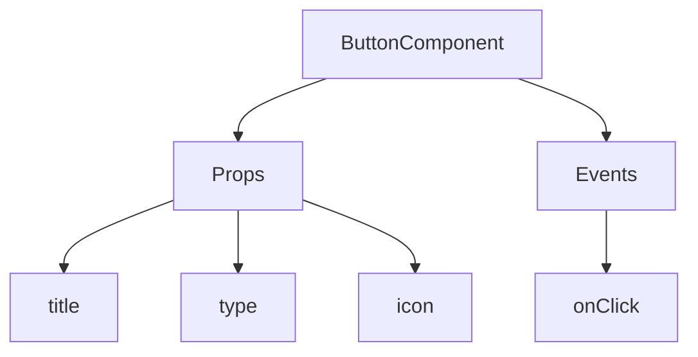
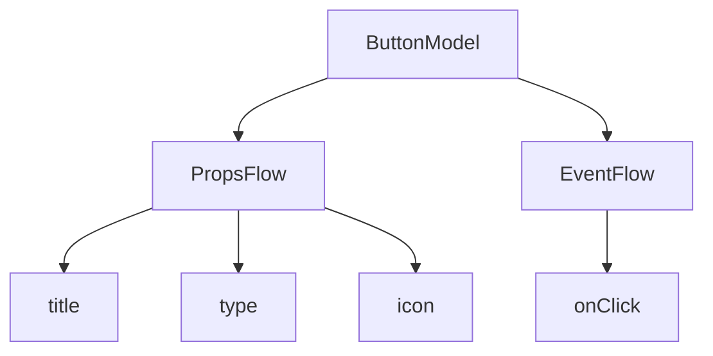

:::tip
このドキュメントはAIによって翻訳されました。不正確な情報については、[英語版](/en)をご参照ください
:::


# クイックスタート：オーケストレーション可能なボタンコンポーネントを構築する

Reactでは、通常このようにボタンコンポーネントをレンダリングします。

```tsx pure
import { Button } from 'antd';

export default function App() {
  return <Button type="primary">Primary Button</Button>;
}
```

上記のコードはシンプルですが、**静的コンポーネント**であり、ノーコードプラットフォームが求める設定可能性やオーケストレーション能力には対応できません。

NocoBaseの**FlowEngine**では、**FlowModel**と**FlowDefinition**を使って、設定可能でイベント駆動型のコンポーネントを素早く構築し、より強力なノーコード機能を実現できます。

---

## ステップ1：FlowModelを使ってコンポーネントをレンダリングする

<code src="./demos/quickstart-1-basic.tsx"></code>

### 🧠 主要なコンセプト

- `FlowModel`は**FlowEngine**におけるコアコンポーネントモデルであり、コンポーネントのロジック、レンダリング、設定機能をカプセル化します。
- すべてのUIコンポーネントは`FlowModel`を通じてインスタンス化され、一元的に管理できます。

### 📌 実装手順

#### 1. カスタムモデルクラスを作成する

```tsx pure
class MyModel extends FlowModel {
  render() {
    return <Button {...this.props} />;
  }
}
```

#### 2. モデルインスタンスを作成する

```ts
const model = this.flowEngine.createModel({
  uid: 'my-model',
  use: 'MyModel',
  props: {
    type: 'primary',
    children: 'Primary Button',
  },
});
```

#### 3. `<FlowModelRenderer />`を使ってレンダリングする

```tsx pure
<FlowModelRenderer model={model} />
```

## ステップ2：PropsFlowを追加してボタンのプロパティを設定可能にする

<code src="./demos/quickstart-2-register-propsflow.tsx"></code>

### 💡 なぜPropsFlowを使うのか？

静的なpropsではなく**Flow**を使うことで、プロパティの以下の機能を実現できます。
- 動的な設定
- ビジュアル編集
- 状態のリプレイと永続化

### 🛠 主な変更点

#### 1. ボタンプロパティの**Flow**を定義する

```tsx pure

const buttonSettings = defineFlow({
  key: 'buttonSettings',
  
  title: 'ボタン設定',
  steps: {
    general: {
      title: '一般設定',
      uiSchema: {
        title: {
          type: 'string',
          title: 'ボタンタイトル',
          'x-decorator': 'FormItem',
          'x-component': 'Input',
        },
        type: {
          type: 'string',
          title: 'タイプ',
          'x-decorator': 'FormItem',
          'x-component': 'Select',
          enum: [
            { label: 'プライマリ', value: 'primary' },
            { label: 'デフォルト', value: 'default' },
            { label: '危険', value: 'danger' },
            { label: '点線', value: 'dashed' },
            { label: 'リンク', value: 'link' },
            { label: 'テキスト', value: 'text' },
          ],
        },
        icon: {
          type: 'string',
          title: 'アイコン',
          'x-decorator': 'FormItem',
          'x-component': 'Select',
          enum: [
            { label: '検索', value: 'SearchOutlined' },
            { label: '追加', value: 'PlusOutlined' },
            { label: '削除', value: 'DeleteOutlined' },
            { label: '編集', value: 'EditOutlined' },
            { label: '設定', value: 'SettingOutlined' },
          ],
        },
      },
      defaultParams: {
        type: 'primary',
      },
      // ステップハンドラー関数、モデルプロパティを設定
      handler(ctx, params) {
        ctx.model.setProps('children', params.title);
        ctx.model.setProps('type', params.type);
        ctx.model.setProps('icon', params.icon ? React.createElement(icons[params.icon]) : undefined);
      },
    },
  },
});

MyModel.registerFlow(buttonSettings);
```

#### 2. 静的な`props`の代わりに`stepParams`を使用する

```diff
const model = this.flowEngine.createModel({
  uid: 'my-model',
  use: 'MyModel',
- props: {
-   type: 'primary',
-   children: 'Primary Button',
- },
+ stepParams: {
+   buttonSettings: {
+     general: {
+       title: 'Primary Button',
+       type: 'primary',
+     },
+   },
+ },
});
```

> ✅ `stepParams`を使用することは**FlowEngine**が推奨する方法であり、Reactコンポーネントのようなシリアライズ不可能なデータに関する問題を回避できます。

#### 3. プロパティ設定インターフェースを有効にする

```diff
- <FlowModelRenderer model={model} />
+ <FlowModelRenderer model={model} showFlowSettings />
```

---

## ステップ3：ボタンのイベントフロー（EventFlow）をサポートする

<code src="./demos/quickstart-3-register-eventflow.tsx"></code>

### 🎯 シナリオ：ボタンクリック後に確認ダイアログを表示する

#### 1. onClickイベントをリッスンする

非侵入的な方法でonClickを追加します。

```diff
const myPropsFlow = defineFlow({
  key: 'buttonSettings',
  steps: {
    general: {
      // ... 省略
      handler(ctx, params) {
        // ... 省略
+       ctx.model.setProps('onClick', (event) => {
+         ctx.model.dispatchEvent('click', { event });
+       });
      },
    },
  },
});
```

#### 2. イベントフローを定義する

```ts
const myEventFlow = defineFlow({
  key: 'clickSettings',
  on: 'click',
  title: 'ボタンイベント',
  steps: {
    confirm: {
      title: '確認操作設定',
      uiSchema: {
        title: {
          type: 'string',
          title: 'ダイアログのプロンプトタイトル',
          'x-decorator': 'FormItem',
          'x-component': 'Input',
        },
        content: {
          type: 'string',
          title: 'ダイアログのプロンプト内容',
          'x-decorator': 'FormItem',
          'x-component': 'Input.TextArea',
        },
      },
      defaultParams: {
        title: '操作の確認',
        content: 'ボタンをクリックしました。確認しますか？',
      },
      async handler(ctx, params) {
        // ダイアログ
        const confirmed = await ctx.modal.confirm({
          title: params.title,
          content: params.content,
        });
        // メッセージ
        await ctx.message.info(`ボタンをクリックしました。確認結果：${confirmed ? '確認済み' : 'キャンセル'}`);
      },
    },
  },
});
MyModel.registerFlow(myEventFlow);
```

**補足説明：**
- **イベントフロー**（**EventFlow**）を使用すると、ボタンの動作をフローを通じて柔軟に設定できます。例えば、ダイアログの表示、メッセージ、API呼び出しなどです。
- `onClick`や`onMouseEnter`などの異なるイベントに対して、それぞれ異なる**イベントフロー**を登録することで、複雑なビジネス要件に対応できます。

#### 3. イベントフローのパラメーターを設定する

モデルを作成する際に、`stepParams`を通じて**イベントフロー**のデフォルトパラメーターを設定できます。

```ts
const model = this.flowEngine.createModel({
  uid: 'my-model',
  use: 'MyModel',
  stepParams: {
    buttonSettings: {
      general: {
        title: 'Primary Button',
        type: 'primary',
      },
    },
    clickSettings: {
      confirm: {
        title: '操作の確認',
        content: 'ボタンをクリックしました。確認しますか？',
      },
    },
  },
});
```

---

## モデル比較図：ReactComponent vs FlowModel

**Flow**はコンポーネントの実装方法を変更するものではありません。単に**ReactComponent**に**PropsFlow**と**EventFlow**のサポートを追加し、コンポーネントのプロパティとイベントを視覚的に設定・オーケストレーションできるようにするものです。


### ReactComponent



### FlowModel



## まとめ

以上の3つのステップを通じて、設定とイベントオーケストレーションをサポートするボタンコンポーネントを完成させました。これにより、以下の利点が得られます。

- 🚀 プロパティ（タイトル、タイプ、アイコンなど）を視覚的に設定可能
- 🔄 イベント応答をフローで管理可能（例：クリックでダイアログ表示）
- 🔧 今後の拡張をサポート（例：条件ロジック、変数バインディングなど）

このパターンは、フォーム、リスト、チャートなど、あらゆるUIコンポーネントにも適用できます。NocoBaseの**FlowEngine**では、**すべてがオーケストレーション可能です**。