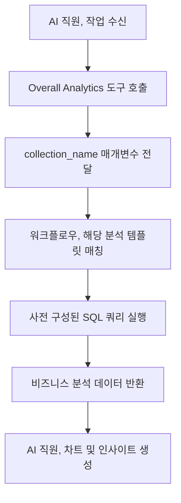

:::tip
이 문서는 AI로 번역되었습니다. 부정확한 내용이 있을 경우 [영어 버전](/en)을 참조하세요
:::


# 역할 및 권한

## 소개

AI 직원 권한 관리는 두 가지 측면으로 구성됩니다:

1.  **AI 직원 접근 권한**: 어떤 사용자가 어떤 AI 직원을 사용할 수 있는지 제어합니다.
2.  **데이터 접근 권한**: AI 직원이 데이터를 처리할 때 권한 제어가 어떻게 적용되는지 관리합니다.

이 문서에서는 이 두 가지 권한의 설정 방법과 작동 원리를 자세히 설명합니다.

---

## AI 직원 접근 권한 설정

### 역할별 AI 직원 사용 설정

`User & Permissions` 페이지로 이동하여 `Roles & Permissions` 탭을 클릭하면 역할 설정 페이지로 들어갑니다.


역할을 선택하고 `Permissions` 탭을 클릭한 다음 `AI employees` 탭을 클릭합니다. 이곳에 AI 직원 **플러그인**에서 관리하는 AI 직원 목록이 표시됩니다.

AI 직원 목록의 `Available` 열에 있는 체크박스를 클릭하여 현재 역할이 해당 AI 직원에 접근할 수 있는지 여부를 제어합니다.


## 데이터 접근 권한

AI 직원이 데이터를 처리할 때, 권한 제어 방식은 사용되는 도구 유형에 따라 달라집니다:

### 시스템 내장 데이터 쿼리 도구 (사용자 권한 준수)


다음 도구들은 **현재 사용자의 데이터 권한을 엄격히 준수**하여 데이터에 접근합니다:

| 도구 이름                            | 설명                                       |
| :--------------------------------- | :----------------------------------------- |
| **Data source query**              | **데이터 소스**, **컬렉션**, 필드를 사용하여 데이터베이스를 쿼리합니다. |
| **Data source records counting**   | **데이터 소스**, **컬렉션**, 필드를 사용하여 총 레코드 수를 집계합니다. |

**작동 원리:**

AI 직원이 이러한 도구를 호출하면 시스템은 다음을 수행합니다:
1.  현재 로그인한 사용자의 신원을 식별합니다.
2.  해당 사용자가 **역할 및 권한**에서 설정한 데이터 접근 규칙을 적용합니다.
3.  해당 사용자가 볼 수 있는 권한이 있는 데이터만 반환합니다.

**예시 시나리오:**

영업 사원 A가 자신이 담당하는 고객 데이터만 볼 수 있다고 가정해 봅시다. 그가 AI 직원 Viz를 사용하여 고객을 분석할 때:
-   Viz는 `Data source query`를 호출하여 고객 테이블을 쿼리합니다.
-   시스템은 영업 사원 A의 데이터 권한 필터링 규칙을 적용합니다.
-   Viz는 영업 사원 A가 접근할 수 있는 고객 데이터만 보고 분석할 수 있습니다.

이는 **AI 직원이 사용자 자신의 데이터 접근 경계를 벗어나지 않도록** 보장합니다.

---

### 워크플로우 사용자 지정 비즈니스 도구 (독립적인 권한 로직)

**워크플로우**를 통해 사용자 지정된 비즈니스 쿼리 도구는 권한 제어가 **사용자 권한과 독립적**이며, **워크플로우**의 비즈니스 로직에 의해 결정됩니다.

이러한 도구는 일반적으로 다음 용도로 사용됩니다:
-   고정된 비즈니스 분석 프로세스
-   사전 구성된 집계 쿼리
-   권한 경계를 넘나드는 통계 분석

#### 예시 1: Overall Analytics (일반 비즈니스 분석)


CRM 데모에서 `Overall Analytics`는 템플릿 기반의 비즈니스 분석 엔진입니다:

| 특징         | 설명                                                               |
| :----------- | :----------------------------------------------------------------- |
| **구현 방식** | **워크플로우**가 사전 구성된 SQL 템플릿을 읽고 읽기 전용 쿼리를 실행합니다. |
| **권한 제어** | 현재 사용자 권한에 의해 제한되지 않으며, 템플릿에 정의된 고정된 비즈니스 데이터를 출력합니다. |
| **적용 시나리오** | 특정 비즈니스 객체(예: 리드, 영업 기회, 고객)에 대한 표준화된 전체 분석을 제공합니다. |
| **보안**     | 모든 쿼리 템플릿은 관리자가 사전 구성하고 검토하여 동적 SQL 생성을 방지합니다. |

**워크플로우:**



**주요 특징:**
-   이 도구를 호출하는 모든 사용자는 **동일한 비즈니스 관점**을 얻게 됩니다.
-   데이터 범위는 비즈니스 로직에 의해 정의되며, 사용자 권한에 의해 필터링되지 않습니다.
-   표준화된 비즈니스 분석 보고서를 제공하는 데 적합합니다.

#### 예시 2: SQL Execution (고급 분석 도구)


CRM 데모에서 `SQL Execution`은 더 유연하지만 엄격한 제어가 필요한 도구입니다:

| 특징         | 설명                                                               |
| :----------- | :----------------------------------------------------------------- |
| **구현 방식** | AI가 SQL 문을 생성하고 실행할 수 있도록 허용합니다.                |
| **권한 제어** | **워크플로우**에 의해 접근 권한이 제어되며, 일반적으로 관리자에게만 허용됩니다. |
| **적용 시나리오** | 고급 데이터 분석, 탐색적 쿼리, 테이블 간 집계 분석.                |
| **보안**     | **워크플로우**에서 읽기 전용 작업(SELECT)을 제한하고, 작업 설정을 통해 가용성을 제어해야 합니다. |

**보안 권장 사항:**

1.  **사용 범위 제한**: 관리 블록의 작업에서만 활성화하도록 설정합니다.
2.  **프롬프트 제약 조건**: 작업 프롬프트에서 쿼리 범위와 테이블 이름을 명확히 제한합니다.
3.  **워크플로우 검증**: **워크플로우**에서 SQL 문을 검증하여 SELECT 작업만 실행되도록 보장합니다.
4.  **감사 로그**: 실행된 모든 SQL 문을 기록하여 추적 가능하도록 합니다.

**예시 설정:**

```markdown
작업 프롬프트 제약 조건:
- CRM 관련 테이블(leads, opportunities, accounts, contacts)만 쿼리할 수 있습니다.
- SELECT 쿼리만 실행할 수 있습니다.
- 시간 범위는 최근 1년 이내로 제한됩니다.
- 반환되는 결과는 1,000개 레코드를 초과하지 않습니다.
```

---

## 권한 설계 권장 사항

### 비즈니스 시나리오별 권한 전략 선택

| 비즈니스 시나리오           | 권장 도구 유형             | 권한 전략         | 이유                               |
| :-------------------------- | :------------------------- | :---------------- | :--------------------------------- |
| 영업 사원이 자신의 고객 보기      | 시스템 내장 쿼리 도구      | 사용자 권한 준수      | 데이터 격리 보장, 비즈니스 보안 보호       |
| 부서 관리자가 팀 데이터 보기      | 시스템 내장 쿼리 도구      | 사용자 권한 준수      | 부서 데이터 범위 자동 적용             |
| 경영진이 전체 비즈니스 분석 보기    | **워크플로우** 사용자 지정 도구 / Overall Analytics | 독립적인 비즈니스 로직 | 표준화된 전체 관점 제공                |
| 데이터 분석가의 탐색적 쿼리     | SQL Execution            | 사용 가능한 객체 엄격히 제한 | 유연성이 필요하지만 접근 범위 제어 필수    |
| 일반 사용자가 표준 보고서 보기    | Overall Analytics          | 독립적인 비즈니스 로직 | 고정된 분석 기준, 기본 권한에 대한 걱정 불필요 |

### 다층 방어 전략

민감한 비즈니스 시나리오의 경우, 다층 권한 제어를 적용하는 것을 권장합니다:

1.  **AI 직원 접근 계층**: 어떤 역할이 해당 AI 직원을 사용할 수 있는지 제어합니다.
2.  **작업 가시성 계층**: 블록 설정을 통해 작업 표시 여부를 제어합니다.
3.  **도구 권한 부여 계층**: **워크플로우**에서 사용자 신원과 권한을 검증합니다.
4.  **데이터 접근 계층**: 사용자 권한 또는 비즈니스 로직을 통해 데이터 범위를 제어합니다.

**예시:**

```
시나리오: 재무 부서만 AI를 사용하여 재무 분석을 수행할 수 있습니다.

- AI 직원 권한: 재무 역할만 "Finance Analyst" AI 직원에 접근할 수 있습니다.
- 작업 설정: 재무 분석 작업은 재무 모듈에서만 표시됩니다.
- 도구 설계: 재무 워크플로우 도구가 사용자 부서를 검증합니다.
- 데이터 권한: 재무 테이블 접근 권한은 재무 역할에만 부여됩니다.
```

---

## 자주 묻는 질문

### Q: AI 직원은 어떤 데이터에 접근할 수 있나요?

**A:** 사용되는 도구 유형에 따라 다릅니다:
-   **시스템 내장 쿼리 도구**: 현재 사용자가 볼 수 있는 권한이 있는 데이터에만 접근할 수 있습니다.
-   **워크플로우** 사용자 지정 도구: **워크플로우**의 비즈니스 로직에 의해 결정되며, 사용자 권한에 의해 제한되지 않을 수 있습니다.

### Q: AI 직원이 민감한 데이터를 유출하는 것을 어떻게 방지할 수 있나요?

**A:** 다층 방어 전략을 채택합니다:
1.  AI 직원의 역할별 접근 권한을 설정하여 누가 사용할 수 있는지 제한합니다.
2.  시스템 내장 도구의 경우, 사용자 데이터 권한에 의존하여 자동으로 필터링합니다.
3.  사용자 지정 도구의 경우, **워크플로우**에서 비즈니스 로직 검증을 구현합니다.
4.  민감한 작업(예: SQL Execution)은 관리자에게만 권한을 부여합니다.

### Q: 특정 AI 직원이 사용자 권한 제한을 우회하도록 하려면 어떻게 해야 하나요?

**A:** **워크플로우** 사용자 지정 비즈니스 도구를 사용합니다:
-   특정 비즈니스 쿼리 로직을 구현하는 **워크플로우**를 생성합니다.
-   **워크플로우**에서 데이터 범위와 접근 규칙을 제어합니다.
-   AI 직원이 사용할 수 있도록 도구를 설정합니다.
-   AI 직원 접근 권한을 통해 누가 해당 기능을 호출할 수 있는지 제어합니다.

### Q: Overall Analytics와 SQL Execution의 차이점은 무엇인가요?

**A:**

| 비교 기준     | Overall Analytics                  | SQL Execution                  |
| :------------ | :--------------------------------- | :----------------------------- |
| 유연성        | 낮음 (사전 구성된 템플릿만 사용 가능) | 높음 (동적으로 쿼리 생성 가능) |
| 보안성        | 높음 (모든 쿼리 사전 검토)         | 중간 (제약 조건 및 검증 필요)  |
| 대상 사용자   | 일반 비즈니스 사용자               | 관리자 또는 고급 분석가        |
| 유지보수 비용 | 분석 템플릿 유지보수 필요          | 유지보수 불필요, 하지만 모니터링 필요 |
| 데이터 일관성 | 강함 (표준화된 기준)               | 약함 (쿼리 결과가 일치하지 않을 수 있음) |

---

## 모범 사례

1.  **기본적으로 사용자 권한 준수**: 명확한 비즈니스 요구 사항이 없는 한, 사용자 권한을 준수하는 시스템 내장 도구를 우선적으로 사용합니다.
2.  **템플릿 기반 표준 분석**: 일반적인 분석 시나리오의 경우, Overall Analytics 패턴을 사용하여 표준화된 기능을 제공합니다.
3.  **고급 도구 엄격 제어**: SQL Execution과 같은 높은 권한의 도구는 소수의 관리자에게만 권한을 부여합니다.
4.  **작업 수준 격리**: 민감한 작업을 특정 블록에 설정하고, 페이지 접근 권한을 통해 격리를 구현합니다.
5.  **감사 및 모니터링**: AI 직원의 데이터 접근 행동을 기록하고, 비정상적인 작업을 정기적으로 검토합니다.