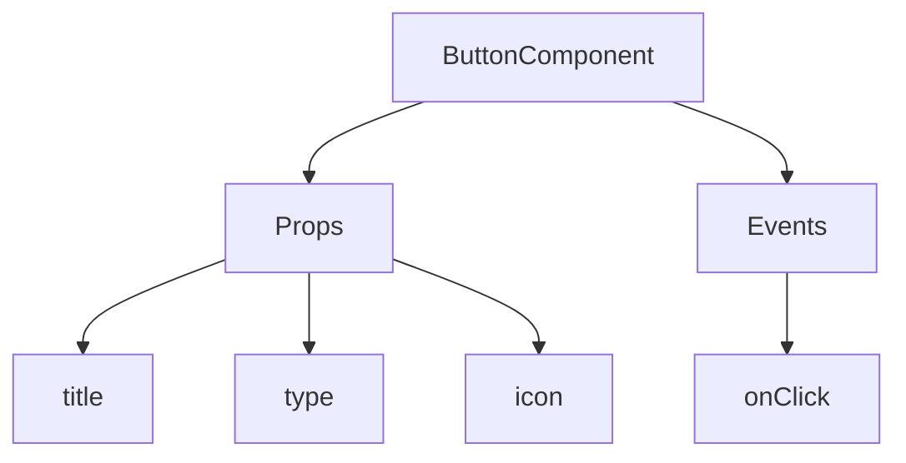
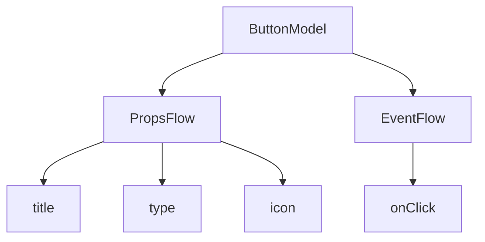

:::tip
이 문서는 AI로 번역되었습니다. 부정확한 내용이 있을 경우 [영어 버전](/en)을 참조하세요
:::


# 빠른 시작: 오케스트레이션 가능한 버튼 컴포넌트 구축하기

React에서는 일반적으로 다음과 같이 버튼 컴포넌트를 렌더링합니다:

```tsx pure
import { Button } from 'antd';

export default function App() {
  return <Button type="primary">Primary Button</Button>;
}
```

위 코드는 간단하지만, **정적 컴포넌트**에 해당하여 노코드 플랫폼에서 요구하는 구성 가능성 및 오케스트레이션 기능을 충족할 수 없습니다.

NocoBase의 FlowEngine에서는 **FlowModel + FlowDefinition**을 통해 구성 및 이벤트 기반 컴포넌트를 빠르게 구축하여 더욱 강력한 노코드 기능을 구현할 수 있습니다.

---

## 첫 번째 단계: FlowModel을 사용하여 컴포넌트 렌더링하기

<code src="./demos/quickstart-1-basic.tsx"></code>

### 🧠 핵심 개념

- `FlowModel`은 FlowEngine의 핵심 컴포넌트 모델로, 컴포넌트 로직, 렌더링 및 구성 기능을 캡슐화합니다.
- 모든 UI 컴포넌트는 `FlowModel`을 통해 인스턴스화되고 통합 관리될 수 있습니다.

### 📌 구현 단계

#### 1. 사용자 정의 모델 클래스 생성

```tsx pure
class MyModel extends FlowModel {
  render() {
    return <Button {...this.props} />;
  }
}
```

#### 2. 모델 인스턴스 생성

```ts
const model = this.flowEngine.createModel({
  uid: 'my-model',
  use: 'MyModel',
  props: {
    type: 'primary',
    children: 'Primary Button',
  },
});
```

#### 3. `<FlowModelRenderer />`를 사용하여 렌더링

```tsx pure
<FlowModelRenderer model={model} />
```

## 두 번째 단계: PropsFlow를 추가하여 버튼 속성 구성 가능하게 만들기

<code src="./demos/quickstart-2-register-propsflow.tsx"></code>

### 💡 PropsFlow를 사용하는 이유

정적 props 대신 Flow를 사용하면 다음과 같은 속성을 구현할 수 있습니다:
- 동적 구성
- 시각적 편집
- 상태 재생 및 영속화

### 🛠 주요 변경 사항

#### 1. 버튼 속성 Flow 정의

```tsx pure

const buttonSettings = defineFlow({
  key: 'buttonSettings',
  
  title: '버튼 설정',
  steps: {
    general: {
      title: '일반 구성',
      uiSchema: {
        title: {
          type: 'string',
          title: '버튼 제목',
          'x-decorator': 'FormItem',
          'x-component': 'Input',
        },
        type: {
          type: 'string',
          title: '유형',
          'x-decorator': 'FormItem',
          'x-component': 'Select',
          enum: [
            { label: '기본', value: 'primary' },
            { label: '보조', value: 'default' },
            { label: '위험', value: 'danger' },
            { label: '점선', value: 'dashed' },
            { label: '링크', value: 'link' },
            { label: '텍스트', value: 'text' },
          ],
        },
        icon: {
          type: 'string',
          title: '아이콘',
          'x-decorator': 'FormItem',
          'x-component': 'Select',
          enum: [
            { label: '검색', value: 'SearchOutlined' },
            { label: '추가', value: 'PlusOutlined' },
            { label: '삭제', value: 'DeleteOutlined' },
            { label: '편집', value: 'EditOutlined' },
            { label: '설정', value: 'SettingOutlined' },
          ],
        },
      },
      defaultParams: {
        type: 'primary',
      },
      // 단계 핸들러 함수, 모델 속성 설정
      handler(ctx, params) {
        ctx.model.setProps('children', params.title);
        ctx.model.setProps('type', params.type);
        ctx.model.setProps('icon', params.icon ? React.createElement(icons[params.icon]) : undefined);
      },
    },
  },
});

MyModel.registerFlow(buttonSettings);
```

#### 2. 정적 `props` 대신 `stepParams` 사용

```diff
const model = this.flowEngine.createModel({
  uid: 'my-model',
  use: 'MyModel',
- props: {
-   type: 'primary',
-   children: 'Primary Button',
- },
+ stepParams: {
+   buttonSettings: {
+     general: {
+       title: 'Primary Button',
+       type: 'primary',
+     },
+   },
+ },
});
```

> ✅ `stepParams`를 사용하는 것이 FlowEngine에서 권장하는 방식이며, 직렬화할 수 없는 데이터(예: React 컴포넌트) 문제를 방지할 수 있습니다.

#### 3. 속성 구성 인터페이스 활성화

```diff
- <FlowModelRenderer model={model} />
+ <FlowModelRenderer model={model} showFlowSettings />
```

---

## 세 번째 단계: 버튼 이벤트 Flow (EventFlow) 지원

<code src="./demos/quickstart-3-register-eventflow.tsx"></code>

### 🎯 시나리오: 버튼 클릭 후 확인 대화 상자 표시

#### 1. onClick 이벤트 리스닝

비침해적인 방식으로 onClick 추가

```diff
const myPropsFlow = defineFlow({
  key: 'buttonSettings',
  steps: {
    general: {
      // ... 생략
      handler(ctx, params) {
        // ... 생략
+       ctx.model.setProps('onClick', (event) => {
+         ctx.model.dispatchEvent('click', { event });
+       });
      },
    },
  },
});
```

#### 2. 이벤트 Flow 정의

```ts
const myEventFlow = defineFlow({
  key: 'clickSettings',
  on: 'click',
  title: '버튼 이벤트',
  steps: {
    confirm: {
      title: '확인 작업 구성',
      uiSchema: {
        title: {
          type: 'string',
          title: '팝업 알림 제목',
          'x-decorator': 'FormItem',
          'x-component': 'Input',
        },
        content: {
          type: 'string',
          title: '팝업 알림 내용',
          'x-decorator': 'FormItem',
          'x-component': 'Input.TextArea',
        },
      },
      defaultParams: {
        title: '작업 확인',
        content: '버튼을 클릭했습니다. 확인하시겠습니까?',
      },
      async handler(ctx, params) {
        // 팝업
        const confirmed = await ctx.modal.confirm({
          title: params.title,
          content: params.content,
        });
        // 메시지
        await ctx.message.info(`버튼을 클릭했습니다. 확인 결과: ${confirmed ? '확인됨' : '취소됨'}`);
      },
    },
  },
});
MyModel.registerFlow(myEventFlow);
```

**추가 설명:**
- 이벤트 Flow (EventFlow)를 사용하면 팝업, 메시지, API 호출 등 Flow를 통해 버튼의 동작을 유연하게 구성할 수 있습니다.
- 다양한 이벤트(예: `onClick`, `onMouseEnter` 등)에 대해 여러 이벤트 Flow를 등록하여 복잡한 비즈니스 요구 사항을 충족할 수 있습니다.

#### 3. 이벤트 Flow 매개변수 구성

모델 생성 시 `stepParams`를 통해 이벤트 Flow의 기본 매개변수를 구성할 수 있습니다:

```ts
const model = this.flowEngine.createModel({
  uid: 'my-model',
  use: 'MyModel',
  stepParams: {
    buttonSettings: {
      general: {
        title: 'Primary Button',
        type: 'primary',
      },
    },
    clickSettings: {
      confirm: {
        title: '작업 확인',
        content: '버튼을 클릭했습니다. 확인하시겠습니까?',
      },
    },
  },
});
```

---

## 모델 비교: ReactComponent vs FlowModel

Flow는 컴포넌트의 구현 방식을 변경하지 않습니다. 단지 ReactComponent에 PropsFlow 및 EventFlow 지원을 추가하여 컴포넌트의 속성과 이벤트를 시각적으로 구성하고 오케스트레이션할 수 있도록 합니다.


### ReactComponent



### FlowModel



## 요약

위 세 단계를 통해 구성 및 이벤트 오케스트레이션을 지원하는 버튼 컴포넌트를 완성했으며, 다음과 같은 장점을 가집니다:

- 🚀 속성 시각적 구성 (예: 제목, 유형, 아이콘)
- 🔄 Flow에 의해 이벤트 응답 제어 가능 (예: 클릭 시 팝업)
- 🔧 향후 확장 지원 (예: 조건부 로직, 변수 바인딩 등)

이러한 패턴은 폼, 목록, 차트 등 모든 UI 컴포넌트에도 적용할 수 있습니다. NocoBase의 FlowEngine에서는 **모든 것을 오케스트레이션할 수 있습니다**.