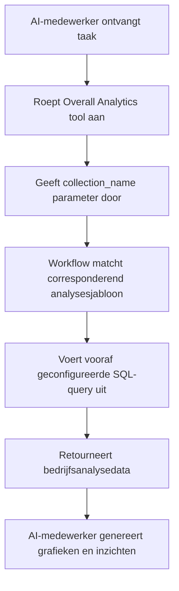

:::tip
Dit document is vertaald door AI. Voor onnauwkeurigheden, raadpleeg [de Engelse versie](/en)
:::


# Rollen & Rechten

## Introductie

Het rechtenbeheer van AI-medewerkers omvat twee niveaus:

1.  **Toegangsrechten voor AI-medewerkers**: Bepalen welke gebruikers welke AI-medewerkers kunnen gebruiken.
2.  **Gegevenstoegangsrechten**: Hoe AI-medewerkers rechten toepassen bij het verwerken van gegevens.

Dit document beschrijft gedetailleerd de configuratiemethoden en de werking van deze twee soorten rechten.

---

## Configuratie van toegangsrechten voor AI-medewerkers

### Beschikbare AI-medewerkers instellen voor rollen

Ga naar de pagina `Gebruiker & Rechten`, klik op het tabblad `Rollen & Rechten` om de rolconfiguratiepagina te openen.


Selecteer een rol, klik op het tabblad `Rechten` en vervolgens op het tabblad `AI-medewerkers`. Hier ziet u de lijst met AI-medewerkers die worden beheerd in de AI-medewerkers plugin.

Klik op het selectievakje in de kolom `Beschikbaar` van de lijst met AI-medewerkers om te bepalen of de huidige rol toegang heeft tot die AI-medewerker.


## Gegevenstoegangsrechten

Wanneer AI-medewerkers gegevens verwerken, hangt de methode voor rechtenbeheer af van het type gebruikte tool:

### Systeem-ingebouwde gegevensquerytools (volgen gebruikersrechten)


De volgende tools volgen **strikt de gegevenstoegangsrechten van de huidige gebruiker** voor gegevenstoegang:

| Toolnaam                            | Beschrijving                     |
| ------------------------------- | ---------------------- |
| **Data source query**           | Query de database met behulp van de gegevensbron, collectie en velden      |
| **Data source records counting** | Tel het totale aantal records met behulp van de gegevensbron, collectie en velden     |

**Hoe het werkt:**

Wanneer AI-medewerkers deze tools aanroepen, zal het systeem:
1.  De identiteit van de huidige ingelogde gebruiker herkennen.
2.  De gegevenstoegangsregels toepassen die voor die gebruiker zijn geconfigureerd in **Rollen & Rechten**.
3.  Alleen de gegevens retourneren die de gebruiker mag bekijken.

**Voorbeeldscenario:**

Stel dat verkoper A alleen klantgegevens kan bekijken waarvoor hij verantwoordelijk is. Wanneer hij AI-medewerker Viz gebruikt om klanten te analyseren:
-   Viz roept `Data source query` aan om de klantentabel te bevragen.
-   Het systeem past de filterregels voor gegevenstoegang van verkoper A toe.
-   Viz kan alleen klantgegevens zien en analyseren waar verkoper A toegang toe heeft.

Dit zorgt ervoor dat **AI-medewerkers de eigen gegevenstoegangsbeperkingen van de gebruiker niet kunnen omzeilen**.

---

### Workflow aangepaste bedrijfstools (onafhankelijke rechtenlogica)

Bedrijfsquerytools die via workflows zijn aangepast, hebben rechtenbeheer dat **onafhankelijk is van gebruikersrechten** en wordt bepaald door de bedrijfslogica van de workflow.

Deze tools worden doorgaans gebruikt voor:
-   Vaste bedrijfsanalyseprocessen
-   Vooraf geconfigureerde geaggregeerde query's
-   Statistische analyses over rechtenbeperkingen heen

#### Voorbeeld 1: Overall Analytics (algemene bedrijfsanalyse)


In de CRM Demo is `Overall Analytics` een sjabloongebaseerde bedrijfsanalysemotor:

| Functie     | Beschrijving                                    |
| ------ | ------------------------------------- |
| **Implementatie** | Workflow leest vooraf geconfigureerde SQL-sjablonen en voert alleen-lezen query's uit              |
| **Rechtenbeheer** | Niet beperkt door de rechten van de huidige gebruiker, geeft vaste bedrijfsgegevens weer zoals gedefinieerd door sjablonen           |
| **Gebruiksscenario's** | Biedt gestandaardiseerde, holistische analyse voor specifieke bedrijfsobjecten (bijv. leads, kansen, klanten)       |
| **Beveiliging**  | Alle querysjablonen worden vooraf geconfigureerd en beoordeeld door beheerders, om dynamische SQL-generatie te voorkomen        |

**Workflow:**



**Belangrijkste kenmerken:**
-   Elke gebruiker die deze tool aanroept, krijgt **hetzelfde bedrijfsperspectief**.
-   De gegevensomvang wordt bepaald door de bedrijfslogica, niet gefilterd door gebruikersrechten.
-   Geschikt voor het leveren van gestandaardiseerde bedrijfsanalyserapporten.

#### Voorbeeld 2: SQL Execution (geavanceerde analysetool)


In de CRM Demo is `SQL Execution` een flexibelere, maar strikt te controleren tool:

| Functie     | Beschrijving                                    |
| ------ | ------------------------------------- |
| **Implementatie** | Staat AI toe om SQL-statements te genereren en uit te voeren                    |
| **Rechtenbeheer** | Gecontroleerd door de workflow, doorgaans alleen beperkt tot beheerders                  |
| **Gebruiksscenario's** | Geavanceerde data-analyse, verkennende query's, cross-tabel geaggregeerde analyse                  |
| **Beveiliging**  | Vereist dat de workflow alleen-lezen bewerkingen (SELECT) beperkt en de beschikbaarheid via taakconfiguratie regelt   |

**Beveiligingsaanbevelingen:**

1.  **Beperk de reikwijdte**: Alleen inschakelen in taken van het beheerblok.
2.  **Promptbeperkingen**: Definieer duidelijk de queryreikwijdte en tabelnamen in taakprompts.
3.  **Workflowvalidatie**: Valideer SQL-statements in de workflow om ervoor te zorgen dat alleen SELECT-bewerkingen worden uitgevoerd.
4.  **Auditlogs**: Registreer alle uitgevoerde SQL-statements voor traceerbaarheid.

**Voorbeeldconfiguratie:**

```markdown
Taakpromptbeperkingen:
- Kan alleen CRM-gerelateerde tabellen bevragen (leads, opportunities, accounts, contacts)
- Kan alleen SELECT-query's uitvoeren
- Tijdsbereik beperkt tot het laatste 1 jaar
- Retourneert maximaal 1000 records
```

---

## Aanbevelingen voor rechtenontwerp

### Kies een rechtenstrategie per bedrijfsscenario

| Bedrijfsscenario         | Aanbevolen tooltype         | Rechtenstrategie         | Reden                   |
| ------------ | -------------- | ------------ | -------------------- |
| Verkoper bekijkt eigen klanten  | Systeem-ingebouwde querytools       | Volgt gebruikersrechten       | Zorgt voor data-isolatie, beschermt bedrijfsbeveiliging        |
| Afdelingsmanager bekijkt teamdata   | Systeem-ingebouwde querytools       | Volgt gebruikersrechten       | Past automatisch de data-omvang van de afdeling toe           |
| Leidinggevende bekijkt wereldwijde bedrijfsanalyse   | Workflow aangepaste tools / Overall Analytics       | Onafhankelijke bedrijfslogica       | Biedt een gestandaardiseerd, holistisch perspectief           |
| Data-analist verkennende query's   | SQL Execution  | Strikte beperking van beschikbare objecten     | Vereist flexibiliteit, maar moet de toegangsreikwijdte controleren      |
| Gewone gebruiker bekijkt standaardrapporten   | Overall Analytics | Onafhankelijke bedrijfslogica       | Vaste analysemethoden, geen zorgen over onderliggende rechten      |

### Meerlaagse beveiligingsstrategie

Voor gevoelige bedrijfsscenario's wordt aanbevolen een meerlaagse rechtenbeheerstrategie toe te passen:

1.  **Toegangslaag AI-medewerker**: Bepaalt welke rollen welke AI-medewerkers kunnen gebruiken.
2.  **Taakzichtbaarheidslaag**: Regelt de weergave van taken via blokconfiguratie.
3.  **Toolautorisatielaag**: Verifieert gebruikersidentiteit en rechten in workflows.
4.  **Gegevenstoegangslaag**: Regelt de gegevensomvang via gebruikersrechten of bedrijfslogica.

**Voorbeeld:**

```
Scenario: Alleen de financiële afdeling mag AI gebruiken voor financiële analyse

- AI-medewerker rechten: Alleen de financiële rol heeft toegang tot de "Finance Analyst" AI-medewerker
- Taakconfiguratie: Financiële analysetaken worden alleen weergegeven in financiële modules
- Toolontwerp: Financiële workflowtools verifiëren de gebruikersafdeling
- Gegevensrechten: Toegangsrechten voor financiële tabellen worden alleen toegekend aan de financiële rol
```

---

## Veelgestelde vragen

### V: Welke gegevens kunnen AI-medewerkers benaderen?

**A:** Afhankelijk van het gebruikte tooltype:
-   **Systeem-ingebouwde querytools**: Kunnen alleen gegevens benaderen die de huidige gebruiker mag bekijken.
-   **Workflow aangepaste tools**: Worden bepaald door de bedrijfslogica van de workflow en zijn mogelijk niet beperkt door gebruikersrechten.

### V: Hoe voorkom ik dat AI-medewerkers gevoelige gegevens lekken?

**A:** Pas meerlaagse beveiliging toe:
1.  Configureer de roltoegangsrechten van AI-medewerkers om te beperken wie ze kan gebruiken.
2.  Voor systeem-ingebouwde tools, vertrouw op gebruikersgegevensrechten voor automatische filtering.
3.  Voor aangepaste tools, implementeer bedrijfslogica-validatie in workflows.
4.  Gevoelige bewerkingen (zoals SQL Execution) mogen alleen aan beheerders worden geautoriseerd.

### V: Wat als ik wil dat bepaalde AI-medewerkers gebruikersrechtenbeperkingen omzeilen?

**A:** Gebruik workflow aangepaste bedrijfstools:
-   Creëer workflows om specifieke bedrijfsquerylogica te implementeren.
-   Beheer de gegevensomvang en toegangsregels in workflows.
-   Configureer tools voor AI-medewerkers om te gebruiken.
-   Beheer wie deze functionaliteit kan aanroepen via toegangsrechten voor AI-medewerkers.

### V: Wat is het verschil tussen Overall Analytics en SQL Execution?

**A:**

| Vergelijkingsdimensie | Overall Analytics   | SQL Execution     |
| ------ | ------------------- | ----------------- |
| Flexibiliteit    | Laag (kan alleen vooraf geconfigureerde sjablonen gebruiken)        | Hoog (kan dynamisch query's genereren)        |
| Beveiliging    | Hoog (alle query's vooraf beoordeeld)         | Gemiddeld (vereist beperkingen en validatie)        |
| Doelgroep   | Reguliere zakelijke gebruikers              | Beheerders of senior analisten        |
| Onderhoudskosten   | Moet analysesjablonen onderhouden            | Geen onderhoud, maar vereist monitoring       |
| Dataconsistentie  | Sterk (gestandaardiseerde meetwaarden)            | Zwak (queryresultaten kunnen inconsistent zijn)      |

---

## Best practices

1.  **Standaard gebruikersrechten volgen**: Tenzij er een duidelijke zakelijke behoefte is, geeft u prioriteit aan het gebruik van systeem-ingebouwde tools die gebruikersrechten volgen.
2.  **Gestandaardiseerde analyse via sjablonen**: Voor veelvoorkomende analysescenario's gebruikt u het Overall Analytics-patroon om gestandaardiseerde mogelijkheden te bieden.
3.  **Strikte controle over geavanceerde tools**: Tools met hoge privileges zoals SQL Execution mogen alleen aan een beperkt aantal beheerders worden geautoriseerd.
4.  **Isolatie op taakniveau**: Configureer gevoelige taken in specifieke blokken en implementeer isolatie via paginatoegangsrechten.
5.  **Audit en monitoring**: Registreer het gedrag van AI-medewerkers bij gegevenstoegang en controleer regelmatig op afwijkende bewerkingen.