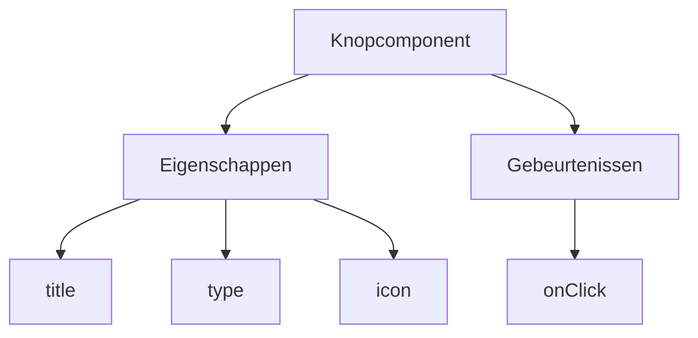
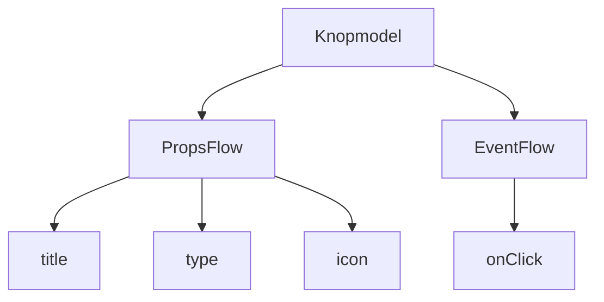

:::tip
Dit document is vertaald door AI. Voor onnauwkeurigheden, raadpleeg [de Engelse versie](/en)
:::


# Snelstart: Een orkestreerbare knopcomponent bouwen

In React renderen we een knopcomponent meestal als volgt:

```tsx pure
import { Button } from 'antd';

export default function App() {
  return <Button type="primary">Primary Button</Button>;
}
```

Hoewel de bovenstaande code eenvoudig is, betreft het een **statische component** die niet voldoet aan de eisen van een no-code platform voor configureerbaarheid en orkestratie.

In de FlowEngine van NocoBase kunt u snel componenten bouwen die configuratie en gebeurtenisgestuurde functionaliteit ondersteunen met behulp van **FlowModel + FlowDefinition**, waardoor u krachtigere no-code mogelijkheden krijgt.

---

## Stap 1: De component renderen met FlowModel

<code src="./demos/quickstart-1-basic.tsx"></code>

### 🧠 Kernconcepten

- `FlowModel` is het kerncomponentmodel in FlowEngine, dat de componentlogica, rendering en configuratiemogelijkheden omvat.
- Elke UI-component kan via `FlowModel` worden geïnstantieerd en uniform worden beheerd.

### 📌 Implementatiestappen

#### 1. Een aangepaste modelklasse aanmaken

```tsx pure
class MyModel extends FlowModel {
  render() {
    return <Button {...this.props} />;
  }
}
```

#### 2. Een modelinstantie aanmaken

```ts
const model = this.flowEngine.createModel({
  uid: 'my-model',
  use: 'MyModel',
  props: {
    type: 'primary',
    children: 'Primary Button',
  },
});
```

#### 3. Renderen met `<FlowModelRenderer />`

```tsx pure
<FlowModelRenderer model={model} />
```

## Stap 2: PropsFlow toevoegen om knopeigenschappen configureerbaar te maken

<code src="./demos/quickstart-2-register-propsflow.tsx"></code>

### 💡 Waarom PropsFlow gebruiken?

Het gebruik van Flow in plaats van statische props maakt het mogelijk om eigenschappen te voorzien van:
- Dynamische configuratie
- Visuele bewerking
- Statusherhaling en persistentie

### 🛠 Belangrijke aanpassingen

#### 1. De Flow voor knopeigenschappen definiëren

```tsx pure

const buttonSettings = defineFlow({
  key: 'buttonSettings',
  
  title: 'Knopinstellingen',
  steps: {
    general: {
      title: 'Algemene configuratie',
      uiSchema: {
        title: {
          type: 'string',
          title: 'Knoptitel',
          'x-decorator': 'FormItem',
          'x-component': 'Input',
        },
        type: {
          type: 'string',
          title: 'Type',
          'x-decorator': 'FormItem',
          'x-component': 'Select',
          enum: [
            { label: 'Primair', value: 'primary' },
            { label: 'Standaard', value: 'default' },
            { label: 'Gevaar', value: 'danger' },
            { label: 'Gestippeld', value: 'dashed' },
            { label: 'Link', value: 'link' },
            { label: 'Tekst', value: 'text' },
          ],
        },
        icon: {
          type: 'string',
          title: 'Icoon',
          'x-decorator': 'FormItem',
          'x-component': 'Select',
          enum: [
            { label: 'Zoeken', value: 'SearchOutlined' },
            { label: 'Toevoegen', value: 'PlusOutlined' },
            { label: 'Verwijderen', value: 'DeleteOutlined' },
            { label: 'Bewerken', value: 'EditOutlined' },
            { label: 'Instellingen', value: 'SettingOutlined' },
          ],
        },
      },
      defaultParams: {
        type: 'primary',
      },
      // Stap-handlerfunctie, stelt modeleigenschappen in
      handler(ctx, params) {
        ctx.model.setProps('children', params.title);
        ctx.model.setProps('type', params.type);
        ctx.model.setProps('icon', params.icon ? React.createElement(icons[params.icon]) : undefined);
      },
    },
  },
});

MyModel.registerFlow(buttonSettings);
```

#### 2. Gebruik `stepParams` in plaats van statische `props`

```diff
const model = this.flowEngine.createModel({
  uid: 'my-model',
  use: 'MyModel',
- props: {
-   type: 'primary',
-   children: 'Primary Button',
- },
+ stepParams: {
+   buttonSettings: {
+     general: {
+       title: 'Primaire Knop',
+       type: 'primary',
+     },
+   },
+ },
});
```

> ✅ Het gebruik van `stepParams` is de aanbevolen methode in FlowEngine, omdat het problemen met niet-serialiseerbare gegevens (zoals React-componenten) voorkomt.

#### 3. De eigenschappenconfiguratie-interface inschakelen

```diff
- <FlowModelRenderer model={model} />
+ <FlowModelRenderer model={model} showFlowSettings />
```

---

## Stap 3: Ondersteuning voor knopgebeurtenis-flow (EventFlow)

<code src="./demos/quickstart-3-register-eventflow.tsx"></code>

### 🎯 Scenario: Een bevestigingsvenster weergeven na het klikken op de knop

#### 1. Luisteren naar de onClick-gebeurtenis

Voeg onClick op een niet-intrusieve manier toe

```diff
const myPropsFlow = defineFlow({
  key: 'buttonSettings',
  steps: {
    general: {
      // ... weggelaten
      handler(ctx, params) {
        // ... weggelaten
+       ctx.model.setProps('onClick', (event) => {
+         ctx.model.dispatchEvent('click', { event });
+       });
      },
    },
  },
});
```

#### 2. De gebeurtenis-flow definiëren

```ts
const myEventFlow = defineFlow({
  key: 'clickSettings',
  on: 'click',
  title: 'Knopgebeurtenis',
  steps: {
    confirm: {
      title: 'Configuratie bevestigingsactie',
      uiSchema: {
        title: {
          type: 'string',
          title: 'Titel pop-upmelding',
          'x-decorator': 'FormItem',
          'x-component': 'Input',
        },
        content: {
          type: 'string',
          title: 'Inhoud pop-upmelding',
          'x-decorator': 'FormItem',
          'x-component': 'Input.TextArea',
        },
      },
      defaultParams: {
        title: 'Actie bevestigen',
        content: 'U heeft op de knop geklikt, wilt u dit bevestigen?',
      },
      async handler(ctx, params) {
        // Pop-up
        const confirmed = await ctx.modal.confirm({
          title: params.title,
          content: params.content,
        });
        // Bericht
        await ctx.message.info(`U heeft op de knop geklikt, bevestigingsresultaat: ${confirmed ? 'Bevestigd' : 'Geannuleerd'}`);
      },
    },
  },
});
MyModel.registerFlow(myEventFlow);
```

**Aanvullende opmerkingen:**
- EventFlow maakt het mogelijk om het gedrag van de knop flexibel te configureren via een flow, zoals het weergeven van pop-ups, berichten, het uitvoeren van API-aanroepen, enz.
- U kunt verschillende gebeurtenis-flows registreren voor verschillende gebeurtenissen (zoals `onClick`, `onMouseEnter`, enz.) om complexe bedrijfsbehoeften te vervullen.

#### 3. Gebeurtenis-flow parameters configureren

Bij het aanmaken van het model kunt u de standaardparameters voor de gebeurtenis-flow configureren via `stepParams`:

```ts
const model = this.flowEngine.createModel({
  uid: 'my-model',
  use: 'MyModel',
  stepParams: {
    buttonSettings: {
      general: {
        title: 'Primaire Knop',
        type: 'primary',
      },
    },
    clickSettings: {
      confirm: {
        title: 'Actie bevestigen',
        content: 'U heeft op de knop geklikt, wilt u dit bevestigen?',
      },
    },
  },
});
```

---

## Modelvergelijking: ReactComponent vs FlowModel

Flow verandert de implementatiewijze van componenten niet. Het voegt simpelweg ondersteuning toe voor PropsFlow en EventFlow aan een ReactComponent, waardoor de eigenschappen en gebeurtenissen van de component visueel geconfigureerd en georkestreerd kunnen worden.


### ReactComponent



### FlowModel



## Samenvatting

Met de bovenstaande drie stappen hebben we een knopcomponent voltooid die configuratie en gebeurtenisorkestratie ondersteunt, met de volgende voordelen:

- 🚀 Visueel eigenschappen configureren (zoals titel, type, icoon)
- 🔄 Gebeurtenisreacties kunnen door een flow worden beheerd (bijv. klikken om een pop-up te tonen)
- 🔧 Ondersteunt toekomstige uitbreidingen (zoals voorwaardelijke logica, variabelebinding, enz.)

Dit patroon is ook van toepassing op elke UI-component, zoals formulieren, lijsten en grafieken. In de FlowEngine van NocoBase is **alles orkestreerbaar**.