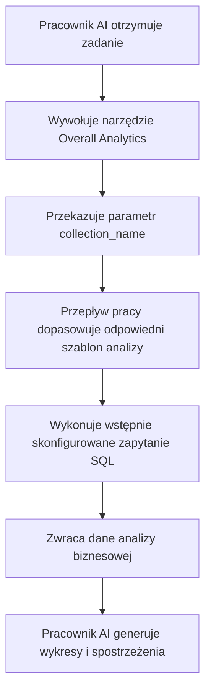

:::tip
Ten dokument został przetłumaczony przez AI. W przypadku niedokładności, proszę odnieść się do [wersji angielskiej](/en)
:::


# Role i uprawnienia

## Wprowadzenie

Zarządzanie uprawnieniami pracowników AI obejmuje dwa poziomy:

1.  **Uprawnienia dostępu pracowników AI**: Kontrolują, którzy użytkownicy mogą korzystać z których pracowników AI.
2.  **Uprawnienia dostępu do danych**: Określają, w jaki sposób pracownicy AI stosują kontrolę uprawnień podczas przetwarzania danych.

Niniejszy dokument szczegółowo opisuje metody konfiguracji i zasady działania tych dwóch typów uprawnień.

---

## Konfigurowanie uprawnień dostępu pracowników AI

### Ustawianie dostępnych pracowników AI dla ról

Proszę przejść do strony `User & Permissions`, kliknąć zakładkę `Roles & Permissions`, aby wejść na stronę konfiguracji ról.


Proszę wybrać rolę, kliknąć zakładkę `Permissions`, a następnie zakładkę `AI employees`. Tutaj zostanie wyświetlona lista pracowników AI zarządzanych w wtyczce pracowników AI.

Proszę kliknąć pole wyboru w kolumnie `Available` na liście pracowników AI, aby określić, czy dana rola może uzyskać dostęp do tego pracownika AI.


## Uprawnienia dostępu do danych

Gdy pracownicy AI przetwarzają dane, metoda kontroli uprawnień zależy od typu używanego narzędzia:

### Wbudowane narzędzia do zapytań o dane (zgodne z uprawnieniami użytkownika)


Poniższe narzędzia **ściśle przestrzegają uprawnień dostępu do danych bieżącego użytkownika** podczas dostępu do danych:

| Nazwa narzędzia                  | Opis                                                              |
| :------------------------------- | :---------------------------------------------------------------- |
| **Data source query**            | Używa źródła danych, kolekcji i pól do wykonywania zapytań w bazie danych. |
| **Data source records counting** | Zlicza całkowitą liczbę rekordów, używając źródła danych, kolekcji i pól. |

**Jak to działa:**

Gdy pracownicy AI wywołują te narzędzia, system:
1.  Identyfikuje tożsamość aktualnie zalogowanego użytkownika.
2.  Stosuje zasady dostępu do danych skonfigurowane dla tego użytkownika w sekcji **Role i uprawnienia**.
3.  Zwraca tylko te dane, do których użytkownik ma uprawnienia dostępu.

**Przykładowy scenariusz:**

Załóżmy, że sprzedawca A może przeglądać tylko dane klientów, za których jest odpowiedzialny. Kiedy używa pracownika AI Viz do analizy klientów:
-   Viz wywołuje `Data source query`, aby wysłać zapytanie do kolekcji klientów.
-   System stosuje reguły filtrowania uprawnień dostępu do danych sprzedawcy A.
-   Viz może widzieć i analizować tylko te dane klientów, do których sprzedawca A ma dostęp.

To zapewnia, że **pracownicy AI nie mogą przekraczać własnych granic dostępu do danych użytkownika**.

---

### Niestandardowe narzędzia biznesowe przepływu pracy (niezależna logika uprawnień)

Niestandardowe narzędzia biznesowe do zapytań, zdefiniowane za pomocą przepływu pracy, mają kontrolę uprawnień **niezależną od uprawnień użytkownika**, określoną przez logikę biznesową przepływu pracy.

Narzędzia te są zazwyczaj używane do:
-   Stałych procesów analizy biznesowej.
-   Wstępnie skonfigurowanych zapytań agregujących.
-   Analiz statystycznych przekraczających granice uprawnień.

#### Przykład 1: Overall Analytics (Ogólna analiza biznesowa)


W demo CRM, `Overall Analytics` to silnik analizy biznesowej oparty na szablonach:

| Cecha                  | Opis                                                                                               |
| :--------------------- | :------------------------------------------------------------------------------------------------- |
| **Implementacja**      | Przepływ pracy odczytuje wstępnie skonfigurowane szablony SQL i wykonuje zapytania tylko do odczytu. |
| **Kontrola uprawnień** | Nie jest ograniczona uprawnieniami bieżącego użytkownika; generuje stałe dane biznesowe zdefiniowane przez szablony. |
| **Zastosowania**       | Zapewnia ustandaryzowaną, całościową analizę dla konkretnych obiektów biznesowych (np. leadów, szans sprzedaży, klientów). |
| **Bezpieczeństwo**     | Wszystkie szablony zapytań są wstępnie konfigurowane i weryfikowane przez administratorów, co zapobiega dynamicznemu generowaniu SQL. |

**Przebieg pracy:**



**Kluczowe cechy:**
-   Każdy użytkownik wywołujący to narzędzie otrzyma **tę samą perspektywę biznesową**.
-   Zakres danych jest definiowany przez logikę biznesową i nie jest filtrowany przez uprawnienia użytkownika.
-   Nadaje się do dostarczania ustandaryzowanych raportów analizy biznesowej.

#### Przykład 2: SQL Execution (Zaawansowane narzędzie analityczne)


W demo CRM, `SQL Execution` to bardziej elastyczne, ale wymagające ścisłej kontroli narzędzie:

| Cecha                  | Opis                                                                                               |
| :--------------------- | :------------------------------------------------------------------------------------------------- |
| **Implementacja**      | Umożliwia AI generowanie i wykonywanie instrukcji SQL.                                             |
| **Kontrola uprawnień** | Kontrolowana przez przepływ pracy, zazwyczaj ograniczona tylko do administratorów.                  |
| **Zastosowania**       | Zaawansowana analiza danych, zapytania eksploracyjne, analiza agregująca między kolekcjami.        |
| **Bezpieczeństwo**     | Wymaga ograniczenia operacji tylko do odczytu (SELECT) w przepływie pracy i kontroli dostępności poprzez konfigurację zadania. |

**Zalecenia dotyczące bezpieczeństwa:**

1.  **Ograniczenie zakresu dostępności**: Włączać tylko w zadaniach w blokach administracyjnych.
2.  **Ograniczenia w podpowiedziach**: Jasno określać zakres zapytania i nazwy kolekcji w podpowiedziach zadań.
3.  **Walidacja przepływu pracy**: Weryfikować instrukcje SQL w przepływie pracy, aby upewnić się, że wykonywane są tylko operacje SELECT.
4.  **Logi audytu**: Rejestrować wszystkie wykonane instrukcje SQL w celu ułatwienia śledzenia.

**Przykładowa konfiguracja:**

```markdown
Ograniczenia podpowiedzi zadania:
- Można wysyłać zapytania tylko do kolekcji związanych z CRM (leads, opportunities, accounts, contacts)
- Można wykonywać tylko zapytania SELECT
- Zakres czasowy ograniczony do ostatniego 1 roku
- Zwraca nie więcej niż 1000 rekordów
```

---

## Zalecenia dotyczące projektowania uprawnień

### Wybór strategii uprawnień według scenariusza biznesowego

| Scenariusz biznesowy                               | Zalecany typ narzędzia               | Strategia uprawnień               | Powód                                                              |
| :------------------------------------------------- | :----------------------------------- | :-------------------------------- | :----------------------------------------------------------------- |
| Sprzedawca przeglądający własnych klientów         | Wbudowane narzędzia do zapytań systemowych | Zgodne z uprawnieniami użytkownika | Zapewnia izolację danych i chroni bezpieczeństwo biznesowe.         |
| Kierownik działu przeglądający dane zespołu        | Wbudowane narzędzia do zapytań systemowych | Zgodne z uprawnieniami użytkownika | Automatycznie stosuje zakres danych działu.                        |
| Kadra kierownicza przeglądająca globalną analizę biznesową | Niestandardowe narzędzia przepływu pracy / Overall Analytics | Niezależna logika biznesowa       | Zapewnia ustandaryzowaną, całościową perspektywę.                  |
| Analityk danych wykonujący zapytania eksploracyjne | SQL Execution                        | Ściśle ogranicza dostępne obiekty | Wymaga elastyczności, ale musi kontrolować zakres dostępu.         |
| Zwykli użytkownicy przeglądający standardowe raporty | Overall Analytics                    | Niezależna logika biznesowa       | Stałe standardy analizy, nie trzeba martwić się o podstawowe uprawnienia. |

### Strategia ochrony wielowarstwowej

W przypadku wrażliwych scenariuszy biznesowych zaleca się przyjęcie wielowarstwowej kontroli uprawnień:

1.  **Warstwa dostępu pracownika AI**: Kontroluje, które role mogą korzystać z danego pracownika AI.
2.  **Warstwa widoczności zadań**: Kontroluje wyświetlanie zadań poprzez konfigurację bloków.
3.  **Warstwa autoryzacji narzędzi**: Weryfikuje tożsamość i uprawnienia użytkownika w przepływach pracy.
4.  **Warstwa dostępu do danych**: Kontroluje zakres danych poprzez uprawnienia użytkownika lub logikę biznesową.

**Przykład:**

```
Scenariusz: Tylko dział finansowy może używać AI do analizy finansowej

- Uprawnienia pracownika AI: Tylko rola finansowa ma dostęp do pracownika AI "Finance Analyst"
- Konfiguracja zadania: Zadania analizy finansowej wyświetlają się tylko w modułach finansowych
- Projekt narzędzia: Narzędzia przepływu pracy finansowego weryfikują dział użytkownika
- Uprawnienia do danych: Uprawnienia dostępu do kolekcji finansowych są przyznawane tylko roli finansowej
```

---

## Często zadawane pytania

### P: Do jakich danych mogą uzyskać dostęp pracownicy AI?

**O:** Zależy to od typu używanego narzędzia:
-   **Wbudowane narzędzia do zapytań systemowych**: Mogą uzyskać dostęp tylko do danych, które bieżący użytkownik ma uprawnienia do przeglądania.
-   **Niestandardowe narzędzia przepływu pracy**: Określone przez logikę biznesową przepływu pracy, mogą nie być ograniczone uprawnieniami użytkownika.

### P: Jak zapobiec wyciekowi wrażliwych danych przez pracowników AI?

**O:** Należy zastosować wielowarstwową ochronę:
1.  Skonfigurować uprawnienia dostępu do ról pracowników AI, aby ograniczyć, kto może z nich korzystać.
2.  W przypadku wbudowanych narzędzi systemowych, polegać na uprawnieniach danych użytkownika do automatycznego filtrowania.
3.  W przypadku niestandardowych narzędzi, zaimplementować walidację logiki biznesowej w przepływach pracy.
4.  Wrażliwe operacje (takie jak SQL Execution) autoryzować tylko administratorom.

### P: Co zrobić, jeśli chcę, aby niektórzy pracownicy AI omijali ograniczenia uprawnień użytkownika?

**O:** Należy użyć niestandardowych narzędzi biznesowych przepływu pracy:
-   Utworzyć przepływy pracy, aby zaimplementować specyficzną logikę zapytań biznesowych.
-   Kontrolować zakres danych i zasady dostępu w przepływach pracy.
-   Skonfigurować narzędzia do użytku przez pracowników AI.
-   Kontrolować, kto może wywołać tę funkcję, poprzez uprawnienia dostępu pracowników AI.

### P: Jaka jest różnica między Overall Analytics a SQL Execution?

**O:**

| Wymiar porównania | Overall Analytics                               | SQL Execution                               |
| :---------------- | :---------------------------------------------- | :------------------------------------------ |
| Elastyczność      | Niska (może używać tylko wstępnie skonfigurowanych szablonów) | Wysoka (może dynamicznie generować zapytania) |
| Bezpieczeństwo    | Wysokie (wszystkie zapytania są wstępnie weryfikowane) | Średnie (wymaga ograniczeń i walidacji)     |
| Docelowi użytkownicy | Zwykli użytkownicy biznesowi                    | Administratorzy lub starsi analitycy        |
| Koszt utrzymania | Wymaga utrzymania szablonów analizy            | Nie wymaga utrzymania, ale wymaga monitorowania |
| Spójność danych   | Silna (ustandaryzowane metryki)                | Słaba (wyniki zapytań mogą być niespójne)    |

---

## Najlepsze praktyki

1.  **Domyślne przestrzeganie uprawnień użytkownika**: O ile nie ma wyraźnej potrzeby biznesowej, należy priorytetowo traktować użycie wbudowanych narzędzi systemowych, które przestrzegają uprawnień użytkownika.
2.  **Ustandaryzowana analiza oparta na szablonach**: W przypadku typowych scenariuszy analitycznych należy używać wzorca Overall Analytics, aby zapewnić ustandaryzowane możliwości.
3.  **Ścisła kontrola zaawansowanych narzędzi**: Narzędzia o wysokich uprawnieniach, takie jak SQL Execution, należy autoryzować tylko nielicznym administratorom.
4.  **Izolacja na poziomie zadań**: Konfigurować wrażliwe zadania w określonych blokach i implementować izolację poprzez uprawnienia dostępu do stron.
5.  **Audyt i monitorowanie**: Rejestrować zachowania pracowników AI związane z dostępem do danych i regularnie przeglądać nietypowe operacje.