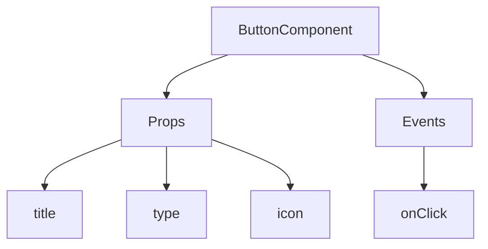
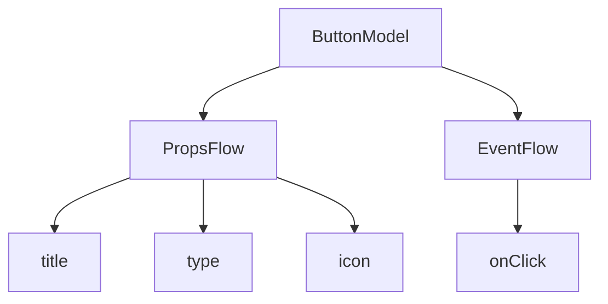

:::tip
Ten dokument został przetłumaczony przez AI. W przypadku niedokładności, proszę odnieść się do [wersji angielskiej](/en)
:::


# Szybki start: Budowanie komponentu przycisku z możliwością orkiestracji

W React zazwyczaj renderujemy komponent przycisku w następujący sposób:

```tsx pure
import { Button } from 'antd';

export default function App() {
  return <Button type="primary">Primary Button</Button>;
}
```

Powyższy kod, choć prosty, jest **komponentem statycznym** i nie spełnia wymagań platform no-code w zakresie konfigurowalności i możliwości orkiestracji.

W FlowEngine NocoBase możemy szybko budować komponenty obsługujące konfigurację i sterowane zdarzeniami, używając **FlowModel + FlowDefinition**, co pozwala osiągnąć potężniejsze możliwości no-code.

---

## Krok 1: Renderowanie komponentu za pomocą FlowModel

<code src="./demos/quickstart-1-basic.tsx"></code>

### 🧠 Kluczowe koncepcje

- `FlowModel` to podstawowy model komponentu w FlowEngine, który hermetyzuje logikę komponentu, jego renderowanie i możliwości konfiguracji.
- Każdy komponent interfejsu użytkownika (UI) może być instancjonowany i jednolicie zarządzany za pomocą `FlowModel`.

### 📌 Kroki implementacji

#### 1. Tworzenie niestandardowej klasy modelu

```tsx pure
class MyModel extends FlowModel {
  render() {
    return <Button {...this.props} />;
  }
}
```

#### 2. Tworzenie instancji modelu

```ts
const model = this.flowEngine.createModel({
  uid: 'my-model',
  use: 'MyModel',
  props: {
    type: 'primary',
    children: 'Primary Button',
  },
});
```

#### 3. Renderowanie za pomocą `<FlowModelRenderer />`

```tsx pure
<FlowModelRenderer model={model} />
```

## Krok 2: Dodawanie PropsFlow, aby właściwości przycisku były konfigurowalne

<code src="./demos/quickstart-2-register-propsflow.tsx"></code>

### 💡 Dlaczego warto używać PropsFlow?

Użycie Flow zamiast statycznych `props` umożliwia:
- Dynamiczną konfigurację
- Wizualną edycję
- Odtwarzanie stanu i jego trwałość

### 🛠 Kluczowe modyfikacje

#### 1. Definiowanie Flow dla właściwości przycisku

```tsx pure

const buttonSettings = defineFlow({
  key: 'buttonSettings',
  
  title: 'Ustawienia przycisku',
  steps: {
    general: {
      title: 'Konfiguracja ogólna',
      uiSchema: {
        title: {
          type: 'string',
          title: 'Tytuł przycisku',
          'x-decorator': 'FormItem',
          'x-component': 'Input',
        },
        type: {
          type: 'string',
          title: 'Typ',
          'x-decorator': 'FormItem',
          'x-component': 'Select',
          enum: [
            { label: 'Główny', value: 'primary' },
            { label: 'Domyślny', value: 'default' },
            { label: 'Niebezpieczny', value: 'danger' },
            { label: 'Przerywany', value: 'dashed' },
            { label: 'Link', value: 'link' },
            { label: 'Tekstowy', value: 'text' },
          ],
        },
        icon: {
          type: 'string',
          title: 'Ikona',
          'x-decorator': 'FormItem',
          'x-component': 'Select',
          enum: [
            { label: 'Szukaj', value: 'SearchOutlined' },
            { label: 'Dodaj', value: 'PlusOutlined' },
            { label: 'Usuń', value: 'DeleteOutlined' },
            { label: 'Edytuj', value: 'EditOutlined' },
            { label: 'Ustawienia', value: 'SettingOutlined' },
          ],
        },
      },
      defaultParams: {
        type: 'primary',
      },
      // Funkcja obsługująca krok, ustawia właściwości modelu
      handler(ctx, params) {
        ctx.model.setProps('children', params.title);
        ctx.model.setProps('type', params.type);
        ctx.model.setProps('icon', params.icon ? React.createElement(icons[params.icon]) : undefined);
      },
    },
  },
});

MyModel.registerFlow(buttonSettings);
```

#### 2. Użycie `stepParams` zamiast statycznych `props`

```diff
const model = this.flowEngine.createModel({
  uid: 'my-model',
  use: 'MyModel',
- props: {
-   type: 'primary',
-   children: 'Primary Button',
- },
+ stepParams: {
+   buttonSettings: {
+     general: {
+       title: 'Primary Button',
+       type: 'primary',
+     },
+   },
+ },
});
```

> ✅ Użycie `stepParams` jest zalecanym podejściem w FlowEngine, ponieważ pozwala uniknąć problemów z danymi, których nie można serializować (takimi jak komponenty React).

#### 3. Włączanie interfejsu konfiguracji właściwości

```diff
- <FlowModelRenderer model={model} />
+ <FlowModelRenderer model={model} showFlowSettings />
```

---

## Krok 3: Obsługa przepływu zdarzeń przycisku (EventFlow)

<code src="./demos/quickstart-3-register-eventflow.tsx"></code>

### 🎯 Scenariusz: Wyświetlanie okna potwierdzenia po kliknięciu przycisku

#### 1. Nasłuchiwanie zdarzenia `onClick`

Dodanie `onClick` w sposób nieinwazyjny

```diff
const myPropsFlow = defineFlow({
  key: 'buttonSettings',
  steps: {
    general: {
      // ... pominięto
      handler(ctx, params) {
        // ... pominięto
+       ctx.model.setProps('onClick', (event) => {
+         ctx.model.dispatchEvent('click', { event });
+       });
      },
    },
  },
});
```

#### 2. Definiowanie przepływu zdarzeń

```ts
const myEventFlow = defineFlow({
  key: 'clickSettings',
  on: 'click',
  title: 'Zdarzenie przycisku',
  steps: {
    confirm: {
      title: 'Konfiguracja akcji potwierdzenia',
      uiSchema: {
        title: {
          type: 'string',
          title: 'Tytuł okna dialogowego',
          'x-decorator': 'FormItem',
          'x-component': 'Input',
        },
        content: {
          type: 'string',
          title: 'Treść okna dialogowego',
          'x-decorator': 'FormItem',
          'x-component': 'Input.TextArea',
        },
      },
      defaultParams: {
        title: 'Potwierdź akcję',
        content: 'Kliknął Pan/Pani przycisk, czy na pewno chce Pan/Pani potwierdzić?',
      },
      async handler(ctx, params) {
        // Okno dialogowe
        const confirmed = await ctx.modal.confirm({
          title: params.title,
          content: params.content,
        });
        // Komunikat
        await ctx.message.info(`Kliknął Pan/Pani przycisk, wynik potwierdzenia: ${confirmed ? 'Potwierdzono' : 'Anulowano'}`);
      },
    },
  },
});
MyModel.registerFlow(myEventFlow);
```

**Dodatkowe uwagi:**
- Przepływ zdarzeń (EventFlow) pozwala na elastyczną konfigurację zachowania przycisku poprzez przepływ pracy, np. wyświetlanie okien dialogowych, komunikatów, wywoływanie API itp.
- Można zarejestrować różne przepływy zdarzeń dla różnych zdarzeń (takich jak `onClick`, `onMouseEnter` itp.), aby sprostać złożonym wymaganiom biznesowym.

#### 3. Konfiguracja parametrów przepływu zdarzeń

Podczas tworzenia modelu można skonfigurować domyślne parametry przepływu zdarzeń za pomocą `stepParams`:

```ts
const model = this.flowEngine.createModel({
  uid: 'my-model',
  use: 'MyModel',
  stepParams: {
    buttonSettings: {
      general: {
        title: 'Primary Button',
        type: 'primary',
      },
    },
    clickSettings: {
      confirm: {
        title: 'Potwierdź akcję',
        content: 'Kliknął Pan/Pani przycisk, czy na pewno chce Pan/Pani potwierdzić?',
      },
    },
  },
});
```

---

## Porównanie modeli: ReactComponent vs FlowModel

Flow nie zmienia sposobu implementacji komponentów. Po prostu dodaje obsługę PropsFlow i EventFlow do ReactComponent, umożliwiając wizualną konfigurację i orkiestrację właściwości i zdarzeń komponentu.


### ReactComponent



### FlowModel



## Podsumowanie

Wykonując powyższe trzy kroki, stworzyliśmy komponent przycisku, który obsługuje konfigurację i orkiestrację zdarzeń, oferując następujące zalety:

- 🚀 Wizualna konfiguracja właściwości (takich jak tytuł, typ, ikona)
- 🔄 Reakcje na zdarzenia mogą być zarządzane przez przepływ pracy (np. kliknięcie w celu wyświetlenia okna dialogowego)
- 🔧 Obsługa przyszłych rozszerzeń (takich jak logika warunkowa, wiązanie zmiennych itp.)

Ten wzorzec ma zastosowanie również do innych komponentów interfejsu użytkownika, takich jak formularze, listy i wykresy. W FlowEngine NocoBase **wszystko można orkiestrować**.