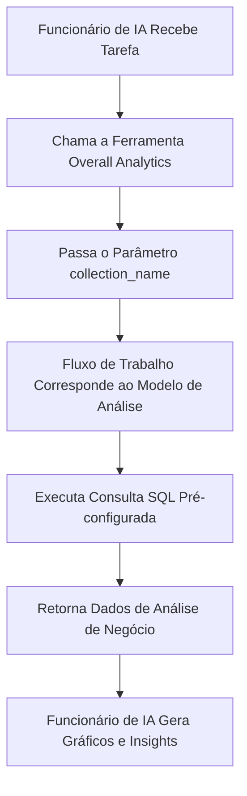

# Funções e Permissões

## Introdução

O gerenciamento de permissões dos Funcionários de IA envolve dois níveis:

1.  **Permissões de Acesso do Funcionário de IA**: Controla quais usuários podem usar quais Funcionários de IA.
2.  **Permissões de Acesso a Dados**: Define como os Funcionários de IA aplicam controles de permissão ao processar dados.

Este documento detalha os métodos de configuração e os princípios de funcionamento desses dois tipos de permissões.

---

## Configurando as Permissões de Acesso do Funcionário de IA

### Definindo Funcionários de IA Disponíveis para Funções

Acesse a página `User & Permissions`, clique na aba `Roles & Permissions` para entrar na página de configuração de funções.


Selecione uma função, clique na aba `Permissions` e, em seguida, na aba `AI employees`. Aqui será exibida a lista de Funcionários de IA gerenciados no **plugin** de Funcionários de IA.

Clique na caixa de seleção na coluna `Available` da lista de Funcionários de IA para controlar se a função atual pode acessar esse Funcionário de IA.


---
:::tip Aviso de tradução por IA
Esta documentação foi traduzida automaticamente por IA.
:::


## Permissões de Acesso a Dados

Quando os Funcionários de IA processam dados, o método de controle de permissões depende do tipo de ferramenta utilizada:

### Ferramentas de Consulta de Dados Integradas ao Sistema (Seguem as Permissões do Usuário)


As seguintes ferramentas **seguem estritamente as permissões de dados do usuário atual** para acesso a dados:

| Nome da Ferramenta                     | Descrição                                                               |
| :------------------------------------- | :---------------------------------------------------------------------- |
| **Consulta de fonte de dados**         | Consulta o banco de dados usando a **fonte de dados**, a **coleção** e os campos. |
| **Contagem de registros da fonte de dados** | Conta o total de registros usando a **fonte de dados**, a **coleção** e os campos. |

**Como Funciona:**

Quando os Funcionários de IA chamam essas ferramentas, o sistema irá:
1.  Identificar a identidade do usuário logado atualmente.
2.  Aplicar as regras de acesso a dados configuradas para esse usuário em **Funções e Permissões**.
3.  Retornar apenas os dados que o usuário tem permissão para visualizar.

**Cenário de Exemplo:**

Suponha que o vendedor A só pode visualizar os dados dos clientes pelos quais é responsável. Quando ele usa o Funcionário de IA Viz para analisar clientes:
-   O Viz chama a `Consulta de fonte de dados` para consultar a tabela de clientes.
-   O sistema aplica as regras de filtragem de permissão de dados do vendedor A.
-   O Viz só pode ver e analisar os dados de clientes que o vendedor A tem acesso.

Isso garante que **os Funcionários de IA não ultrapassem os limites de acesso a dados do próprio usuário**.

---

### Ferramentas de Negócio Personalizadas do Fluxo de Trabalho (Lógica de Permissão Independente)

As ferramentas de consulta de negócio personalizadas através de **fluxos de trabalho** têm controle de permissão **independente das permissões do usuário**, sendo determinado pela lógica de negócio do **fluxo de trabalho**.

Essas ferramentas são tipicamente usadas para:
-   Processos fixos de análise de negócios.
-   Consultas agregadas pré-configuradas.
-   Análise estatística que transcende os limites de permissão.

#### Exemplo 1: Overall Analytics (Análise de Negócios Geral)


Na Demonstração de CRM, `Overall Analytics` é um motor de análise de negócios baseado em modelos:

| Característica         | Descrição                                                                                             |
| :--------------------- | :---------------------------------------------------------------------------------------------------- |
| **Implementação**      | O **fluxo de trabalho** lê modelos SQL pré-configurados e executa consultas somente leitura.                  |
| **Controle de Permissão** | Não é limitado pelas permissões do usuário atual; gera dados de negócio fixos definidos pelos modelos. |
| **Casos de Uso**       | Fornece análise holística padronizada para objetos de negócio específicos (por exemplo, leads, oportunidades, clientes). |
| **Segurança**          | Todos os modelos de consulta são pré-configurados e revisados por administradores, evitando a geração dinâmica de SQL. |

**Fluxo de Trabalho:**



**Características Principais:**
-   Qualquer usuário que chamar esta ferramenta obterá a **mesma perspectiva de negócio**.
-   O escopo dos dados é definido pela lógica de negócio, não sendo filtrado pelas permissões do usuário.
-   Adequado para fornecer relatórios de análise de negócios padronizados.

#### Exemplo 2: SQL Execution (Ferramenta de Análise Avançada)


Na Demonstração de CRM, `SQL Execution` é uma ferramenta mais flexível, mas que requer controle rigoroso:

| Característica         | Descrição                                                                                             |
| :--------------------- | :---------------------------------------------------------------------------------------------------- |
| **Implementação**      | Permite que a IA gere e execute instruções SQL.                                                       |
| **Controle de Permissão** | Controlado pelo **fluxo de trabalho**, geralmente limitado apenas a administradores.                          |
| **Casos de Uso**       | Análise de dados avançada, consultas exploratórias, análise agregada entre tabelas.                   |
| **Segurança**          | Requer que o **fluxo de trabalho** restrinja operações somente leitura (`SELECT`) e controle a disponibilidade através da configuração de tarefas. |

**Recomendações de Segurança:**

1.  **Limitar o Escopo de Uso**: Habilitar apenas em tarefas de blocos de gerenciamento.
2.  **Restrições de Prompt**: Definir claramente o escopo da consulta e os nomes das tabelas nos prompts da tarefa.
3.  **Validação do Fluxo de Trabalho**: Validar as instruções SQL no **fluxo de trabalho** para garantir que apenas operações `SELECT` sejam executadas.
4.  **Logs de Auditoria**: Registrar todas as instruções SQL executadas para facilitar a rastreabilidade.

**Exemplo de Configuração:**

```markdown
Restrições de Prompt da Tarefa:
- Só pode consultar tabelas relacionadas ao CRM (leads, opportunities, accounts, contacts)
- Só pode executar consultas SELECT
- Intervalo de tempo limitado ao último 1 ano
- Retornar resultados limitados a 1000 registros
```

---

## Recomendações de Design de Permissões

### Escolha a Estratégia de Permissão por Cenário de Negócio

| Cenário de Negócio                                | Tipo de Ferramenta Recomendado              | Estratégia de Permissão             | Motivo                                                                 |
| :------------------------------------------------ | :------------------------------------------ | :---------------------------------- | :--------------------------------------------------------------------- |
| Vendedor visualizando seus próprios clientes      | Ferramentas de consulta integradas ao sistema | Seguir permissões do usuário        | Garante isolamento de dados e protege a segurança do negócio.          |
| Gerente de departamento visualizando dados da equipe | Ferramentas de consulta integradas ao sistema | Seguir permissões do usuário        | Aplica automaticamente o escopo de dados do departamento.              |
| Executivo visualizando análise de negócios global | Ferramentas personalizadas do **fluxo de trabalho** / Overall Analytics | Lógica de negócio independente      | Oferece uma perspectiva holística padronizada.                         |
| Analista de dados realizando consultas exploratórias | SQL Execution                               | Restringir estritamente objetos disponíveis | Requer flexibilidade, mas o escopo de acesso deve ser controlado.      |
| Usuários comuns visualizando relatórios padrão    | Overall Analytics                           | Lógica de negócio independente      | Padrões de análise fixos, sem necessidade de se preocupar com as permissões subjacentes. |

### Estratégia de Proteção em Múltiplas Camadas

Para cenários de negócios sensíveis, recomenda-se adotar um controle de permissões em múltiplas camadas:

1.  **Camada de Acesso do Funcionário de IA**: Controla quais funções podem usar esse Funcionário de IA.
2.  **Camada de Visibilidade da Tarefa**: Controla se a tarefa é exibida através da configuração de blocos.
3.  **Camada de Autorização da Ferramenta**: Verifica a identidade e as permissões do usuário nos **fluxos de trabalho**.
4.  **Camada de Acesso a Dados**: Controla o escopo dos dados através das permissões do usuário ou da lógica de negócio.

**Exemplo:**

```
Cenário: Apenas o departamento financeiro pode usar a IA para análise financeira.

- Permissões do Funcionário de IA: Apenas a função financeira pode acessar o Funcionário de IA "Finance Analyst".
- Configuração da Tarefa: As tarefas de análise financeira são exibidas apenas nos módulos financeiros.
- Design da Ferramenta: As ferramentas do fluxo de trabalho financeiro verificam o departamento do usuário.
- Permissões de Dados: As permissões de acesso às tabelas financeiras são concedidas apenas à função financeira.
```

---

## Perguntas Frequentes

### P: Quais dados os Funcionários de IA podem acessar?

**R:** Depende do tipo de ferramenta utilizada:
-   **Ferramentas de consulta integradas ao sistema**: Só podem acessar os dados que o usuário atual tem permissão para visualizar.
-   **Ferramentas personalizadas do fluxo de trabalho**: Determinadas pela lógica de negócio do **fluxo de trabalho**, podem não ser limitadas pelas permissões do usuário.

### P: Como evitar que os Funcionários de IA vazem dados sensíveis?

**R:** Adote proteção em múltiplas camadas:
1.  Configure as permissões de acesso por função para os Funcionários de IA, limitando quem pode usá-los.
2.  Para ferramentas integradas ao sistema, dependa das permissões de dados do usuário para filtragem automática.
3.  Para ferramentas personalizadas, implemente a validação da lógica de negócio nos **fluxos de trabalho**.
4.  Operações sensíveis (como `SQL Execution`) devem ser autorizadas apenas a administradores.

### P: E se eu quiser que alguns Funcionários de IA ignorem as restrições de permissão do usuário?

**R:** Use ferramentas de negócio personalizadas do **fluxo de trabalho**:
-   Crie um **fluxo de trabalho** para implementar lógicas de consulta de negócio específicas.
-   Controle o escopo dos dados e as regras de acesso no **fluxo de trabalho**.
-   Configure a ferramenta para ser usada pelos Funcionários de IA.
-   Controle quem pode chamar essa capacidade através das permissões de acesso do Funcionário de IA.

### P: Qual a diferença entre Overall Analytics e SQL Execution?

**R:**

| Dimensão de Comparação | Overall Analytics                           | SQL Execution                               |
| :--------------------- | :------------------------------------------ | :------------------------------------------ |
| Flexibilidade          | Baixa (só pode usar modelos pré-configurados) | Alta (pode gerar consultas dinamicamente)   |
| Segurança              | Alta (todas as consultas são pré-revisadas) | Média (requer restrições e validação)       |
| Usuários Alvo          | Usuários de negócio comuns                  | Administradores ou analistas avançados      |
| Custo de Manutenção    | Necessita manter modelos de análise        | Não requer manutenção, mas exige monitoramento |
| Consistência dos Dados | Forte (métricas padronizadas)               | Fraca (resultados da consulta podem ser inconsistentes) |

---

## Melhores Práticas

1.  **Seguir as Permissões do Usuário por Padrão**: A menos que haja uma necessidade de negócio clara, priorize o uso de ferramentas integradas ao sistema que seguem as permissões do usuário.
2.  **Análise Padrão Baseada em Modelos**: Para cenários de análise comuns, use o padrão `Overall Analytics` para fornecer capacidades padronizadas.
3.  **Controlar Rigorosamente Ferramentas Avançadas**: Ferramentas de alta permissão como `SQL Execution` devem ser autorizadas apenas a um pequeno número de administradores.
4.  **Isolamento em Nível de Tarefa**: Configure tarefas sensíveis em blocos específicos e implemente o isolamento através de permissões de acesso à página.
5.  **Auditoria e Monitoramento**: Registre o comportamento de acesso a dados dos Funcionários de IA e revise regularmente operações anormais.