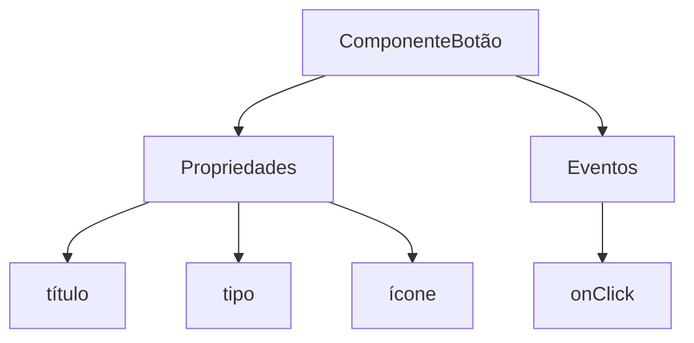
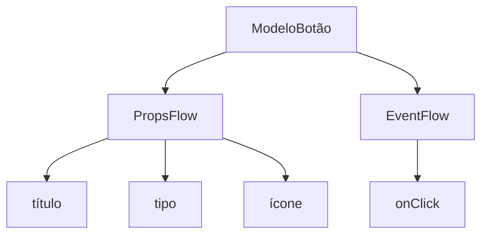

# Início Rápido: Construindo um Componente de Botão Orquestrável

Em React, geralmente renderizamos um componente de botão assim:

```tsx pure
import { Button } from 'antd';

export default function App() {
  return <Button type="primary">Primary Button</Button>;
}
```

Embora o código acima seja simples, ele é um **componente estático** e não consegue atender às necessidades de uma plataforma no-code em termos de configurabilidade e capacidade de orquestração.

No FlowEngine do NocoBase, podemos construir rapidamente componentes que suportam configuração e são orientados a eventos usando **FlowModel + FlowDefinition**, alcançando capacidades no-code mais poderosas.

---

## Passo 1: Renderizando o Componente Usando FlowModel

<code src="./demos/quickstart-1-basic.tsx"></code>

### 🧠 Conceitos Chave

- `FlowModel` é o modelo de componente central no FlowEngine, encapsulando a lógica do componente, a renderização e as capacidades de configuração.
- Cada componente de UI pode ser instanciado e gerenciado de forma unificada através do `FlowModel`.

### 📌 Etapas de Implementação

#### 1. Crie uma classe de modelo personalizada

```tsx pure
class MyModel extends FlowModel {
  render() {
    return <Button {...this.props} />;
  }
}
```

#### 2. Crie uma instância do modelo

```ts
const model = this.flowEngine.createModel({
  uid: 'my-model',
  use: 'MyModel',
  props: {
    type: 'primary',
    children: 'Primary Button',
  },
});
```

#### 3. Renderize usando `<FlowModelRenderer />`

```tsx pure
<FlowModelRenderer model={model} />
```

---
:::tip Aviso de tradução por IA
Esta documentação foi traduzida automaticamente por IA.
:::


## Passo 2: Adicione PropsFlow para Tornar as Propriedades do Botão Configuráveis

<code src="./demos/quickstart-2-register-propsflow.tsx"></code>

### 💡 Por que usar PropsFlow?

Usar Flow em vez de props estáticas permite:
- Configuração dinâmica
- Edição visual
- Replay e persistência de estado

### 🛠 Modificações Chave

#### 1. Defina o Flow para as propriedades do botão

```tsx pure

const buttonSettings = defineFlow({
  key: 'buttonSettings',
  
  title: 'Configurações do Botão',
  steps: {
    setProps: {
      title: 'Configuração Geral',
      uiSchema: {
        title: {
          type: 'string',
          title: 'Título do Botão',
          'x-decorator': 'FormItem',
          'x-component': 'Input',
        },
        type: {
          type: 'string',
          title: 'Tipo',
          'x-decorator': 'FormItem',
          'x-component': 'Select',
          enum: [
            { label: 'Primário', value: 'primary' },
            { label: 'Padrão', value: 'default' },
            { label: 'Perigo', value: 'danger' },
            { label: 'Tracejado', value: 'dashed' },
            { label: 'Link', value: 'link' },
            { label: 'Texto', value: 'text' },
          ],
        },
        icon: {
          type: 'string',
          title: 'Ícone',
          'x-decorator': 'FormItem',
          'x-component': 'Select',
          enum: [
            { label: 'Pesquisar', value: 'SearchOutlined' },
            { label: 'Adicionar', value: 'PlusOutlined' },
            { label: 'Excluir', value: 'DeleteOutlined' },
            { label: 'Editar', value: 'EditOutlined' },
            { label: 'Configurações', value: 'SettingOutlined' },
          ],
        },
      },
      defaultParams: {
        type: 'primary',
      },
      // Função de handler do passo, define as propriedades do modelo
      handler(ctx, params) {
        ctx.model.setProps('children', params.title);
        ctx.model.setProps('type', params.type);
        ctx.model.setProps('icon', params.icon ? React.createElement(icons[params.icon]) : undefined);
      },
    },
  },
});

MyModel.registerFlow(buttonSettings);
```

#### 2. Use `stepParams` em vez de `props` estáticas

```diff
const model = this.flowEngine.createModel({
  uid: 'my-model',
  use: 'MyModel',
- props: {
-   type: 'primary',
-   children: 'Primary Button',
- },
+ stepParams: {
+   buttonSettings: {
+     general: {
+       title: 'Primary Button',
+       type: 'primary',
+     },
+   },
+ },
});
```

> ✅ Usar `stepParams` é a abordagem recomendada no FlowEngine, pois evita problemas com dados não serializáveis (como componentes React).

#### 3. Habilite a interface de configuração de propriedades

```diff
- <FlowModelRenderer model={model} />
+ <FlowModelRenderer model={model} showFlowSettings />
```

---

## Passo 3: Suporte ao Fluxo de Eventos do Botão (EventFlow)

<code src="./demos/quickstart-3-register-eventflow.tsx"></code>

### 🎯 Cenário: Exibir um diálogo de confirmação após clicar no botão

#### 1. Ouça o evento onClick

Adicione onClick de forma não intrusiva

```diff
const myPropsFlow = defineFlow({
  key: 'buttonSettings',
  steps: {
    general: {
      // ... omitido
      handler(ctx, params) {
        // ... omitido
+       ctx.model.setProps('onClick', (event) => {
+         ctx.model.dispatchEvent('click', { event });
+       });
      },
    },
  },
});
```

#### 2. Defina o fluxo de eventos

```ts
const myEventFlow = defineFlow({
  key: 'clickSettings',
  on: 'click',
  title: 'Evento do Botão',
  steps: {
    confirm: {
      title: 'Configuração da Ação de Confirmação',
      uiSchema: {
        title: {
          type: 'string',
          title: 'Título do Prompt do Diálogo',
          'x-decorator': 'FormItem',
          'x-component': 'Input',
        },
        content: {
          type: 'string',
          title: 'Conteúdo do Prompt do Diálogo',
          'x-decorator': 'FormItem',
          'x-component': 'Input.TextArea',
        },
      },
      defaultParams: {
        title: 'Ação de Confirmação',
        content: 'Você clicou no botão, tem certeza?',
      },
      async handler(ctx, params) {
        // Diálogo
        const confirmed = await ctx.modal.confirm({
          title: params.title,
          content: params.content,
        });
        // Mensagem
        await ctx.message.info(`Você clicou no botão, resultado da confirmação: ${confirmed ? 'Confirmado' : 'Cancelado'}`);
      },
    },
  },
});
MyModel.registerFlow(myEventFlow);
```

**Observações Adicionais:**
- O Fluxo de Eventos (EventFlow) permite que o comportamento do botão seja configurado de forma flexível através de um fluxo, como exibir diálogos, mensagens, fazer chamadas de API, etc.
- Você pode registrar diferentes fluxos de eventos para diferentes eventos (como `onClick`, `onMouseEnter`, etc.) para atender a requisitos de negócios complexos.

#### 3. Configure os parâmetros do fluxo de eventos

Ao criar o modelo, você pode configurar os parâmetros padrão para o fluxo de eventos via `stepParams`:

```ts
const model = this.flowEngine.createModel({
  uid: 'my-model',
  use: 'MyModel',
  stepParams: {
    buttonSettings: {
      general: {
        title: 'Primary Button',
        type: 'primary',
      },
    },
    clickSettings: {
      confirm: {
        title: 'Ação de Confirmação',
        content: 'Você clicou no botão, tem certeza?',
      },
    },
  },
});
```

---

## Comparação de Modelos: ReactComponent vs FlowModel

O Flow não altera a forma como os componentes são implementados. Ele simplesmente adiciona suporte para PropsFlow e EventFlow a um ReactComponent, permitindo que as propriedades e eventos do componente sejam configurados e orquestrados visualmente.


### ReactComponent



### FlowModel



## Resumo

Através dos três passos acima, completamos um componente de botão que suporta configuração e orquestração de eventos, com as seguintes vantagens:

- 🚀 Configure visualmente as propriedades (como título, tipo, ícone)
- 🔄 Respostas a eventos podem ser gerenciadas por um fluxo (ex: clique para exibir um diálogo)
- 🔧 Suporta extensões futuras (como lógica condicional, vinculação de variáveis, etc.)

Este padrão também é aplicável a qualquer componente de UI, como formulários, listas e gráficos. No FlowEngine do NocoBase, **tudo é orquestrável**.