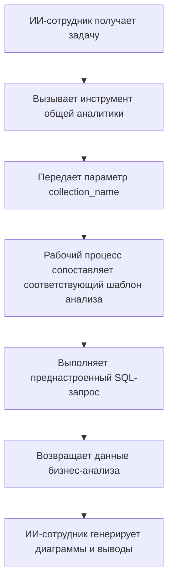

# Роли и права доступа

## Введение

Управление правами ИИ-сотрудников состоит из двух уровней:

1. **Права доступа к ИИ-сотрудникам**: определяет, какие пользователи могут использовать каких ИИ-сотрудников
2. **Права доступа к данным**: как ИИ-сотрудники применяют контроль прав при обработке данных

В этом документе описаны способы настройки и принципы работы двух типов прав.

---

## Настройка прав доступа к ИИ-сотрудникам

### Настройка доступных ИИ-сотрудников для ролей

Перейдите на страницу `Пользователи и права доступа`, нажмите вкладку `Роли и права доступа`, чтобы открыть страницу настройки ролей.


Выберите роль, нажмите вкладку `Права доступа`, затем вкладку `ИИ-сотрудники`. Это отобразит список ИИ-сотрудников, управляемых в плагине ИИ-сотрудников.

Нажмите флажок в столбце `Доступно` в списке ИИ-сотрудников, чтобы управлять тем, может ли текущая роль получать доступ к этому ИИ-сотруднику.


---

## Права доступа к данным

Когда ИИ-сотрудники обрабатывают данные, способ контроля прав зависит от типа используемого инструмента:

### Встроенные инструменты запросов данных системы

Следующие инструменты **строго следуют правам текущего пользователя на доступ к данным**:

| Название инструмента    | Описание |
| ------------------------------------ | ------------------------------- |
| **Запрос источника данных** | Выполняет запрос к базе данных, используя источник данных, коллекцию и поля |
| **Подсчет записей источника данных** | Подсчитывает общее количество записей, используя источник данных, коллекцию и поля |

**Как это работает:**

Когда ИИ-сотрудники вызывают эти инструменты, система выполняет:
1. Определяет личность текущего вошедшего пользователя
2. Применяет правила доступа к данным, настроенные для этого пользователя в **Ролях и правах доступа**
3. Возвращает только те данные, которые пользователь имеет право просматривать

**Пример сценария:**

Предположим, что менеджер продаж A может просматривать только данные клиентов, за которые он отвечает. Когда он использует ИИ-сотрудника Viz для анализа клиентов:
- Viz вызывает `Запрос источника данных`, чтобы выполнить запрос к таблице клиентов
- Система применяет правила фильтрации прав доступа к данным для менеджера продаж A
- Viz может видеть и анализировать только те данные о клиентах, к которым менеджер продаж A имеет доступ

Это гарантирует, что **ИИ-сотрудники не могут обойти границы доступа пользователя к данным**.

---

### Пользовательские бизнес-инструменты на основе рабочего процесса (независимая логика прав)

Бизнес-инструменты запросов, настраиваемые через рабочий процесс, имеют контроль прав **независимо от прав пользователя** и определяются бизнес-логикой рабочего процесса.

Эти инструменты обычно используют для:
- Фиксированных процессов бизнес-аналитики
- Преднастроенных агрегирующих запросов
- Статистического анализа, пересекающего границы прав

#### Пример 1: Общая аналитика (общее бизнес-исследование)


В CRM Demo `Общая аналитика` — движок бизнес-аналитики на основе шаблонов:

| Возможность | Описание |
| -------------------- | ---------------------------------------------- |
| **Реализация**   | Рабочий процесс считывает преднастроенные шаблоны SQL и выполняет запросы только для чтения |
| **Контроль прав доступа** | Не ограничивается правами текущего пользователя: выводит фиксированные бизнес-данные, определенные шаблонами |
| **Сценарии применения**        | Предоставляет стандартизированный комплексный анализ для конкретных бизнес-объектов |
| **Безопасность**         | Все шаблоны запросов преднастроены и проверены администраторами, что позволяет избежать динамической генерации SQL |

**Рабочий процесс:**



**Ключевые характеристики:**
- Любой пользователь, вызывающий этот инструмент, получает **одну и ту же бизнес-картину**
- Объем данных определяется бизнес-логикой, а не фильтруется правами пользователя
- Подходит для предоставления стандартизированных отчетов бизнес-аналитики

#### Пример 2: Выполнение SQL (инструмент расширенного анализа)


В CRM Demo `Выполнение SQL` — более гибкий, но строго контролируемый инструмент:

| Возможность | Описание |
| -------------------- | ---------------------------------------------- |
| **Реализация**   | Позволяет ИИ генерировать и выполнять SQL-операторы |
| **Контроль прав доступа** | Управляется рабочим процессом и обычно ограничен только администраторами |
| **Сценарии применения**        | Расширенный анализ данных, исследовательские запросы, агрегирующий анализ через несколько таблиц |
| **Безопасность**         | Требует, чтобы рабочий процесс ограничивал операции только чтением (SELECT) и управлял доступностью через конфигурацию задач |

**Рекомендации по безопасности:**

1. **Ограничьте область**: включайте только в задачах блоков управления
2. **Ограничения запросов**: четко определяйте область запроса и названия таблиц в запросах задач
3. **Валидация рабочего процесса**: проверяйте SQL-операторы в рабочем процессе, чтобы выполнялись только операции SELECT
4. **Аудит-логи**: фиксируйте все выполненные SQL-операторы для прослеживаемости

**Пример конфигурации:**

```markdown
Ограничения запросов задачи:
- Запрашивайте только CRM-таблицы (напрмер, лиды или контакты)
- Выполняйте только запросы SELECT
- Период времени ограничен последним 1 годом
- Результаты ограничены 1000 записями
```

---

## Рекомендации по проектированию прав

### Выбирайте стратегию прав в зависимости от бизнес-сценария

| Бизнес-сценарий | Рекомендуемый тип инструмента | Стратегия прав | Причина |
| ------------------------- | -------------------- | ------------------- | ------------------------ |
| Менеджер продаж просматривает своих клиентов | Встроенные инструменты запросов системы | Следовать правам пользователя | Обеспечивает изоляцию данных и обеспечивает бизнес-безопасность |
| Руководитель отдела просматривает данные команды | Встроенные инструменты запросов системы | Следовать правам пользователя | Автоматически применяет область данных отдела |
| Руководитель просматривает глобальную бизнес-аналитику | Пользовательские инструменты рабочего процесса (Общая аналитика) | Независимая бизнес-логика | Обеспечивает стандартизированную комплексную картину |
| Аналитик данных выполняет исследовательские запросы | Выполнение SQL | Строго ограничивайте доступные объекты | Требует гибкости, но необходимо контролировать область доступа |
| Обычные пользователи просматривают стандартные отчеты | Общая аналитика | Независимая бизнес-логика | Фиксированные стандарты анализа, не нужно беспокоиться о базовых правах |

### Стратегия многоуровневой защиты

Для чувствительных бизнес-сценариев рекомендуется использовать многоуровневый контроль прав:

1. **Уровень доступа к ИИ-сотрудникам**: контролируйте, какие роли могут использовать каких ИИ-сотрудников
2. **Уровень видимости задач**: управляйте отображением задач через конфигурацию блоков
3. **Уровень авторизации инструментов**: проверяйте личность пользователя и права в рабочем процессе
4. **Уровень доступа к данным**: контролируйте область данных через права пользователя или бизнес-логику

**Пример:**

```
Сценарий: использовать ИИ для финансового анализа может только финансовый отдел

- Права на ИИ-сотрудника: только роль Финансист может получить доступ к ИИ-сотруднику "Финансовый аналитик"
- Конфигурация задач: задачи по финансовому анализу отображаются только в модулях финансов
- Проектирование инструментов: инструменты рабочего процесса для финансов проверяют отдел пользователя
- Права на данные: доступ к таблицам финансов предоставляется только роли Финансист
```

---

## Часто задаваемые вопросы

### Вопрос: К каким данным могут обращаться ИИ-сотрудники?

**Ответ:** зависит от типа используемого инструмента:
- **Встроенные инструменты запросов системы**: могут получать доступ только к тем данным, которые текущий пользователь имеет право просматривать
- **Пользовательские инструменты рабочего процесса**: определяются бизнес-логикой рабочего процесса и могут не ограничиваться правами пользователя

### Вопрос: Как не допустить утечку чувствительных данных ИИ-сотрудниками?

**Ответ:** применяйте многоуровневую защиту:
1. Настройте права доступа к ролям ИИ-сотрудников, чтобы ограничить круг пользователей, которые могут ими пользоваться
2. Для встроенных инструментов системы используйте права доступа пользователей к данным для автоматической фильтрации
3. Для пользовательских инструментов реализуйте валидацию бизнес-логики в рабочих процессах
4. Чувствительные операции (например, Выполнение SQL) должны быть разрешены только администраторам

### Вопрос: Что делать, если я хочу, чтобы некоторые ИИ-сотрудники обходили ограничения прав пользователя?

**Ответ:** используйте пользовательские бизнес-инструменты на основе рабочего процесса:
- Создавайте рабочие процессы для реализации конкретной бизнес-логики запросов
- Управляйте областью данных и правилами доступа в рабочих процессах
- Настраивайте инструменты, которыми смогут пользоваться ИИ-сотрудники
- Управляйте тем, кто может вызывать эту возможность, через права доступа к ИИ-сотрудникам

### Вопрос: В чем разница между Общей аналитикой и Выполнением SQL?

**Ответ:**

| Критерий сравнения | Общая аналитика   | Выполнение SQL     |
| -------------------- | ------------------- | ----------------- |
| Гибкость          | Низкая (можно использовать только преднастроенные шаблоны) | Высокая (запросы можно генерировать динамически) |
| Безопасность             | Высокая (все запросы предварительно проверяются) | Средняя (требуются ограничения и валидация) |
| Целевые пользователи         | Обычные бизнес-пользователи | Администраторы или старшие аналитики |
| Затраты на сопровождение     | Нужно поддерживать шаблоны анализа | Сопровождение не требуется, но нужна регулярная проверка |
| Согласованность данных     | Сильная (стандартизированные метрики) | Слабая (результаты запросов могут быть несогласованными) |

---

## Лучшие практики

1. **По умолчанию используйте права пользователя**: если нет явной бизнес-необходимости, отдавайте приоритет встроенным инструментам системы, которые следуют правам пользователя
2. **Стандартизированный анализ по шаблонам**: для типовых сценариев анализа используйте подход Общая аналитика, чтобы предоставлять стандартизированные возможности
3. **Строго контролируйте расширенные инструменты**: инструменты с высоким уровнем привилегий, такие как Выполнение SQL, должны быть разрешены только нескольким администраторам
4. **Изоляция на уровне задач**: настраивайте чувствительные задачи в конкретных блоках и реализуйте изоляцию через права доступа к страницам
5. **Аудит и мониторинг (Audit and Monitoring)**: фиксируйте поведение ИИ-сотрудников при доступе к данным и регулярно проверяйте аномальные операции
