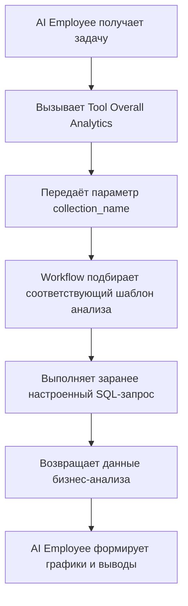

:::tip Уведомление о переводе ИИ
Эта документация была автоматически переведена ИИ.
:::

# Роли и разрешения

## Введение

Управление разрешениями AI Employee включает два уровня:

1. **Разрешение доступа к AI Employee**: контролирует, какие пользователи могут использовать какие AI Employee.
2. **Разрешение доступа к данным**: каким образом применяются разрешения, когда AI Employee обрабатывает данные.

В этом документе подробно описаны способы настройки и принципы работы обоих типов разрешений.

---

## Настройка разрешения доступа к AI Employee

### Назначение AI Employee для роли

Откройте страницу `User & Permissions`, перейдите на вкладку `Roles & Permissions`, чтобы открыть страницу настройки ролей.


Выберите роль, перейдите на вкладку `Permissions`, затем — на вкладку `AI employees`. На ней отображается список AI Employee, управляемых плагином.

С помощью флажка в столбце `Available` укажите, может ли текущая роль использовать данного AI Employee.


---

## Разрешения доступа к данным

При обработке данных AI Employee способ контроля разрешений зависит от типа используемого Tool:

### Встроенные инструменты запроса данных (следуют разрешениям пользователя)

Следующие инструменты обращаются к данным **строго в соответствии с разрешениями текущего пользователя**:

| Название инструмента | Описание |
| --- | --- |
| **Data source query** | Запрос к базе данных с использованием источника данных, Collection и Field |
| **Data source records counting** | Подсчёт общего количества записей с использованием источника данных, Collection и Field |

**Принцип работы:**

Когда AI Employee вызывает эти инструменты, система:
1. Идентифицирует личность текущего пользователя.
2. Применяет правила доступа, настроенные в **ролях и разрешениях** для этого пользователя.
3. Возвращает только те данные, которые пользователю разрешено просматривать.

**Пример сценария:**

Предположим, менеджер по продажам A может видеть данные только своих клиентов. Когда он использует AI Employee Viz для анализа клиентов:
- Viz вызывает `Data source query` для запроса таблицы клиентов.
- Система применяет правила фильтрации данных менеджера A.
- Viz видит и анализирует только тех клиентов, к которым у A есть доступ.

Это гарантирует, что **AI Employee не выходит за пределы доступа пользователя к данным**.

---

### Пользовательские бизнес-инструменты Workflow (независимая логика разрешений)

Пользовательские бизнес-инструменты, реализованные через Workflow, имеют контроль разрешений, **независимый от разрешений пользователя** и определяемый бизнес-логикой Workflow.

Такие инструменты обычно используются для:
- Фиксированных процессов бизнес-анализа.
- Заранее настроенных агрегатных запросов.
- Сводной аналитики, выходящей за границы разрешений.

#### Пример 1: Overall Analytics (общий бизнес-анализ)


В CRM Demo `Overall Analytics` представляет собой шаблонный движок бизнес-анализа:

| Свойство | Описание |
| --- | --- |
| **Реализация** | Workflow читает заранее настроенные SQL-шаблоны и выполняет запросы только на чтение |
| **Контроль разрешений** | Не ограничивается разрешениями текущего пользователя; вывод — фиксированные бизнес-данные, заданные шаблоном |
| **Сценарий применения** | Стандартизированный общий анализ для конкретных бизнес-объектов (Lead, Opportunity, Account) |
| **Безопасность** | Все шаблоны запросов настраиваются и проверяются администратором заранее, что исключает динамическое формирование SQL |

**Поток выполнения:**



**Ключевые особенности:**
- Любой пользователь, вызывающий этот Tool, получает **одинаковый бизнес-обзор**.
- Объём данных определяется бизнес-логикой и не фильтруется разрешениями пользователя.
- Подходит для стандартизированных аналитических отчётов.

#### Пример 2: SQL Execution (расширенный аналитический инструмент)


В CRM Demo `SQL Execution` — более гибкий инструмент, требующий строгого контроля:

| Свойство | Описание |
| --- | --- |
| **Реализация** | Позволяет ИИ генерировать и выполнять SQL-запросы |
| **Контроль разрешений** | Управляется Workflow и обычно ограничен администратором |
| **Сценарий применения** | Расширенный анализ данных, исследовательские запросы, агрегация по нескольким таблицам |
| **Безопасность** | В Workflow следует ограничить операции только чтением (SELECT) и контролировать доступность через настройки задачи |

**Рекомендации по безопасности:**

1. **Ограничьте область доступности**: настраивайте этот Tool только в задачах в административных Block.
2. **Ограничения промпта**: в промпте задачи явно укажите область запроса и имена таблиц.
3. **Проверка в Workflow**: проверяйте SQL-запросы в Workflow, чтобы выполнялись только SELECT-операции.
4. **Журнал аудита**: фиксируйте все выполненные SQL-запросы для возможности аудита.

**Пример настройки:**

```markdown
Ограничения промпта задачи:
- Запрашивать можно только таблицы CRM (leads, opportunities, accounts, contacts)
- Допустимы только SELECT-запросы
- Диапазон дат — последние 12 месяцев
- Размер результата — не более 1000 записей
```

---

## Рекомендации по проектированию разрешений

### Выбор стратегии разрешений по бизнес-сценарию

| Бизнес-сценарий | Рекомендуемый тип Tool | Стратегия разрешений | Причина |
| --- | --- | --- | --- |
| Менеджер просматривает своих клиентов | Встроенный Tool | Следовать разрешениям пользователя | Изоляция данных и защита бизнеса |
| Руководитель отдела просматривает данные команды | Встроенный Tool | Следовать разрешениям пользователя | Автоматическое применение области данных отдела |
| Топ-менеджер просматривает глобальный анализ | Пользовательский Tool / Overall Analytics | Независимая бизнес-логика | Стандартизированный общий обзор |
| Аналитик выполняет исследовательские запросы | SQL Execution | Строгое ограничение допустимых объектов | Нужна гибкость, но требуется контроль доступа |
| Обычный пользователь смотрит стандартные отчёты | Overall Analytics | Независимая бизнес-логика | Фиксированные метрики анализа без учёта базовых разрешений |

### Многоуровневая защита

Для чувствительных бизнес-сценариев рекомендуется многослойный контроль разрешений:

1. **Уровень доступа к AI Employee**: какие роли могут использовать AI Employee.
2. **Уровень видимости задачи**: показывается ли задача — настраивается через Block.
3. **Уровень авторизации Tool**: проверка личности и разрешений пользователя в Workflow.
4. **Уровень доступа к данным**: контроль объёма данных через разрешения пользователя или бизнес-логику.

**Пример:**

```
Сценарий: только финансовый отдел может использовать ИИ для финансового анализа

- Разрешение AI Employee: только роль «Финансы» может работать с AI Employee «Finance Analyst»
- Настройка задачи: задача финансового анализа отображается только в финансовом модуле
- Разработка Tool: финансовый Workflow проверяет принадлежность пользователя к отделу
- Разрешения данных: доступ к финансовым таблицам предоставлен только финансовой роли
```

---

## Часто задаваемые вопросы

### В: К каким данным имеет доступ AI Employee?

**О:** Зависит от типа Tool:
- **Встроенные инструменты запроса**: только к данным, доступным текущему пользователю.
- **Пользовательские Tool Workflow**: определяется бизнес-логикой Workflow и может не зависеть от разрешений пользователя.

### В: Как предотвратить утечку чувствительных данных через AI Employee?

**О:** Применяйте многослойную защиту:
1. Настройте разрешение роли AI Employee — кто может его использовать.
2. Для встроенных инструментов положитесь на автоматическую фильтрацию по разрешениям пользователя.
3. Для пользовательских Tool реализуйте проверку бизнес-логики в Workflow.
4. Чувствительные операции (такие как SQL Execution) предоставляйте только администратору.

### В: Я хочу, чтобы некоторые AI Employee выходили за пределы разрешений пользователя. Как это сделать?

**О:** Используйте пользовательские бизнес-Tool Workflow:
- Создайте Workflow с нужной бизнес-логикой запроса.
- В Workflow контролируйте объём данных и правила доступа.
- Назначьте Tool AI Employee.
- Контролируйте, кто может использовать эту возможность, через разрешения доступа AI Employee.

### В: В чём разница между Overall Analytics и SQL Execution?

**О:**

| Параметр | Overall Analytics | SQL Execution |
| --- | --- | --- |
| Гибкость | Низкая (только заранее настроенные шаблоны) | Высокая (динамическая генерация запросов) |
| Безопасность | Высокая (все запросы предварительно проверены) | Средняя (требует ограничений и проверок) |
| Целевая аудитория | Обычные бизнес-пользователи | Администраторы или продвинутые аналитики |
| Стоимость поддержки | Поддержка шаблонов анализа | Поддержка не требуется, но нужен мониторинг |
| Согласованность данных | Высокая (стандартизированные метрики) | Низкая (результаты могут различаться) |

---

## Лучшие практики

1. **По умолчанию следовать разрешениям пользователя**: при отсутствии явной бизнес-потребности предпочитайте встроенные инструменты, учитывающие разрешения.
2. **Шаблонизация стандартного анализа**: для типичных сценариев используйте шаблон Overall Analytics для стандартизированных возможностей.
3. **Жёсткий контроль расширенных инструментов**: SQL Execution и другие высокопривилегированные Tool предоставляйте только узкому кругу администраторов.
4. **Изоляция на уровне задачи**: настраивайте чувствительные задачи в специальных Block и изолируйте их через разрешения доступа к страницам.
5. **Аудит и мониторинг**: фиксируйте поведение AI Employee при доступе к данным и регулярно проверяйте аномальные операции.
