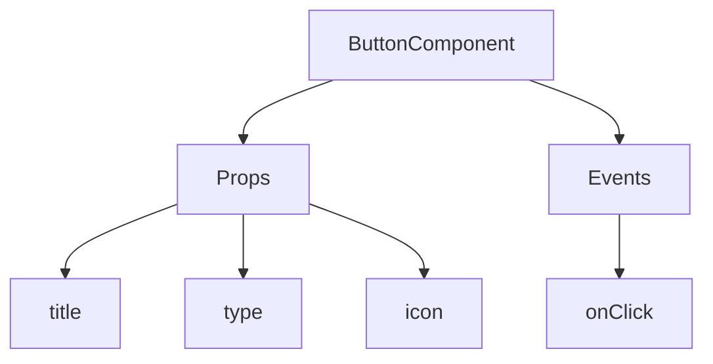
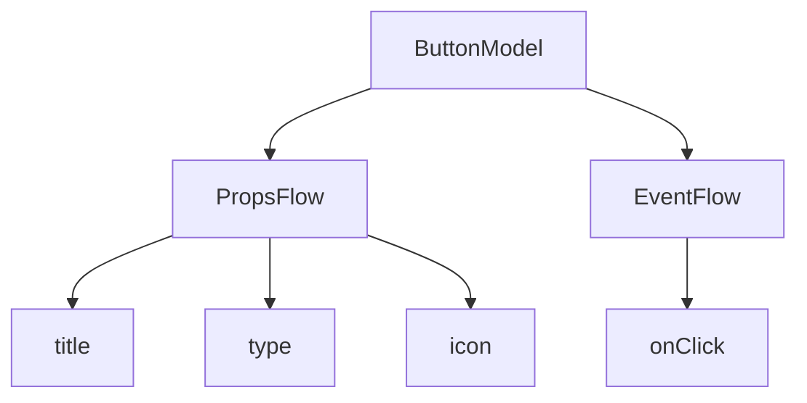

:::tip Уведомление о переводе ИИ
Эта документация была автоматически переведена ИИ.
:::


# Быстрый старт: Создание компонуемого компонента кнопки

В React мы обычно рендерим компонент кнопки следующим образом:

```tsx pure
import { Button } from 'antd';

export default function App() {
  return <Button type="primary">Primary Button</Button>;
}
```

Хотя приведенный выше код прост, он представляет собой **статический компонент** и не может удовлетворить потребности no-code платформ в гибкой настройке и возможностях компоновки.

В FlowEngine NocoBase мы можем быстро создавать компоненты, поддерживающие конфигурацию и управляемые событиями, используя **FlowModel + FlowDefinition**, достигая таким образом более мощных no-code возможностей.

---

## Шаг 1: Рендеринг компонента с помощью FlowModel

<code src="./demos/quickstart-1-basic.tsx"></code>

### 🧠 Ключевые концепции

- `FlowModel` — это основная модель компонента в FlowEngine, инкапсулирующая логику компонента, возможности рендеринга и конфигурации.
- Каждый компонент пользовательского интерфейса может быть инстанцирован и унифицированно управляться через `FlowModel`.

### 📌 Шаги реализации

#### 1. Создайте пользовательский класс модели

```tsx pure
class MyModel extends FlowModel {
  render() {
    return <Button {...this.props} />;
  }
}
```

#### 2. Создайте экземпляр модели

```ts
const model = this.flowEngine.createModel({
  uid: 'my-model',
  use: 'MyModel',
  props: {
    type: 'primary',
    children: 'Primary Button',
  },
});
```

#### 3. Выполните рендеринг с помощью `<FlowModelRenderer />`

```tsx pure
<FlowModelRenderer model={model} />
```

## Шаг 2: Добавление PropsFlow для настройки свойств кнопки

<code src="./demos/quickstart-2-register-propsflow.tsx"></code>

### 💡 Зачем использовать PropsFlow?

Использование Flow вместо статических свойств (props) позволяет реализовать:
- Динамическую конфигурацию
- Визуальное редактирование
- Воспроизведение и сохранение состояния

### 🛠 Ключевые изменения

#### 1. Определите Flow для свойств кнопки

```tsx pure

const buttonSettings = defineFlow({
  key: 'buttonSettings',
  
  title: 'Настройки кнопки',
  steps: {
    general: {
      title: 'Общая конфигурация',
      uiSchema: {
        title: {
          type: 'string',
          title: 'Заголовок кнопки',
          'x-decorator': 'FormItem',
          'x-component': 'Input',
        },
        type: {
          type: 'string',
          title: 'Тип',
          'x-decorator': 'FormItem',
          'x-component': 'Select',
          enum: [
            { label: 'Основной', value: 'primary' },
            { label: 'По умолчанию', value: 'default' },
            { label: 'Опасный', value: 'danger' },
            { label: 'Пунктирный', value: 'dashed' },
            { label: 'Ссылка', value: 'link' },
            { label: 'Текст', value: 'text' },
          ],
        },
        icon: {
          type: 'string',
          title: 'Иконка',
          'x-decorator': 'FormItem',
          'x-component': 'Select',
          enum: [
            { label: 'Поиск', value: 'SearchOutlined' },
            { label: 'Добавить', value: 'PlusOutlined' },
            { label: 'Удалить', value: 'DeleteOutlined' },
            { label: 'Редактировать', value: 'EditOutlined' },
            { label: 'Настройки', value: 'SettingOutlined' },
          ],
        },
      },
      defaultParams: {
        type: 'primary',
      },
      // Функция-обработчик шага, устанавливает свойства модели
      handler(ctx, params) {
        ctx.model.setProps('children', params.title);
        ctx.model.setProps('type', params.type);
        ctx.model.setProps('icon', params.icon ? React.createElement(icons[params.icon]) : undefined);
      },
    },
  },
});

MyModel.registerFlow(buttonSettings);
```

#### 2. Используйте `stepParams` вместо статических `props`

```diff
const model = this.flowEngine.createModel({
  uid: 'my-model',
  use: 'MyModel',
- props: {
-   type: 'primary',
-   children: 'Primary Button',
- },
+ stepParams: {
+   buttonSettings: {
+     general: {
+       title: 'Primary Button',
+       type: 'primary',
+     },
+   },
+ },
});
```

> ✅ Использование `stepParams` — это рекомендуемый подход в FlowEngine, так как он позволяет избежать проблем с несериализуемыми данными (такими как компоненты React).

#### 3. Включите интерфейс настройки свойств

```diff
- <FlowModelRenderer model={model} />
+ <FlowModelRenderer model={model} showFlowSettings />
```

---

## Шаг 3: Поддержка потока событий кнопки (EventFlow)

<code src="./demos/quickstart-3-register-eventflow.tsx"></code>

### 🎯 Сценарий: Показ диалогового окна подтверждения после нажатия кнопки

#### 1. Прослушивание события onClick

Добавьте onClick неинтрузивным способом

```diff
const myPropsFlow = defineFlow({
  key: 'buttonSettings',
  steps: {
    general: {
      // ... опущено
      handler(ctx, params) {
        // ... опущено
+       ctx.model.setProps('onClick', (event) => {
+         ctx.model.dispatchEvent('click', { event });
+       });
      },
    },
  },
});
```

#### 2. Определение потока событий

```ts
const myEventFlow = defineFlow({
  key: 'clickSettings',
  on: 'click',
  title: 'Событие кнопки',
  steps: {
    confirm: {
      title: 'Настройка действия подтверждения',
      uiSchema: {
        title: {
          type: 'string',
          title: 'Заголовок всплывающего окна',
          'x-decorator': 'FormItem',
          'x-component': 'Input',
        },
        content: {
          type: 'string',
          title: 'Содержимое всплывающего окна',
          'x-decorator': 'FormItem',
          'x-component': 'Input.TextArea',
        },
      },
      defaultParams: {
        title: 'Подтверждение действия',
        content: 'Вы нажали кнопку, подтверждаете ли вы действие?',
      },
      async handler(ctx, params) {
        // Всплывающее окно
        const confirmed = await ctx.modal.confirm({
          title: params.title,
          content: params.content,
        });
        // Сообщение
        await ctx.message.info(`Вы нажали кнопку, результат подтверждения: ${confirmed ? 'Подтверждено' : 'Отменено'}`);
      },
    },
  },
});
MyModel.registerFlow(myEventFlow);
```

**Дополнительные примечания:**
- Поток событий (EventFlow) позволяет гибко настраивать поведение кнопки через рабочий процесс, например, показывать всплывающие окна, сообщения, выполнять вызовы API и т. д.
- Вы можете регистрировать различные потоки событий для разных событий (таких как `onClick`, `onMouseEnter` и т. д.) для удовлетворения сложных бизнес-требований.

#### 3. Настройка параметров потока событий

При создании модели вы можете настроить параметры потока событий по умолчанию через `stepParams`:

```ts
const model = this.flowEngine.createModel({
  uid: 'my-model',
  use: 'MyModel',
  stepParams: {
    buttonSettings: {
      general: {
        title: 'Primary Button',
        type: 'primary',
      },
    },
    clickSettings: {
      confirm: {
        title: 'Confirm Action',
        content: 'You clicked the button, are you sure?',
      },
    },
  },
});
```

---

## Сравнение моделей: ReactComponent vs FlowModel

Flow не меняет способ реализации компонентов. Он просто добавляет поддержку PropsFlow и EventFlow к ReactComponent, позволяя визуально настраивать и компоновать свойства и события компонента.


### ReactComponent



### FlowModel



## Заключение

Выполнив три описанных выше шага, мы создали компонент кнопки, поддерживающий настройку и компоновку событий, со следующими преимуществами:

- 🚀 Визуальная настройка свойств (таких как заголовок, тип, иконка)
- 🔄 Обработка событий может управляться потоком (например, показ всплывающего окна по клику)
- 🔧 Поддержка будущих расширений (например, условная логика, привязка переменных и т. д.)

Этот шаблон также применим к любым компонентам пользовательского интерфейса, таким как формы, списки и диаграммы. В FlowEngine NocoBase **все поддается компоновке**.