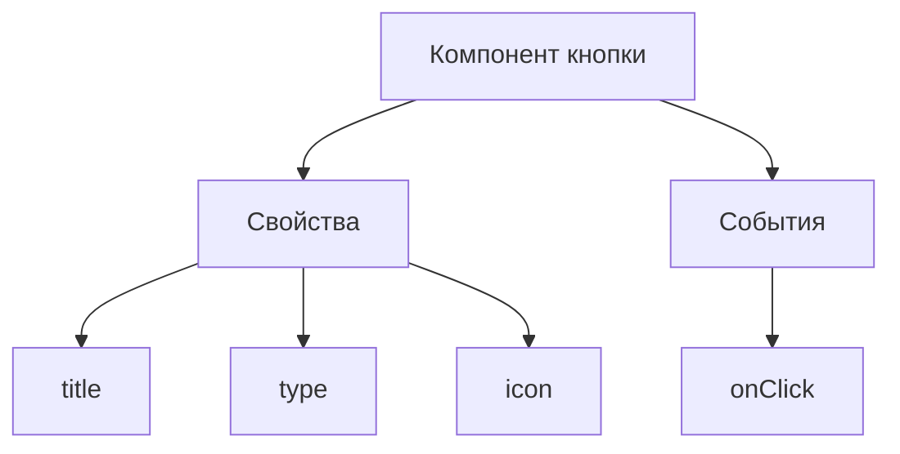
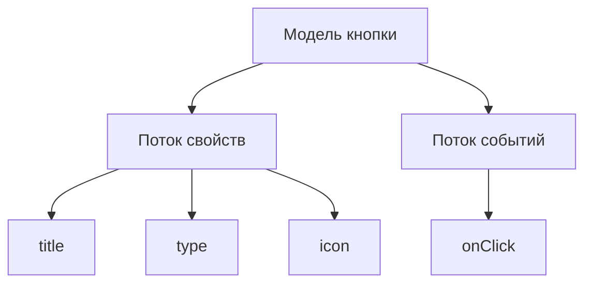

# Быстрый старт: создание оркестрируемого компонента кнопки

В React компонент кнопки обычно рендерится так:

```tsx pure
import { Button } from 'antd';

export default function App() {
  return <Button type="primary">Primary Button</Button>;
}
```

Хотя пример выше простой, это **статический компонент**, и он не покрывает требования no-code платформы к настраиваемости и оркестрации.

В движке потоков NocoBase можно быстро собирать компоненты с поддержкой конфигурации и управлением по событиям, используя **модель потока (FlowModel) + определение потока (FlowDefinition)**.

---

## Шаг 1: рендер компонента через модель потока (FlowModel)

<code src="./demos/quickstart-1-basic.tsx"></code>

### 🧠 Ключевые идеи

- Модель потока (`FlowModel`) — базовая модель компонента в движке потоков, инкапсулирующая логику компонента, рендер и возможности конфигурации.
- Любой UI-компонент можно единообразно создавать и управлять им через модель потока (`FlowModel`).

### 📌 Шаги реализации

#### 1. Создайте пользовательский класс модели

```tsx pure
class MyModel extends FlowModel {
  render() {
    return <Button {...this.props} />;
  }
}
```

#### 2. Создайте экземпляр модели

```ts
const model = await this.flowEngine.createModelAsync({
  uid: 'my-model',
  use: 'MyModel',
  props: {
    type: 'primary',
    children: 'Primary Button',
  },
});
```

#### 3. Выполните рендер через `<FlowModelRenderer />`

```tsx pure
<FlowModelRenderer model={model} />
```

## Шаг 2: добавьте PropsFlow, чтобы свойства кнопки стали настраиваемыми

<code src="./demos/quickstart-2-register-propsflow.tsx"></code>

### 💡 Зачем использовать PropsFlow?

Использование потока (Flow) вместо статических props даёт:
- Динамическую конфигурацию
- Визуальное редактирование
- Воспроизведение состояния и персистентность

### 🛠 Ключевые изменения

#### 1. Определите поток (Flow) для свойств кнопки

```tsx pure

const buttonSettings = defineFlow({
  key: 'buttonSettings',
  
  title: 'Button Settings',
  steps: {
    general: {
      title: 'General Configuration',
      uiSchema: {
        title: {
          type: 'string',
          title: 'Button Title',
          'x-decorator': 'FormItem',
          'x-component': 'Input',
        },
        type: {
          type: 'string',
          title: 'Type',
          'x-decorator': 'FormItem',
          'x-component': 'Select',
          enum: [
            { label: 'Primary', value: 'primary' },
            { label: 'Default', value: 'default' },
            { label: 'Danger', value: 'danger' },
            { label: 'Dashed', value: 'dashed' },
            { label: 'Link', value: 'link' },
            { label: 'Text', value: 'text' },
          ],
        },
        icon: {
          type: 'string',
          title: 'Icon',
          'x-decorator': 'FormItem',
          'x-component': 'Select',
          enum: [
            { label: 'Search', value: 'SearchOutlined' },
            { label: 'Add', value: 'PlusOutlined' },
            { label: 'Delete', value: 'DeleteOutlined' },
            { label: 'Edit', value: 'EditOutlined' },
            { label: 'Settings', value: 'SettingOutlined' },
          ],
        },
      },
      defaultParams: {
        type: 'primary',
      },
      // Функция-обработчик шага, задаёт свойства модели (Step handler function, sets model properties)
      handler(ctx, params) {
        ctx.model.setProps('children', params.title);
        ctx.model.setProps('type', params.type);
        ctx.model.setProps('icon', params.icon ? React.createElement(icons[params.icon]) : undefined);
      },
    },
  },
});

MyModel.registerFlow(buttonSettings);
```

#### 2. Используйте `stepParams` вместо статических `props`

```diff
const model = this.flowEngine.createModel({
  uid: 'my-model',
  use: 'MyModel',
- props: {
-   type: 'primary',
-   children: 'Primary Button',
- },
+ stepParams: {
+   buttonSettings: {
+     general: {
+       title: 'Primary Button',
+       type: 'primary',
+     },
+   },
+ },
});
```

> ✅ Использование `stepParams` — рекомендуемый подход в движке потоков, так как он избегает проблем с несериализуемыми данными (например React-компонентами).

#### 3. Включите интерфейс конфигурации свойств

```diff
- <FlowModelRenderer model={model} />
+ <FlowModelRenderer model={model} showFlowSettings />
```

---

## Шаг 3: добавьте поддержку потока событий кнопки (EventFlow)

<code src="./demos/quickstart-3-register-eventflow.tsx"></code>

### 🎯 Сценарий: показывать диалог подтверждения после клика по кнопке

#### 1. Обработка события onClick

Добавление onClick неинвазивным способом

```diff
const myPropsFlow = defineFlow({
  key: 'buttonSettings',
  steps: {
    general: {
      // ... omitted
      handler(ctx, params) {
        // ... omitted
+       ctx.model.setProps('onClick', (event) => {
+         ctx.model.dispatchEvent('click', { event });
+       });
      },
    },
  },
});
```

#### 2. Определите event flow

```ts
const myEventFlow = defineFlow({
  key: 'clickSettings',
  on: 'click',
  title: 'Button Event',
  steps: {
    confirm: {
      title: 'Confirmation Action Configuration',
      uiSchema: {
        title: {
          type: 'string',
          title: 'Dialog Prompt Title',
          'x-decorator': 'FormItem',
          'x-component': 'Input',
        },
        content: {
          type: 'string',
          title: 'Dialog Prompt Content',
          'x-decorator': 'FormItem',
          'x-component': 'Input.TextArea',
        },
      },
      defaultParams: {
        title: 'Confirm Action',
        content: 'You clicked the button, are you sure?',
      },
      async handler(ctx, params) {
        // Диалог (Dialog)
        const confirmed = await ctx.modal.confirm({
          title: params.title,
          content: params.content,
        });
        // Сообщение (Message)
        await ctx.message.info(`You clicked the button, confirmation result: ${confirmed ? 'Confirmed' : 'Canceled'}`);
      },
    },
  },
});
MyModel.registerFlow(myEventFlow);
```

**Дополнительные замечания:**
- EventFlow позволяет гибко настраивать поведение кнопки через flow: показывать диалоги, сообщения, выполнять API-вызовы и т.д.
- Можно регистрировать разные event flow для разных событий (например `onClick`, `onMouseEnter` и т.д.), чтобы покрывать сложные бизнес-требования.

#### 3. Настройте параметры event flow

При создании модели можно задать параметры event flow по умолчанию через `stepParams`:

```ts
const model = this.flowEngine.createModel({
  uid: 'my-model',
  use: 'MyModel',
  stepParams: {
    buttonSettings: {
      general: {
        title: 'Primary Button',
        type: 'primary',
      },
    },
    clickSettings: {
      confirm: {
        title: 'Confirm Action',
        content: 'You clicked the button, are you sure?',
      },
    },
  },
});
```

---

## Сравнение моделей: ReactComponent и модель потока (FlowModel)

Поток не меняет способ реализации компонентов. Он добавляет в ReactComponent поддержку PropsFlow и EventFlow, позволяя визуально настраивать и оркестрировать свойства и события компонента.


### ReactComponent


```mermaid
graph TD
  Button[Компонент кнопки]
  Button --> Props[Свойства]
  Button --> Events[События]
  Props --> title[title]
  Props --> type[type]
  Props --> icon[icon]
  Events --> onClick[onClick]
```

### Модель потока (FlowModel)


```mermaid
graph TD
  Button[Модель кнопки]
  Button --> Props[Поток свойств]
  Button --> Events[Поток событий]
  Props --> title[title]
  Props --> type[type]
  Props --> icon[icon]
  Events --> onClick[onClick]
```

## Итог

За три шага мы собрали компонент кнопки с поддержкой конфигурации и оркестрации событий, получив следующие преимущества:

- 🚀 Визуальная настройка свойств (title, type, icon)
- 🔄 Управление реакцией на события через flow (например, клик показывает диалог)
- 🔧 Поддержка дальнейших расширений (условная логика, привязка переменных и т.д.)

Этот паттерн применим к любым UI-компонентам: формам, спискам, графикам. В движке потоков NocoBase **можно оркестрировать всё**.