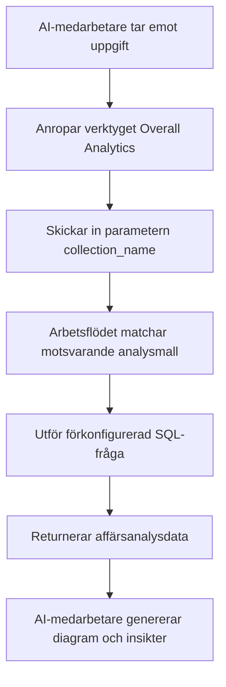

:::tip
Detta dokument har översatts av AI. För eventuella felaktigheter, se [den engelska versionen](/en)
:::


# Roller och behörigheter

## Introduktion

Behörighetshantering för AI-medarbetare omfattar två nivåer:

1.  **Åtkomstbehörigheter för AI-medarbetare**: Styr vilka användare som får använda vilka AI-medarbetare.
2.  **Dataåtkomstbehörigheter**: Hur AI-medarbetare tillämpar behörighetskontroller vid databehandling.

Detta dokument beskriver i detalj hur dessa två typer av behörigheter konfigureras och fungerar.

---

## Konfigurera åtkomstbehörigheter för AI-medarbetare

### Ställa in tillgängliga AI-medarbetare för roller

Gå till sidan `User & Permissions`, klicka på fliken `Roles & Permissions` för att komma till konfigurationssidan för roller.


Välj en roll, klicka på fliken `Permissions` och sedan på fliken `AI employees`. Här visas en lista över de AI-medarbetare som hanteras i `AI employees` plugin.

Klicka i kryssrutan i kolumnen `Available` i listan över AI-medarbetare för att styra om den aktuella rollen kan komma åt den AI-medarbetaren.


## Dataåtkomstbehörigheter

När AI-medarbetare behandlar data beror behörighetskontrollen på vilken typ av verktyg som används:

### Systeminbyggda datafrågeverktyg (följer användarbehörigheter)


Följande verktyg kommer att **strikt följa den aktuella användarens databehörigheter** för dataåtkomst:

| Verktygsnamn                     | Beskrivning                                          |
| :------------------------------- | :--------------------------------------------------- |
| **Data source query**            | Använder datakälla, samling och fält för att fråga databasen |
| **Data source records counting** | Räknar totalt antal poster med hjälp av datakälla, samling och fält |

**Så fungerar det:**

När AI-medarbetare anropar dessa verktyg kommer systemet att:
1.  Identifiera den aktuella inloggade användarens identitet.
2.  Tillämpa de dataåtkomstregler som konfigurerats för användaren under **Roller och behörigheter**.
3.  Returnera endast den data som användaren har behörighet att se.

**Exempelscenario:**

Anta att säljare A endast kan se kunddata som hen ansvarar för. När hen använder AI-medarbetaren Viz för att analysera kunder:
-   Viz anropar `Data source query` för att fråga kundsamlingen.
-   Systemet tillämpar säljare A:s filtreringsregler för databehörighet.
-   Viz kan endast se och analysera kunddata som säljare A har åtkomst till.

Detta säkerställer att **AI-medarbetare inte kan kringgå användarens egna dataåtkomstgränser**.

---

### Arbetsflödesanpassade affärsverktyg (oberoende behörighetslogik)

Affärsfrågeverktyg som anpassats via arbetsflöden har behörighetskontroll som är **oberoende av användarbehörigheter** och bestäms av arbetsflödets affärslogik.

Dessa verktyg används vanligtvis för:
-   Fasta affärsanalysprocesser
-   Förkonfigurerade aggregerade frågor
-   Statistisk analys över behörighetsgränser

#### Exempel 1: Overall Analytics (Allmän affärsanalys)


I CRM-demon är `Overall Analytics` en mallbaserad affärsanalysmotor:

| Funktion           | Beskrivning                                                                                             |
| :----------------- | :------------------------------------------------------------------------------------------------------ |
| **Implementering** | Arbetsflödet läser förkonfigurerade SQL-mallar och utför skrivskyddade frågor                               |
| **Behörighetskontroll** | Begränsas inte av aktuella användarbehörigheter; utdata är fast affärsdata definierad av mallar               |
| **Användningsområden** | Ger standardiserad helhetsanalys för specifika affärsobjekt (t.ex. leads, affärsmöjligheter, kunder) |
| **Säkerhet**       | Alla frågemallar är förkonfigurerade och granskade av administratörer för att undvika dynamisk SQL-generering |

**Arbetsflöde:**



**Viktiga egenskaper:**
-   Alla användare som anropar detta verktyg får **samma affärsperspektiv**.
-   Dataomfånget definieras av affärslogiken och filtreras inte av användarbehörigheter.
-   Lämplig för att tillhandahålla standardiserade affärsanalysrapporter.

#### Exempel 2: SQL Execution (Avancerat analysverktyg)


I CRM-demon är `SQL Execution` ett mer flexibelt men strikt kontrollerat verktyg:

| Funktion           | Beskrivning                                                                                             |
| :----------------- | :------------------------------------------------------------------------------------------------------ |
| **Implementering** | Tillåter AI att generera och utföra SQL-satser                                                              |
| **Behörighetskontroll** | Styrs av arbetsflödet vem som får åtkomst, vanligtvis begränsat till endast administratörer                 |
| **Användningsområden** | Avancerad dataanalys, utforskande frågor, aggregerad analys över samlingar                                  |
| **Säkerhet**       | Kräver att arbetsflödet begränsar skrivskyddade operationer (SELECT) och kontrollerar tillgängligheten via uppgiftskonfiguration |

**Säkerhetsrekommendationer:**

1.  **Begränsa omfattning**: Aktivera endast i uppgifter inom administrationsblocket.
2.  **Promptbegränsningar**: Definiera tydligt frågeomfång och samlingsnamn i uppgiftsprompten.
3.  **Arbetsflödesvalidering**: Validera SQL-satser i arbetsflödet för att säkerställa att endast SELECT-operationer utförs.
4.  **Revisionsloggar**: Logga alla utförda SQL-satser för spårbarhet.

**Exempelkonfiguration:**

```markdown
Uppgiftspromptbegränsningar:
- Kan endast fråga CRM-relaterade samlingar (leads, opportunities, accounts, contacts)
- Kan endast utföra SELECT-frågor
- Tidsomfånget begränsat till det senaste året
- Returnerade resultat får inte överstiga 1000 poster
```

---

## Rekommendationer för behörighetsdesign

### Välj behörighetsstrategi efter affärsscenario

| Affärsscenario                          | Rekommenderad verktygstyp                 | Behörighetsstrategi         | Anledning                                        |
| :-------------------------------------- | :---------------------------------------- | :-------------------------- | :----------------------------------------------- |
| Säljare som ser sina egna kunder        | Systeminbyggda frågeverktyg               | Följer användarbehörigheter | Säkerställer dataseparation och skyddar affärssäkerheten |
| Avdelningschef som ser teamdata         | Systeminbyggda frågeverktyg               | Följer användarbehörigheter | Tillämpar automatiskt avdelningens dataomfång    |
| Chefer som ser global affärsanalys      | Arbetsflödesanpassade verktyg / Overall Analytics | Oberoende affärslogik       | Ger ett standardiserat helhetsperspektiv         |
| Dataanalytiker utforskande frågor       | SQL Execution                             | Strikt begränsa tillgängliga objekt | Kräver flexibilitet, men åtkomstomfånget måste kontrolleras |
| Vanliga användare som ser standardrapporter | Overall Analytics                         | Oberoende affärslogik       | Fasta analysstandarder, ingen anledning att oroa sig för underliggande behörigheter |

### Flerlagers skyddsstrategi

För känsliga affärsscenarier rekommenderas en flerlagers behörighetskontroll:

1.  **Åtkomstlager för AI-medarbetare**: Styr vilka roller som får använda vilken AI-medarbetare.
2.  **Synlighetslager för uppgifter**: Styr om uppgifter visas via blockkonfiguration.
3.  **Verktygsauktoriseringslager**: Verifiera användaridentitet och behörigheter i arbetsflöden.
4.  **Dataåtkomstlager**: Styr dataomfånget via användarbehörigheter eller affärslogik.

**Exempel:**

```
Scenario: Endast ekonomiavdelningen kan använda AI för finansiell analys

- AI-medarbetarbehörigheter: Endast ekonomrollen kan komma åt AI-medarbetaren "Finance Analyst"
- Uppgiftskonfiguration: Finansiella analysuppgifter visas endast i ekonomimoduler
- Verktygsdesign: Finansiella arbetsflödesverktyg verifierar användarens avdelning
- Databehörigheter: Åtkomstbehörigheter för ekonomisamlingar beviljas endast ekonomrollen
```

---

## Vanliga frågor och svar

### F: Vilken data kan AI-medarbetare komma åt?

**S:** Det beror på vilken typ av verktyg som används:
-   **Systeminbyggda frågeverktyg**: Kan endast komma åt data som den aktuella användaren har behörighet att se.
-   **Arbetsflödesanpassade verktyg**: Bestäms av arbetsflödets affärslogik och kan vara obegränsade av användarbehörigheter.

### F: Hur förhindrar man att AI-medarbetare läcker känslig data?

**S:** Använd flerlagers skydd:
1.  Konfigurera rollåtkomstbehörigheter för AI-medarbetare för att begränsa vem som får använda dem.
2.  För systeminbyggda verktyg, förlita dig på användarens databehörigheter för automatisk filtrering.
3.  För anpassade verktyg, implementera affärslogikvalidering i arbetsflöden.
4.  Känsliga operationer (som SQL Execution) bör endast auktoriseras till administratörer.

### F: Vad händer om jag vill att vissa AI-medarbetare ska kunna kringgå användarbehörighetsbegränsningar?

**S:** Använd arbetsflödesanpassade affärsverktyg:
-   Skapa arbetsflöden för att implementera specifik affärsfrågelogik.
-   Kontrollera dataomfång och åtkomstregler i arbetsflöden.
-   Konfigurera verktyg för AI-medarbetare att använda.
-   Kontrollera vem som kan anropa denna funktion via AI-medarbetarens åtkomstbehörigheter.

### F: Vad är skillnaden mellan Overall Analytics och SQL Execution?

**S:**

| Jämförelsedimension | Overall Analytics                       | SQL Execution                       |
| :------------------ | :-------------------------------------- | :---------------------------------- |
| Flexibilitet        | Låg (kan endast använda förkonfigurerade mallar) | Hög (kan dynamiskt generera frågor) |
| Säkerhet            | Hög (alla frågor förhandsgranskas)      | Medel (kräver begränsningar och validering) |
| Målgrupp            | Vanliga affärsanvändare                | Administratörer eller seniora analytiker |
| Underhållskostnad   | Behöver underhålla analysmallar         | Inget underhåll, men kräver övervakning |
| Datakonsistens      | Stark (standardiserade mått)            | Svag (frågeresultat kan vara inkonsekventa) |

---

## Bästa praxis

1.  **Följ användarbehörigheter som standard**: Om det inte finns ett tydligt affärsbehov, prioritera att använda systeminbyggda verktyg som följer användarbehörigheter.
2.  **Mallbaserad standardanalys**: För vanliga analysscenarier, använd `Overall Analytics`-mönstret för att tillhandahålla standardiserade funktioner.
3.  **Strikt kontroll av avancerade verktyg**: Högprivilegierade verktyg som `SQL Execution` bör endast auktoriseras till ett fåtal administratörer.
4.  **Isolering på uppgiftsnivå**: Konfigurera känsliga uppgifter i specifika block och implementera isolering via sidåtkomstbehörigheter.
5.  **Revision och övervakning**: Logga AI-medarbetares dataåtkomstbeteende och granska regelbundet avvikande operationer.