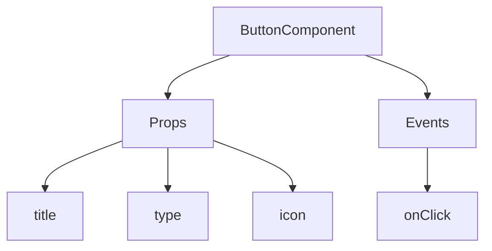
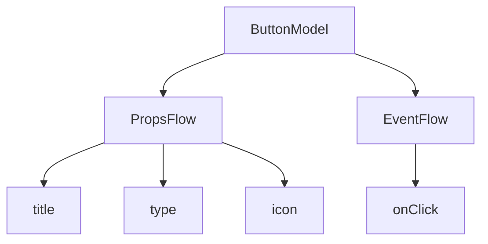

:::tip
Detta dokument har översatts av AI. För eventuella felaktigheter, se [den engelska versionen](/en)
:::


# Snabbstart: Bygga en orkestrerbar knappkomponent

I React renderar vi vanligtvis en knappkomponent så här:

```tsx pure
import { Button } from 'antd';

export default function App() {
  return <Button type="primary">Primary Button</Button>;
}
```

Även om koden ovan är enkel, är det en **statisk komponent** som inte kan uppfylla behoven hos en no-code-plattform när det gäller konfigurerbarhet och orkestreringsförmåga.

I NocoBase FlowEngine kan vi snabbt bygga komponenter som stöder konfiguration och är händelsestyrda med hjälp av **FlowModel + FlowDefinition**, vilket ger kraftfullare no-code-funktioner.

---

## Steg 1: Rendera komponenten med FlowModel

<code src="./demos/quickstart-1-basic.tsx"></code>

### 🧠 Nyckelkoncept

- `FlowModel` är den centrala komponentmodellen i FlowEngine, som kapslar in komponentlogik, rendering och konfigurationsförmåga.
- Varje UI-komponent kan instansieras och hanteras enhetligt via `FlowModel`.

### 📌 Implementeringssteg

#### 1. Skapa en anpassad modellklass

```tsx pure
class MyModel extends FlowModel {
  render() {
    return <Button {...this.props} />;
  }
}
```

#### 2. Skapa en modellinstans

```ts
const model = this.flowEngine.createModel({
  uid: 'my-model',
  use: 'MyModel',
  props: {
    type: 'primary',
    children: 'Primary Button',
  },
});
```

#### 3. Rendera med `<FlowModelRenderer />`

```tsx pure
<FlowModelRenderer model={model} />
```

## Steg 2: Lägg till PropsFlow för att göra knappegenskaper konfigurerbara

<code src="./demos/quickstart-2-register-propsflow.tsx"></code>

### 💡 Varför använda PropsFlow?

Att använda Flow istället för statiska props möjliggör:
- Dynamisk konfiguration
- Visuell redigering
- Tillståndsåteruppspelning och persistens

### 🛠 Viktiga ändringar

#### 1. Definiera Flow för knappegenskaper

```tsx pure

const buttonSettings = defineFlow({
  key: 'buttonSettings',
  
  title: 'Knappinställningar',
  steps: {
    setProps: {
      title: 'Allmän konfiguration',
      uiSchema: {
        title: {
          type: 'string',
          title: 'Knapprubrik',
          'x-decorator': 'FormItem',
          'x-component': 'Input',
        },
        type: {
          type: 'string',
          title: 'Typ',
          'x-decorator': 'FormItem',
          'x-component': 'Select',
          enum: [
            { label: 'Primär', value: 'primary' },
            { label: 'Standard', value: 'default' },
            { label: 'Fara', value: 'danger' },
            { label: 'Streckad', value: 'dashed' },
            { label: 'Länk', value: 'link' },
            { label: 'Text', value: 'text' },
          ],
        },
        icon: {
          type: 'string',
          title: 'Ikon',
          'x-decorator': 'FormItem',
          'x-component': 'Select',
          enum: [
            { label: 'Sök', value: 'SearchOutlined' },
            { label: 'Lägg till', value: 'PlusOutlined' },
            { label: 'Ta bort', value: 'DeleteOutlined' },
            { label: 'Redigera', value: 'EditOutlined' },
            { label: 'Inställningar', value: 'SettingOutlined' },
          ],
        },
      },
      defaultParams: {
        type: 'primary',
      },
      // Steghanteringsfunktion, ställer in modellegenskaper
      handler(ctx, params) {
        ctx.model.setProps('children', params.title);
        ctx.model.setProps('type', params.type);
        ctx.model.setProps('icon', params.icon ? React.createElement(icons[params.icon]) : undefined);
      },
    },
  },
});

MyModel.registerFlow(buttonSettings);
```

#### 2. Använd `stepParams` istället för statiska `props`

```diff
const model = this.flowEngine.createModel({
  uid: 'my-model',
  use: 'MyModel',
- props: {
-   type: 'primary',
-   children: 'Primary Button',
- },
+ stepParams: {
+   buttonSettings: {
+     general: {
+       title: 'Primary Button',
+       type: 'primary',
+     },
+   },
+ },
});
```

> ✅ Att använda `stepParams` är det rekommenderade tillvägagångssättet i FlowEngine, då det undviker problem med icke-serialiserbar data (som React-komponenter).

#### 3. Aktivera gränssnittet för egenskapsinställningar

```diff
- <FlowModelRenderer model={model} />
+ <FlowModelRenderer model={model} showFlowSettings />
```

---

## Steg 3: Stöd för knappens händelseflöde (EventFlow)

<code src="./demos/quickstart-3-register-eventflow.tsx"></code>

### 🎯 Scenario: Visa en bekräftelsedialogruta efter att ha klickat på knappen

#### 1. Lyssna på `onClick`-händelsen

Lägg till `onClick` på ett icke-påträngande sätt

```diff
const myPropsFlow = defineFlow({
  key: 'buttonSettings',
  steps: {
    general: {
      // ... omitted
      handler(ctx, params) {
        // ... omitted
+       ctx.model.setProps('onClick', (event) => {
+         ctx.model.dispatchEvent('click', { event });
+       });
      },
    },
  },
});
```

#### 2. Definiera händelseflödet

```ts
const myEventFlow = defineFlow({
  key: 'clickSettings',
  on: 'click',
  title: 'Knapphändelse',
  steps: {
    confirm: {
      title: 'Konfiguration för bekräftelseåtgärd',
      uiSchema: {
        title: {
          type: 'string',
          title: 'Titel för dialogruta',
          'x-decorator': 'FormItem',
          'x-component': 'Input',
        },
        content: {
          type: 'string',
          title: 'Innehåll för dialogruta',
          'x-decorator': 'FormItem',
          'x-component': 'Input.TextArea',
        },
      },
      defaultParams: {
        title: 'Bekräfta åtgärd',
        content: 'Du klickade på knappen, vill du bekräfta?',
      },
      async handler(ctx, params) {
        // Dialogruta
        const confirmed = await ctx.modal.confirm({
          title: params.title,
          content: params.content,
        });
        // Meddelande
        await ctx.message.info(`Du klickade på knappen, bekräftelseresultat: ${confirmed ? 'Bekräftad' : 'Avbruten'}`);
      },
    },
  },
});
MyModel.registerFlow(myEventFlow);
```

**Ytterligare anmärkningar:**
- Händelseflödet (EventFlow) gör att knappens beteende flexibelt kan konfigureras via ett flöde, till exempel att visa dialogrutor, meddelanden, göra API-anrop med mera.
- Ni kan registrera olika händelseflöden för olika händelser (som `onClick`, `onMouseEnter` etc.) för att uppfylla komplexa affärsbehov.

#### 3. Konfigurera parametrar för händelseflödet

När ni skapar modellen kan ni konfigurera standardparametrarna för händelseflödet via `stepParams`:

```ts
const model = this.flowEngine.createModel({
  uid: 'my-model',
  use: 'MyModel',
  stepParams: {
    buttonSettings: {
      general: {
        title: 'Primary Button',
        type: 'primary',
      },
    },
    clickSettings: {
      confirm: {
        title: 'Confirm Action',
        content: 'You clicked the button, are you sure?',
      },
    },
  },
});
```

---

## Modelljämförelse: ReactComponent vs FlowModel

Flow ändrar inte hur komponenter implementeras. Det lägger helt enkelt till stöd för PropsFlow och EventFlow till en ReactComponent, vilket gör att komponentens egenskaper och händelser kan konfigureras och orkestreras visuellt.


### ReactComponent



### FlowModel



## Sammanfattning

Genom de tre stegen ovan har vi skapat en knappkomponent som stöder konfiguration och händelseorkestrering, med följande fördelar:

- 🚀 Visuellt konfigurera egenskaper (som rubrik, typ, ikon)
- 🔄 Händelsesvar kan hanteras av ett flöde (t.ex. klicka för att visa en dialogruta)
- 🔧 Stöder framtida utökningar (som villkorslogik, variabelbindning etc.)

Detta mönster är också tillämpligt på alla UI-komponenter, såsom formulär, listor och diagram. I NocoBase FlowEngine är **allt orkestrerbart**.