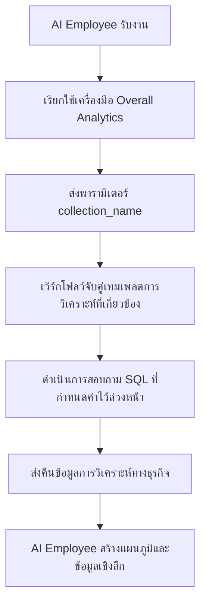

:::tip
เอกสารนี้แปลโดย AI หากมีข้อมูลที่ไม่ถูกต้อง โปรดดู[เวอร์ชันภาษาอังกฤษ](/en)
:::


# บทบาทและสิทธิ์การเข้าถึง

## บทนำ

การจัดการสิทธิ์การเข้าถึงสำหรับ AI Employee ประกอบด้วย 2 ระดับ:

1. **สิทธิ์การเข้าถึง AI Employee**: ควบคุมว่าผู้ใช้คนใดสามารถใช้ AI Employee ตัวไหนได้บ้าง
2. **สิทธิ์การเข้าถึงข้อมูล**: ควบคุมการใช้สิทธิ์เมื่อ AI Employee ประมวลผลข้อมูล

เอกสารนี้จะอธิบายรายละเอียดเกี่ยวกับวิธีการกำหนดค่าและหลักการทำงานของสิทธิ์การเข้าถึงทั้งสองประเภทนี้ครับ/ค่ะ

---

## การกำหนดค่าสิทธิ์การเข้าถึง AI Employee

### การตั้งค่า AI Employee ที่บทบาทสามารถใช้งานได้

ไปที่หน้า `User & Permissions` จากนั้นคลิกแท็บ `Roles & Permissions` เพื่อเข้าสู่หน้าการกำหนดค่าบทบาทครับ/ค่ะ


เลือกบทบาทที่ต้องการ จากนั้นคลิกแท็บ `Permissions` แล้วคลิกแท็บ `AI employees` ซึ่งจะแสดงรายการ AI Employee ที่จัดการอยู่ในปลั๊กอิน AI employees ครับ/ค่ะ

คลิกช่องทำเครื่องหมายในคอลัมน์ `Available` ของรายการ AI Employee เพื่อควบคุมว่าบทบาทปัจจุบันสามารถเข้าถึง AI Employee ตัวนั้นได้หรือไม่ครับ/ค่ะ


## สิทธิ์การเข้าถึงข้อมูล

เมื่อ AI Employee ประมวลผลข้อมูล วิธีการควบคุมสิทธิ์จะขึ้นอยู่กับประเภทของเครื่องมือที่ใช้งานครับ/ค่ะ

### เครื่องมือสอบถามข้อมูลในระบบ (เป็นไปตามสิทธิ์ของผู้ใช้)


เครื่องมือต่อไปนี้จะ**ปฏิบัติตามสิทธิ์การเข้าถึงข้อมูลของผู้ใช้ปัจจุบันอย่างเคร่งครัด**ในการเข้าถึงข้อมูลครับ/ค่ะ

| ชื่อเครื่องมือ                            | คำอธิบาย                     |
| ------------------------------------ | ------------------------------- |
| **Data source query**                | สอบถามฐานข้อมูลโดยใช้แหล่งข้อมูล, คอลเลกชัน และฟิลด์      |
| **Data source records counting**     | นับจำนวนเรคคอร์ดทั้งหมดโดยใช้แหล่งข้อมูล, คอลเลกชัน และฟิลด์     |

**หลักการทำงาน:**

เมื่อ AI Employee เรียกใช้เครื่องมือเหล่านี้ ระบบจะดำเนินการดังนี้ครับ/ค่ะ
1. ระบุตัวตนของผู้ใช้ที่เข้าสู่ระบบปัจจุบัน
2. ใช้กฎการเข้าถึงข้อมูลที่กำหนดค่าไว้สำหรับผู้ใช้นั้นในส่วน **บทบาทและสิทธิ์การเข้าถึง**
3. ส่งคืนเฉพาะข้อมูลที่ผู้ใช้มีสิทธิ์ดูเท่านั้น

**ตัวอย่างสถานการณ์:**

สมมติว่าพนักงานขาย A สามารถดูข้อมูลลูกค้าที่ตนเองรับผิดชอบได้เท่านั้น เมื่อเขา/เธอใช้ AI Employee Viz เพื่อวิเคราะห์ลูกค้า:
- Viz จะเรียกใช้ `Data source query` เพื่อสอบถามตารางลูกค้า
- ระบบจะใช้กฎการกรองสิทธิ์การเข้าถึงข้อมูลของพนักงานขาย A
- Viz จะสามารถเห็นและวิเคราะห์ได้เฉพาะข้อมูลลูกค้าที่พนักงานขาย A มีสิทธิ์เข้าถึงเท่านั้น

สิ่งนี้ช่วยให้มั่นใจว่า **AI Employee จะไม่สามารถเข้าถึงข้อมูลที่เกินขอบเขตสิทธิ์การเข้าถึงข้อมูลของผู้ใช้เองได้** ครับ/ค่ะ

---

### เครื่องมือทางธุรกิจที่กำหนดเองด้วยเวิร์กโฟลว์ (ตรรกะสิทธิ์การเข้าถึงอิสระ)

เครื่องมือสอบถามทางธุรกิจที่กำหนดเองผ่านเวิร์กโฟลว์ จะมีระบบควบคุมสิทธิ์การเข้าถึงที่**เป็นอิสระจากสิทธิ์ของผู้ใช้** โดยจะถูกกำหนดโดยตรรกะทางธุรกิจของเวิร์กโฟลว์นั้นๆ ครับ/ค่ะ

เครื่องมือเหล่านี้มักใช้สำหรับ:
- กระบวนการวิเคราะห์ทางธุรกิจที่กำหนดไว้ตายตัว
- การสอบถามแบบรวม (Aggregate Query) ที่กำหนดค่าไว้ล่วงหน้า
- การวิเคราะห์ทางสถิติที่ข้ามขอบเขตสิทธิ์การเข้าถึง

#### ตัวอย่างที่ 1: Overall Analytics (การวิเคราะห์ทางธุรกิจทั่วไป)


ใน CRM Demo, `Overall Analytics` คือเอนจินการวิเคราะห์ทางธุรกิจที่ใช้เทมเพลตครับ/ค่ะ

| คุณสมบัติ     | คำอธิบาย                                    |
| ------------ | ------------------------------------------ |
| **การนำไปใช้** | เวิร์กโฟลว์อ่านเทมเพลต SQL ที่กำหนดค่าไว้ล่วงหน้า และดำเนินการสอบถามแบบอ่านอย่างเดียว              |
| **การควบคุมสิทธิ์** | ไม่จำกัดโดยสิทธิ์ของผู้ใช้ปัจจุบัน, ส่งออกข้อมูลทางธุรกิจที่กำหนดโดยเทมเพลต           |
| **กรณีการใช้งาน** | ให้การวิเคราะห์แบบองค์รวมที่เป็นมาตรฐานสำหรับวัตถุทางธุรกิจเฉพาะ (เช่น ลีด, โอกาสทางธุรกิจ, ลูกค้า)       |
| **ความปลอดภัย**  | เทมเพลตการสอบถามทั้งหมดได้รับการกำหนดค่าและตรวจสอบล่วงหน้าโดยผู้ดูแลระบบ เพื่อหลีกเลี่ยงการสร้าง SQL แบบไดนามิก        |

**เวิร์กโฟลว์:**



**คุณสมบัติหลัก:**
- ผู้ใช้ทุกคนที่เรียกใช้เครื่องมือนี้จะได้รับ**มุมมองทางธุรกิจเดียวกัน**
- ขอบเขตข้อมูลถูกกำหนดโดยตรรกะทางธุรกิจ ไม่ได้ถูกกรองโดยสิทธิ์ของผู้ใช้
- เหมาะสำหรับการจัดทำรายงานการวิเคราะห์ทางธุรกิจที่เป็นมาตรฐาน

#### ตัวอย่างที่ 2: SQL Execution (เครื่องมือวิเคราะห์ขั้นสูง)


ใน CRM Demo, `SQL Execution` เป็นเครื่องมือที่ยืดหยุ่นกว่า แต่ต้องมีการควบคุมอย่างเข้มงวดครับ/ค่ะ

| คุณสมบัติ     | คำอธิบาย                                    |
| ------------ | ------------------------------------------ |
| **การนำไปใช้** | อนุญาตให้ AI สร้างและดำเนินการคำสั่ง SQL                    |
| **การควบคุมสิทธิ์** | ควบคุมโดยเวิร์กโฟลว์, โดยทั่วไปจำกัดเฉพาะผู้ดูแลระบบ                  |
| **กรณีการใช้งาน** | การวิเคราะห์ข้อมูลขั้นสูง, การสอบถามเชิงสำรวจ, การวิเคราะห์แบบรวมข้ามตาราง                  |
| **ความปลอดภัย**  | ต้องจำกัดการดำเนินการแบบอ่านอย่างเดียว (SELECT) ในเวิร์กโฟลว์ และควบคุมการใช้งานผ่านการกำหนดค่างาน   |

**คำแนะนำด้านความปลอดภัย:**

1. **จำกัดขอบเขตการใช้งาน**: เปิดใช้งานเฉพาะในงานของบล็อกการจัดการเท่านั้น
2. **ข้อจำกัดใน Prompt**: กำหนดขอบเขตการสอบถามและชื่อตารางให้ชัดเจนใน Prompt ของงาน
3. **การตรวจสอบในเวิร์กโฟลว์**: ตรวจสอบคำสั่ง SQL ในเวิร์กโฟลว์ เพื่อให้แน่ใจว่าดำเนินการเฉพาะคำสั่ง SELECT เท่านั้น
4. **บันทึกการตรวจสอบ (Audit Log)**: บันทึกคำสั่ง SQL ทั้งหมดที่ดำเนินการ เพื่อให้สามารถตรวจสอบย้อนหลังได้

**ตัวอย่างการกำหนดค่า:**

```markdown
ข้อจำกัดใน Prompt ของงาน:
- สามารถสอบถามได้เฉพาะตารางที่เกี่ยวข้องกับ CRM (leads, opportunities, accounts, contacts)
- สามารถดำเนินการได้เฉพาะการสอบถามแบบ SELECT
- ช่วงเวลาจำกัดภายใน 1 ปีล่าสุด
- ส่งคืนผลลัพธ์ไม่เกิน 1000 รายการ
```

---

## คำแนะนำในการออกแบบสิทธิ์การเข้าถึง

### เลือกกลยุทธ์สิทธิ์การเข้าถึงตามสถานการณ์ทางธุรกิจ

| สถานการณ์ทางธุรกิจ         | ประเภทเครื่องมือที่แนะนำ         | กลยุทธ์สิทธิ์การเข้าถึง         | เหตุผล                   |
| ------------------------- | ------------------------------ | -------------------------- | ------------------------ |
| พนักงานขายดูข้อมูลลูกค้าของตนเอง  | เครื่องมือสอบถามในระบบ       | เป็นไปตามสิทธิ์ของผู้ใช้       | รับรองการแยกข้อมูล และปกป้องความปลอดภัยทางธุรกิจ        |
| ผู้จัดการแผนกดูข้อมูลทีม   | เครื่องมือสอบถามในระบบ       | เป็นไปตามสิทธิ์ของผู้ใช้       | ใช้ขอบเขตข้อมูลแผนกโดยอัตโนมัติ           |
| ผู้บริหารดูการวิเคราะห์ธุรกิจโดยรวม   | เครื่องมือที่กำหนดเองด้วยเวิร์กโฟลว์ / Overall Analytics       | ตรรกะทางธุรกิจอิสระ       | ให้มุมมองโดยรวมที่เป็นมาตรฐาน           |
| นักวิเคราะห์ข้อมูลสอบถามเชิงสำรวจ   | SQL Execution  | จำกัดวัตถุที่ใช้งานได้อย่างเคร่งครัด     | ต้องการความยืดหยุ่น แต่ต้องควบคุมขอบเขตการเข้าถึง      |
| ผู้ใช้ทั่วไปดูรายงานมาตรฐาน   | Overall Analytics | ตรรกะทางธุรกิจอิสระ       | มาตรฐานการวิเคราะห์ที่ตายตัว ไม่ต้องกังวลเรื่องสิทธิ์พื้นฐาน      |

### กลยุทธ์การป้องกันหลายชั้น

สำหรับสถานการณ์ทางธุรกิจที่ละเอียดอ่อน แนะนำให้ใช้การควบคุมสิทธิ์การเข้าถึงแบบหลายชั้นครับ/ค่ะ

1. **ชั้นการเข้าถึง AI Employee**: ควบคุมว่าบทบาทใดสามารถใช้ AI Employee ตัวไหนได้บ้าง
2. **ชั้นการมองเห็นงาน**: ควบคุมการแสดงผลของงานผ่านการกำหนดค่าบล็อก
3. **ชั้นการอนุญาตเครื่องมือ**: ตรวจสอบตัวตนและสิทธิ์ของผู้ใช้ในเวิร์กโฟลว์
4. **ชั้นการเข้าถึงข้อมูล**: ควบคุมขอบเขตข้อมูลผ่านสิทธิ์ของผู้ใช้หรือตรรกะทางธุรกิจ

**ตัวอย่าง:**

```
สถานการณ์: เฉพาะแผนกการเงินเท่านั้นที่สามารถใช้ AI ในการวิเคราะห์ทางการเงินได้

- สิทธิ์ AI Employee: เฉพาะบทบาทการเงินเท่านั้นที่สามารถเข้าถึง AI Employee "Finance Analyst"
- การกำหนดค่างาน: งานวิเคราะห์ทางการเงินจะแสดงเฉพาะในโมดูลการเงิน
- การออกแบบเครื่องมือ: เครื่องมือเวิร์กโฟลว์ทางการเงินจะตรวจสอบแผนกของผู้ใช้
- สิทธิ์การเข้าถึงข้อมูล: สิทธิ์การเข้าถึงตารางการเงินจะมอบให้เฉพาะบทบาทการเงินเท่านั้น
```

---

## คำถามที่พบบ่อย

### Q: AI Employee สามารถเข้าถึงข้อมูลใดได้บ้าง?

**A:** ขึ้นอยู่กับประเภทของเครื่องมือที่ใช้ครับ/ค่ะ
- **เครื่องมือสอบถามในระบบ**: สามารถเข้าถึงได้เฉพาะข้อมูลที่ผู้ใช้ปัจจุบันมีสิทธิ์ดูเท่านั้น
- **เครื่องมือที่กำหนดเองด้วยเวิร์กโฟลว์**: ถูกกำหนดโดยตรรกะทางธุรกิจของเวิร์กโฟลว์ ซึ่งอาจไม่ถูกจำกัดด้วยสิทธิ์ของผู้ใช้

### Q: จะป้องกันไม่ให้ AI Employee รั่วไหลข้อมูลที่ละเอียดอ่อนได้อย่างไร?

**A:** ใช้การป้องกันหลายชั้นครับ/ค่ะ
1. กำหนดค่าสิทธิ์การเข้าถึงบทบาทของ AI Employee เพื่อจำกัดว่าใครสามารถใช้งานได้
2. สำหรับเครื่องมือในระบบ ให้พึ่งพาสิทธิ์การเข้าถึงข้อมูลของผู้ใช้ในการกรองโดยอัตโนมัติ
3. สำหรับเครื่องมือที่กำหนดเอง ให้ใช้การตรวจสอบตรรกะทางธุรกิจในเวิร์กโฟลว์
4. การดำเนินการที่ละเอียดอ่อน (เช่น SQL Execution) ควรอนุญาตให้เฉพาะผู้ดูแลระบบเท่านั้น

### Q: ฉันต้องการให้ AI Employee บางตัวสามารถข้ามข้อจำกัดสิทธิ์ของผู้ใช้ได้ ต้องทำอย่างไร?

**A:** ใช้เครื่องมือทางธุรกิจที่กำหนดเองด้วยเวิร์กโฟลว์ครับ/ค่ะ
- สร้างเวิร์กโฟลว์เพื่อใช้ตรรกะการสอบถามทางธุรกิจเฉพาะ
- ควบคุมขอบเขตข้อมูลและกฎการเข้าถึงในเวิร์กโฟลว์
- กำหนดค่าเครื่องมือให้ AI Employee ใช้งาน
- ควบคุมว่าใครสามารถเรียกใช้ความสามารถนี้ได้ผ่านสิทธิ์การเข้าถึง AI Employee

### Q: Overall Analytics และ SQL Execution แตกต่างกันอย่างไร?

**A:**

| มิติการเปรียบเทียบ   | Overall Analytics   | SQL Execution     |
| -------------------- | ------------------- | ----------------- |
| ความยืดหยุ่น    | ต่ำ (ใช้ได้เฉพาะเทมเพลตที่กำหนดค่าไว้ล่วงหน้า)        | สูง (สามารถสร้างการสอบถามแบบไดนามิกได้)        |
| ความปลอดภัย    | สูง (การสอบถามทั้งหมดได้รับการตรวจสอบล่วงหน้า)         | ปานกลาง (ต้องมีข้อจำกัดและการตรวจสอบ)        |
| ผู้ใช้เป้าหมาย   | ผู้ใช้ทางธุรกิจทั่วไป              | ผู้ดูแลระบบ หรือนักวิเคราะห์ระดับสูง        |
| ค่าใช้จ่ายในการบำรุงรักษา   | ต้องบำรุงรักษาเทมเพลตการวิเคราะห์            | ไม่ต้องบำรุงรักษา แต่ต้องมีการตรวจสอบ       |
| ความสอดคล้องของข้อมูล  | สูง (มาตรฐานเดียวกัน)            | ต่ำ (ผลลัพธ์การสอบถามอาจไม่สอดคล้องกัน)      |

---

## แนวทางปฏิบัติที่ดีที่สุด

1. **ปฏิบัติตามสิทธิ์ของผู้ใช้เป็นค่าเริ่มต้น**: เว้นแต่จะมีข้อกำหนดทางธุรกิจที่ชัดเจน ให้ความสำคัญกับการใช้เครื่องมือในระบบที่ปฏิบัติตามสิทธิ์ของผู้ใช้
2. **การวิเคราะห์มาตรฐานแบบเทมเพลต**: สำหรับสถานการณ์การวิเคราะห์ทั่วไป ให้ใช้รูปแบบ Overall Analytics เพื่อให้ความสามารถที่เป็นมาตรฐาน
3. **ควบคุมเครื่องมือขั้นสูงอย่างเข้มงวด**: เครื่องมือที่มีสิทธิ์สูง เช่น SQL Execution ควรอนุญาตให้ผู้ดูแลระบบเพียงไม่กี่คนเท่านั้น
4. **การแยกงานตามระดับ**: กำหนดค่างานที่ละเอียดอ่อนในบล็อกเฉพาะ และใช้การแยกผ่านสิทธิ์การเข้าถึงหน้า
5. **การตรวจสอบและเฝ้าระวัง**: บันทึกพฤติกรรมการเข้าถึงข้อมูลของ AI Employee และตรวจสอบการดำเนินการที่ผิดปกติเป็นประจำ