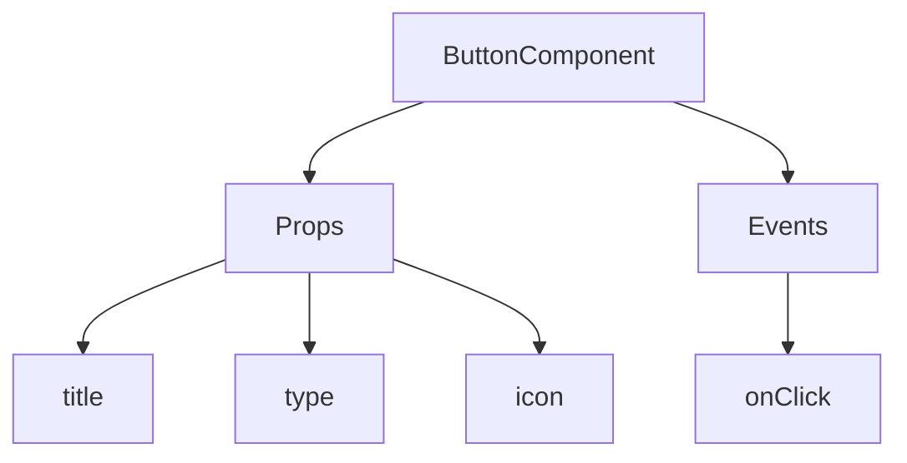
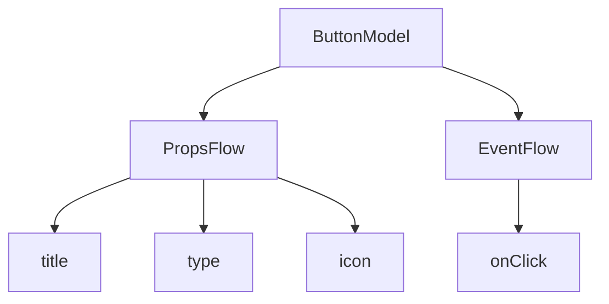

:::tip
เอกสารนี้แปลโดย AI หากมีข้อมูลที่ไม่ถูกต้อง โปรดดู[เวอร์ชันภาษาอังกฤษ](/en)
:::


# เริ่มต้นใช้งานอย่างรวดเร็ว: สร้างคอมโพเนนต์ปุ่มที่สามารถจัดลำดับการทำงานได้

ใน React เรามักจะเรนเดอร์คอมโพเนนต์ปุ่มด้วยวิธีนี้ครับ/ค่ะ:

```tsx pure
import { Button } from 'antd';

export default function App() {
  return <Button type="primary">Primary Button</Button>;
}
```

โค้ดข้างต้นแม้จะเรียบง่าย แต่เป็น**คอมโพเนนต์แบบคงที่ (Static Component)** ซึ่งไม่สามารถตอบสนองความต้องการของแพลตฟอร์ม No-code ในด้านความสามารถในการกำหนดค่าและการจัดลำดับการทำงานได้ครับ/ค่ะ

ใน FlowEngine ของ NocoBase เราสามารถสร้างคอมโพเนนต์ที่รองรับการกำหนดค่าและขับเคลื่อนด้วยเหตุการณ์ได้อย่างรวดเร็ว โดยใช้ **FlowModel + FlowDefinition** ซึ่งช่วยให้แพลตฟอร์ม No-code มีความสามารถที่ทรงพลังยิ่งขึ้นครับ/ค่ะ

---

## ขั้นตอนที่ 1: เรนเดอร์คอมโพเนนต์โดยใช้ FlowModel

<code src="./demos/quickstart-1-basic.tsx"></code>

### 🧠 แนวคิดสำคัญ

- `FlowModel` คือโมเดลคอมโพเนนต์หลักใน FlowEngine ที่รวบรวมตรรกะของคอมโพเนนต์ การเรนเดอร์ และความสามารถในการกำหนดค่าไว้ด้วยกันครับ/ค่ะ
- คอมโพเนนต์ UI ทุกตัวสามารถสร้างอินสแตนซ์และจัดการได้อย่างเป็นระบบผ่าน `FlowModel` ครับ/ค่ะ

### 📌 ขั้นตอนการนำไปใช้งาน

#### 1. สร้างคลาสโมเดลแบบกำหนดเอง

```tsx pure
class MyModel extends FlowModel {
  render() {
    return <Button {...this.props} />;
  }
}
```

#### 2. สร้างอินสแตนซ์ของโมเดล

```ts
const model = this.flowEngine.createModel({
  uid: 'my-model',
  use: 'MyModel',
  props: {
    type: 'primary',
    children: 'Primary Button',
  },
});
```

#### 3. เรนเดอร์โดยใช้ `<FlowModelRenderer />`

```tsx pure
<FlowModelRenderer model={model} />
```

## ขั้นตอนที่ 2: เพิ่ม PropsFlow เพื่อให้คุณสมบัติของปุ่มสามารถกำหนดค่าได้

<code src="./demos/quickstart-2-register-propsflow.tsx"></code>

### 💡 ทำไมต้องใช้ PropsFlow?

การใช้ Flow แทนที่จะเป็น props แบบคงที่ ช่วยให้คุณสมบัติสามารถ:
- กำหนดค่าแบบไดนามิกได้
- แก้ไขด้วยภาพได้
- เล่นซ้ำสถานะและคงอยู่ได้

### 🛠 จุดปรับปรุงสำคัญ

#### 1. กำหนด Flow สำหรับคุณสมบัติของปุ่ม

```tsx pure

const buttonSettings = defineFlow({
  key: 'buttonSettings',
  
  title: 'การตั้งค่าปุ่ม',
  steps: {
    general: {
      title: 'การกำหนดค่าทั่วไป',
      uiSchema: {
        title: {
          type: 'string',
          title: 'ชื่อปุ่ม',
          'x-decorator': 'FormItem',
          'x-component': 'Input',
        },
        type: {
          type: 'string',
          title: 'ประเภท',
          'x-decorator': 'FormItem',
          'x-component': 'Select',
          enum: [
            { label: 'หลัก', value: 'primary' },
            { label: 'รอง', value: 'default' },
            { label: 'อันตราย', value: 'danger' },
            { label: 'เส้นประ', value: 'dashed' },
            { label: 'ลิงก์', value: 'link' },
            { label: 'ข้อความ', value: 'text' },
          ],
        },
        icon: {
          type: 'string',
          title: 'ไอคอน',
          'x-decorator': 'FormItem',
          'x-component': 'Select',
          enum: [
            { label: 'ค้นหา', value: 'SearchOutlined' },
            { label: 'เพิ่ม', value: 'PlusOutlined' },
            { label: 'ลบ', value: 'DeleteOutlined' },
            { label: 'แก้ไข', value: 'EditOutlined' },
            { label: 'ตั้งค่า', value: 'SettingOutlined' },
          ],
        },
      },
      defaultParams: {
        type: 'primary',
      },
      // ฟังก์ชัน handler ของ step สำหรับตั้งค่าคุณสมบัติของโมเดล
      handler(ctx, params) {
        ctx.model.setProps('children', params.title);
        ctx.model.setProps('type', params.type);
        ctx.model.setProps('icon', params.icon ? React.createElement(icons[params.icon]) : undefined);
      },
    },
  },
});

MyModel.registerFlow(buttonSettings);
```

#### 2. ใช้ `stepParams` แทน `props` แบบคงที่

```diff
const model = this.flowEngine.createModel({
  uid: 'my-model',
  use: 'MyModel',
- props: {
-   type: 'primary',
-   children: 'Primary Button',
- },
+ stepParams: {
+   buttonSettings: {
+     general: {
+       title: 'Primary Button',
+       type: 'primary',
+     },
+   },
+ },
});
```

> ✅ การใช้ `stepParams` เป็นวิธีที่ FlowEngine แนะนำครับ/ค่ะ เพื่อหลีกเลี่ยงปัญหาข้อมูลที่ไม่สามารถซีเรียลไลซ์ได้ (เช่น คอมโพเนนต์ React)

#### 3. เปิดใช้งานหน้าจอการกำหนดค่าคุณสมบัติ

```diff
- <FlowModelRenderer model={model} />
+ <FlowModelRenderer model={model} showFlowSettings />
```

---

## ขั้นตอนที่ 3: รองรับ EventFlow (โฟลว์เหตุการณ์) ของปุ่ม

<code src="./demos/quickstart-3-register-eventflow.tsx"></code>

### 🎯 สถานการณ์: แสดงกล่องข้อความยืนยันหลังจากคลิกปุ่ม

#### 1. ดักฟังเหตุการณ์ onClick

เพิ่ม onClick ด้วยวิธีที่ไม่รบกวนการทำงานเดิม

```diff
const myPropsFlow = defineFlow({
  key: 'buttonSettings',
  steps: {
    general: {
      // ... ละไว้
      handler(ctx, params) {
        // ... ละไว้
+       ctx.model.setProps('onClick', (event) => {
+         ctx.model.dispatchEvent('click', { event });
+       });
      },
    },
  },
});
```

#### 2. กำหนด EventFlow

```ts
const myEventFlow = defineFlow({
  key: 'clickSettings',
  on: 'click',
  title: 'เหตุการณ์ของปุ่ม',
  steps: {
    confirm: {
      title: 'การกำหนดค่าการดำเนินการยืนยัน',
      uiSchema: {
        title: {
          type: 'string',
          title: 'หัวข้อข้อความแจ้งเตือนป๊อปอัป',
          'x-decorator': 'FormItem',
          'x-component': 'Input',
        },
        content: {
          type: 'string',
          title: 'เนื้อหาข้อความแจ้งเตือนป๊อปอัป',
          'x-decorator': 'FormItem',
          'x-component': 'Input.TextArea',
        },
      },
      defaultParams: {
        title: 'ยืนยันการดำเนินการ',
        content: 'คุณได้คลิกปุ่มแล้ว ต้องการยืนยันหรือไม่?',
      },
      async handler(ctx, params) {
        // ป๊อปอัป
        const confirmed = await ctx.modal.confirm({
          title: params.title,
          content: params.content,
        });
        // ข้อความแจ้งเตือน
        await ctx.message.info(`คุณคลิกปุ่มแล้ว ผลการยืนยัน: ${confirmed ? 'ยืนยัน' : 'ยกเลิก'}`);
      },
    },
  },
});
MyModel.registerFlow(myEventFlow);
```

**หมายเหตุเพิ่มเติม:**
- EventFlow ช่วยให้พฤติกรรมของปุ่มสามารถกำหนดค่าได้อย่างยืดหยุ่นผ่านโฟลว์ เช่น การแสดงป๊อปอัป, ข้อความแจ้งเตือน, การเรียกใช้ API เป็นต้นครับ/ค่ะ
- คุณสามารถลงทะเบียน EventFlow ที่แตกต่างกันสำหรับเหตุการณ์ต่างๆ (เช่น `onClick`, `onMouseEnter` เป็นต้น) เพื่อตอบสนองความต้องการทางธุรกิจที่ซับซ้อนได้ครับ/ค่ะ

#### 3. กำหนดค่าพารามิเตอร์ของ EventFlow

เมื่อสร้างโมเดล คุณสามารถกำหนดค่าพารามิเตอร์เริ่มต้นสำหรับ EventFlow ได้ผ่าน `stepParams` ครับ/ค่ะ:

```ts
const model = this.flowEngine.createModel({
  uid: 'my-model',
  use: 'MyModel',
  stepParams: {
    buttonSettings: {
      general: {
        title: 'Primary Button',
        type: 'primary',
      },
    },
    clickSettings: {
      confirm: {
        title: 'ยืนยันการดำเนินการ',
        content: 'คุณได้คลิกปุ่มแล้ว ต้องการยืนยันหรือไม่?',
      },
    },
  },
});
```

---

## แผนภาพเปรียบเทียบโมเดล: ReactComponent vs FlowModel

Flow ไม่ได้เปลี่ยนแปลงวิธีการนำคอมโพเนนต์ไปใช้งานครับ/ค่ะ แต่เป็นการเพิ่มการรองรับ PropsFlow และ EventFlow ให้กับ ReactComponent เพื่อให้คุณสมบัติและเหตุการณ์ของคอมโพเนนต์สามารถกำหนดค่าและจัดลำดับการทำงานด้วยภาพได้


### ReactComponent



### FlowModel



## สรุป

ด้วยสามขั้นตอนข้างต้น เราได้สร้างคอมโพเนนต์ปุ่มที่รองรับการกำหนดค่าและการจัดลำดับเหตุการณ์ ซึ่งมีข้อดีดังนี้ครับ/ค่ะ:

- 🚀 กำหนดค่าคุณสมบัติด้วยภาพได้ (เช่น ชื่อ, ประเภท, ไอคอน)
- 🔄 การตอบสนองต่อเหตุการณ์สามารถถูกจัดการโดยโฟลว์ได้ (เช่น คลิกเพื่อแสดงป๊อปอัป)
- 🔧 รองรับการขยายในอนาคต (เช่น ตรรกะแบบมีเงื่อนไข, การผูกตัวแปร เป็นต้น)

รูปแบบนี้ยังสามารถนำไปใช้กับคอมโพเนนต์ UI อื่นๆ ได้ด้วยครับ/ค่ะ เช่น ฟอร์ม, รายการ, แผนภูมิ และอื่นๆ ใน FlowEngine ของ NocoBase นั้น **ทุกสิ่งสามารถจัดลำดับการทำงานได้**