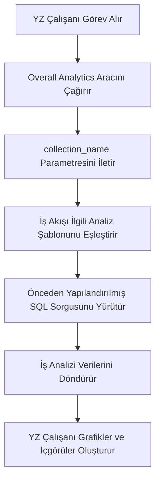

:::tip
Bu belge AI tarafından çevrilmiştir. Herhangi bir yanlışlık için lütfen [İngilizce sürümüne](/en) bakın
:::


# Roller ve İzinler

## Giriş

Yapay Zeka (YZ) çalışanlarının izin yönetimi iki seviyeden oluşur:

1.  **YZ Çalışanı Erişim İzinleri**: Hangi kullanıcıların hangi YZ çalışanlarını kullanabileceğini kontrol eder.
2.  **Veri Erişim İzinleri**: YZ çalışanlarının verileri işlerken izin kontrollerini nasıl uyguladığını belirler.

Bu belge, bu iki izin türünün yapılandırma yöntemlerini ve çalışma prensiplerini ayrıntılı olarak açıklayacaktır.

---

## YZ Çalışanı Erişim İzinlerini Yapılandırma

### Roller İçin Kullanılabilir YZ Çalışanlarını Ayarlama

`Kullanıcılar ve İzinler` sayfasına gidin, `Roller ve İzinler` sekmesine tıklayarak rol yapılandırma sayfasına erişin.


Bir rol seçin, `İzinler` sekmesine ve ardından `YZ Çalışanları` sekmesine tıklayın. Burada YZ çalışanları eklentisinde yönetilen YZ çalışanlarının listesi görüntülenecektir.

YZ çalışanları listesindeki `Kullanılabilir` sütunundaki onay kutusuna tıklayarak, mevcut rolün ilgili YZ çalışanına erişip erişemeyeceğini kontrol edebilirsiniz.


## Veri Erişim İzinleri

YZ çalışanları verileri işlerken, izin kontrol yöntemi kullanılan araç tipine bağlıdır:

### Sistem Dahili Veri Sorgulama Araçları (Kullanıcı İzinlerini Takip Eder)

Aşağıdaki araçlar, veri erişimi için **mevcut kullanıcının veri izinlerini kesinlikle takip eder**:

| Araç Adı                            | Açıklama                     |
| ------------------------------------ | ------------------------------- |
| **Data source query**                | **veri kaynağı**, **koleksiyon** ve alanları kullanarak veritabanını sorgular |
| **Data source records counting**     | **veri kaynağı**, **koleksiyon** ve alanları kullanarak toplam kayıt sayısını sayar |

**Çalışma Prensibi:**

YZ çalışanları bu araçları çağırdığında, sistem şunları yapar:
1.  Mevcut oturum açmış kullanıcının kimliğini tanımlar.
2.  Bu kullanıcı için **Roller ve İzinler** bölümünde yapılandırılmış veri erişim kurallarını uygular.
3.  Yalnızca kullanıcının görüntüleme izni olan verileri döndürür.

**Örnek Senaryo:**

Diyelim ki satış görevlisi A, yalnızca sorumlu olduğu müşteri verilerini görüntüleyebilir. YZ çalışanı Viz'i kullanarak müşterileri analiz ettiğinde:
-   Viz, müşteri tablosunu sorgulamak için `Data source query` aracını çağırır.
-   Sistem, satış görevlisi A'nın veri izin filtreleme kurallarını uygular.
-   Viz, yalnızca satış görevlisi A'nın erişebildiği müşteri verilerini görebilir ve analiz edebilir.

Bu, **YZ çalışanlarının kullanıcının kendi veri erişim sınırlarını aşmamasını** sağlar.

---

### İş Akışı Özel İş Araçları (Bağımsız İzin Mantığı)

**iş akışı** aracılığıyla özelleştirilmiş iş sorgulama araçlarının izin kontrolü, **kullanıcı izinlerinden bağımsızdır** ve **iş akışı**nın iş mantığı tarafından belirlenir.

Bu tür araçlar genellikle şunlar için kullanılır:
-   Sabit iş analizi süreçleri
-   Önceden yapılandırılmış toplu sorgular
-   İzin sınırlarını aşan istatistiksel analizler

#### Örnek 1: Overall Analytics (Genel İş Analizi)


CRM Demosunda, `Overall Analytics` şablon tabanlı bir iş analizi motorudur:

| Özellik        | Açıklama                                    |
| -------------- | ------------------------------------------- |
| **Uygulama**   | **iş akışı**, önceden yapılandırılmış SQL şablonlarını okur ve salt okunur sorgular yürütür |
| **İzin Kontrolü** | Mevcut kullanıcı izinleriyle sınırlı değildir, şablonlar tarafından tanımlanan sabit iş verilerini çıkarır |
| **Kullanım Durumları** | Belirli iş nesneleri (örn. potansiyel müşteriler, fırsatlar, müşteriler) için standartlaştırılmış bütünsel analiz sağlar |
| **Güvenlik**   | Tüm sorgu şablonları yöneticiler tarafından önceden yapılandırılır ve incelenir, dinamik SQL üretimini önler |

**İş Akışı:**



**Temel Özellikler:**
-   Bu aracı çağıran herhangi bir kullanıcı **aynı iş perspektifini** elde eder.
-   Veri kapsamı iş mantığı tarafından tanımlanır, kullanıcı izinleri tarafından filtrelenmez.
-   Standartlaştırılmış iş analizi raporları sağlamak için uygundur.

#### Örnek 2: SQL Execution (Gelişmiş Analiz Aracı)


CRM Demosunda, `SQL Execution` daha esnek ancak sıkı kontrol gerektiren bir araçtır:

| Özellik        | Açıklama                                    |
| -------------- | ------------------------------------------- |
| **Uygulama**   | YZ'nin SQL ifadeleri oluşturmasına ve yürütmesine izin verir |
| **İzin Kontrolü** | **iş akışı** tarafından kontrol edilir, genellikle yalnızca yöneticilerle sınırlıdır |
| **Kullanım Durumları** | Gelişmiş veri analizi, keşifsel sorgular, tablolar arası toplu analiz |
| **Güvenlik**   | **iş akışı**nda salt okunur işlemleri (SELECT) kısıtlamayı ve görev yapılandırması aracılığıyla kullanılabilirliği kontrol etmeyi gerektirir |

**Güvenlik Önerileri:**

1.  **Kullanım Alanını Sınırlayın**: Yalnızca yönetim bloğu görevlerinde etkinleştirin.
2.  **İstem Kısıtlamaları**: Görev istemlerinde sorgu kapsamını ve tablo adlarını açıkça tanımlayın.
3.  **İş Akışı Doğrulaması**: Yalnızca SELECT işlemlerinin yürütüldüğünden emin olmak için SQL ifadelerini **iş akışı**nda doğrulayın.
4.  **Denetim Kayıtları**: İzlenebilirlik için yürütülen tüm SQL ifadelerini kaydedin.

**Örnek Yapılandırma:**

```markdown
Görev İstem Kısıtlamaları:
- Yalnızca CRM ile ilgili tabloları sorgulayabilir (leads, opportunities, accounts, contacts)
- Yalnızca SELECT sorguları yürütebilir
- Zaman aralığı son 1 yıl ile sınırlıdır
- Dönüş sonuçları 1000 kaydı aşmaz
```

---

## İzin Tasarımı Önerileri

### İş Senaryosuna Göre İzin Stratejisi Seçimi

| İş Senaryosu         | Önerilen Araç Tipi         | İzin Stratejisi         | Neden                   |
| -------------------- | -------------------------- | ----------------------- | ------------------------ |
| Satış görevlisinin kendi müşterilerini görüntülemesi | Sistem dahili sorgu araçları | Kullanıcı izinlerini takip eder | Veri izolasyonunu sağlar ve iş güvenliğini korur |
| Departman yöneticisinin ekip verilerini görüntülemesi | Sistem dahili sorgu araçları | Kullanıcı izinlerini takip eder | Departman veri kapsamını otomatik olarak uygular |
| Yöneticinin genel iş analizini görüntülemesi | **iş akışı** özel araçları / Overall Analytics | Bağımsız iş mantığı       | Standartlaştırılmış bütünsel bir bakış açısı sunar |
| Veri analistinin keşifsel sorgular yapması | SQL Execution              | Kullanılabilir nesneleri sıkıca sınırlar | Esneklik gerektirir ancak erişim kapsamı kontrol edilmelidir |
| Normal kullanıcıların standart raporları görüntülemesi | Overall Analytics          | Bağımsız iş mantığı       | Sabit analiz standartları, temel izinlerle ilgilenmeye gerek yok |

### Çok Katmanlı Koruma Stratejisi

Hassas iş senaryoları için çok katmanlı izin kontrolü benimsenmesi önerilir:

1.  **YZ Çalışanı Erişim Katmanı**: Hangi rollerin hangi YZ çalışanını kullanabileceğini kontrol eder.
2.  **Görev Görünürlüğü Katmanı**: Blok yapılandırması aracılığıyla görevin görüntülenip görüntülenmeyeceğini kontrol eder.
3.  **Araç Yetkilendirme Katmanı**: **iş akışı**nda kullanıcı kimliğini ve izinlerini doğrular.
4.  **Veri Erişim Katmanı**: Kullanıcı izinleri veya iş mantığı aracılığıyla veri kapsamını kontrol eder.

**Örnek:**

```
Senaryo: Yalnızca finans departmanı finansal analiz için YZ kullanabilir

- YZ Çalışanı İzinleri: Yalnızca finans rolü "Finance Analyst" YZ çalışanına erişebilir
- Görev Yapılandırması: Finansal analiz görevleri yalnızca finans modüllerinde görüntülenir
- Araç Tasarımı: Finans iş akışı araçları kullanıcı departmanını doğrular
- Veri İzinleri: Finans tablosu erişim izinleri yalnızca finans rolüne verilir
```

---

## Sıkça Sorulan Sorular

### S: YZ çalışanları hangi verilere erişebilir?

**C:** Kullanılan araç tipine bağlıdır:
-   **Sistem dahili sorgu araçları**: Yalnızca mevcut kullanıcının görüntüleme izni olan verilere erişebilir.
-   **iş akışı özel araçları**: **iş akışı**nın iş mantığı tarafından belirlenir, kullanıcı izinleriyle sınırlı olmayabilir.

### S: YZ çalışanlarının hassas verileri sızdırması nasıl önlenir?

**C:** Çok katmanlı koruma benimseyin:
1.  YZ çalışanlarının rol erişim izinlerini yapılandırarak kimlerin kullanabileceğini sınırlayın.
2.  Sistem dahili araçları için, otomatik filtreleme için kullanıcı veri izinlerine güvenin.
3.  Özel araçlar için, **iş akışı**nda iş mantığı doğrulaması uygulayın.
4.  Hassas işlemler (SQL Execution gibi) yalnızca yöneticilere yetkilendirilmelidir.

### S: Bazı YZ çalışanlarının kullanıcı izin kısıtlamalarını aşmasını istersem ne yapmalıyım?

**C:** **iş akışı** özel iş araçlarını kullanın:
-   Belirli iş sorgulama mantığını uygulamak için **iş akışı**ları oluşturun.
-   **iş akışı**nda veri kapsamını ve erişim kurallarını kontrol edin.
-   Araçları YZ çalışanlarının kullanması için yapılandırın.
-   Bu yeteneği kimlerin çağırabileceğini YZ çalışanı erişim izinleri aracılığıyla kontrol edin.

### S: Overall Analytics ve SQL Execution arasındaki fark nedir?

**C:**

| Karşılaştırma Boyutu | Overall Analytics           | SQL Execution               |
| -------------------- | --------------------------- | --------------------------- |
| Esneklik             | Düşük (yalnızca önceden yapılandırılmış şablonlar kullanılabilir) | Yüksek (sorguları dinamik olarak oluşturabilir) |
| Güvenlik             | Yüksek (tüm sorgular önceden incelenir) | Orta (kısıtlamalar ve doğrulama gerektirir) |
| Hedef Kullanıcılar   | Normal iş kullanıcıları      | Yöneticiler veya kıdemli analistler |
| Bakım Maliyeti       | Analiz şablonlarını sürdürmek gerekir | Bakım gerektirmez, ancak izleme gerektirir |
| Veri Tutarlılığı     | Güçlü (standartlaştırılmış ölçütler) | Zayıf (sorgu sonuçları tutarsız olabilir) |

---

## En İyi Uygulamalar

1.  **Varsayılan olarak Kullanıcı İzinlerini Takip Edin**: Açık bir iş ihtiyacı olmadıkça, kullanıcı izinlerini takip eden sistem dahili araçlarını öncelikli olarak kullanın.
2.  **Şablonlaştırılmış Standart Analiz**: Yaygın analiz senaryoları için, standartlaştırılmış yetenekler sağlamak üzere Overall Analytics modelini kullanın.
3.  **Gelişmiş Araçları Sıkıca Kontrol Edin**: SQL Execution gibi yüksek ayrıcalıklı araçlar yalnızca az sayıda yöneticiye yetkilendirilmelidir.
4.  **Görev Düzeyinde İzolasyon**: Hassas görevleri belirli bloklarda yapılandırın ve sayfa erişim izinleri aracılığıyla izolasyon uygulayın.
5.  **Denetim ve İzleme**: YZ çalışanlarının veri erişim davranışlarını kaydedin ve anormal işlemleri düzenli olarak inceleyin.