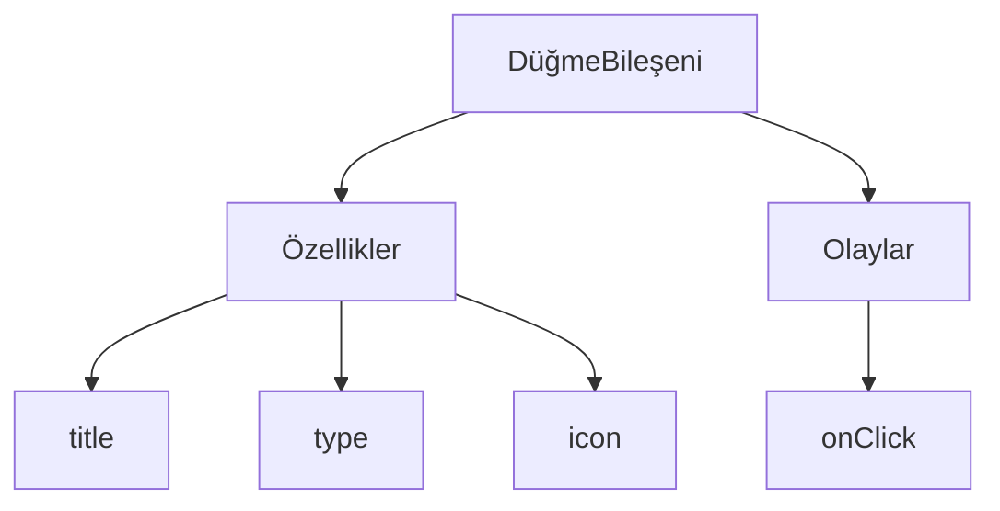
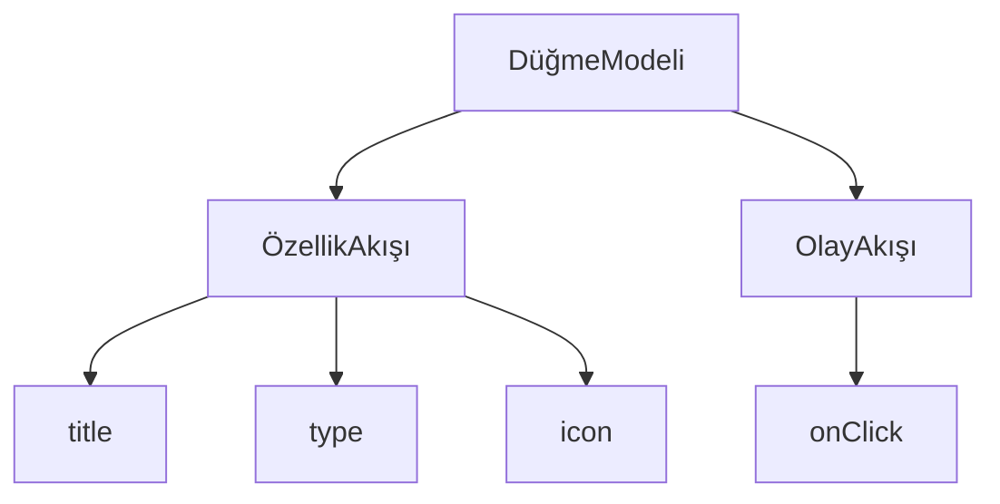

:::tip
Bu belge AI tarafından çevrilmiştir. Herhangi bir yanlışlık için lütfen [İngilizce sürümüne](/en) bakın
:::


# Hızlı Başlangıç: Düzenlenebilir Bir Düğme Bileşeni Oluşturma

React'te bir düğme bileşenini genellikle şu şekilde render ederiz:

```tsx pure
import { Button } from 'antd';

export default function App() {
  return <Button type="primary">Primary Button</Button>;
}
```

Yukarıdaki kod basit olsa da, bu bir **statik bileşendir** ve kodsuz bir platformun yapılandırılabilirlik ve düzenleme (orkestrasyon) yetenekleri ihtiyacını karşılayamaz.

NocoBase'in FlowEngine'inde, **FlowModel + FlowDefinition** kullanarak yapılandırmayı ve olay odaklı çalışmayı destekleyen bileşenleri hızla oluşturabilir, böylece daha güçlü kodsuz yetenekler elde edebiliriz.

---

## Adım 1: FlowModel Kullanarak Bileşeni Render Etme

<code src="./demos/quickstart-1-basic.tsx"></code>

### 🧠 Temel Kavramlar

- `FlowModel`, FlowEngine'deki temel bileşen modelidir; bileşen mantığını, render etme ve yapılandırma yeteneklerini kapsar.
- Her UI bileşeni, `FlowModel` aracılığıyla örneklenip (instantiate) tek tip olarak yönetilebilir.

### 📌 Uygulama Adımları

#### 1. Özel bir model sınıfı oluşturun

```tsx pure
class MyModel extends FlowModel {
  render() {
    return <Button {...this.props} />;
  }
}
```

#### 2. Bir model örneği oluşturun

```ts
const model = this.flowEngine.createModel({
  uid: 'my-model',
  use: 'MyModel',
  props: {
    type: 'primary',
    children: 'Primary Button',
  },
});
```

#### 3. `<FlowModelRenderer />` kullanarak render edin

```tsx pure
<FlowModelRenderer model={model} />
```

## Adım 2: Düğme Özelliklerini Yapılandırılabilir Hale Getirmek İçin PropsFlow Ekleyin

<code src="./demos/quickstart-2-register-propsflow.tsx"></code>

### 💡 Neden PropsFlow Kullanmalıyız?

Statik prop'lar yerine Flow kullanmak, özelliklerin şunları yapmasını sağlar:
- Dinamik yapılandırma
- Görsel düzenleme
- Durum tekrarı ve kalıcılık

### 🛠 Temel Değişiklikler

#### 1. Düğme özelliklerinin Flow'unu tanımlayın

```tsx pure

const buttonSettings = defineFlow({
  key: 'buttonSettings',
  
  title: 'Düğme Ayarları',
  steps: {
    general: {
      title: 'Genel Yapılandırma',
      uiSchema: {
        title: {
          type: 'string',
          title: 'Düğme Başlığı',
          'x-decorator': 'FormItem',
          'x-component': 'Input',
        },
        type: {
          type: 'string',
          title: 'Tip',
          'x-decorator': 'FormItem',
          'x-component': 'Select',
          enum: [
            { label: 'Birincil', value: 'primary' },
            { label: 'Varsayılan', value: 'default' },
            { label: 'Tehlike', value: 'danger' },
            { label: 'Kesikli', value: 'dashed' },
            { label: 'Bağlantı', value: 'link' },
            { label: 'Metin', value: 'text' },
          ],
        },
        icon: {
          type: 'string',
          title: 'İkon',
          'x-decorator': 'FormItem',
          'x-component': 'Select',
          enum: [
            { label: 'Ara', value: 'SearchOutlined' },
            { label: 'Ekle', value: 'PlusOutlined' },
            { label: 'Sil', value: 'DeleteOutlined' },
            { label: 'Düzenle', value: 'EditOutlined' },
            { label: 'Ayarlar', value: 'SettingOutlined' },
          ],
        },
      },
      defaultParams: {
        type: 'primary',
      },
      // Adım işleyici fonksiyonu, model özelliklerini ayarlar
      handler(ctx, params) {
        ctx.model.setProps('children', params.title);
        ctx.model.setProps('type', params.type);
        ctx.model.setProps('icon', params.icon ? React.createElement(icons[params.icon]) : undefined);
      },
    },
  },
});

MyModel.registerFlow(buttonSettings);
```

#### 2. Statik `props` yerine `stepParams` kullanın

```diff
const model = this.flowEngine.createModel({
  uid: 'my-model',
  use: 'MyModel',
- props: {
-   type: 'primary',
-   children: 'Primary Button',
- },
+ stepParams: {
+   buttonSettings: {
+     general: {
+       title: 'Primary Button',
+       type: 'primary',
+     },
+   },
+ },
});
```

> ✅ `stepParams` kullanmak, FlowEngine'de önerilen yaklaşımdır, çünkü serileştirilemeyen verilerle (React bileşenleri gibi) ilgili sorunları önler.

#### 3. Özellik yapılandırma arayüzünü etkinleştirin

```diff
- <FlowModelRenderer model={model} />
+ <FlowModelRenderer model={model} showFlowSettings />
```

---

## Adım 3: Düğme Olay Akışını (EventFlow) Destekleme

<code src="./demos/quickstart-3-register-eventflow.tsx"></code>

### 🎯 Senaryo: Düğmeye Tıkladıktan Sonra Onay Penceresi Gösterme

#### 1. onClick olayını dinleyin

onClick'i müdahaleci olmayan bir şekilde ekleyin

```diff
const myPropsFlow = defineFlow({
  key: 'buttonSettings',
  steps: {
    general: {
      // ... atlandı
      handler(ctx, params) {
        // ... atlandı
+       ctx.model.setProps('onClick', (event) => {
+         ctx.model.dispatchEvent('click', { event });
+       });
      },
    },
  },
});
```

#### 2. Olay akışını tanımlayın

```ts
const myEventFlow = defineFlow({
  key: 'clickSettings',
  on: 'click',
  title: 'Düğme Olayı',
  steps: {
    confirm: {
      title: 'Onay İşlemi Yapılandırması',
      uiSchema: {
        title: {
          type: 'string',
          title: 'Açılır Pencere Başlığı',
          'x-decorator': 'FormItem',
          'x-component': 'Input',
        },
        content: {
          type: 'string',
          title: 'Açılır Pencere İçeriği',
          'x-decorator': 'FormItem',
          'x-component': 'Input.TextArea',
        },
      },
      defaultParams: {
        title: 'İşlemi Onayla',
        content: 'Düğmeye tıkladınız, onaylıyor musunuz?',
      },
      async handler(ctx, params) {
        // Açılır pencere
        const confirmed = await ctx.modal.confirm({
          title: params.title,
          content: params.content,
        });
        // Mesaj
        await ctx.message.info(`Düğmeye tıkladınız, onay sonucu: ${confirmed ? 'Onaylandı' : 'İptal Edildi'}`);
      },
    },
  },
});
MyModel.registerFlow(myEventFlow);
```

**Ek Notlar:**
- Olay Akışı (EventFlow), düğmenin davranışının bir akış aracılığıyla esnek bir şekilde yapılandırılmasını sağlar; örneğin, açılır pencereler, mesajlar, API çağrıları gibi.
- Farklı olaylar (`onClick`, `onMouseEnter` vb. gibi) için farklı olay akışları kaydedebilir, böylece karmaşık iş gereksinimlerini karşılayabilirsiniz.

#### 3. Olay akışı parametrelerini yapılandırın

Modeli oluştururken, `stepParams` aracılığıyla olay akışının varsayılan parametrelerini yapılandırabilirsiniz:

```ts
const model = this.flowEngine.createModel({
  uid: 'my-model',
  use: 'MyModel',
  stepParams: {
    buttonSettings: {
      general: {
        title: 'Primary Button',
        type: 'primary',
      },
    },
    clickSettings: {
      confirm: {
        title: 'İşlemi Onayla',
        content: 'Düğmeye tıkladınız, onaylıyor musunuz?',
      },
    },
  },
});
```

---

## Model Karşılaştırması: ReactComponent ve FlowModel

Flow, bileşenlerin uygulama şeklini değiştirmez. Yalnızca bir ReactComponent'a PropsFlow ve EventFlow desteği ekleyerek, bileşenin özelliklerinin ve olaylarının görsel olarak yapılandırılabilmesini ve düzenlenebilmesini sağlar.


### ReactComponent



### FlowModel



## Özet

Yukarıdaki üç adımı tamamlayarak, yapılandırmayı ve olay düzenlemesini destekleyen bir düğme bileşeni oluşturduk. Bu bileşen aşağıdaki avantajlara sahiptir:

- 🚀 Özellikleri görsel olarak yapılandırma (başlık, tip, ikon gibi)
- 🔄 Olay yanıtları bir akış tarafından yönetilebilir (örneğin, tıklamayla açılır pencere gösterme)
- 🔧 Gelecekteki genişletmeleri destekler (koşullu mantık, değişken bağlama vb. gibi)

Bu desen, formlar, listeler ve grafikler gibi herhangi bir UI bileşeni için de geçerlidir. NocoBase'in FlowEngine'inde, **her şey düzenlenebilir** (orkestrasyonu yapılabilir).