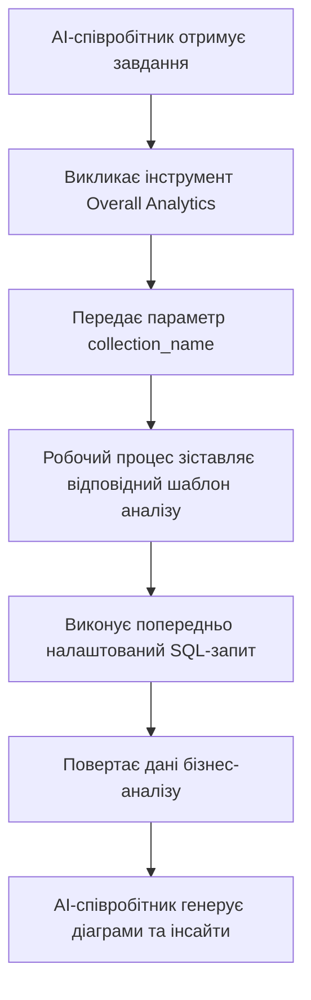

:::tip Повідомлення про переклад ШІ
Ця документація була автоматично перекладена штучним інтелектом.
:::


# Ролі та дозволи

## Вступ

Управління дозволами для AI-співробітників складається з двох рівнів:

1.  **Дозволи на доступ до AI-співробітників**: Контролює, які користувачі можуть використовувати яких AI-співробітників.
2.  **Дозволи на доступ до даних**: Як AI-співробітники застосовують контроль дозволів під час обробки даних.

Цей документ детально описує способи налаштування та принципи роботи цих двох типів дозволів.

---

## Налаштування дозволів на доступ до AI-співробітників

### Визначення доступних AI-співробітників для ролей

Перейдіть на сторінку `User & Permissions`, натисніть вкладку `Roles & Permissions`, щоб перейти на сторінку налаштування ролей.


Оберіть роль, натисніть вкладку `Permissions`, а потім вкладку `AI employees`. Тут відобразиться список AI-співробітників, якими керує плагін AI-співробітників.

Натисніть прапорець у стовпці `Available` списку AI-співробітників, щоб визначити, чи може поточна роль отримати доступ до цього AI-співробітника.


## Дозволи на доступ до даних

Коли AI-співробітники обробляють дані, метод контролю дозволів залежить від типу використовуваного інструменту:

### Вбудовані системні інструменти запитів до даних (дотримуються дозволів користувача)


Наступні інструменти **суворо дотримуються дозволів на дані поточного користувача** для доступу до даних:

| Назва інструменту                            | Опис                     |
| ------------------------------------ | ------------------------------- |
| **Data source query**                | Запитує базу даних, використовуючи джерело даних, колекцію та поля |
| **Data source records counting**     | Підраховує загальну кількість записів, використовуючи джерело даних, колекцію та поля |

**Принцип роботи:**

Коли AI-співробітники викликають ці інструменти, система:
1.  Ідентифікує особу поточного авторизованого користувача.
2.  Застосовує правила доступу до даних, налаштовані для цього користувача в розділі **Ролі та дозволи**.
3.  Повертає лише ті дані, які користувач має право переглядати.

**Приклад сценарію:**

Припустімо, що продавець А може переглядати лише дані клієнтів, за які він відповідає. Коли він використовує AI-співробітника Viz для аналізу клієнтів:
-   Viz викликає `Data source query` для запиту таблиці клієнтів.
-   Система застосовує правила фільтрації дозволів на дані продавця А.
-   Viz може бачити та аналізувати лише ті дані клієнтів, до яких продавець А має доступ.

Це гарантує, що **AI-співробітники не можуть обходити власні межі доступу користувача до даних**.

---

### Користувацькі бізнес-інструменти робочого процесу (незалежна логіка дозволів)

Бізнес-інструменти запитів, налаштовані за допомогою робочих процесів, мають контроль дозволів, **незалежний від дозволів користувача**, і визначаються бізнес-логікою робочого процесу.

Ці інструменти зазвичай використовуються для:
-   Фіксованих процесів бізнес-аналізу
-   Попередньо налаштованих агрегованих запитів
-   Статистичного аналізу, що виходить за межі дозволів

#### Приклад 1: Overall Analytics (Загальний бізнес-аналіз)


У демонстраційній версії CRM `Overall Analytics` — це шаблонний механізм бізнес-аналізу:

| Характеристика     | Опис                                    |
| -------------------- | ---------------------------------------------- |
| **Реалізація**   | Робочий процес читає попередньо налаштовані SQL-шаблони та виконує запити лише для читання |
| **Контроль дозволів** | Не обмежується поточними дозволами користувача, виводить фіксовані бізнес-дані, визначені шаблонами |
| **Сценарії використання**        | Забезпечує стандартизований цілісний аналіз для конкретних бізнес-об'єктів (наприклад, лідів, можливостей, клієнтів) |
| **Безпека**         | Усі шаблони запитів попередньо налаштовуються та перевіряються адміністраторами, що запобігає динамічній генерації SQL |

**Робочий процес:**



**Ключові характеристики:**
-   Будь-який користувач, що викликає цей інструмент, отримає **однаковий бізнес-перспективу**.
-   Обсяг даних визначається бізнес-логікою, не фільтрується дозволами користувача.
-   Підходить для надання стандартизованих звітів бізнес-аналізу.

#### Приклад 2: SQL Execution (Інструмент розширеного аналізу)


У демонстраційній версії CRM `SQL Execution` — це більш гнучкий, але такий, що вимагає суворого контролю, інструмент:

| Характеристика     | Опис                                    |
| -------------------- | ---------------------------------------------- |
| **Реалізація**   | Дозволяє AI генерувати та виконувати SQL-оператори |
| **Контроль дозволів** | Контролюється робочим процесом, зазвичай обмежується лише адміністраторами |
| **Сценарії використання**        | Розширений аналіз даних, дослідницькі запити, агрегований аналіз між таблицями |
| **Безпека**         | Вимагає від робочого процесу обмеження операцій лише для читання (SELECT) та контролю доступності через налаштування завдання |

**Рекомендації з безпеки:**

1.  **Обмежте сферу застосування**: Увімкніть лише для завдань у блоках керування.
2.  **Обмеження підказок**: Чітко визначте сферу запиту та назви таблиць у підказках завдання.
3.  **Перевірка робочого процесу**: Перевіряйте SQL-оператори в робочому процесі, щоб переконатися, що виконуються лише операції SELECT.
4.  **Журнали аудиту**: Записуйте всі виконані SQL-оператори для відстеження.

**Приклад конфігурації:**

```markdown
Обмеження підказок завдання:
- Можна запитувати лише таблиці, пов'язані з CRM (leads, opportunities, accounts, contacts)
- Можна виконувати лише запити SELECT
- Часовий діапазон обмежений останнім 1 роком
- Кількість повернених результатів не перевищує 1000 записів
```

---

## Рекомендації щодо проектування дозволів

### Вибір стратегії дозволів за бізнес-сценарієм

| Бізнес-сценарій         | Рекомендований тип інструменту | Стратегія дозволів         | Причина                   |
| ------------------------- | -------------------- | ------------------- | ------------------------ |
| Продавець переглядає власних клієнтів | Вбудовані системні інструменти запитів | Дотримання дозволів користувача | Забезпечує ізоляцію даних та захист бізнес-безпеки |
| Керівник відділу переглядає дані команди | Вбудовані системні інструменти запитів | Дотримання дозволів користувача | Автоматично застосовує обсяг даних відділу |
| Керівник переглядає глобальний бізнес-аналіз | Користувацькі інструменти робочого процесу / Overall Analytics | Незалежна бізнес-логіка       | Забезпечує стандартизований цілісний погляд |
| Аналітик даних виконує дослідницькі запити | SQL Execution | Суворе обмеження доступних об'єктів | Потребує гнучкості, але необхідно контролювати обсяг доступу |
| Звичайні користувачі переглядають стандартні звіти | Overall Analytics | Незалежна бізнес-логіка       | Фіксовані стандарти аналізу, не потрібно турбуватися про базові дозволи |

### Багаторівнева стратегія захисту

Для чутливих бізнес-сценаріїв рекомендується застосовувати багаторівневий контроль дозволів:

1.  **Рівень доступу AI-співробітників**: Контролює, які ролі можуть використовувати цього AI-співробітника.
2.  **Рівень видимості завдань**: Контролює відображення завдань за допомогою конфігурації блоків.
3.  **Рівень авторизації інструментів**: Перевіряє ідентифікацію користувача та дозволи в робочих процесах.
4.  **Рівень доступу до даних**: Контролює обсяг даних за допомогою дозволів користувача або бізнес-логіки.

**Приклад:**

```
Сценарій: Лише фінансовий відділ може використовувати AI для фінансового аналізу

- Дозволи AI-співробітників: Лише фінансова роль може отримати доступ до AI-співробітника "Finance Analyst"
- Конфігурація завдання: Завдання фінансового аналізу відображаються лише у фінансових модулях
- Дизайн інструменту: Інструменти фінансового робочого процесу перевіряють відділ користувача
- Дозволи на дані: Дозволи на доступ до фінансових таблиць надаються лише фінансовій ролі
```

---

## Часті запитання

### З: До яких даних можуть отримати доступ AI-співробітники?

**В:** Залежить від типу використовуваного інструменту:
-   **Вбудовані системні інструменти запитів**: Можуть отримати доступ лише до даних, які поточний користувач має право переглядати.
-   **Користувацькі інструменти робочого процесу**: Визначаються бізнес-логікою робочого процесу, можуть не обмежуватися дозволами користувача.

### З: Як запобігти витоку конфіденційних даних AI-співробітниками?

**В:** Застосуйте багаторівневий захист:
1.  Налаштуйте дозволи на доступ до AI-співробітників за ролями, щоб обмежити, хто може їх використовувати.
2.  Для вбудованих системних інструментів покладайтеся на дозволи користувача на дані для автоматичної фільтрації.
3.  Для користувацьких інструментів реалізуйте перевірку бізнес-логіки в робочих процесах.
4.  Чутливі операції (такі як SQL Execution) повинні бути авторизовані лише адміністраторам.

### З: Що робити, якщо я хочу, щоб деякі AI-співробітники обходили обмеження дозволів користувача?

**В:** Використовуйте користувацькі бізнес-інструменти робочого процесу:
-   Створіть робочі процеси для реалізації конкретної логіки бізнес-запитів.
-   У робочому процесі контролюйте обсяг даних та правила доступу.
-   Налаштуйте інструменти для використання AI-співробітниками.
-   Контролюйте, хто може викликати цю функцію, за допомогою дозволів на доступ до AI-співробітників.

### З: Яка різниця між Overall Analytics та SQL Execution?

**В:**

| Вимір порівняння   | Overall Analytics   | SQL Execution     |
| -------------------- | ------------------- | ----------------- |
| Гнучкість    | Низька (можна використовувати лише попередньо налаштовані шаблони)        | Висока (може динамічно генерувати запити)        |
| Безпека             | Висока (усі запити попередньо перевіряються)         | Середня (потребує обмежень та перевірки)        |
| Цільові користувачі         | Звичайні бізнес-користувачі              | Адміністратори або старші аналітики        |
| Вартість обслуговування   | Потрібно підтримувати шаблони аналізу            | Не потребує обслуговування, але вимагає моніторингу       |
| Узгодженість даних     | Висока (стандартизовані показники)            | Низька (результати запитів можуть бути неузгодженими)      |

---

## Найкращі практики

1.  **За замовчуванням дотримуйтесь дозволів користувача**: Якщо немає чіткої бізнес-потреби, надавайте перевагу використанню вбудованих системних інструментів, які дотримуються дозволів користувача.
2.  **Шаблонний стандартний аналіз**: Для поширених сценаріїв аналізу використовуйте шаблон Overall Analytics для надання стандартизованих можливостей.
3.  **Суворий контроль над розширеними інструментами**: Інструменти з високими дозволами, такі як SQL Execution, повинні бути авторизовані лише кільком адміністраторам.
4.  **Ізоляція на рівні завдань**: Налаштовуйте чутливі завдання в певних блоках та реалізуйте ізоляцію за допомогою дозволів на доступ до сторінок.
5.  **Аудит та моніторинг**: Записуйте поведінку AI-співробітників щодо доступу до даних та регулярно перевіряйте на наявність аномальних операцій.