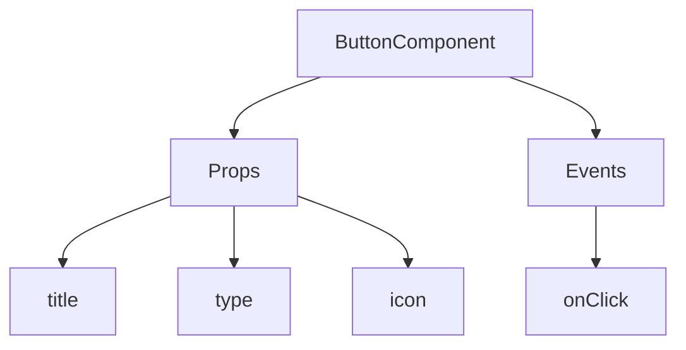
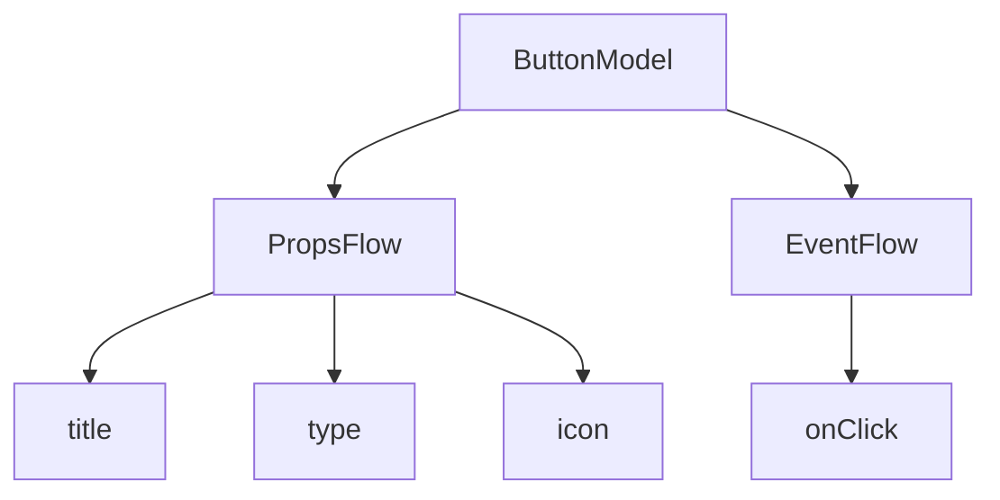

:::tip Повідомлення про переклад ШІ
Ця документація була автоматично перекладена штучним інтелектом.
:::


# Швидкий старт: Створення компонента кнопки, що піддається оркестрації

У React ми зазвичай рендеримо компонент кнопки так:

```tsx pure
import { Button } from 'antd';

export default function App() {
  return <Button type="primary">Primary Button</Button>;
}
```

Хоча наведений вище код простий, він є **статичним компонентом** і не може задовольнити потреби no-code платформи щодо можливостей конфігурації та оркестрації.

У FlowEngine NocoBase ми можемо швидко створювати компоненти, які підтримують конфігурацію та керуються подіями, використовуючи **FlowModel + FlowDefinition**, досягаючи потужніших можливостей no-code.

---

## Крок 1: Рендеринг компонента за допомогою FlowModel

<code src="./demos/quickstart-1-basic.tsx"></code>

### 🧠 Ключові концепції

- `FlowModel` — це основна модель компонента у FlowEngine, яка інкапсулює логіку компонента, можливості рендерингу та конфігурації.
- Кожен компонент інтерфейсу користувача можна інстанціювати та уніфіковано керувати ним за допомогою `FlowModel`.

### 📌 Кроки реалізації

#### 1. Створення власного класу моделі

```tsx pure
class MyModel extends FlowModel {
  render() {
    return <Button {...this.props} />;
  }
}
```

#### 2. Створення екземпляра моделі

```ts
const model = this.flowEngine.createModel({
  uid: 'my-model',
  use: 'MyModel',
  props: {
    type: 'primary',
    children: 'Primary Button',
  },
});
```

#### 3. Рендеринг за допомогою `<FlowModelRenderer />`

```tsx pure
<FlowModelRenderer model={model} />
```

## Крок 2: Додавання PropsFlow для конфігурації властивостей кнопки

<code src="./demos/quickstart-2-register-propsflow.tsx"></code>

### 💡 Навіщо використовувати PropsFlow?

Використання Flow замість статичних props дозволяє:
- Динамічну конфігурацію
- Візуальне редагування
- Відтворення стану та його збереження

### 🛠 Ключові зміни

#### 1. Визначення Flow для властивостей кнопки

```tsx pure

const buttonSettings = defineFlow({
  key: 'buttonSettings',
  
  title: 'Налаштування кнопки',
  steps: {
    general: {
      title: 'Загальна конфігурація',
      uiSchema: {
        title: {
          type: 'string',
          title: 'Заголовок кнопки',
          'x-decorator': 'FormItem',
          'x-component': 'Input',
        },
        type: {
          type: 'string',
          title: 'Тип',
          'x-decorator': 'FormItem',
          'x-component': 'Select',
          enum: [
            { label: 'Основний', value: 'primary' },
            { label: 'За замовчуванням', value: 'default' },
            { label: 'Небезпечний', value: 'danger' },
            { label: 'Пунктирний', value: 'dashed' },
            { label: 'Посилання', value: 'link' },
            { label: 'Текст', value: 'text' },
          ],
        },
        icon: {
          type: 'string',
          title: 'Іконка',
          'x-decorator': 'FormItem',
          'x-component': 'Select',
          enum: [
            { label: 'Пошук', value: 'SearchOutlined' },
            { label: 'Додати', value: 'PlusOutlined' },
            { label: 'Видалити', value: 'DeleteOutlined' },
            { label: 'Редагувати', value: 'EditOutlined' },
            { label: 'Налаштування', value: 'SettingOutlined' },
          ],
        },
      },
      defaultParams: {
        type: 'primary',
      },
      // Функція обробника кроку, встановлює властивості моделі
      handler(ctx, params) {
        ctx.model.setProps('children', params.title);
        ctx.model.setProps('type', params.type);
        ctx.model.setProps('icon', params.icon ? React.createElement(icons[params.icon]) : undefined);
      },
    },
  },
});

MyModel.registerFlow(buttonSettings);
```

#### 2. Використання `stepParams` замість статичних `props`

```diff
const model = this.flowEngine.createModel({
  uid: 'my-model',
  use: 'MyModel',
- props: {
-   type: 'primary',
-   children: 'Primary Button',
- },
+ stepParams: {
+   buttonSettings: {
+     general: {
+       title: 'Основна кнопка',
+       type: 'primary',
+     },
+   },
+ },
});
```

> ✅ Використання `stepParams` є рекомендованим підходом у FlowEngine, оскільки це дозволяє уникнути проблем з несеріалізованими даними (наприклад, компонентами React).

#### 3. Увімкнення інтерфейсу конфігурації властивостей

```diff
- <FlowModelRenderer model={model} />
+ <FlowModelRenderer model={model} showFlowSettings />
```

---

## Крок 3: Підтримка потоку подій кнопки (EventFlow)

<code src="./demos/quickstart-3-register-eventflow.tsx"></code>

### 🎯 Сценарій: Відображення діалогового вікна підтвердження після натискання кнопки

#### 1. Прослуховування події onClick

Додайте onClick ненав'язливим способом

```diff
const myPropsFlow = defineFlow({
  key: 'buttonSettings',
  steps: {
    general: {
      // ... пропущено
      handler(ctx, params) {
        // ... пропущено
+       ctx.model.setProps('onClick', (event) => {
+         ctx.model.dispatchEvent('click', { event });
+       });
      },
    },
  },
});
```

#### 2. Визначення потоку подій

```ts
const myEventFlow = defineFlow({
  key: 'clickSettings',
  on: 'click',
  title: 'Подія кнопки',
  steps: {
    confirm: {
      title: 'Конфігурація дії підтвердження',
      uiSchema: {
        title: {
          type: 'string',
          title: 'Заголовок підказки діалогового вікна',
          'x-decorator': 'FormItem',
          'x-component': 'Input',
        },
        content: {
          type: 'string',
          title: 'Вміст підказки діалогового вікна',
          'x-decorator': 'FormItem',
          'x-component': 'Input.TextArea',
        },
      },
      defaultParams: {
        title: 'Підтвердити дію',
        content: 'Ви натиснули кнопку, ви впевнені?',
      },
      async handler(ctx, params) {
        // Діалогове вікно
        const confirmed = await ctx.modal.confirm({
          title: params.title,
          content: params.content,
        });
        // Повідомлення
        await ctx.message.info(`Ви натиснули кнопку, результат підтвердження: ${confirmed ? 'Підтверджено' : 'Скасовано'}`);
      },
    },
  },
});
MyModel.registerFlow(myEventFlow);
```

**Додаткові примітки:**
- EventFlow дозволяє гнучко конфігурувати поведінку кнопки за допомогою потоку, наприклад, відображення діалогових вікон, повідомлень, виконання викликів API тощо.
- Ви можете реєструвати різні потоки подій для різних подій (наприклад, `onClick`, `onMouseEnter` тощо), щоб задовольнити складні бізнес-вимоги.

#### 3. Налаштування параметрів потоку подій

При створенні моделі ви можете налаштувати параметри за замовчуванням для потоку подій через `stepParams`:

```ts
const model = this.flowEngine.createModel({
  uid: 'my-model',
  use: 'MyModel',
  stepParams: {
    buttonSettings: {
      general: {
        title: 'Основна кнопка',
        type: 'primary',
      },
    },
    clickSettings: {
      confirm: {
        title: 'Підтвердити дію',
        content: 'Ви натиснули кнопку, ви впевнені?',
      },
    },
  },
});
```

---

## Порівняння моделей: ReactComponent проти FlowModel

Flow не змінює спосіб реалізації компонентів. Він просто додає підтримку PropsFlow та EventFlow до ReactComponent, дозволяючи візуально конфігурувати та оркеструвати властивості та події компонента.


### ReactComponent



### FlowModel



## Підсумок

Виконавши три кроки вище, ми створили компонент кнопки, який підтримує конфігурацію та оркестрацію подій, з такими перевагами:

- 🚀 Візуальна конфігурація властивостей (наприклад, заголовок, тип, іконка)
- 🔄 Реакції на події можуть керуватися потоком (наприклад, натискання для відображення діалогового вікна)
- 🔧 Підтримує майбутні розширення (наприклад, умовна логіка, прив'язка змінних тощо)

Цей шаблон також застосовний до будь-якого компонента інтерфейсу користувача, такого як форми, списки та діаграми. У FlowEngine NocoBase **все піддається оркестрації**.