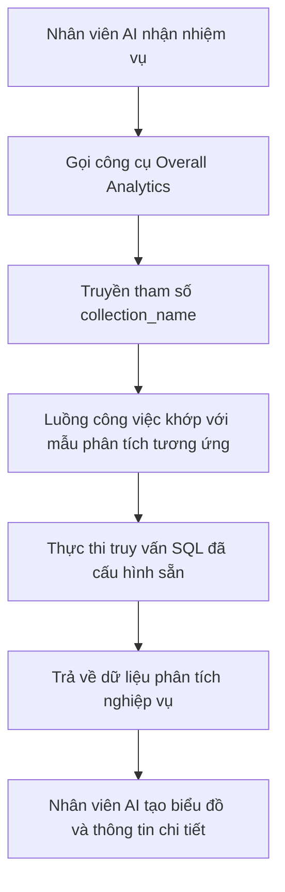

:::tip
Tài liệu này được dịch bởi AI. Đối với bất kỳ thông tin không chính xác nào, vui lòng tham khảo [phiên bản tiếng Anh](/en)
:::


# Vai trò và Quyền hạn

## Giới thiệu

Quản lý quyền hạn của nhân viên AI bao gồm hai cấp độ:

1.  **Quyền truy cập của nhân viên AI**: Kiểm soát người dùng nào có thể sử dụng nhân viên AI nào
2.  **Quyền truy cập dữ liệu**: Cách nhân viên AI áp dụng kiểm soát quyền hạn khi xử lý dữ liệu

Tài liệu này sẽ trình bày chi tiết cách cấu hình và nguyên lý hoạt động của hai loại quyền hạn này.

---

## Cấu hình quyền truy cập của nhân viên AI

### Thiết lập nhân viên AI khả dụng cho các vai trò

Truy cập trang `User & Permissions`, nhấp vào tab `Roles & Permissions` để vào trang cấu hình vai trò.


Chọn một vai trò, nhấp vào tab `Permissions`, sau đó nhấp vào tab `AI employees`. Tại đây sẽ hiển thị danh sách các nhân viên AI được quản lý trong plugin nhân viên AI.

Nhấp vào ô chọn trong cột `Available` của danh sách nhân viên AI để kiểm soát xem vai trò hiện tại có thể truy cập nhân viên AI đó hay không.


## Quyền truy cập dữ liệu

Khi nhân viên AI xử lý dữ liệu, phương pháp kiểm soát quyền hạn phụ thuộc vào loại công cụ được sử dụng:

### Công cụ truy vấn dữ liệu tích hợp sẵn của hệ thống (Tuân thủ quyền hạn người dùng)

Các công cụ sau đây sẽ truy cập dữ liệu **tuân thủ nghiêm ngặt quyền hạn dữ liệu của người dùng hiện tại**:

| Tên công cụ                            | Mô tả                     |
| ------------------------------- | ---------------------- |
| **Data source query**           | Truy vấn cơ sở dữ liệu bằng nguồn dữ liệu, bộ sưu tập và trường | 
| **Data source records counting** | Đếm tổng số bản ghi bằng nguồn dữ liệu, bộ sưu tập và trường |

**Nguyên lý hoạt động:**

Khi nhân viên AI gọi các công cụ này, hệ thống sẽ:
1.  Xác định danh tính của người dùng đang đăng nhập
2.  Áp dụng các quy tắc truy cập dữ liệu đã cấu hình cho người dùng đó trong **Vai trò và Quyền hạn**
3.  Chỉ trả về dữ liệu mà người dùng có quyền xem

**Kịch bản ví dụ:**

Giả sử nhân viên bán hàng A chỉ có thể xem dữ liệu khách hàng mà mình phụ trách. Khi người đó sử dụng nhân viên AI Viz để phân tích khách hàng:
-   Viz gọi `Data source query` để truy vấn bảng khách hàng
-   Hệ thống áp dụng các quy tắc lọc quyền hạn dữ liệu của nhân viên bán hàng A
-   Viz chỉ có thể thấy và phân tích dữ liệu khách hàng mà nhân viên bán hàng A có quyền truy cập

Điều này đảm bảo rằng **nhân viên AI sẽ không vượt qua giới hạn truy cập dữ liệu của chính người dùng**.

---

### Công cụ nghiệp vụ tùy chỉnh của luồng công việc (Logic quyền hạn độc lập)

Các công cụ truy vấn nghiệp vụ được tùy chỉnh thông qua luồng công việc có quyền kiểm soát **độc lập với quyền hạn người dùng**, được xác định bởi logic nghiệp vụ của luồng công việc.

Các công cụ này thường được sử dụng cho:
-   Các quy trình phân tích nghiệp vụ cố định
-   Các truy vấn tổng hợp được cấu hình sẵn
-   Phân tích thống kê vượt qua ranh giới quyền hạn

#### Ví dụ 1: Overall Analytics (Phân tích nghiệp vụ tổng thể)


Trong CRM Demo, `Overall Analytics` là một công cụ phân tích nghiệp vụ dựa trên mẫu:

| Đặc điểm     | Mô tả                                    |
| ------ | ------------------------------------- |
| **Cách triển khai** | Luồng công việc đọc các mẫu SQL được cấu hình sẵn và thực hiện các truy vấn chỉ đọc |
| **Kiểm soát quyền hạn** | Không bị giới hạn bởi quyền hạn người dùng hiện tại, xuất dữ liệu nghiệp vụ cố định được định nghĩa bởi mẫu |
| **Trường hợp áp dụng** | Cung cấp phân tích tổng thể tiêu chuẩn hóa cho các đối tượng nghiệp vụ cụ thể (ví dụ: khách hàng tiềm năng, cơ hội, khách hàng) |
| **Bảo mật**  | Tất cả các mẫu truy vấn được quản trị viên cấu hình và xem xét trước, tránh tạo SQL động |

**Luồng công việc:**



**Đặc điểm chính:**
-   Bất kỳ người dùng nào gọi công cụ này cũng sẽ nhận được **cùng một góc nhìn nghiệp vụ**
-   Phạm vi dữ liệu được xác định bởi logic nghiệp vụ, không bị lọc bởi quyền hạn người dùng
-   Phù hợp để cung cấp các báo cáo phân tích nghiệp vụ tiêu chuẩn hóa

#### Ví dụ 2: SQL Execution (Công cụ phân tích nâng cao)


Trong CRM Demo, `SQL Execution` là một công cụ linh hoạt hơn nhưng cần được kiểm soát chặt chẽ:

| Đặc điểm     | Mô tả                                    |
| ------ | ------------------------------------- |
| **Cách triển khai** | Cho phép AI tạo và thực thi các câu lệnh SQL |
| **Kiểm soát quyền hạn** | Được kiểm soát bởi luồng công việc, thường chỉ giới hạn cho quản trị viên |
| **Trường hợp áp dụng** | Phân tích dữ liệu nâng cao, truy vấn khám phá, phân tích tổng hợp đa bảng |
| **Bảo mật**  | Cần giới hạn các thao tác chỉ đọc (SELECT) trong luồng công việc và kiểm soát khả năng sử dụng thông qua cấu hình nhiệm vụ |

**Khuyến nghị bảo mật:**

1.  **Giới hạn phạm vi khả dụng**: Chỉ cấu hình bật trong các nhiệm vụ của khối quản lý
2.  **Ràng buộc lời nhắc**: Trong lời nhắc nhiệm vụ, xác định rõ phạm vi truy vấn và tên bảng
3.  **Xác thực luồng công việc**: Trong luồng công việc, xác thực các câu lệnh SQL, đảm bảo chỉ thực thi thao tác SELECT
4.  **Nhật ký kiểm toán**: Ghi lại tất cả các câu lệnh SQL đã thực thi, thuận tiện cho việc truy vết

**Cấu hình ví dụ:**

```markdown
Ràng buộc lời nhắc nhiệm vụ:
- Chỉ có thể truy vấn các bảng liên quan đến CRM (leads, opportunities, accounts, contacts)
- Chỉ có thể thực thi truy vấn SELECT
- Phạm vi thời gian giới hạn trong 1 năm gần nhất
- Kết quả trả về không quá 1000 bản ghi
```

---

## Khuyến nghị thiết kế quyền hạn

### Chọn chiến lược quyền hạn theo kịch bản nghiệp vụ

| Kịch bản nghiệp vụ         | Loại công cụ đề xuất         | Chiến lược quyền hạn         | Lý do                   |
| ------------ | -------------- | ------------ | -------------------- |
| Nhân viên bán hàng xem khách hàng của mình  | Công cụ truy vấn tích hợp sẵn       | Tuân thủ quyền người dùng       | Đảm bảo cách ly dữ liệu, bảo vệ an toàn nghiệp vụ        |
| Trưởng phòng xem dữ liệu nhóm   | Công cụ truy vấn tích hợp sẵn       | Tuân thủ quyền người dùng       | Tự động áp dụng phạm vi dữ liệu phòng ban           |
| Giám đốc xem phân tích nghiệp vụ toàn cầu   | Công cụ tùy chỉnh luồng công việc / Overall Analytics       | Logic nghiệp vụ độc lập       | Cung cấp góc nhìn tổng thể tiêu chuẩn hóa           |
| Chuyên viên phân tích dữ liệu truy vấn khám phá   | SQL Execution  | Giới hạn nghiêm ngặt đối tượng khả dụng     | Cần linh hoạt, nhưng phải kiểm soát phạm vi truy cập      |
| Người dùng thông thường xem báo cáo tiêu chuẩn   | Overall Analytics | Logic nghiệp vụ độc lập       | Tiêu chí phân tích cố định, không cần quan tâm đến quyền hạn cơ bản      |

### Chiến lược bảo vệ đa lớp

Đối với các kịch bản nghiệp vụ nhạy cảm, nên áp dụng kiểm soát quyền hạn đa lớp:

1.  **Lớp truy cập nhân viên AI**: Kiểm soát vai trò nào có thể sử dụng nhân viên AI đó
2.  **Lớp hiển thị nhiệm vụ**: Kiểm soát việc hiển thị nhiệm vụ thông qua cấu hình khối
3.  **Lớp ủy quyền công cụ**: Xác thực danh tính và quyền hạn người dùng trong luồng công việc
4.  **Lớp truy cập dữ liệu**: Kiểm soát phạm vi dữ liệu thông qua quyền hạn người dùng hoặc logic nghiệp vụ

**Ví dụ:**

```
Kịch bản: Chỉ phòng tài chính mới có thể sử dụng AI để phân tích tài chính

- Quyền hạn nhân viên AI: Chỉ vai trò tài chính mới có thể truy cập nhân viên AI "Finance Analyst"
- Cấu hình nhiệm vụ: Nhiệm vụ phân tích tài chính chỉ hiển thị trong các module tài chính
- Thiết kế công cụ: Công cụ luồng công việc tài chính xác thực phòng ban người dùng
- Quyền hạn dữ liệu: Quyền truy cập bảng tài chính chỉ được cấp cho vai trò tài chính
```

---

## Câu hỏi thường gặp

### H: Nhân viên AI có thể truy cập những dữ liệu nào?

**Đ:** Phụ thuộc vào loại công cụ được sử dụng:
-   **Công cụ truy vấn tích hợp sẵn của hệ thống**: Chỉ có thể truy cập dữ liệu mà người dùng hiện tại có quyền xem
-   **Công cụ tùy chỉnh luồng công việc**: Được xác định bởi logic nghiệp vụ của luồng công việc, có thể không bị giới hạn bởi quyền hạn người dùng

### H: Làm thế nào để ngăn nhân viên AI làm rò rỉ dữ liệu nhạy cảm?

**Đ:** Áp dụng bảo vệ đa lớp:
1.  Cấu hình quyền truy cập vai trò của nhân viên AI, giới hạn người có thể sử dụng
2.  Đối với các công cụ tích hợp sẵn của hệ thống, dựa vào quyền hạn dữ liệu người dùng để lọc tự động
3.  Đối với các công cụ tùy chỉnh, triển khai xác thực logic nghiệp vụ trong luồng công việc
4.  Các thao tác nhạy cảm (như SQL Execution) chỉ nên được ủy quyền cho quản trị viên

### H: Tôi muốn một số nhân viên AI vượt qua giới hạn quyền hạn người dùng thì làm thế nào?

**Đ:** Sử dụng công cụ nghiệp vụ tùy chỉnh của luồng công việc:
-   Tạo luồng công việc để triển khai logic truy vấn nghiệp vụ cụ thể
-   Trong luồng công việc, kiểm soát phạm vi dữ liệu và các quy tắc truy cập
-   Cấu hình công cụ cho nhân viên AI sử dụng
-   Thông qua quyền truy cập nhân viên AI để kiểm soát ai có thể gọi khả năng này

### H: Sự khác biệt giữa Overall Analytics và SQL Execution là gì?

**Đ:**

| Tiêu chí so sánh   | Overall Analytics   | SQL Execution     |
| ------ | ------------------- | ----------------- |
| Tính linh hoạt    | Thấp (chỉ có thể sử dụng các mẫu được cấu hình sẵn)        | Cao (có thể tạo truy vấn động)        |
| Bảo mật    | Cao (tất cả các truy vấn được xem xét trước)         | Trung bình (cần ràng buộc và xác thực)        |
| Đối tượng áp dụng   | Nhân viên nghiệp vụ thông thường              | Quản trị viên hoặc chuyên viên phân tích cấp cao        |
| Chi phí bảo trì   | Cần duy trì các mẫu phân tích            | Không cần duy trì, nhưng cần giám sát       |
| Tính nhất quán dữ liệu  | Mạnh (tiêu chí chuẩn hóa)            | Yếu (kết quả truy vấn có thể không nhất quán)      |

---

## Các thực hành tốt nhất

1.  **Mặc định tuân thủ quyền hạn người dùng**: Trừ khi có nhu cầu nghiệp vụ rõ ràng, ưu tiên sử dụng các công cụ tích hợp sẵn của hệ thống tuân thủ quyền hạn người dùng
2.  **Phân tích tiêu chuẩn theo mẫu**: Đối với các kịch bản phân tích phổ biến, sử dụng mô hình Overall Analytics để cung cấp khả năng tiêu chuẩn hóa
3.  **Kiểm soát chặt chẽ các công cụ nâng cao**: Các công cụ có quyền hạn cao như SQL Execution chỉ nên được ủy quyền cho một số ít quản trị viên
4.  **Cách ly cấp độ nhiệm vụ**: Cấu hình các nhiệm vụ nhạy cảm trong các khối cụ thể, thực hiện cách ly thông qua quyền truy cập trang
5.  **Kiểm toán và giám sát**: Ghi lại hành vi truy cập dữ liệu của nhân viên AI, thường xuyên xem xét các thao tác bất thường