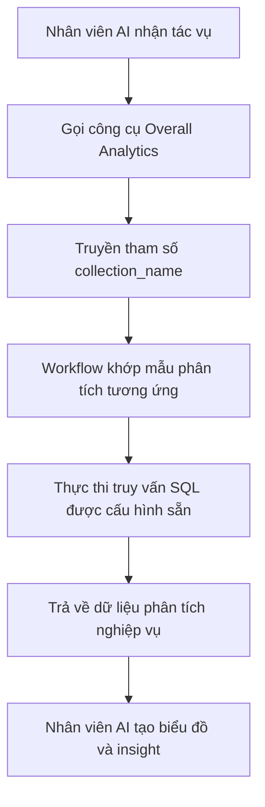

# Vai trò và quyền

## Giới thiệu

Quản lý quyền của Nhân viên AI bao gồm hai cấp độ:

1. **Quyền truy cập Nhân viên AI**: Kiểm soát người dùng nào có thể sử dụng Nhân viên AI nào
2. **Quyền truy cập dữ liệu**: Cách áp dụng kiểm soát quyền khi Nhân viên AI xử lý dữ liệu

Tài liệu này sẽ giải thích chi tiết phương thức cấu hình và nguyên lý hoạt động của hai loại quyền này.

---

## Cấu hình quyền truy cập Nhân viên AI

### Thiết lập Nhân viên AI khả dụng cho vai trò

Vào trang `User & Permissions`, nhấp vào tab `Roles & Permissions` để vào trang cấu hình vai trò.


Chọn một vai trò, nhấp vào tab `Permissions`, sau đó nhấp vào tab `AI employees`, ở đây sẽ hiển thị danh sách Nhân viên AI được quản lý trong Plugin Nhân viên AI.

Nhấp vào hộp kiểm trong cột `Available` của danh sách Nhân viên AI để kiểm soát xem vai trò hiện tại có thể truy cập Nhân viên AI đó hay không.


---

## Quyền truy cập dữ liệu

Khi Nhân viên AI xử lý dữ liệu, phương thức kiểm soát quyền phụ thuộc vào loại công cụ được sử dụng:

### Công cụ truy vấn dữ liệu tích hợp sẵn (tuân theo quyền người dùng)

Các công cụ sau đây sẽ truy cập dữ liệu **nghiêm ngặt theo quyền dữ liệu của người dùng hiện tại**:

| Tên công cụ | Mô tả |
| ------------------------------- | ---------------------- |
| **Data source query**           | Truy vấn cơ sở dữ liệu sử dụng nguồn dữ liệu, bảng dữ liệu và Field |
| **Data source records counting** | Đếm tổng số bản ghi sử dụng nguồn dữ liệu, bảng dữ liệu và Field |

**Nguyên lý hoạt động:**

Khi Nhân viên AI gọi các công cụ này, hệ thống sẽ:
1. Nhận diện danh tính người dùng đang đăng nhập hiện tại
2. Áp dụng các quy tắc truy cập dữ liệu mà người dùng đó đã cấu hình trong **Vai trò và quyền**
3. Chỉ trả về dữ liệu mà người dùng đó có quyền xem

**Kịch bản ví dụ:**

Giả sử nhân viên bán hàng A chỉ có thể xem dữ liệu khách hàng mình phụ trách, khi anh ta sử dụng Nhân viên AI Viz để phân tích khách hàng:
- Viz gọi `Data source query` để truy vấn bảng khách hàng
- Hệ thống áp dụng quy tắc lọc quyền dữ liệu của nhân viên bán hàng A
- Viz chỉ có thể xem và phân tích dữ liệu khách hàng mà nhân viên bán hàng A có quyền truy cập

Điều này đảm bảo **Nhân viên AI sẽ không vượt qua ranh giới truy cập dữ liệu của chính người dùng**.

---

### Công cụ nghiệp vụ tùy chỉnh trong Workflow (logic quyền độc lập)

Các công cụ truy vấn nghiệp vụ tùy chỉnh thông qua Workflow có kiểm soát quyền **độc lập với quyền người dùng**, được quyết định bởi logic nghiệp vụ của Workflow.

Loại công cụ này thường được dùng cho:
- Quy trình phân tích nghiệp vụ cố định
- Truy vấn tổng hợp được cấu hình sẵn
- Phân tích thống kê vượt qua ranh giới quyền

#### Ví dụ 1: Overall Analytics (Phân tích nghiệp vụ tổng quát)


Trong CRM Demo, `Overall Analytics` là một engine phân tích nghiệp vụ được mẫu hóa:

| Đặc tính | Mô tả |
| ------ | ------------------------------------- |
| **Cách triển khai** | Workflow đọc mẫu SQL được cấu hình sẵn, thực thi truy vấn chỉ đọc |
| **Kiểm soát quyền** | Không bị giới hạn bởi quyền người dùng hiện tại, đầu ra là dữ liệu nghiệp vụ cố định do mẫu định nghĩa |
| **Kịch bản phù hợp** | Cung cấp phân tích tổng thể chuẩn hóa cho các đối tượng nghiệp vụ cụ thể (như leads, opportunities, accounts) |
| **Tính bảo mật** | Tất cả mẫu truy vấn được Quản trị viên cấu hình và xét duyệt trước, tránh tạo SQL động |

**Quy trình hoạt động:**


```mermaid
flowchart TD
    A[Nhân viên AI nhận tác vụ] --> B[Gọi công cụ Overall Analytics]
    B --> C[Truyền tham số collection_name]
    C --> D[Workflow khớp mẫu phân tích tương ứng]
    D --> E[Thực thi truy vấn SQL được cấu hình sẵn]
    E --> F[Trả về dữ liệu phân tích nghiệp vụ]
    F --> G[Nhân viên AI tạo biểu đồ và insight]
```

**Đặc tính chính:**
- Bất kỳ người dùng nào gọi công cụ này đều nhận được **cùng một góc nhìn nghiệp vụ**
- Phạm vi dữ liệu do logic nghiệp vụ định nghĩa, không bị lọc bởi quyền người dùng
- Phù hợp cho việc cung cấp báo cáo phân tích nghiệp vụ chuẩn hóa

#### Ví dụ 2: SQL Execution (Công cụ phân tích nâng cao)


Trong CRM Demo, `SQL Execution` là một công cụ linh hoạt hơn nhưng cần kiểm soát nghiêm ngặt:

| Đặc tính | Mô tả |
| ------ | ------------------------------------- |
| **Cách triển khai** | Cho phép AI tạo và thực thi câu lệnh SQL |
| **Kiểm soát quyền** | Workflow kiểm soát ai có thể truy cập, thường chỉ giới hạn cho Quản trị viên |
| **Kịch bản phù hợp** | Phân tích dữ liệu nâng cao, truy vấn khám phá, phân tích tổng hợp đa bảng |
| **Tính bảo mật** | Cần giới hạn thao tác chỉ đọc (SELECT) trong Workflow, và kiểm soát tính khả dụng thông qua cấu hình tác vụ |

**Khuyến nghị bảo mật:**

1. **Giới hạn phạm vi khả dụng**: Chỉ cấu hình bật trong tác vụ của Block quản trị
2. **Ràng buộc Prompt**: Xác định rõ phạm vi truy vấn và tên bảng trong Prompt tác vụ
3. **Xác thực Workflow**: Xác thực câu lệnh SQL trong Workflow, đảm bảo chỉ thực thi thao tác SELECT
4. **Nhật ký kiểm toán**: Ghi lại tất cả câu lệnh SQL đã thực thi, thuận tiện cho việc truy nguyên

**Cấu hình ví dụ:**

```markdown
Ràng buộc Prompt tác vụ:
- Chỉ có thể truy vấn các bảng liên quan đến CRM (leads, opportunities, accounts, contacts)
- Chỉ có thể thực thi truy vấn SELECT
- Phạm vi thời gian giới hạn trong 1 năm gần nhất
- Kết quả trả về không vượt quá 1000 bản ghi
```

---

## Khuyến nghị thiết kế quyền

### Chọn chiến lược quyền theo kịch bản nghiệp vụ

| Kịch bản nghiệp vụ | Loại công cụ khuyến nghị | Chiến lược quyền | Lý do |
| ------------ | -------------- | ------------ | -------------------- |
| Nhân viên bán hàng xem khách hàng của mình | Công cụ truy vấn tích hợp sẵn | Tuân theo quyền người dùng | Đảm bảo cô lập dữ liệu, bảo vệ an toàn nghiệp vụ |
| Trưởng phòng xem dữ liệu nhóm | Công cụ truy vấn tích hợp sẵn | Tuân theo quyền người dùng | Tự động áp dụng phạm vi dữ liệu của phòng ban |
| Lãnh đạo cấp cao xem phân tích nghiệp vụ tổng thể | Công cụ tùy chỉnh trong Workflow / Overall Analytics | Logic nghiệp vụ độc lập | Cung cấp góc nhìn tổng thể chuẩn hóa |
| Nhà phân tích dữ liệu truy vấn khám phá | SQL Execution | Giới hạn nghiêm ngặt đối tượng khả dụng | Cần linh hoạt, nhưng phải kiểm soát phạm vi truy cập |
| Người dùng thông thường xem báo cáo chuẩn | Overall Analytics | Logic nghiệp vụ độc lập | Tiêu chí phân tích cố định, không cần quan tâm quyền lớp dưới |

### Chiến lược bảo vệ nhiều lớp

Đối với các kịch bản nghiệp vụ nhạy cảm, khuyến nghị áp dụng kiểm soát quyền nhiều lớp:

1. **Lớp truy cập Nhân viên AI**: Kiểm soát vai trò nào có thể sử dụng Nhân viên AI đó
2. **Lớp hiển thị tác vụ**: Kiểm soát việc hiển thị tác vụ thông qua cấu hình Block
3. **Lớp ủy quyền công cụ**: Xác thực danh tính và quyền người dùng trong Workflow
4. **Lớp truy cập dữ liệu**: Kiểm soát phạm vi dữ liệu thông qua quyền người dùng hoặc logic nghiệp vụ

**Ví dụ:**

```
Kịch bản: Chỉ phòng tài chính có thể sử dụng AI để phân tích tài chính

- Quyền Nhân viên AI: Chỉ vai trò tài chính có thể truy cập Nhân viên AI "Finance Analyst"
- Cấu hình tác vụ: Tác vụ phân tích tài chính chỉ hiển thị trong module tài chính
- Thiết kế công cụ: Công cụ Workflow tài chính xác thực phòng ban của người dùng
- Quyền dữ liệu: Quyền truy cập bảng tài chính chỉ được cấp cho vai trò tài chính
```

---

## Câu hỏi thường gặp

### Q: Nhân viên AI có thể truy cập dữ liệu nào?

**A:** Phụ thuộc vào loại công cụ được sử dụng:
- **Công cụ truy vấn tích hợp sẵn**: Chỉ có thể truy cập dữ liệu mà người dùng hiện tại có quyền xem
- **Công cụ tùy chỉnh trong Workflow**: Do logic nghiệp vụ của Workflow quyết định, có thể không bị giới hạn bởi quyền người dùng

### Q: Làm thế nào để ngăn Nhân viên AI làm rò rỉ dữ liệu nhạy cảm?

**A:** Áp dụng bảo vệ nhiều lớp:
1. Cấu hình quyền truy cập theo vai trò của Nhân viên AI, giới hạn ai có thể sử dụng
2. Đối với công cụ tích hợp sẵn, dựa vào tự động lọc theo quyền dữ liệu người dùng
3. Đối với công cụ tùy chỉnh, triển khai xác thực logic nghiệp vụ trong Workflow
4. Các thao tác nhạy cảm (như SQL Execution) chỉ ủy quyền cho Quản trị viên

### Q: Tôi muốn một số Nhân viên AI vượt qua giới hạn quyền người dùng thì làm sao?

**A:** Sử dụng công cụ nghiệp vụ tùy chỉnh trong Workflow:
- Tạo Workflow triển khai logic truy vấn nghiệp vụ cụ thể
- Kiểm soát phạm vi dữ liệu và quy tắc truy cập trong Workflow
- Cấu hình công cụ cho Nhân viên AI sử dụng
- Kiểm soát ai có thể gọi năng lực này thông qua quyền truy cập Nhân viên AI

### Q: Sự khác biệt giữa Overall Analytics và SQL Execution là gì?

**A:**

| Tiêu chí so sánh | Overall Analytics | SQL Execution |
| ------ | ------------------- | ----------------- |
| Tính linh hoạt | Thấp (chỉ có thể sử dụng mẫu cấu hình sẵn) | Cao (có thể tạo truy vấn động) |
| Tính bảo mật | Cao (tất cả truy vấn được xét duyệt trước) | Trung bình (cần ràng buộc và xác thực) |
| Đối tượng phù hợp | Người làm nghiệp vụ thông thường | Quản trị viên hoặc nhà phân tích cao cấp |
| Chi phí bảo trì | Cần bảo trì mẫu phân tích | Không cần bảo trì, nhưng cần giám sát |
| Tính nhất quán dữ liệu | Mạnh (tiêu chí chuẩn hóa) | Yếu (kết quả truy vấn có thể không nhất quán) |

---

## Thực hành tốt nhất

1. **Mặc định tuân theo quyền người dùng**: Trừ khi có nhu cầu nghiệp vụ rõ ràng, ưu tiên sử dụng công cụ tích hợp sẵn tuân theo quyền người dùng
2. **Mẫu hóa phân tích chuẩn**: Đối với các kịch bản phân tích phổ biến, sử dụng mẫu Overall Analytics để cung cấp năng lực chuẩn hóa
3. **Kiểm soát nghiêm ngặt công cụ nâng cao**: Các công cụ có quyền cao như SQL Execution chỉ ủy quyền cho một số ít Quản trị viên
4. **Cô lập cấp tác vụ**: Cấu hình tác vụ nhạy cảm trong Block cụ thể, thực hiện cô lập thông qua quyền truy cập trang
5. **Kiểm toán và giám sát**: Ghi lại hành vi truy cập dữ liệu của Nhân viên AI, xem xét định kỳ các thao tác bất thường
