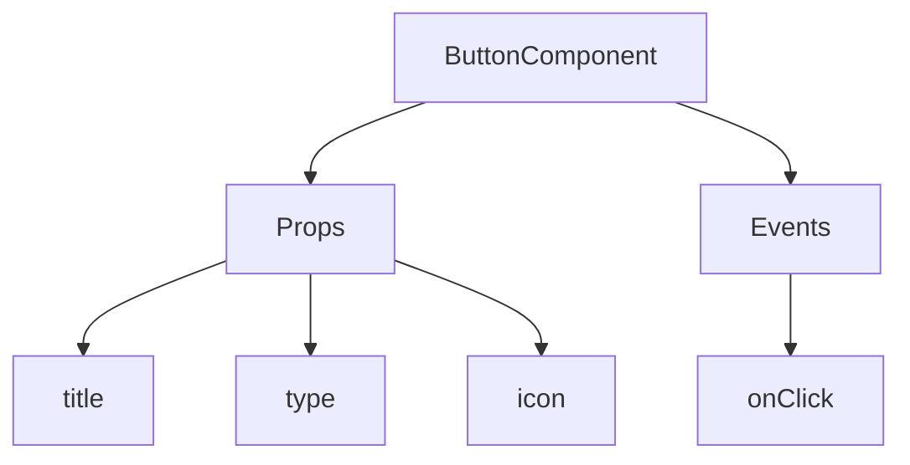
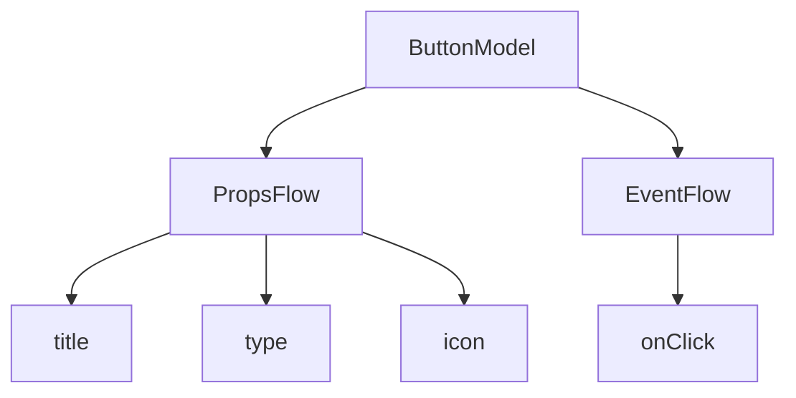

:::tip
Tài liệu này được dịch bởi AI. Đối với bất kỳ thông tin không chính xác nào, vui lòng tham khảo [phiên bản tiếng Anh](/en)
:::


# Bắt đầu nhanh: Xây dựng thành phần nút có thể điều phối

Trong React, chúng ta thường render một thành phần nút như sau:

```tsx pure
import { Button } from 'antd';

export default function App() {
  return <Button type="primary">Primary Button</Button>;
}
```

Mặc dù đoạn mã trên đơn giản, nhưng nó là một **thành phần tĩnh**, không thể đáp ứng yêu cầu về khả năng cấu hình và điều phối của các nền tảng không mã (no-code).

Trong FlowEngine của NocoBase, chúng ta có thể nhanh chóng xây dựng các thành phần hỗ trợ cấu hình và điều khiển bằng sự kiện thông qua **FlowModel + FlowDefinition**, từ đó đạt được khả năng không mã mạnh mẽ hơn.

---

## Bước 1: Render thành phần bằng FlowModel

<code src="./demos/quickstart-1-basic.tsx"></code>

### 🧠 Khái niệm chính

- `FlowModel` là mô hình thành phần cốt lõi trong FlowEngine, đóng gói logic, khả năng render và cấu hình của thành phần.
- Mọi thành phần UI đều có thể được khởi tạo và quản lý thống nhất thông qua `FlowModel`.

### 📌 Các bước triển khai

#### 1. Tạo lớp mô hình tùy chỉnh

```tsx pure
class MyModel extends FlowModel {
  render() {
    return <Button {...this.props} />;
  }
}
```

#### 2. Tạo một thể hiện (instance) của mô hình

```ts
const model = this.flowEngine.createModel({
  uid: 'my-model',
  use: 'MyModel',
  props: {
    type: 'primary',
    children: 'Primary Button',
  },
});
```

#### 3. Render bằng cách sử dụng `<FlowModelRenderer />`

```tsx pure
<FlowModelRenderer model={model} />
```

## Bước 2: Thêm PropsFlow để làm cho thuộc tính nút có thể cấu hình

<code src="./demos/quickstart-2-register-propsflow.tsx"></code>

### 💡 Tại sao nên sử dụng PropsFlow?

Sử dụng Flow thay vì các props tĩnh cho phép các thuộc tính có:
- Cấu hình động
- Chỉnh sửa trực quan
- Phát lại trạng thái và lưu trữ lâu dài

### 🛠 Các điểm cải tiến chính

#### 1. Định nghĩa Flow cho các thuộc tính của nút

```tsx pure

const buttonSettings = defineFlow({
  key: 'buttonSettings',
  
  title: 'Cài đặt nút',
  steps: {
    general: {
      title: 'Cấu hình chung',
      uiSchema: {
        title: {
          type: 'string',
          title: 'Tiêu đề nút',
          'x-decorator': 'FormItem',
          'x-component': 'Input',
        },
        type: {
          type: 'string',
          title: 'Loại',
          'x-decorator': 'FormItem',
          'x-component': 'Select',
          enum: [
            { label: 'Chính', value: 'primary' },
            { label: 'Mặc định', value: 'default' },
            { label: 'Nguy hiểm', value: 'danger' },
            { label: 'Nét đứt', value: 'dashed' },
            { label: 'Liên kết', value: 'link' },
            { label: 'Văn bản', value: 'text' },
          ],
        },
        icon: {
          type: 'string',
          title: 'Biểu tượng',
          'x-decorator': 'FormItem',
          'x-component': 'Select',
          enum: [
            { label: 'Tìm kiếm', value: 'SearchOutlined' },
            { label: 'Thêm', value: 'PlusOutlined' },
            { label: 'Xóa', value: 'DeleteOutlined' },
            { label: 'Chỉnh sửa', value: 'EditOutlined' },
            { label: 'Cài đặt', value: 'SettingOutlined' },
          ],
        },
      },
      defaultParams: {
        type: 'primary',
      },
      // Hàm xử lý bước, thiết lập thuộc tính mô hình
      handler(ctx, params) {
        ctx.model.setProps('children', params.title);
        ctx.model.setProps('type', params.type);
        ctx.model.setProps('icon', params.icon ? React.createElement(icons[params.icon]) : undefined);
      },
    },
  },
});

MyModel.registerFlow(buttonSettings);
```

#### 2. Sử dụng `stepParams` thay thế cho `props` tĩnh

```diff
const model = this.flowEngine.createModel({
  uid: 'my-model',
  use: 'MyModel',
- props: {
-   type: 'primary',
-   children: 'Primary Button',
- },
+ stepParams: {
+   buttonSettings: {
+     general: {
+       title: 'Primary Button',
+       type: 'primary',
+     },
+   },
+ },
});
```

> ✅ Sử dụng `stepParams` là cách tiếp cận được khuyến nghị trong FlowEngine, vì nó tránh các vấn đề với dữ liệu không thể tuần tự hóa (như các thành phần React).

#### 3. Kích hoạt giao diện cấu hình thuộc tính

```diff
- <FlowModelRenderer model={model} />
+ <FlowModelRenderer model={model} showFlowSettings />
```

---

## Bước 3: Hỗ trợ luồng sự kiện nút (EventFlow)

<code src="./demos/quickstart-3-register-eventflow.tsx"></code>

### 🎯 Kịch bản: Hiển thị hộp thoại xác nhận sau khi nhấp vào nút

#### 1. Lắng nghe sự kiện onClick

Thêm onClick theo cách không xâm lấn

```diff
const myPropsFlow = defineFlow({
  key: 'buttonSettings',
  steps: {
    general: {
      // ... bỏ qua
      handler(ctx, params) {
        // ... bỏ qua
+       ctx.model.setProps('onClick', (event) => {
+         ctx.model.dispatchEvent('click', { event });
+       });
      },
    },
  },
});
```

#### 2. Định nghĩa luồng sự kiện

```ts
const myEventFlow = defineFlow({
  key: 'clickSettings',
  on: 'click',
  title: 'Sự kiện nút',
  steps: {
    confirm: {
      title: 'Cấu hình hành động xác nhận',
      uiSchema: {
        title: {
          type: 'string',
          title: 'Tiêu đề hộp thoại',
          'x-decorator': 'FormItem',
          'x-component': 'Input',
        },
        content: {
          type: 'string',
          title: 'Nội dung hộp thoại',
          'x-decorator': 'FormItem',
          'x-component': 'Input.TextArea',
        },
      },
      defaultParams: {
        title: 'Xác nhận hành động',
        content: 'Bạn đã nhấp vào nút, bạn có chắc chắn không?',
      },
      async handler(ctx, params) {
        // Hộp thoại
        const confirmed = await ctx.modal.confirm({
          title: params.title,
          content: params.content,
        });
        // Thông báo
        await ctx.message.info(`Bạn đã nhấp vào nút, kết quả xác nhận: ${confirmed ? 'Đã xác nhận' : 'Đã hủy'}`);
      },
    },
  },
});
MyModel.registerFlow(myEventFlow);
```

**Lưu ý bổ sung:**
- Luồng sự kiện (EventFlow) cho phép hành vi của nút được cấu hình linh hoạt thông qua một luồng công việc, ví dụ như hiển thị hộp thoại, thông báo, gọi API, v.v.
- Bạn có thể đăng ký các luồng sự kiện khác nhau cho các sự kiện khác nhau (như `onClick`, `onMouseEnter`, v.v.) để đáp ứng các yêu cầu nghiệp vụ phức tạp.

#### 3. Cấu hình các tham số của luồng sự kiện

Khi tạo mô hình, bạn có thể cấu hình các tham số mặc định cho luồng sự kiện thông qua `stepParams`:

```ts
const model = this.flowEngine.createModel({
  uid: 'my-model',
  use: 'MyModel',
  stepParams: {
    buttonSettings: {
      general: {
        title: 'Primary Button',
        type: 'primary',
      },
    },
    clickSettings: {
      confirm: {
        title: 'Xác nhận hành động',
        content: 'Bạn đã nhấp vào nút, bạn có chắc chắn không?',
      },
    },
  },
});
```

---

## So sánh mô hình: ReactComponent và FlowModel

Flow không làm thay đổi cách triển khai các thành phần. Nó chỉ bổ sung hỗ trợ cho PropsFlow và EventFlow vào một ReactComponent, từ đó cho phép các thuộc tính và sự kiện của thành phần có thể được cấu hình và điều phối một cách trực quan.


### ReactComponent



### FlowModel



## Tóm tắt

Qua ba bước trên, chúng ta đã hoàn thành một thành phần nút hỗ trợ cấu hình và điều phối sự kiện, với những ưu điểm sau:

- 🚀 Cấu hình thuộc tính trực quan (như tiêu đề, loại, biểu tượng)
- 🔄 Phản hồi sự kiện có thể được quản lý bởi một luồng công việc (ví dụ: nhấp để hiển thị hộp thoại)
- 🔧 Hỗ trợ mở rộng trong tương lai (như logic điều kiện, ràng buộc biến, v.v.)

Mô hình này cũng có thể áp dụng cho bất kỳ thành phần UI nào khác như biểu mẫu, danh sách, biểu đồ. Trong FlowEngine của NocoBase, **mọi thứ đều có thể điều phối**.