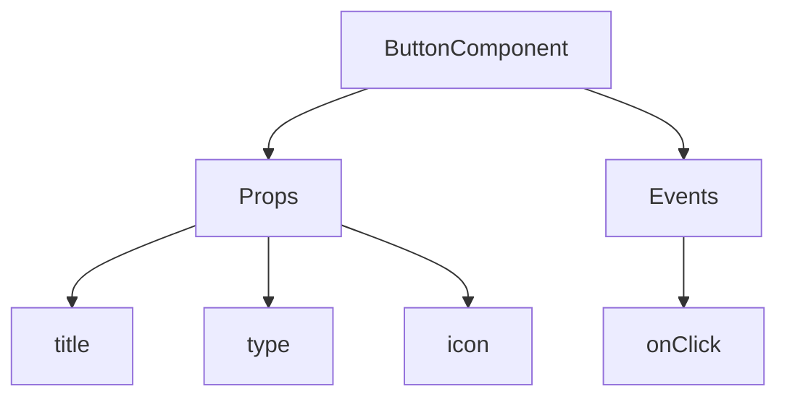
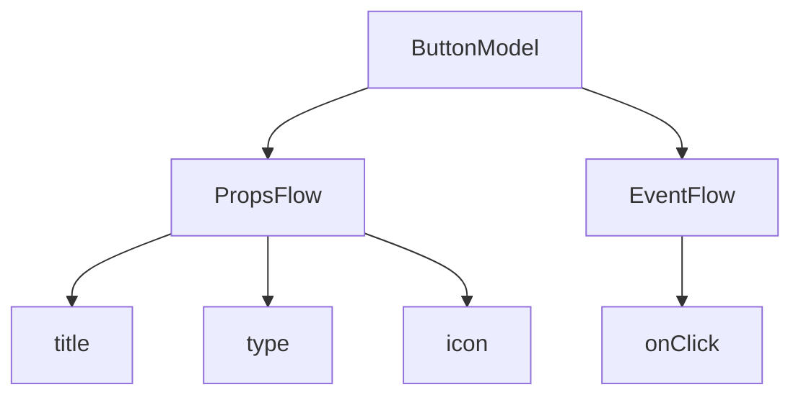

# Khởi đầu nhanh: Xây dựng component nút có thể điều phối

Trong React, chúng ta thường render một component nút như sau:

```tsx pure
import { Button } from 'antd';

export default function App() {
  return <Button type="primary">Primary Button</Button>;
}
```

Code trên tuy đơn giản, nhưng thuộc về **component tĩnh**, không thể đáp ứng yêu cầu về khả năng cấu hình và khả năng điều phối của nền tảng no-code.

Trong FlowEngine của NocoBase, chúng ta có thể thông qua **FlowModel + FlowDefinition** để nhanh chóng xây dựng component hỗ trợ cấu hình và điều khiển bằng sự kiện, đạt được khả năng no-code mạnh mẽ hơn.

---

## Bước 1: Dùng FlowModel để render component

<code src="./demos/quickstart-1-basic.tsx"></code>

### 🧠 Khái niệm chính

- `FlowModel` là model component cốt lõi trong FlowEngine, đóng gói logic, render và khả năng cấu hình của component.
- Mỗi component UI có thể được khởi tạo và quản lý thống nhất thông qua `FlowModel`.

### 📌 Các bước triển khai

#### 1. Tạo class model tùy chỉnh

```tsx pure
class MyModel extends FlowModel {
  render() {
    return <Button {...this.props} />;
  }
}
```

#### 2. Tạo instance model

```ts
const model = await this.flowEngine.createModelAsync({
  uid: 'my-model',
  use: 'MyModel',
  props: {
    type: 'primary',
    children: 'Primary Button',
  },
});
```

#### 3. Dùng `<FlowModelRenderer />` để render

```tsx pure
<FlowModelRenderer model={model} />
```

---

## Bước 2: Thêm PropsFlow, làm cho thuộc tính nút có thể cấu hình

<code src="./demos/quickstart-2-register-propsflow.tsx"></code>

### 💡 Tại sao cần dùng PropsFlow?

Dùng Flow thay vì props tĩnh, có thể đạt được:
- Cấu hình động của thuộc tính
- Chỉnh sửa trực quan
- Phát lại trạng thái và lưu trữ

### 🛠 Các điểm cải tiến chính

#### 1. Định nghĩa Flow của thuộc tính nút

```tsx pure

const buttonSettings = defineFlow({
  key: 'buttonSettings',
  
  title: 'Cài đặt nút',
  steps: {
    setProps: {
      title: 'Cấu hình chung',
      uiSchema: {
        title: {
          type: 'string',
          title: 'Tiêu đề nút',
          'x-decorator': 'FormItem',
          'x-component': 'Input',
        },
        type: {
          type: 'string',
          title: 'Loại',
          'x-decorator': 'FormItem',
          'x-component': 'Select',
          enum: [
            { label: 'Chính', value: 'primary' },
            { label: 'Phụ', value: 'default' },
            { label: 'Nguy hiểm', value: 'danger' },
            { label: 'Đường nét đứt', value: 'dashed' },
            { label: 'Liên kết', value: 'link' },
            { label: 'Văn bản', value: 'text' },
          ],
        },
        icon: {
          type: 'string',
          title: 'Biểu tượng',
          'x-decorator': 'FormItem',
          'x-component': 'Select',
          enum: [
            { label: 'Tìm kiếm', value: 'SearchOutlined' },
            { label: 'Thêm', value: 'PlusOutlined' },
            { label: 'Xóa', value: 'DeleteOutlined' },
            { label: 'Chỉnh sửa', value: 'EditOutlined' },
            { label: 'Cài đặt', value: 'SettingOutlined' },
          ],
        },
      },
      defaultParams: {
        type: 'primary',
      },
      // Hàm xử lý bước, đặt thuộc tính của model
      handler(ctx, params) {
        ctx.model.setProps('children', params.title);
        ctx.model.setProps('type', params.type);
        ctx.model.setProps('icon', params.icon ? React.createElement(icons[params.icon]) : undefined);
      },
    },
  },
});

MyModel.registerFlow(buttonSettings);
```

#### 2. Dùng `stepParams` thay cho `props` tĩnh

```diff
const model = await this.flowEngine.createModelAsync({
  uid: 'my-model',
  use: 'MyModel',
- props: {
-   type: 'primary',
-   children: 'Primary Button',
- },
+ stepParams: {
+   buttonSettings: {
+     general: {
+       title: 'Primary Button',
+       type: 'primary',
+     },
+   },
+ },
});
```

> ✅ Dùng `stepParams` là cách được FlowEngine khuyến nghị, có thể tránh vấn đề dữ liệu không thể serialize (như component React).

#### 3. Bật giao diện cấu hình thuộc tính

```diff
- <FlowModelRenderer model={model} />
+ <FlowModelRenderer model={model} showFlowSettings />
```

---

## Bước 3: Hỗ trợ luồng sự kiện nút (EventFlow)

<code src="./demos/quickstart-3-register-eventflow.tsx"></code>

### 🎯 Ngữ cảnh: Hiển thị hộp xác nhận sau khi click nút

#### 1. Lắng nghe sự kiện onClick

Dùng cách không xâm lấn, thêm onClick

```diff
const myPropsFlow = defineFlow({
  key: 'buttonSettings',
  steps: {
    general: {
      // ... lược bỏ
      handler(ctx, params) {
        // ... lược bỏ
+       ctx.model.setProps('onClick', (event) => {
+         ctx.model.dispatchEvent('click', { event });
+       });
      },
    },
  },
});
```

#### 2. Định nghĩa luồng sự kiện

```ts
const myEventFlow = defineFlow({
  key: 'clickSettings',
  on: 'click',
  title: 'Sự kiện nút',
  steps: {
    confirm: {
      title: 'Cấu hình thao tác xác nhận',
      uiSchema: {
        title: {
          type: 'string',
          title: 'Tiêu đề thông báo dialog',
          'x-decorator': 'FormItem',
          'x-component': 'Input',
        },
        content: {
          type: 'string',
          title: 'Nội dung thông báo dialog',
          'x-decorator': 'FormItem',
          'x-component': 'Input.TextArea',
        },
      },
      defaultParams: {
        title: 'Xác nhận thao tác',
        content: 'Bạn đã click nút, có xác nhận không?',
      },
      async handler(ctx, params) {
        // Dialog
        const confirmed = await ctx.modal.confirm({
          title: params.title,
          content: params.content,
        });
        // Thông báo
        await ctx.message.info(`Bạn đã click nút, kết quả xác nhận: ${confirmed ? 'Xác nhận' : 'Hủy'}`);
      },
    },
  },
});
MyModel.registerFlow(myEventFlow);
```

**Bổ sung:**
- Luồng sự kiện (EventFlow) có thể cho phép hành vi của nút được cấu hình linh hoạt qua quy trình, ví dụ dialog, message, gọi API, v.v.
- Bạn có thể đăng ký các luồng sự kiện khác nhau cho các sự kiện khác nhau (như `onClick`, `onMouseEnter`, v.v.), đáp ứng yêu cầu nghiệp vụ phức tạp.

#### 3. Cấu hình tham số luồng sự kiện

Khi tạo model, có thể cấu hình tham số mặc định của luồng sự kiện thông qua `stepParams`:

```ts
const model = await this.flowEngine.createModelAsync({
  uid: 'my-model',
  use: 'MyModel',
  stepParams: {
    buttonSettings: {
      general: {
        title: 'Primary Button',
        type: 'primary',
      },
    },
    clickSettings: {
      confirm: {
        title: 'Xác nhận thao tác',
        content: 'Bạn đã click nút, có xác nhận không?',
      },
    },
  },
});
```

---

## Sơ đồ so sánh model: ReactComponent vs FlowModel

Flow không thay đổi cách triển khai của component. Nó chỉ thêm hỗ trợ PropsFlow và EventFlow cho ReactComponent, từ đó làm cho thuộc tính và sự kiện của component đều có thể được cấu hình và điều phối trực quan.


### ReactComponent


```mermaid
graph TD
  Button[ButtonComponent]
  Button --> Props[Props]
  Button --> Events[Events]
  Props --> title[title]
  Props --> type[type]
  Props --> icon[icon]
  Events --> onClick[onClick]
```

### FlowModel


```mermaid
graph TD
  Button[ButtonModel]
  Button --> Props[PropsFlow]
  Button --> Events[EventFlow]
  Props --> title[title]
  Props --> type[type]
  Props --> icon[icon]
  Events --> onClick[onClick]
```

## Tóm tắt

Qua ba bước trên, chúng ta đã hoàn thành một component nút hỗ trợ cấu hình và điều phối sự kiện, có các ưu điểm sau:

- 🚀 Cấu hình thuộc tính trực quan (như tiêu đề, loại, biểu tượng)
- 🔄 Phản hồi sự kiện có thể được tiếp quản bởi quy trình (như dialog click)
- 🔧 Hỗ trợ mở rộng tiếp theo (như logic điều kiện, ràng buộc biến, v.v.)

Mô hình này cũng áp dụng cho bất kỳ component UI nào như form, list, biểu đồ, v.v., trong FlowEngine của NocoBase, **mọi thứ đều có thể điều phối**.
