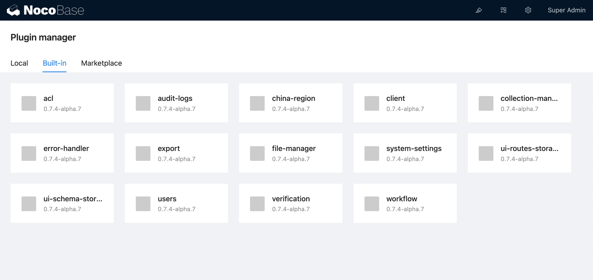

# Introduction

NocoBase adopts microkernel architecture, functions are extended in the form of plugins. Front and back ends are separated. Various plugin interfaces are provided, and plugins are divided by functional modules with pluggable features.


The pluggable design reduces the coupling between modules and increases the reuse rate. As the plugin library continues to expand, common scenarios require only a combination of plugins to complete the base build. NocoBase's no-code platform, for example, is a combination of various plugins.



## Plugin Manager

NocoBase provides a powerful plugin manager for managing plugins. The flow of the plugin manager is as follows



No-code Users can manage the activation and deactivation of local plugins through the interface at


Developers can also manage the complete plugin process by way of the CLI:

```bash
# Create the plugin
yarn pm create hello
# Register the plugin
yarn pm add hello
# Activate the plugin
yarn pm enable hello
# Disable the plugin
yarn pm disable hello
# Remove the plugin
yarn pm remove hello
```

For more plugin examples, see [packages/samples](https://github.com/nocobase/nocobase/tree/main/packages/samples).

## Extensibility

Whether it is generic functionality or personalization, it is recommended to write it as a plugin. NocoBase is extensible in all aspects.

- It can be user-intuitive interface-related page modules, block types, action types, field types, etc.
- Filters, validators, access restrictions, etc. for enhancing or restricting the HTTP API
- It can also be enhancements to underlying data tables, migrations, events, command lines, etc.


Distribution of modules.

- Server
  - Collections & Fields: mainly used for system table configuration. Business tables are recommended to be configured in "Plugin Settings Manager - Collection manager".
  - Resources & Actions: Mainly used to extend the Action API
  - Middleware: Middleware
  - Events: Events
  - I18n: server-side internationalization
  - Commands: Custom command lines
  - Migrations: Migration scripts
- Client
  - UI Schema Designer: Page Designer
  - UI Router: When there is a need for custom pages
  - Plugin Settings Manager: Provides configuration pages for plugins
  - I18n: Client side internationalization
