# Core concepts

## Collection

Collection is a collection of all kinds of data, such as orders, products, users, comments, etc. Different collections are distinguished by name, e.g.

```ts
// Orders
{
  name: 'orders',
}
// Products
{
  name: 'products',
}
// Users
{
  name: 'users',
}
// Comments
{
  name: 'comments',
}
```

## Collection Field

Each Collection has a number of Fields.

```ts
// Collection configuration
{
  name: 'users',
  fields: [
    { type: 'string', name: 'name' },
    { type: 'integer', name: 'age' },
    // Other fields
  ],
}
// sample data
[
  {
    name: 'Jason',
    age: 20,
  },
  { {
    name: 'Li Si',
    age: 18,
  }
];
```

The composition of a Collection Field in NocoBase consists of



### Field Type

Different fields are distinguished by name, and type indicates the data type of the field, which is divided into Attribute Type and Association Type, e.g.

**Attribute - Attribute Type**

- string
- text
- date
- boolean
- time
- float
- json
- location
- password
- virtual
- ...

**Relationship - Association Type**

- hasOne
- hasMany
- belongsTo
- belongsToMany
- ...

### Field Component

The field has a data type, the IO of the field value is fine, but it is not enough, if you need to display the field on the interface, you need another dimension of configuration -- `uiSchema`, e.g.

```tsx | pure
// Email field, displayed with Input component, using email validation rules
{
  type: 'string',
  name: 'email',
  uiSchema: {
    'x-component': 'Input',
    'x-component-props': { size: 'large' },
    'x-validator': 'email',
    'x-pattern': 'editable', // editable state, and readonly state, read-pretty state
  },
}

// Example data
{
  email: 'admin@nocobase.com',
}

// Component example
<Input name={'email'} size={'large'} value={'admin@nocobase.com'} />
```

The uiSchema is used to configure the components of the field to be displayed on the interface, each field component will correspond to a value and includes several maintained configurations:

- The component of the field
- The parameters of the component
- The field's validation rules
- The mode of the field (editable, readonly, read-pretty)
- The default value of the field
- Other

[see the UI Schema chapter for more information](/development/client/ui-schema-designer/what-is-ui-schema).

The built-in field components of NocoBase are

- Input
- InputNumber
- Select
- Radio
- Checkbox
- ...

### Field Interface

With Field Type and Field Component you can freely combine several fields, we call this combined template Field Interface, e.g.

```ts
// email field, string + input, email validation rules
{
  type: 'string',
  name: 'email',
  uiSchema: {
    'x-component': 'Input',
    'x-component-props': {},
    'x-validator': 'email',
  },
}

// phone field, string + input, phone validation rules
{
  type: 'string',
  name: 'phone',
  uiSchema: {
    'x-component': 'Input',
    'x-component-props': {},
    'x-validator': 'phone',
  },
}
```

The above email and phone require a full uiSchema to be configured each time which is very tedious. To simplify the configuration, another concept Field interface is introduced, which can template some parameters, e.g.

```ts
// Template for the email field
interface email {
  type: 'string';
  uiSchema: {
    'x-component': 'Input',
    'x-component-props': {},
    'x-validator': 'email',
  };
}

// Template for the phone field
interface phone {
  type: 'string';
  uiSchema: {
    'x-component': 'Input',
    'x-component-props': {},
    'x-validator': 'phone',
  };
}

// Simplified field configuration
// email
{
  interface: 'email',
  name: 'email',
}

// phone
{
  interface: 'phone',
  name: 'phone',
}
```

[More Field Interface here](https://github.com/nocobase/nocobase/tree/main/packages/core/client/src/collection-manager/interfaces)
