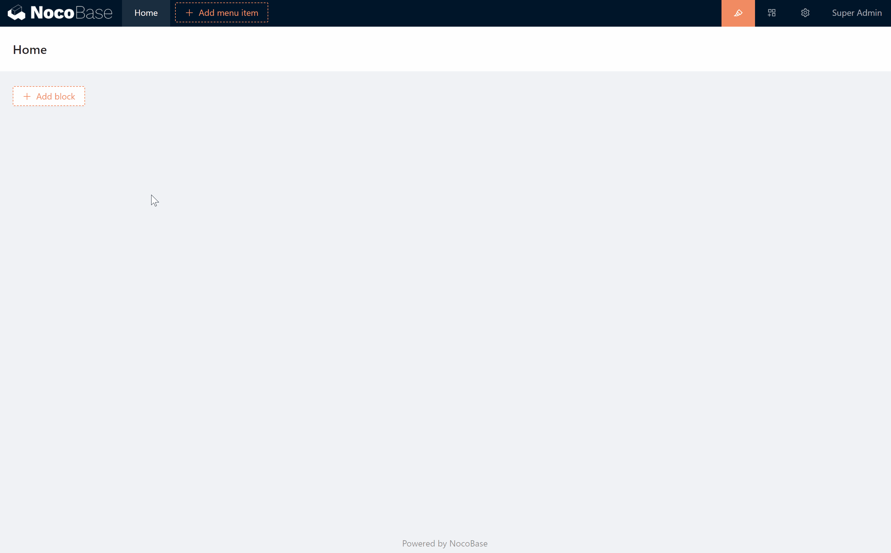

# Charts

Currently, chart blocks in NocoBase need to be implemented via a configuration file or by writing code. The chart library uses [g2plot](https://g2plot.antv.vision/en/examples/gallery), which theoretically supports all charts on [https://g2plot.antv.vision/en/examples/gallery](https://g2plot.antv.vision/en/examples/gallery). The currently configurable charts include

- Column charts
- Bar charts
- Line charts
- Pie charts
- Area charts

## Add and edit charts



## Chart Configuration

The initial chart configuration is static JSON data

```json
{
  "data": [
    {
      "type": "furniture & appliances",
      "sales": 38
    },
    {
      "type": "食品油副食",
      "sales": 52
    },
    {
      "type": "Fresh Fruit",
      "sales": 61
    },
    {
      "type": "美容洗护",
      "sales": 145
    },
    {
      "type": "Maternity & Baby Products",
      "sales": 48
    },
    {
      "type": "Imported Food",
      "sales": 38
    },
    {
      "type": "Food & Beverage",
      "sales": 38
    },
    {
      "type": "Home Cleaning",
      "sales": 38
    }
  ],
  "xField": "type",
  "yField": "sales",
  "label": {
    "position": "middle",
    "style": {
      "fill": "#FFFFFF",
      "opacity": 0.6
    }
  },
  "xAxis": {
    "label": {
      "autoHide": true,
      "autoRotate": false
    }
  },
  "meta": {
    "type": {
      "alias": "category"
    },
    "sales": {
      "alias": "sales"
    }
  }
}

```

Data supports expression, NocoBase has a built-in `requestChartData(config)` function for custom chart data requests. Parameters are described in: [https://github.com/axios/axios#request-config](https://github.com/axios/axios#request-config)

Example.

```json
{
  "data": "{{requestChartData({ url: 'collectionName:getColumnChartData' })}}",
  "xField": "type",
  "yField": "sales",
  "label": {
    "position": "middle",
    "style": {
      "fill": "#FFFFFF",
      "opacity": 0.6
    }
  },
  "xAxis": {
    "label": {
      "autoHide": true,
      "autoRotate": false
    }
  },
  "meta": {
    "type": {
      "alias": "category"
    },
    "sales": {
      "alias": "sales"
    }
  }
}

```

HTTP API example.

```bash
GET /api/collectionName:getColumnChartData

Response Body
{
    "data": [
    {
      "type": "furniture & appliances",
      "sales": 38
    },
    {
      "type": "食品油副食",
      "sales": 52
    },
    {
      "type": "Fresh Fruit",
      "sales": 61
    },
    {
      "type": "美容洗护",
      "sales": 145
    },
    {
      "type": "Maternity & Baby Products",
      "sales": 48
    },
    {
      "type": "Imported Food",
      "sales": 38
    },
    {
      "type": "Food & Beverage",
      "sales": 38
    },
    {
      "type": "Home Cleaning",
      "sales": 38
    }
  ]
}

```

## Server-side implementation

Add a custom getColumnChartData method to the data table named collectionName.

```js
app.resourcer.registerActionHandlers({
  'collectionName:getColumnChartData': (ctx, next) => {
    // The data to be output
    ctx.body = [];
    await next();
  },
});

```

## Video

### Static data

🍎🍎🍎🍎🍎🍎🍎🍎🍎🍎🍎🍎🍎🍎🍎🍎🍎🍎🍎🍎🍎🍎🍎🍎🍎

chart-static.mp4

### Dynamic data

🍎🍎🍎🍎🍎🍎🍎🍎🍎🍎🍎🍎🍎🍎🍎🍎🍎🍎🍎🍎🍎🍎🍎🍎🍎

chart-dynamic.mp4

### Other icons

Theoretically supports all charts on [https://g2plot.antv.vision/en/examples/gallery](https://g2plot.antv.vision/en/examples/gallery)

🍎🍎🍎🍎🍎🍎🍎🍎🍎🍎🍎🍎🍎🍎🍎🍎🍎🍎🍎🍎🍎🍎🍎🍎🍎

chart-more.mp4

## JS Expressions

Syntax

```js
{
  "key1": "{{ js expression }}"
}
```

🍎🍎🍎🍎🍎🍎🍎🍎🍎🍎🍎🍎🍎🍎🍎🍎🍎🍎🍎🍎🍎🍎🍎🍎🍎

chart-js.mp4