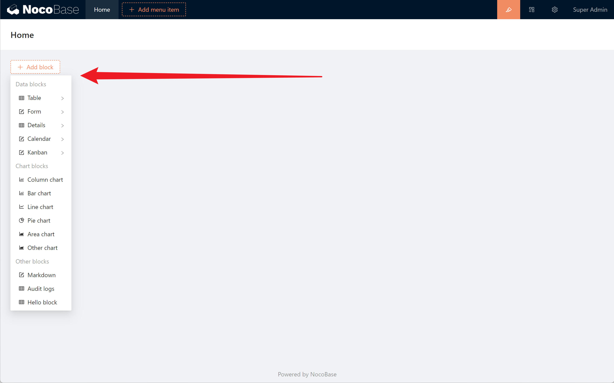
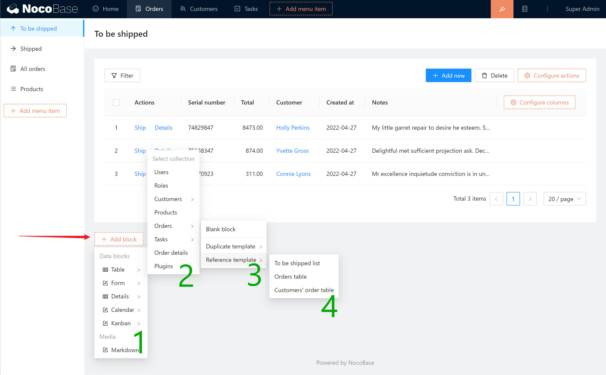

# Blocks

Blocks are views used to display and manipulate data. In NocoBase, pages, popups and drawers are considered as containers of blocks, and the container is like a canvas in which various blocks can be placed.

Thanks to NocoBase's design of separating data and view, pages carry data through blocks and organize and manage data in different forms according to different block types.

## Structure of blocks

A block consists of three parts.

1. content area: the body of the block
2. action area: various action buttons can be placed to manipulate the block data
3. configuration area: buttons for operating the block configuration

## Block types

NocoBase currently has 10+ types of blocks built in, more can be supported in the future by way of plugins.

- **Data blocks:** blocks designed for organizing data.
    - **Table:** A block that present multiple data in a table, either a single collection or multiple collections that are related to each other.
    - **Form:** A block for entering or editing data in a form, either for a particular collection or for multiple collections that are related to each other in a unified way.
    - **Details:** A block to display a specific record, either for a particular collection or for multiple collection that are related to each other.
    - **Calendar:** A block that displays multiple records in the form of a calendar, suitable for certain data with important characteristics in terms of date.
    - **Kanban:** A block that displays multiple data in the form of a Kanban board, suitable for managing production processes.
- **Chart blocks:** Blocks designed for graphical presentation of statistical data. Currently supports: bar graphs, bar charts, line graphs, pie charts, area charts, etc.
- **Other blocks:** Blocks designed to display special data.
    - **Markdown:** Text content written in Markdown.
    - **Audit Log**: Show the change records of all data in a collection, including new, edit and delete.

## Add block

Enter the UI Editor mode and click the Add block button on the page and in the pop-up window to add the block. The options are divided into 4 steps.

1. Select block type: Currently available block types include Table, Form, Details, Calendar, Kanban, Markdown
2. Select Collection: All collections will be listed here
3. Choose the creation method: create a blank block, or duplicate a block template , or reference a block template
4. Select Template: If you selected Create from Template in step 3, select the template in step 4

## Configure Blocks

The configuration of blocks consists of three elements.

- Configure block content
- Configure block actions
- Configure block properties

### Configure block content

Take the table block as an example, the content of the block is the columns to be displayed in the table. Click Configure columns to configure the columns to be displayed.

### Configure block actions

Take table block as an example, there are filter, add, delete, view, edit, customize and other actions available. Click the Configure actions button to configure the actions. Each of the action buttons can be configured for their own properties.

### Configure block properties

Move the cursor to the upper right corner of the block and you will see the block configuration button. Using the table block as an example, the following properties can be configured.

- Drag & drop sorting
- Set the data scope
- Set default sorting rules
- Records per page

## Adjust the layout

It is possible to put either just one block or multiple blocks in combination within the page. You can adjust the position and width of the blocks by dragging and dropping them.

## Block templates

You can save a block as a template, which can be copied or referenced later.

For example, if a form is used for both adding and editing data, then you can save this form as a template and reference it in the Add Data and Edit Data blocks.