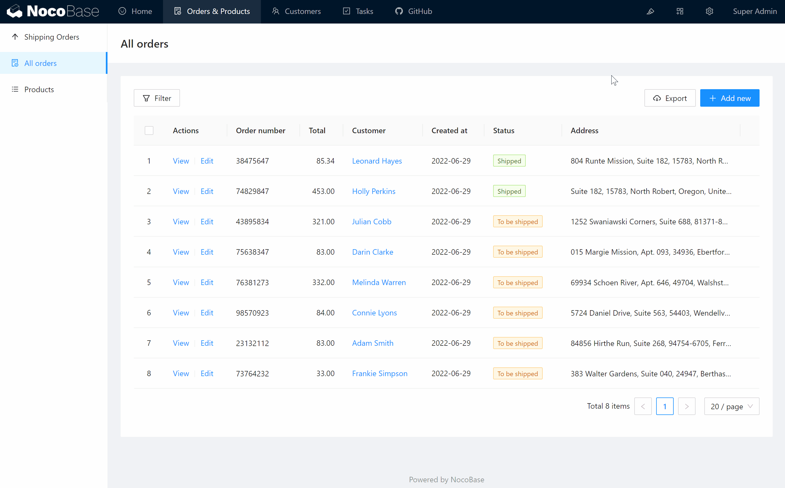

# Menus

The default menu location for NocoBase is at the top and on the left. The top is the first level menu and the left side is the menu for the second level and lower levels.

Three types of menu items are supported.

- Menu groups
- Pages
- Links

Once you enter the UI Editor mode, you can add and edit menus, as well as sort menu items.

NocoBase currently supports three types of menu items.

- Page: Jumps to the content page the menu item is associated.
- Group: grouping menu items and placing similar menus in a uniform location.
- Link: jumps to a specified URL.

Take the warehouse system as an example, if you have storage management in your business, storage management contains in and out logs, inventory queries, jump to the ERP application storage and other functions. Then you can set the menu like this.

```
- Storage space management (grouping)
    - Inventory query (page)
    - Inbound and outbound log (page)
    - Jump ERP application storage space (link)

```

## Default position

In NocoBase's built-in page templates, the menu appears at the top and on the left.


## Add Menu Item


Click Add menu item to select the type to add. Support infinite level submenu.

## Configure and Sort

Move the cursor over the menu item and the Sort and Configure buttons will appear in the upper right corner. Press and hold the Sort button to drag and drop the sorting.

Configurations that are operable on menu items:

- Edit
- Move to
- Insert before
- Insert after
- Insert Inner
- Delete

