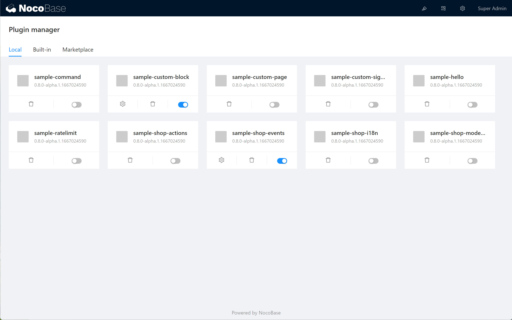

# Plugins

# What is a plugin

- Plugins are programs that are implemented following certain specifications and are loaded on the original system or platform to extend its capabilities.
- Typically, plugins cannot be run independently of the original system or platform.
- We can use different plug-ins to accomplish the same function, so plugins can be easily extended and replaced.

## Plugins in NocoBase

NocoBase is designed as a plugin architecture, and most of the functionality is done with plugins, except for a lightweight kernel.

Theoretically, even built-in features can be replaced with new plugins as well.

## Plugin Manager

NocoBase provides a visual plugin manager to enable and disable plugins, or to configure them.

The plugin manager is still in its early stages and in the future hopefully we will find a wide variety of plugins here to meet the needs.

