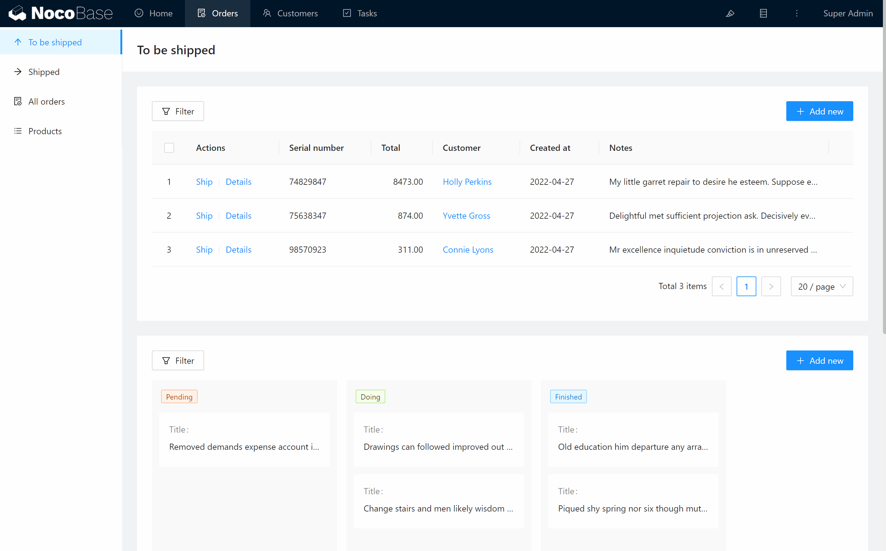

# Collections

Before developing a system, we usually have to abstract the business and build a data model. In NocoBase, the concept of a data collection is similar to that of a table in a relational database.

Click the "Collections & Fields" button to enter the configuration interface. Here, you can add, edit and delete data collections.

## Field Types

- Basic
    - Single line text
    - Long text
    - Phone
    - Email
    - Number
    - Percent
    - Password
    - Icon
- Choices
    - Checkbox
    - Single select
    - Multiple select
    - Radio group
    - Checkbox group
    - China region
- Media
    - Attachment
    - Markdown
    - Rich Text
- Date & Time
    - Date
    - Time
- Relationship Type
    - Link to
    - Sub-table
- System Info
    - ID
    - Created at
    - Last updated at
    - Created by
    - Last updated by