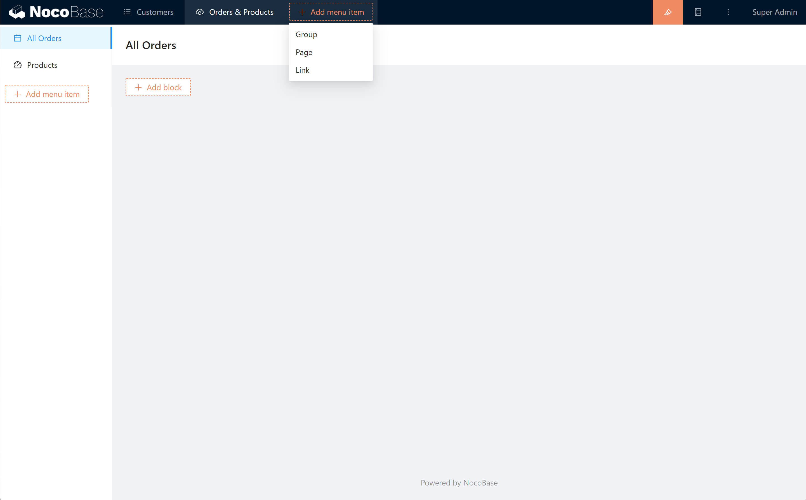

# Menus

The default menu location for NocoBase is at the top and on the left. The top is the first level menu and the left side is the menu for the second level and lower levels.

Three types of menu items are supported.

- Menu groups
- Pages
- Links

Once you enter the UI Editor mode, you can add and edit menus, as well as sort menu items.

## Add Menu Item

Click Add menu item to select the type to add. Support infinite level submenu.

## Configure and Sort

Move the cursor over the menu item and the Sort and Configure buttons will appear in the upper right corner. Press and hold the Sort button to drag and drop the sorting.

Configurations that are operable on menu items:

- Edit
- Move to
- Insert before
- Insert after
- Insert Inner
- Delete

