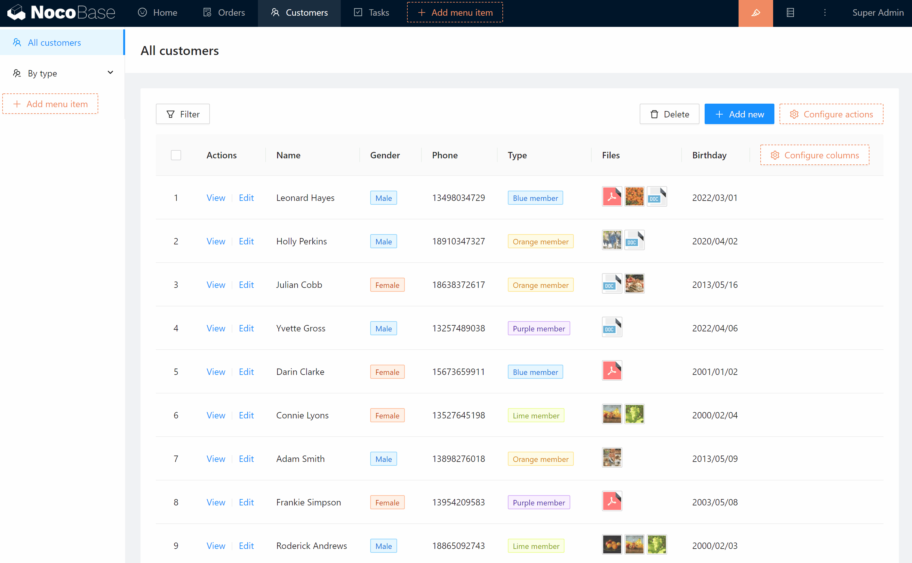

# Tabs

In a single record page or popup, you can add multiple tabs and add different blocks to each tab to display different content and actions. For example, in a customer information popup, add 3 tabs to display customer's personal information, order history, customer reviews.

Or, in an order record to be shipped, place a form block in the first tab for quick shipping, a block of associated data in the second tab to display the order items for the current order, and an order details block in the third tab.

