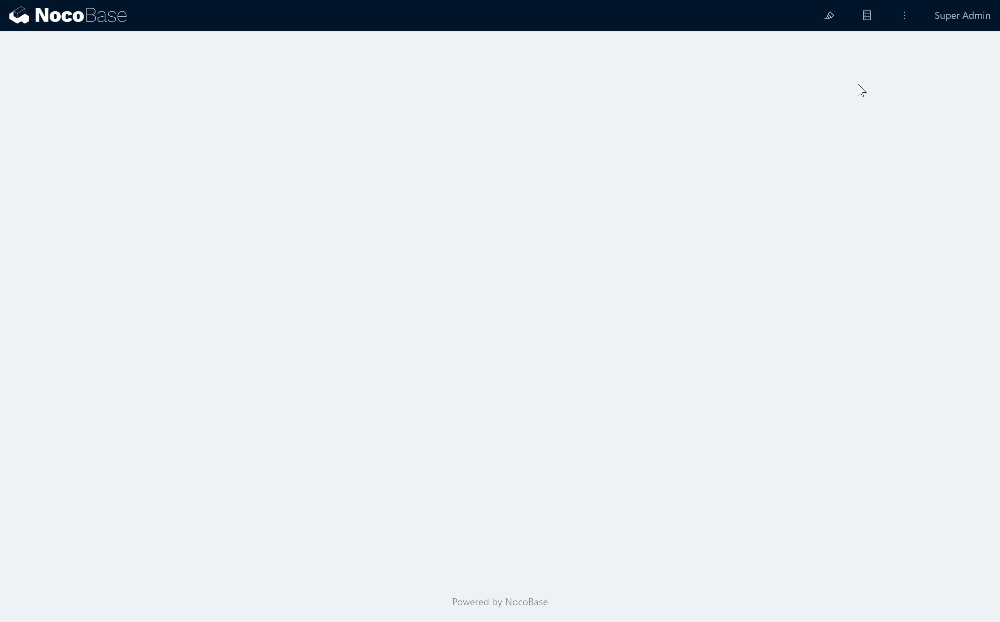
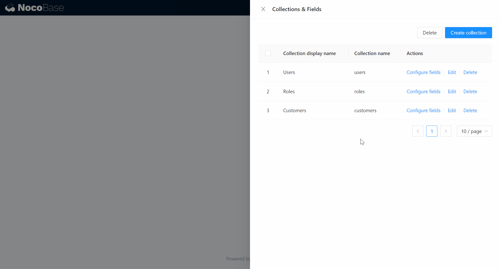
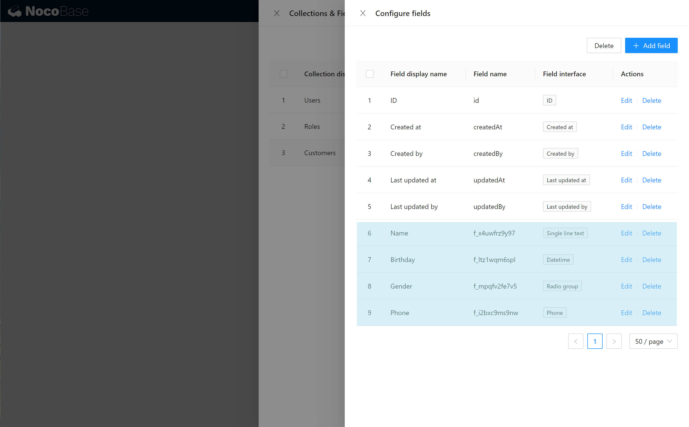
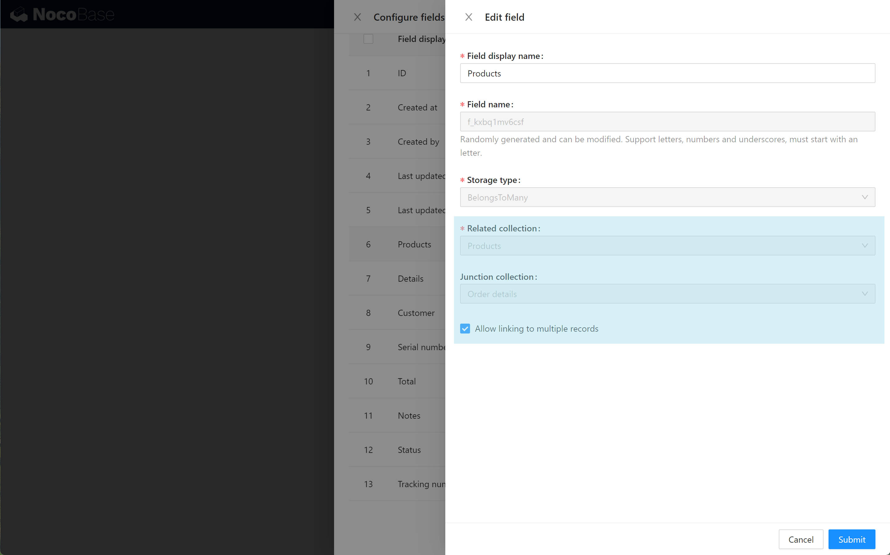
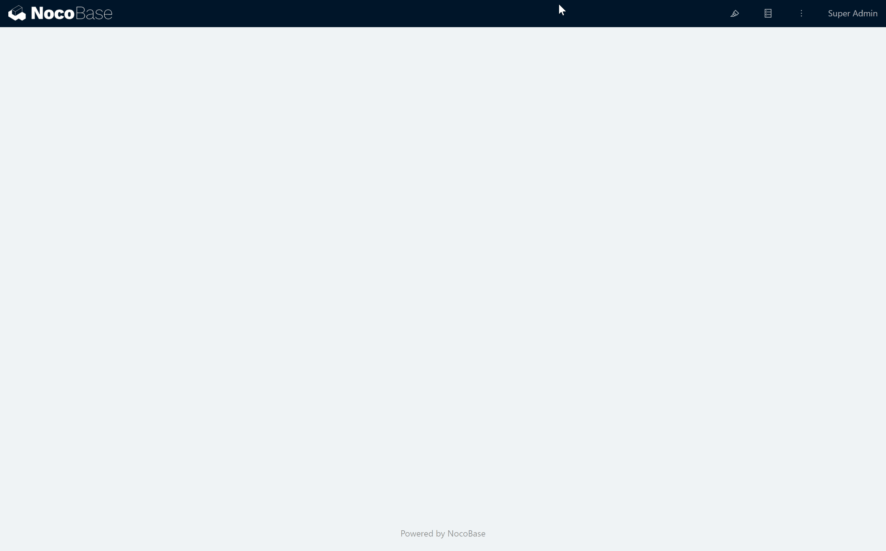
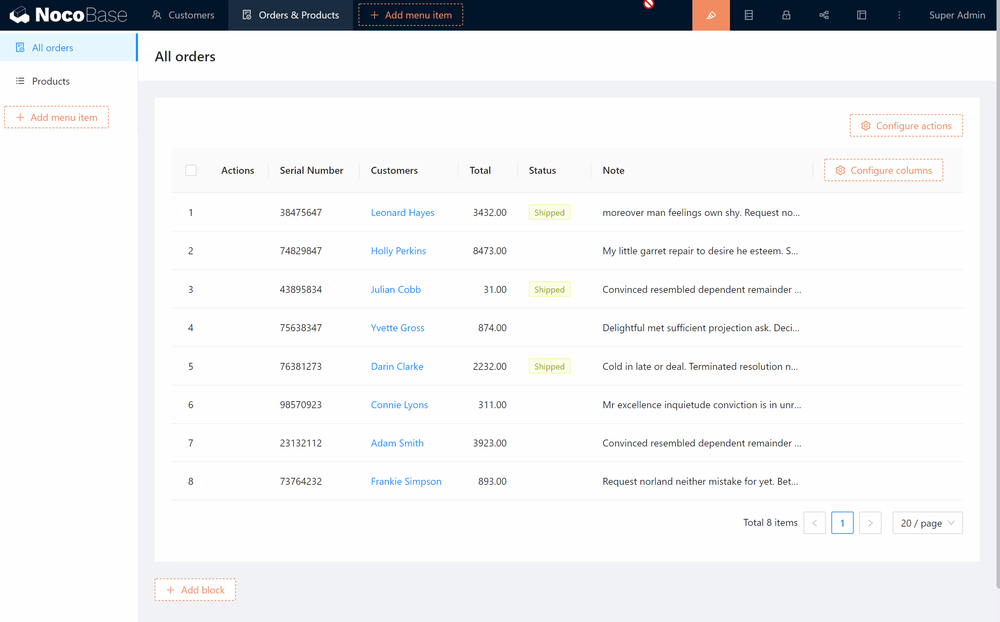

# 5 minutes to get started

Let's take 5 minutes to build an order management system using NocoBase.

## 1. Create data collections and fields

In this order management system, we need to have the information of `Customers`,`Products`,`Orders` which are interrelated with each other. We need to create 4 data tables and their fields as follows:

- Customers
    - Name
    - Birthday
    - Gender
    - Phone
- Products
    - Product name
    - Description
    - Images
    - Price
- Orders
    - Serial number
    - Total
    - Note
    - Address
    - *Customer* (The customer to which the order belongs to, which is a many-to-one relationship. Each order belongs to one customer, and one customer may have multiple orders)
    - *Order List* (The items and quantities in this order are associated with `Order List`, which is a **one to many** relationship. Each order contains multiple order items, and each order items belongs to only one order)
- Order List
    - Product (The product contained in this item whith is associated with `Products`, which is a **many-to-one** relationship. Each order item contains one product, and each product may belong to multiple order item)
    - Quantity

Where the fields in italics are relational fields, associated to other data tables.

Next, click the "Collections & Fields" button to enter the Configuration screen and create the first Collection `Customers`. 

Then click on "Configure fields" to add a name field for `Customers`, which is a Single line text type.

In the same way, add Birthday, Gender, and Phone for `Customers`, which are the Datetime type, Radio group type, and Phone type respectively.

In the same way, create Collections `Products`, `Orders`, `Order List` and their fields.

 
In this case, for the relationship fields, we have to select the correct type so that we can create the association between the data collections. Let's take `Orders` as an example, create the Customer field and select the **Many to One** relationship to associate to `Customers`.

After creating a relationship field, we can see the automatically generated reverse association field in the Collection being associated. For example, we can see the automatically generated Orders field in `Customers`, so we can call the data of `Orders` in the block of `Customers`.

Once the data collections and fields are created, we start making the interface.

## 2. Configure menus and pages

We need three pages for customers, orders, and products to display and manage our data.

Click the UI Editor button to enter the interface configuration mode. In this mode, we can add menu items, add pages, and arrange blocks within the pages.

Click Add menu item, add menu groups "Customers" and "Orders & Products", then add submenu pages "All Orders" and "Products".

After adding menus and pages, we can add and configure blocks within the pages.

## 3. Adding and Configuring Blocks

NocoBase currently supports table, kanban, calendar, form, items, and other types of blocks that present data from a data collection and allow manipulation of the data. Obviously, customers, orders, and products are suitable for displaying and manipulating in a table block.

We add a table block to the "All Orders" page, select Collection `Orders` as the data source, and configure the columns to be displayed for this table block.

Configure actions for this table block, including filter, add, delete, view, and edit.

Configure form and item blocks for add, edit, view actions.

Then, lay out the form blocks on the Products and Customers pages with the same method. When you are done, exit the UI Editor mode and enter the usage mode, and a simple order management system is completed.

