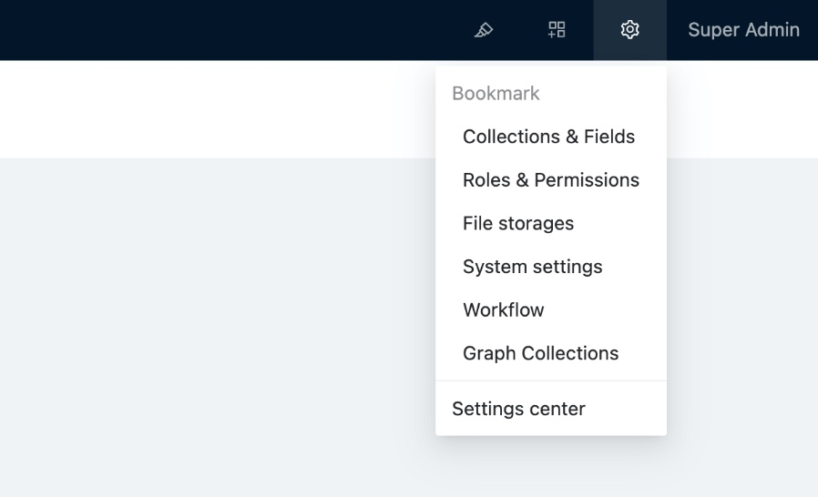

# v0.8：Plugin manager & docs

Starting with v0.8, NocoBase begins to provide an available plugin manager and development documentation. Here are the main changes in v0.8.

## Tweaks to the top right corner of the interface

- UI Editor
- Plugin Manager
- Plugin Settings Manager
- Personal Center



## The new plugin manager

v0.8 provides a powerful plugin manager for managing plugins in a no-code way.

### Plugin manager flow


### Plugin Manager interface

Currently it is mainly used for disabling, activating and deleting local plugins. Built-in plugins cannot be deleted.


### Plugin Manager command

In addition to being able to activate and disable plugins from the no-code interface, you can also manage plugins more completely from the command line.

```
# Create a plugin
yarn pm create hello
# Register the plugin
yarn pm add hello
# Activate the plugin
yarn pm enable hello
# Disable the plugin
yarn pm disable hello
# Remove the plugin
yarn pm remove hello

```

Note: Releases and upgrades for plugins will be supported in subsequent releases.

```
# Publish the plugin
yarn pm publish hello
# Publish the plugin
yarn pm upgrade hello

```

For more plugin examples, see [packages/samples](https://github.com/nocobase/nocobase/tree/main/packages/samples).

## Changes of plugin

### Plugin’s directory structure

```
|- /hello
  |- /src
    |- /client      # Plugin client
    |- /server      # Plugin server
  |- client.d.ts
  |- client.js
  |- package.json   # Plugin package information
  |- server.d.ts
  |- server.js

```

### Plugin’s name specification

NocoBase plugin is also an NPM package, the correspondence rule between plugin name and NPM package name is `${PLUGIN_PACKAGE_PREFIX}-${pluginName}`.

`PLUGIN_PACKAGE_PREFIX` is the plugin package prefix, which can be customized in .env, [click here for PLUGIN_PACKAGE_PREFIX description](https://www.notion.so/api/env#plugin_package_prefix).

For example, a project named `my-nocobase-app` adds the `hello` plugin with package name `@my-nocobase-app/plugin-hello`.

`PLUGIN_PACKAGE_PREFIX` is configured as follows.

```
PLUGIN_PACKAGE_PREFIX=@nocobase/plugin-,@nocobase/preset-,@my-nocobase-app/plugin-

```

The correspondence between plugin names and package names is

- `users` plugin package name is `@nocobase/plugin-users`
- `nocobase` plugin package name is `@nocobase/preset-nocobase`
- `hello` plugin package named `@my-nocobase-app/plugin-hello`

### Plugin’s lifecycle

v0.8 provides a more complete approach to the plugin lifecycle.

```
import { InstallOptions, Plugin } from '@nocobase/server';

export class HelloPlugin extends Plugin {
  afterAdd() {
    // After the plugin has been added via pm.add
  }

  beforeLoad() {
    // Before all plugins are loaded, generally used to register classes and event listeners
  }

  async load() {
    // Load configuration
  }

  async install(options?: InstallOptions) {
    // Install logic
  }

  async afterEnable() {
    // After activation
  }

  async afterDisable() {
    // After disable
  }

  async remove() {
    // Remove logic
  }
}

export default HelloPlugin;

```

### Front- and back-end entrance for plugins

The lifecycle of the plugin is controlled by the server

```
import { Application } from '@nocobase/server';

const app = new Application({
  // ...
});

class MyPlugin extends Plugin {
  afterAdd() {}
  beforeLoad() {}
  load() {}
  install() {}
  afterEnable() {}
  afterDisable() {}
  remove() {}
}

app.plugin(MyPlugin, { name: 'my-plugin' });

```

The client side of the plugin exists as Context.Provider (similar to Middleware on the server side)

```
import React from 'react';
import { Application } from '@nocobase/client';

const app = new Application({
  apiClient: {
    baseURL: process.env.API_BASE_URL,
  },
  dynamicImport: (name: string) => {
    return import(`../plugins/${name}`);
  },
});

// When you visit the /hello page, it displays Hello world!
const HelloProvider = React.memo((props) => {
  const location = useLocation();
  if (location.pathname === '/hello') {
    return <div>Hello world!</div>
  }
  return <>{props.children}</>
});
HelloProvider.displayName = 'HelloProvider'

app.use(HelloProvider);

```

## Custom business code

v0.7 plugins are not complete, custom business code may be scattered in `packages/app/client` and `packages/app/server`, which is not conducive to upgrade and maintenance. v0.8 recommends organizing as a plugin package and using `yarn pm` to manage plugins.

## More complete documentation is provided

- **Welcome**: a quick look at NocoBase
- **Manual**: learn more about the core features provided by the NocoBase platform
- **Plugin Development Tutorial**: Advanced dive into plugin development
- **API Reference**: Check the API usage during plugin development
- **Client Components Library** (in preparation): provides examples and usage of NocoBase components

## More plugin examples are provided

- [command](https://github.com/nocobase/nocobase/tree/develop/packages/samples/command)
- [custom-block](https://github.com/nocobase/nocobase/tree/develop/packages/samples/custom-block)
- [custom-page](https://github.com/nocobase/nocobase/tree/develop/packages/samples/custom-page)
- [custom-signup-page](https://github.com/nocobase/nocobase/tree/develop/packages/samples/custom-signup-page)
- [hello](https://github.com/nocobase/nocobase/tree/develop/packages/samples/hello)
- [ratelimit](https://github.com/nocobase/nocobase/tree/develop/packages/samples/ratelimit)
- [shop-actions](https://github.com/nocobase/nocobase/tree/develop/packages/samples/shop-actions)
- [shop-events](https://github.com/nocobase/nocobase/tree/develop/packages/samples/shop-events)
- [shop-i18n](https://github.com/nocobase/nocobase/tree/develop/packages/samples/shop-i18n)
- [shop-modeling](https://github.com/nocobase/nocobase/tree/develop/packages/samples/shop-modeling)

## Other new features and functionality

- Import from Excel
- Bulk Update & Edit
- Graphical collection
- Workflow support for viewing execution history
- JSON field
