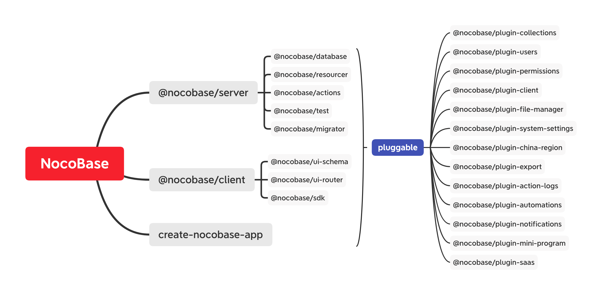

# 微内核架构

NocoBase 采用微内核架构，各类功能以插件形式扩展，所以微内核架构也叫插件化架构，由内核和插件两部分组成。内核提供了最小功能的 WEB 服务器，还提供了各种插件化接口；插件是按功能划分的各种独立模块，通过接口适配，具有可插拔的特点。插件化的设计降低了模块之间的耦合度，提高了复用率。随着插件库的不断扩充，常见的场景只需要组合插件即可完成基础搭建，这种设计理念非常适合无代码平台。
