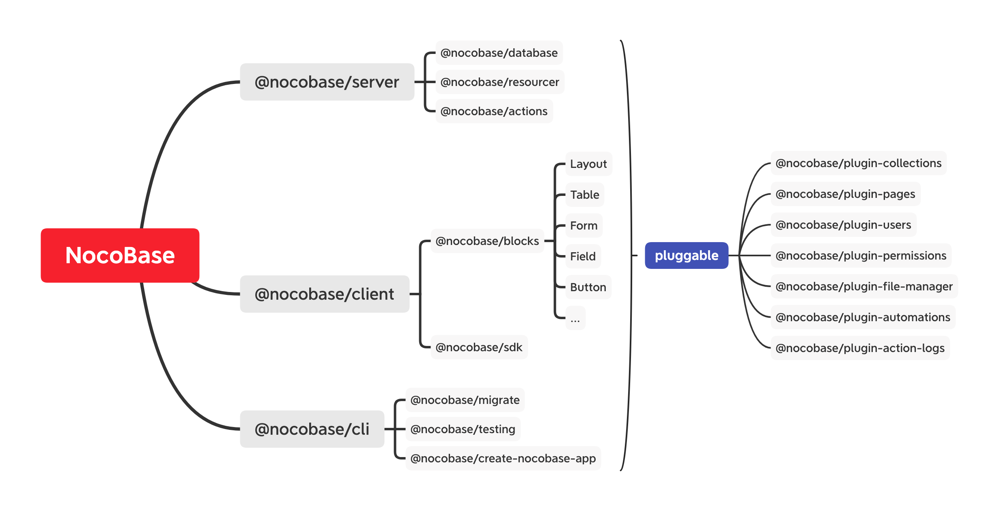

## NocoBase 是什么？

NocoBase 是一个开源免费的无代码、低代码开发平台。 无论是不懂编程的业务主管，还是精通编程的开发人员，都可以快速搭建各类定制化、私有部署的协作平台、管理系统。

## 架构

### 微内核

NocoBase 采用微内核架构，框架只保留核心的概念，具体各类功能都以插件的形式扩展。各个包可以拆出来单独或组合使用，可用于现有项目中，这也是渐进式框架的意义所在。除此之外，我们也非常注重与现有技术框架融合，做连接现有生态的桥梁，而不是闭门造车。

### 插件化

所有的功能需求都通过插件形式扩展，除了现有的几个核心插件以外，开发者还可以自由的扩展，包括但不局限于：

- Collection - 数据
- Relationship - 相关数据
- Field - 字段
- Model - 模型
- Hook - 触发事件
- Resource - 资源
- Action - 操作方法
- Middleware - 中间件
- Block - 区块
- Page - 页面

### 配置化驱动

配置化是常见的无代码/低代码技术方案，NocoBase 也是基于配置驱动的，为了方便各类配置需求，配置有三类写法：

- 直接写在代码里，多用于处理动态配置
- 保存在文件里，多用于系统表配置或纯开发配置
- 保存在数据表里，多用于业务表配置

## 核心点在哪里？

NocoBase 本质上是对数据的信息化处理，包括三点核心：

- 数据的存储 —— 结构和关系
- 数据的行为 —— 方法和事件
- 数据的形态 —— 页面和区块
