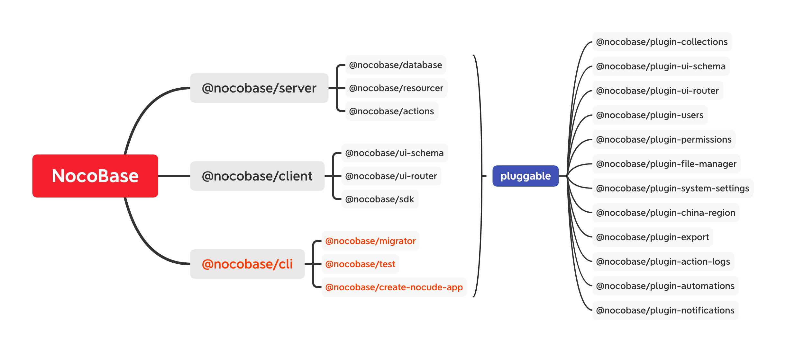

## NocoBase 是什么？

NocoBase 是一个开源免费的无代码、低代码开发平台。 无论是不懂编程的业务主管，还是精通编程的开发人员，都可以快速搭建各类定制化、私有部署的协作平台、管理系统。

## 架构

### 微内核

NocoBase 采用微内核架构，框架只保留核心的概念，具体各类功能都以插件的形式扩展。各个包可以拆出来单独或组合使用，也可用于现有项目中。

### 插件化

所有的功能需求都通过插件形式扩展，除了现有的几个核心插件以外，开发者还可以自由的扩展，包括但不局限于：

- Collection - 数据表
  - CollectionField - 字段
    - DataType - 存储类型
    - UI Schema/Component - 组件
    - Template - 模板
  - Model/Repository - 模型
  - Schema Builder - 构造器
- Resource/Service - 资源/服务
  - Action - 方法
  - Hook/Event - 事件
  - Middleware - 中间件
    - Resource Middleware
    - Action Middleware
- UI
  - UI Schema/Component - 前端组件
  - Router - 前端路由

### 配置化

配置化驱动，为了方便各场景配置需求，配置有三种写法：

- 直接写在代码里，多用于处理动态配置
- 保存在文件里，多用于系统表配置或纯开发配置
- 保存在数据表里，多用于业务表配置
