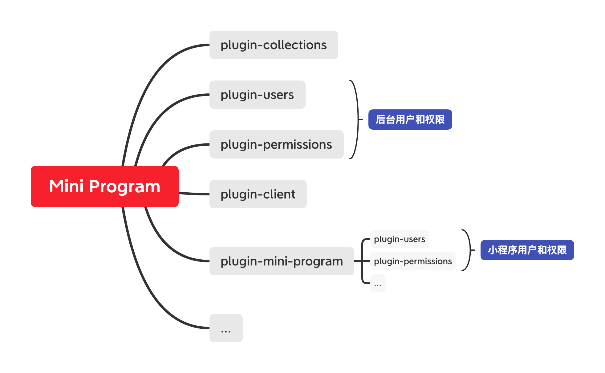

# Server-side Kernel

## 微服务 - Microservices

为了更快的理解 NocoBase，我们先创建一个应用，新建一个 app.js 文件，代码如下：

```ts
const { Application } = require('@nocobase/server');

const app = new Application({
  // 省略配置信息
});

// 配置一张 users 表
app.collection({
  name: 'users',
  fields: [
    { type: 'string', name: 'username' },
    { type: 'password', name: 'password' }
  ],
});

// 解析 argv 参数，终端通过命令行进行不同操作
app.parse(process.argv);
```

终端运行

```bash
# 根据配置生成数据库表结构
node app.js db:sync
# 启动应用
node app.js start --port=3000
```

相关 users 表的 REST API 就生成了

```bash
GET     http://localhost:3000/api/users
POST    http://localhost:3000/api/users
GET     http://localhost:3000/api/users/1
PUT     http://localhost:3000/api/users/1
DELETE  http://localhost:3000/api/users/1
```

以上示例，只用了 10 行左右的代码就创建了真实可用的 REST API 服务。除了内置的 REST API 以外，还可以通过 `app.actions()` 自定义其他操作，如登录、注册、注销等。

```ts
app.actions({
  async login(ctx, next) {},
  async register(ctx, next) {},
  async logout(ctx, next) {},
}, {
  resourceName: 'users', // 属于 users 资源
});
```

以上自定义操作的 HTTP API 为：

```bash
POST    http://localhost:3000/api/users:login
POST    http://localhost:3000/api/users:register
POST    http://localhost:3000/api/users:logout
```

自定义的 HTTP API 依旧保持 REST API 的风格，以 `<resourceName>:<actionName>` 格式表示。实际上 REST API 也可以显式指定 `actionName`，当指定了 `actionName`，无所谓使用什么请求方法，如：

```bash
# 更新操作
PUT     http://localhost:3000/api/users/1
# 等同于
POST    http://localhost:3000/api/users:update/1

# 删除操作
DELETE  http://localhost:3000/api/users/1
# 等同于
GET     http://localhost:3000/api/users:destroy/1
# 等同于
POST    http://localhost:3000/api/users:destroy/1
```

NocoBase 的路由（Resourcer）基于资源（Resource）和操作（Action）设计，将 REST 和 RPC 结合起来，提供更为灵活且统一的 Resource Action API。结合客户端 SDK 是这样的：

```ts
const { ClientSDK } = require('@nocobase/sdk');

const api = new ClientSDK({
  // 可以适配不同 request
  request(params) => Promise.resolve({}),
});

await api.resource('users').list();
await api.resource('users').create();
await api.resource('users').get();
await api.resource('users').update();
await api.resource('users').destroy();
await api.resource('users').login();
await api.resource('users').register();
await api.resource('users').logout();
```

## 应用 - Application

NocoBase 的 Application 继承了 Koa，集成了 DB 和 CLI，添加了一些必要的 API，这里列一些重点：

- `app.db`：数据库实例，每个 app 都有自己的 db。
    - `db.getCollection()` 数据表/数据集
      - `collection.repository` 数据仓库
      - `collection.model` 数据模型
  - `db.on()` 添加事件监听，由 EventEmitter 提供
  - `db.emit()` 触发事件，由 EventEmitter 提供
  - `db.emitAsync()` 触发异步事件
- `app.cli`，Commander 实例，提供命令行操作
- `app.context`，上下文
  - `ctx.db`
  - `ctx.action` 当前资源操作实例
    - `action.params` 操作参数
    - `action.mergeParams()` 参数合并方法
- `app.constructor()` 初始化
- `app.collection()` 定义数据 Schema，等同于 `app.db.collection()`
- `app.resource()` 定义资源
- `app.actions()` 定义资源的操作方法
- `app.on()` 添加事件监听，由 EventEmitter 提供
- `app.emit()` 触发事件，由 EventEmitter 提供
- `app.emitAsync()` 触发异步事件
- `app.use()` 添加中间件，由 Koa 提供
- `app.command()` 自定义命令行，等同于 `app.cli.command()`
- `app.plugin()` 添加插件
- `app.load()` 载入配置，主要用于载入插件
- `app.parse()` 解析 argv 参数，写在最后，等同于 `app.cli.parseAsync()`

## 数据集 - Collection

NocoBase 通过 `app.collection()` 方法定义数据的 Schema，Schema 的类型包括：

属性 Attribute

- Boolean 布尔型
- String 字符串
- Text 长文本
- Integer 整数型
- Float 浮点型
- Decimal 货币
- Json/Jsonb/Array 不同数据库的 JSON 类型不一致，存在兼容性问题
- Time 时间
- Date 日期
- Virtual 虚拟字段
- Reference 引用
- Formula 计算公式
- Context 上下文
- Password 密码
- Sort 排序

关系 Association/Realtion

- HasOne 一对一
- HasMany 一对多
- BelongsTo 多对一
- BelongsToMany 多对多
- Polymorphic 多态

比如一个微型博客的表结构可以这样设计：

```ts
// 用户
app.collection({
  name: 'users',
  fields: {
    username: { type: 'string', unique: true },
    password: { type: 'password', unique: true },
    posts:    { type: 'hasMany' },
  },
});

// 文章
app.collection({
  name: 'posts',
  fields: {
    title:    'string',
    content:  'text',
    tags:     'belongsToMany',
    comments: 'hasMany',
    author:   { type: 'belongsTo', target: 'users' },
  },
});

// 标签
app.collection({
  name: 'tags',
  fields: [
    { type: 'string', name: 'name' },
    { type: 'belongsToMany', name: 'posts' },
  ],
});

// 评论
app.collection({
  name: 'comments',
  fields: [
    { type: 'text', name: 'content' },
    { type: 'belongsTo', name: 'user' },
  ],
});
```

除了通过 `app.collection()` 配置 schema，也可以直接调用 api 插入或修改 schema，collection 的核心 API 有：

- `collection` 当前 collection 的数据结构
  - `collection.hasField()` 判断字段是否存在
  - `collection.addField()` 添加字段配置
  - `collection.getField()` 获取字段配置
  - `collection.removeField()` 移除字段配置
  - `collection.sync()` 与数据库表结构同步
- `collection.repository` 当前 collection 的数据仓库
  - `repository.findMany()`
  - `repository.findOne()`
  - `repository.create()`
  - `repository.update()`
  - `repository.destroy()`
  - `repository.relatedQuery().for()`
    - `create()`
    - `update()`
    - `destroy()`
    - `findMany()`
    - `findOne()`
    - `set()`
    - `add()`
    - `remove()`
    - `toggle()`
- `collection.model` 当前 collection 的数据模型

Collection 示例：

```ts
const collection = app.db.getCollection('posts');

collection.hasField('title');

collection.getField('title');

// 添加或更新
collection.addField({
  type: 'string',
  name: 'content',
});

// 移除
collection.removeField('content');

// 添加、或指定 key path 替换
collection.mergeField({
  name: 'content',
  type: 'string',
});

除了全局的 `db.sync()`，也有 `collection.sync()` 方法。

await collection.sync();
```

`db:sync` 是非常常用的命令行之一，数据库根据 collection 的 schema 生成表结构。更多详情见 CLI 章节。`db:sync` 之后，就可以往表里写入数据了，可以使用 Repository 或 Model 操作。

- Repository 初步提供了 findAll、findOne、create、update、destroy 核心操作方法。
- Model 为 Sequelize.Model，详细使用说明可以查看 Sequelize 文档。
- Model 取决于适配的 ORM，Repository 基于 Model 提供统一的接口。

通过 Repository 创建数据

```ts
const User = app.db.getCollection('users');

const user = await User.repository.create({
  title: 't1',
  content: 'c1',
  author: 1,
  tags: [1,2,3],
}, {
  whitelist: [],
  blacklist: [],
});

await User.repository.findMany({
  filter: {
    title: 't1',
  },
  fields: ['id', 'title', 'content'],
  sort: '-created_at',
  page: 1,
  perPage: 20,
});

await User.repository.findOne({
  filter: {
    title: 't1',
  },
  fields: ['id', 'title', 'content'],
  sort: '-created_at',
  page: 1,
  perPage: 20,
});

await User.repository.update({
  title: 't1',
  content: 'c1',
  author: 1,
  tags: [1,2,3],
}, {
  filter: {},
  whitelist: [],
  blacklist: [],
});

await User.repository.destroy({
  filter: {},
});
```

通过 Model 创建数据

```ts
const User = db.getCollection('users');
const user = await User.model.create({
  title: 't1',
  content: 'c1',
});
```

## 资源 & 操作 - Resource & Action

Resource 是互联网资源，互联网资源都对应一个地址。客户端请求资源地址，服务器响应请求，在这里「请求」就是一种「操作」，在 REST 里通过判断请求方法（GET/POST/PUT/DELETE）来识别具体的操作，但是请求方法局限性比较大，如上文提到的登录、注册、注销就无法用 REST API 的方式表示。为了解决这类问题，NocoBase 以 `<resourceName>:<actionName>` 格式表示资源的操作。在关系模型的世界里，关系无处不在，基于关系，NocoBase 又延伸了关系资源的概念，对应关系资源的操作的格式为 `<associatedName>.<resourceName>:<actionName>`。

Collection 会自动同步给 Resource，如上文 Collection 章节定义的 Schema，可以提炼的资源有：

- `users`
- `users.posts`
- `posts`
- `posts.tags`
- `posts.comments`
- `posts.author`
- `tags`
- `tags.posts`
- `comments`
- `comments.user`

<Alert title="Collection 和 Resource 的关系与区别" type="warning">

- Collection 定义数据的 schema（结构和关系）
- Resource 定义数据的 action（操作方法）
- Resource 请求和响应的数据结构由 Collection 定义
- Collection 默认自动同步给 Resource
- Resource 的概念更大，除了对接 Collection 以外，也可以对接外部数据或其他自定义

</Alert>

资源相关 API 有：

- `app.resource()`
- `app.actions()`
- `ctx.action`

一个资源可以有多个操作。

```ts
// 数据类
app.resource({
  name: 'users',
  actions: {
    async list(ctx, next) {},
    async get(ctx, next) {},
    async create(ctx, next) {},
    async update(ctx, next) {},
    async destroy(ctx, next) {},
  },
});

// 非数据类
app.resource({
  name: 'server',
  actions: {
    // 获取服务器时间
    getTime(ctx, next) {},
    // 健康检测
    healthCheck(ctx, next) {},
  },
});
```

常规操作可以用于不同资源

```ts
app.actions({
  async list(ctx, next) {},
  async get(ctx, next) {},
  async create(ctx, next) {},
  async update(ctx, next) {},
  async destroy(ctx, next) {},
}, {
  // 不指定 resourceName 时，全局共享
  resourceNames: ['posts', 'comments', 'users'],
});
```

在资源内部定义的 action 不会共享，常规类似增删改查的操作建议设置为全局，`app.resource()` 只设置参数，如：

```ts
app.resource({
  name: 'users',
  actions: {
    list: {
      fields: ['id', 'username'], // 只输出 id 和 username 字段
      filter: {
        'username.$ne': 'admin', // 数据范围筛选过滤 username != admin
      },
      sort: ['-created_at'], // 创建时间倒序
      perPage: 50,
    },
    get: {
      fields: ['id', 'username'], // 只输出 id 和 username 字段
      filter: {
        'username.$ne': 'admin', // 数据范围筛选过滤 username != admin
      },
    },
    create: {
      fields: ['username'], // 白名单
    },
    update: {
      fields: ['username'], // 白名单
    },
    destroy: {
      filter: { // 不能删除 admin
        'username.$ne': 'admin',
      },
    },
  },
});

// app 默认已经内置了 list, get, create, update, destroy 操作
app.actions({
  async list(ctx, next) {},
  async get(ctx, next) {},
  async create(ctx, next) {},
  async update(ctx, next) {},
  async destroy(ctx, next) {},
});
```

在 Middleware Handler 和 Action Handler 里，都可以通过 `ctx.action` 获取到当前 action 实例，提供了两个非常有用的 API：

- `ctx.action.params`：获取操作对应的参数
- `ctx.action.mergeParams()`：处理多来源参数合并

`ctx.action.params` 有：

- 定位资源和操作
  - `actionName`
  - `resourceName`
  - `associatedName`
- 定位资源 ID
  - `resourceId`
  - `associatedId`
- request query
  - `filter`
  - `fields`
  - `sort`
  - `page`
  - `perPage`
  - 其他 query 值
- request body
  - `values`

示例：

```ts
async function (ctx, next) {
  const { resourceName, resourceId, filter, fields } = ctx.action.params;
  // ...
}
```

`ctx.action.mergeParams()` 主要用于多来源参数合并，以 `filter` 参数为例。如：客户端请求日期 2021-09-15 创建的文章

```bash
GET /api/posts:list?filter={"created_at": "2021-09-15"}
```

资源设置锁定只能查看已发布的文章

```ts
app.resource({
  name: 'posts',
  actions: {
    list: {
      filter: { status: 'publish' }, // 只能查看已发布文章
    },
  },
})
```

权限设定，只能查看自己创建的文章

```ts
app.use(async (ctx, next) => {
  const { resourceName, actionName } = ctx.action.params;
  if (resourceName === 'posts' && actionName === 'list') {
    ctx.action.mergeParams({
      filter: {
        created_by_id: ctx.state.currentUser.id,
      },
    });
  }
  await next();
});
```

以上客户端、资源配置、中间件内我们都指定了 filter 参数，三个来源的参数最终会合并在一起作为最终的过滤条件：

```ts
async function list(ctx, next) {
  // list 操作中获取到的 filter
  console.log(ctx.params.filter);
  // filter 是特殊的 and 合并
  // {
  //   and: [
  //     { created_at: '2021-09-15' },
  //     { status: 'publish' },
  //     { created_by_id: 1, }
  //   ]
  // }
}
```

## 事件 - Event

在操作执行前、后都放置了相关事件监听器，可以通过 `app.db.on()` 和 `app.on()` 添加。区别在于：

- `app.db.on()` 添加数据库层面的监听器
- `app.on()` 添加服务器应用层面的监听器

以 `users:login` 为例，在数据库里为「查询」操作，在应用里为「登录」操作。也就是说，如果需要记录登录操作日志，要在 `app.on()` 里处理。

```ts
// 创建数据时，执行 User.create() 时触发
app.db.on('users.beforeCreate', async (model) => {});

// 客户端 `POST /api/users:login` 时触发
app.on('users.beforeLogin', async (ctx, next) => {});

// 客户端 `POST /api/users` 时触发
app.on('users.beforeCreate', async (ctx, next) => {});
```

## 中间件 - Middleware

Server Application 基于 Koa，所有 Koa 的插件（中间件）都可以直接使用，可以通过 `app.use()` 添加。如：

```ts
const responseTime = require('koa-response-time');
app.use(responseTime());

app.use(async (ctx, next) => {
  await next();
});
```

与 `koa.use(middleware)` 略有不同，`app.use(middleware, options)` 多了个 options 参数，可以用于限定 resource 和 action，也可以用于控制中间件的插入位置。

```ts
import { middleware } from '@nocobase/server';

app.use(async (ctx, next) => {}, {
  name: 'middlewareName1',
  resourceNames: [], // 作用于资源内所有 actions
  actionNames: [
    'list', // 全部 list action
    'users:list', // 仅 users 资源的 list action,
  ],
  insertBefore: '',
  insertAfter: '',
});
```

## 命令行 - CLI

Application 除了可以做 HTTP Server 以外，也是 CLI（内置了 Commander）。目前内置的命令有：

- `init` 初始化
- `db:sync --force` 用于配置与数据库表结构同步
- `start --port` 启动应用
- `plugin:**` 插件相关

自定义：

```ts
app.command('foo').action(async () => {
  console.log('foo...');
});
```

## 插件 - Plugin

上文，讲述了核心的扩展接口，包括但不局限于：

- Database/Collection
  - `app.db` database 实例
  - `app.collection()` 等同于 `app.db.collection()`
- Resource/Action
  - `app.resource()` 等同于 `app.resourcer.define()`
  - `app.actions()` 等同于 `app.resourcer.registerActions()`
- Hook/Event
  - `app.on()` 添加服务器监听器
  - `app.db.on()` 添加数据库监听器
- Middleware
  - `app.use()` 添加中间件
- CLI
  - `app.cli` commander 实例
  - `app.command()` 等同于 `app.cli.command()`

基于以上扩展接口，进一步提供了模块化、可插拔的插件，可以通过 `app.plugin()` 添加。插件的流程包括安装、升级、激活、载入、禁用、卸载，不需要的流程可缺失。如：

**最简单的插件**

```ts
app.plugin(function pluginName1() {

});
```

这种方式添加的插件会直接载入，无需安装。

**JSON 风格**

```ts
const plugin = app.plugin({
  enable: false, // 默认为 true，不需要启用时可以禁用。
  name: 'plugin-name1',
  displayName: '插件名称',
  version: '1.2.3',
  dependencies: {
    pluginName2: '1.x', 
    pluginName3: '1.x',
  },
  async install() {},
  async upgrade() {},
  async activate() {},
  async bootstrap() {},
  async deactivate() {},
  async unstall() {},
});
// 通过 api 激活插件
plugin.activate();
```

**OOP 风格**

```ts
class MyPlugin extends Plugin {
  async install() {}
  async upgrade() {}
  async bootstrap() {}
  async activate() {}
  async deactivate() {}
  async unstall() {}
}

app.plugin(MyPlugin);
// 或
app.plugin({
  name: 'plugin-name1',
  displayName: '插件名称',
  version: '1.2.3',
  dependencies: {
    pluginName2: '1.x', 
    pluginName3: '1.x',
  },
  plugin: MyPlugin,
});
```

**引用独立的 Package**

```ts
app.plugin('@nocobase/plugin-action-logs');
```

插件信息也可以直接写在 `package.json` 里

```js
{
  name: 'pluginName1',
  displayName: '插件名称',
  version: '1.2.3',
  dependencies: {
    pluginName2: '1.x', 
    pluginName3: '1.x',
  },
}
```

**插件 CLI**

```bash
plugin:install pluginName1
plugin:unstall pluginName1
plugin:activate pluginName1
plugin:deactivate pluginName1
```

目前已有的插件：

- @nocobase/plugin-collections 提供数据表配置接口，可通过 HTTP API 管理数据表。
- @nocobase/plugin-action-logs 操作日志
- @nocobase/plugin-automations 自动化（未升级 v0.5，暂不能使用）
- @nocobase/plugin-china-region 中国行政区
- @nocobase/plugin-client 提供客户端，无代码的可视化配置界面，需要与 @nocobase/client 配合使用
- @nocobase/plugin-export 导出
- @nocobase/plugin-file-manager 文件管理器
- @nocobase/plugin-permissions 角色和权限
- @nocobase/plugin-system-settings 系统配置
- @nocobase/plugin-ui-router 前端路由配置
- @nocobase/plugin-ui-schema ui 配置
- @nocobase/plugin-users 用户模块

## 测试 - Testing

有代码就需要测试，@nocobase/test 提供了 mockDatabase 和 mockServer 用于数据库和服务器的测试，如：

```ts
import { mockServer, MockServer } from '@nocobase/test';

describe('mock server', () => {
  let api: MockServer;

  beforeEach(() => {
    api = mockServer({
      dataWrapping: false,
    });
    api.actions({
      list: async (ctx, next) => {
        ctx.body = [1, 2];
        await next();
      },
    });
    api.resource({
      name: 'test',
    });
  });

  afterEach(async () => {
    return api.destroy();
  });

  it('agent.get', async () => {
    const response = await api.agent().get('/test');
    expect(response.body).toEqual([1, 2]);
  });

  it('agent.resource', async () => {
    const response = await api.agent().resource('test').list();
    expect(response.body).toEqual([1, 2]);
  });
});
```

## 客户端 - Client

为了让更多非开发人员也能参与进来，NocoBase 提供了配套的客户端插件 —— 无代码的可视化配置界面。客户端插件需要与 @nocobase/client 配合使用，可以直接使用，也可以自行改造。

插件配置

```ts
app.plugin('@nocobase/plugin-client', {
  // 自定义 dist 路径
  dist: path.resolve(__dirname, './node_modules/@nocobase/client/app'),
});
```

为了满足各类场景需求，客户端 `@nocobase/client` 提供了丰富的基础组件：

- Action - 操作
  - Action.Window 当前浏览器窗口/标签里打开
  - Action.Drawer 打开抽屉（默认右侧划出）
  - Action.Modal 打开对话框
  - Action.Dropdown 下拉菜单
  - Action.Popover 气泡卡片
  - Action.Group 按钮分组
  - Action.Bar 操作栏
- AddNew 「添加」模块
  - AddNew.CardItem -  添加区块
  - AddNew.PaneItem - 添加区块（查看面板，与当前查看的数据相关）
  - AddNew.FormItem -  添加字段
- BlockItem/CardItem/FormItem - 装饰器
  - BlockItem - 普通装饰器（无包装效果）
  - CardItem - 卡片装饰器
  - FormItem - 字段装饰器
- Calendar - 日历
- Cascader - 级联选择
- Chart - 图表
- Checkbox - 勾选
- Checkbox.Group - 多选框
- Collection - 数据表配置
- Collection.Field - 数据表字段
- ColorSelect - 颜色选择器
- DatePicker - 日期选择器
- DesignableBar - 配置工具栏
- Filter - 筛选器
- Form - 表单
- Grid - 栅格布局
- IconPicker - 图标选择器
- Input - 输入框
- Input.TextArea - 多行输入框
- InputNumber - 数字框
- Kanban - 看板
- ListPicker - 列表选择器（用于选择、展示关联数据）
- Markdown 编辑器
- Menu - 菜单
- Password - 密码
- Radio - 单选框
- Select - 选择器
- Table - 表格
- Tabs - 标签页
- TimePicker - 时间选择器
- Upload - 上传

可以自行扩展组件，以上组件基于 Formily 构建，怎么自定义组件大家查看相关组件源码或 Formily 文档，这里说点不一样的。

- 如何扩展数据库字段？
- 如何将第三方区块添加到 AddNew 模块中？
- 如何在操作栏里添加更多的内置操作？
- 如何自定义配置工具栏？

除了组件具备灵活的扩展以外，客户端也可以在任意前端框架中使用，可以自定义 Request 和 Router，如：

<pre lang="tsx">
import React from 'react';
import { MemoryRouter } from 'react-router-dom';
import { ClientSDK, Application } from '@nocobase/client';

// 初始化 client 实例
const client = new ClientSDK({
  request: (options) => Promise.resolve({}),
});

// 适配 Route Component
const RouteSwitch = createRouteSwitch({
  components: {
    AdminLayout,
    AuthLayout,
    RouteSchemaRenderer,
  },
});

ReactDOM.render(
  <ClientProvider client={client}>
    <MemoryRouter initialEntries={['/admin']}>
      <RouteSwitch routes={[]}/>
    </MemoryRouter>
  </ClientProvider>,
  document.getElementById('root'),
);
</pre>

更多细节，可以通过 `create-nocobase-app` 初始化项目脚手架并体验。

```bash
yarn create nocobase-app my-nocobase-project
```

nocobase-app 默认使用 umijs 作为项目构建工具，并集成了 Server 作数据接口，初始化的目录结构如下：

```bash
|- src
  |- pages
  |- apis
|- .env
|- .umirc.ts
|- package.json
```

## 场景 - Cases

小型管理信息系统，具备完整的前后端。


API 服务，无客户端，提供纯后端接口。


小程序 + 后台管理，只需要一套数据库，但有两套用户和权限，一套用于后台用户，一套用于小程序用户。



SaaS 服务（共享用户），每个应用有自己配套的数据库，各应用数据完全隔离。应用不需要用户和权限模块，SaaS 主站全局共享了。


SaaS 服务（独立用户），每个应用有自己的独立用户模块和权限，应用可以绑定自己的域名。


