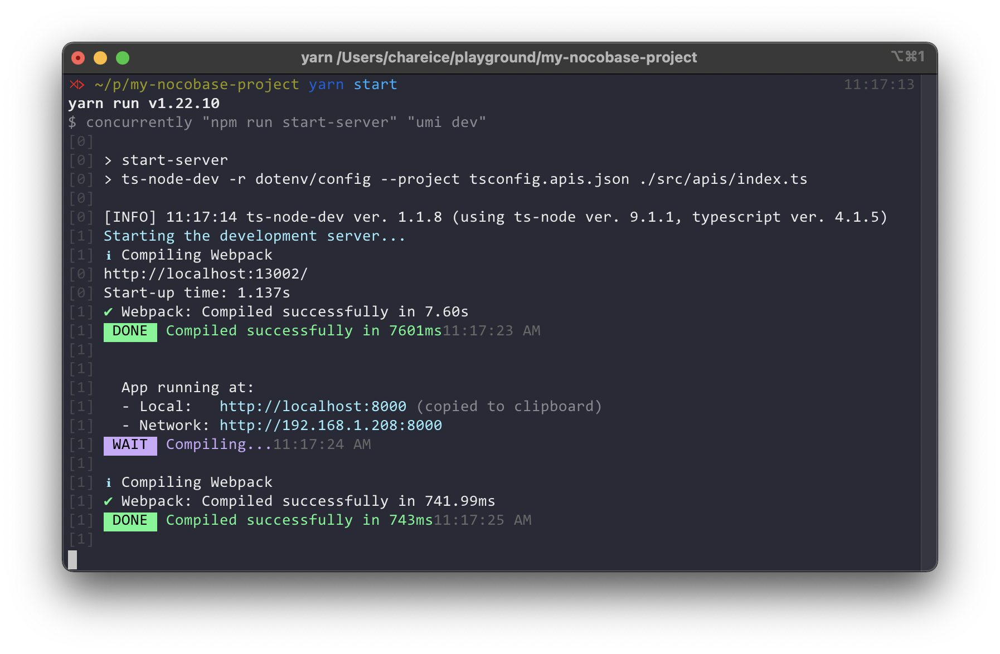
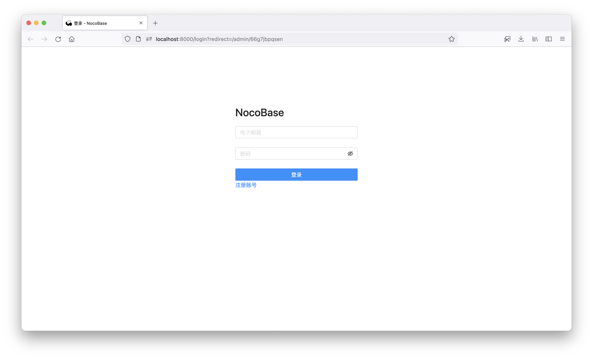

# 快速起步

## 创建新的 Nocobase 项目


### 步骤一：运行安装脚本


```shell
yarn create nocobase-app my-nocobase-project --quickstart
```

> 若安装时遇到网络问题，请使用[淘宝 NPM 镜像](https://npmmirror.com/)  

```shell
yarn config set registry https://registry.npm.taobao.org/
```



### 步骤二：打开系统


安装脚本执行完毕之后，系统将自行启动。


使用浏览器打开 http://localhost:8000 进入系统登录页面，初始登录用户名为 `admin@nocobase.com`，密码为 `admin`。



## 构建内容


快速启动程序创建了一个包含演示数据的 Nocobase 项目，你可以随意浏览。


我们接下来将会使用数据表配置功能创建数据库结构，之后在界面上配置区块，演示如何使用 Nocobase 管理你的数据，最后我们使用 Nocobase 提供的 Restful API 进行数据操作。


> 若你的服务未运行，可以在终端执行命令来启动它。
>  

```bash
cd my-nocobase-app && yarn start
```
