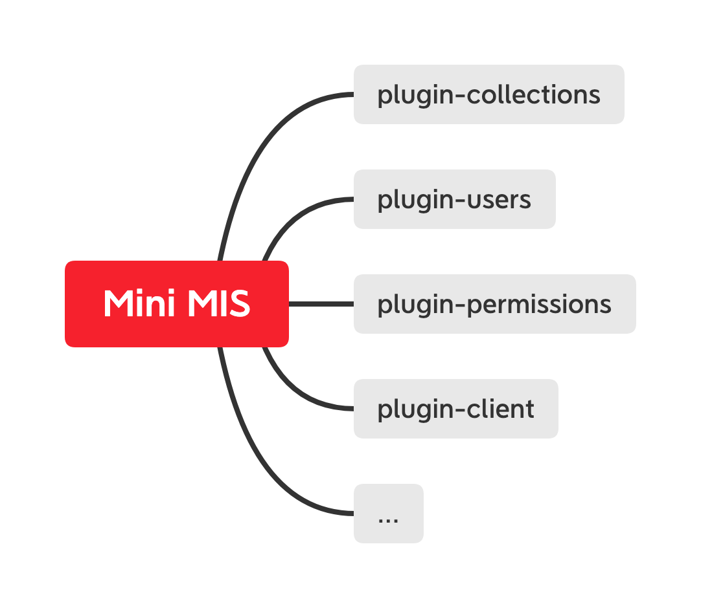
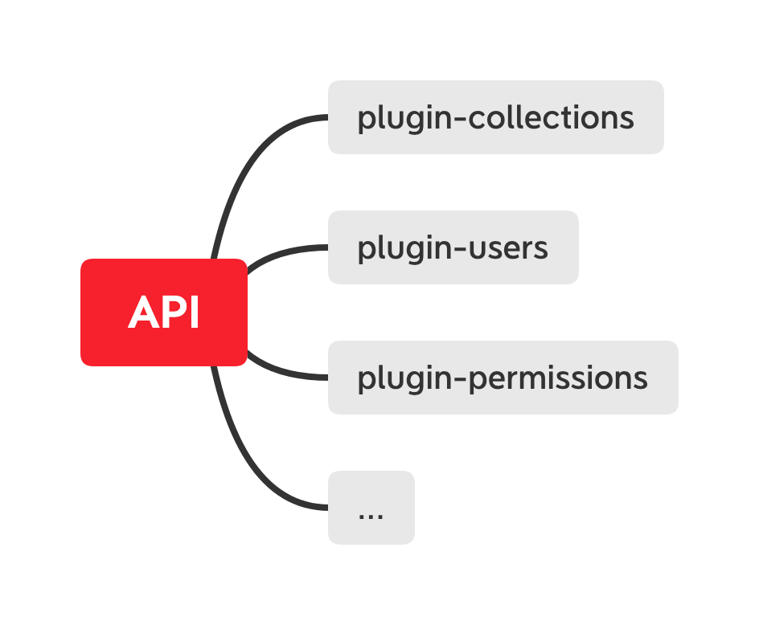
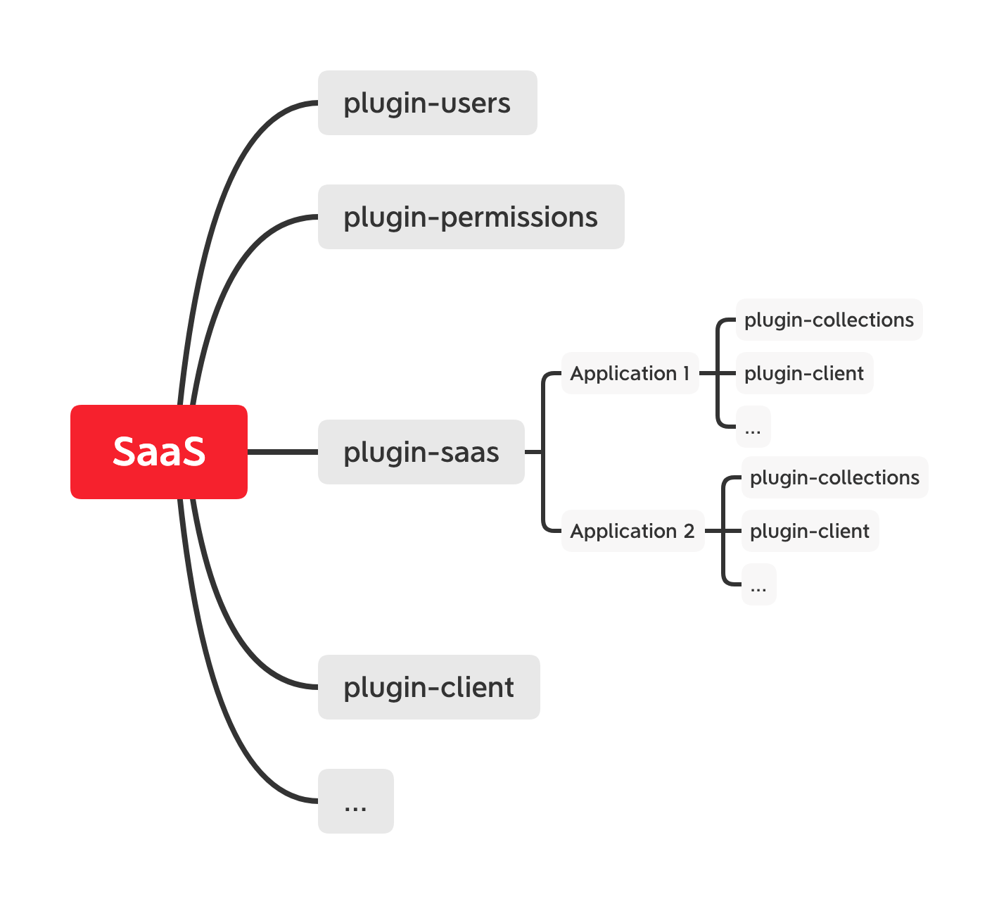
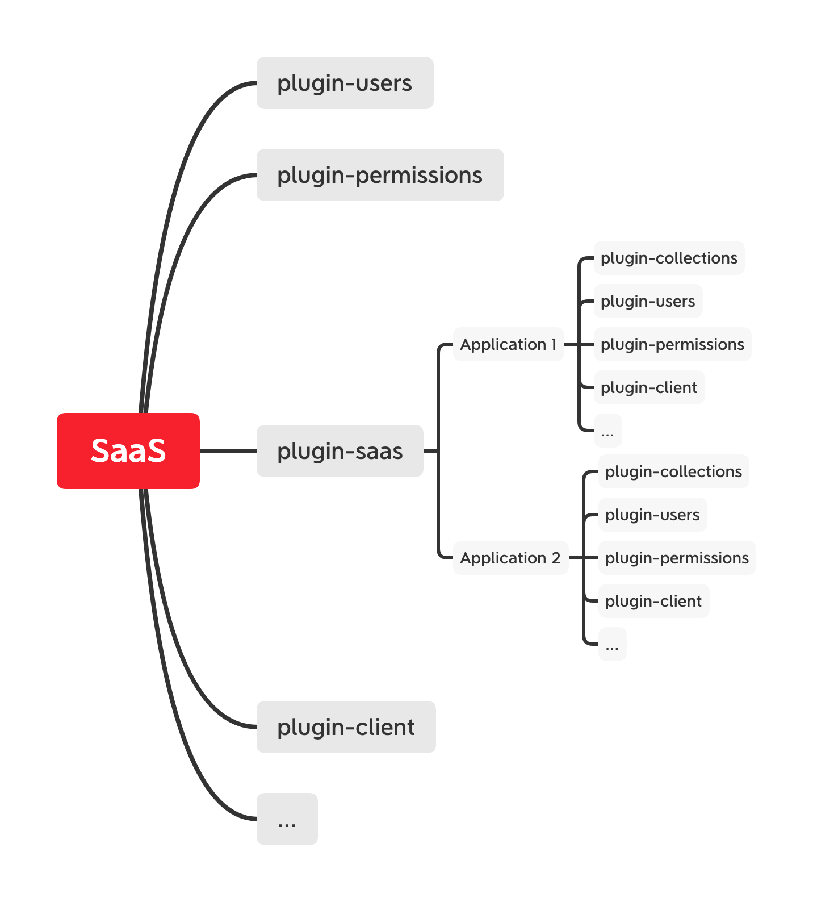

# NocoBase

考虑到大家是初次接触 NocoBase，开发文档的第一篇，从宏观的角度，带大家了解 NocoBase 的基础概念。NocoBase 采用微内核架构，框架只保留核心，各类功能以插件形式扩展。


## 微服务 - Microservices

首先我们创建一个应用，新建一个 app.js 文件，代码如下：

```ts
const { Application } = require('@nocobase/server');

const app = new Application();

app.collection({
  name: 'users',
  fields: [
    { type: 'string', name: 'username' },
    { type: 'password', name: 'password' },
  ],
});

app.start(process.argv);
```

终端运行

```bash
# 根据配置生成数据库表结构
node app.js db sync
# 启动应用
node app.js start --port=3000
```

相关 users 表的 REST API 就生成了

```bash
GET     http://localhost:3000/api/users
POST    http://localhost:3000/api/users
GET     http://localhost:3000/api/users/1
PUT     http://localhost:3000/api/users/1
DELETE  http://localhost:3000/api/users/1
```

除了内置的 REST API 以外，还可以自定义其他操作，如登录、注册、注销等。

```ts
app.registerActions({
  async login(ctx, next) {},
  async register(ctx, next) {},
  async logout(ctx, next) {},
}, {
  resourceName: 'users',
});
```

以上操作的 HTTP API 为：

```bash
POST    http://localhost:3000/api/users:login
POST    http://localhost:3000/api/users:register
POST    http://localhost:3000/api/users:logout
```

自定义的 HTTP API 依旧保持 REST API 的风格，以 `<resourceName>:<actionName>` 格式表示。REST API 也可以显式指定 actionName，当指定了 actionName 时，无所谓使用什么 Request Method，如：

```bash
GET     http://localhost:3000/api/users:list
POST    http://localhost:3000/api/users:create
GET     http://localhost:3000/api/users:get/1
POST    http://localhost:3000/api/users:update/1
POST    http://localhost:3000/api/users:destroy/1
```

结合客户端 SDK 是这样的：

```ts
const { ClientSDK } = require('@nocobase/client');

const api = new ClientSDK();

await api.resource('users').list();
await api.resource('users').create();
await api.resource('users').get();
await api.resource('users').update();
await api.resource('users').destroy();
await api.resource('users').login();
await api.resource('users').register();
await api.resource('users').logout();
```

## 数据集 - Collection

上述例子，通过 `app.collection()` 方法定义数据的 Schema，Schema 的核心为字段配置，字段类型包括：

属性 Attribute

- Boolean 布尔型
- String 字符串
- Text 长文本
- Integer 整数型
- Float 浮点型
- Decimal 货币
- Json/Jsonb/Array 不同数据库的 JSON 类型不一致，存在兼容性问题
- Time 时间
- Date 日期
- Virtual 虚拟字段
- Reference 引用
- Formula 计算公式
- Context 上下文
- Password 密码
- Sort 排序

关系 Association/Realtion

- HasOne 一对一
- HasMany 一对多
- BelongsTo 多对一
- BelongsToMany 多对多
- Polymorphic 多态

比如一个微型博客的表结构可以这样设计：

```ts
// 用户
app.collection({
  name: 'users',
  fields: [
    { type: 'string', name: 'username', unique: true },
    { type: 'password', name: 'password', unique: true },
    { type: 'hasMany', name: 'posts' },
  ],
});

// 文章
app.collection({
  name: 'posts',
  fields: [
    { type: 'string', name: 'title' },
    { type: 'text', name: 'content' },
    { type: 'belongsToMany', name: 'tags' },
    { type: 'hasMany', name: 'comments' },
    { type: 'belongsTo', name: 'author', target: 'users' },
  ],
});

// 标签
app.collection({
  name: 'tags',
  fields: [
    { type: 'string', name: 'name' },
    { type: 'belongsToMany', name: 'posts' },
  ],
});

// 评论
app.collection({
  name: 'comments',
  fields: [
    { type: 'text', name: 'content' },
    { type: 'belongsTo', name: 'user' },
  ],
});
```

存在外键关联时，也无需顾虑建表和字段的顺序，`db sync` 时会自动处理。为了方便开发，提供了一些有用的属性或方法：

- `app.db` 数据库实例
- `app.db.getModel()` 获取 Model
- `app.db.getTable()` 获取 Schema Table

## 资源 & 操作 - Resource & Action

不同于常规的 MVC + Router，NocoBase 的路由（Resourcer）基于资源（Resource）和操作（Action）设计，将 REST 和 RPC 结合起来，提供更为灵活且统一的 Resource Action API，Action 不局限于增删改查。资源可以通过 `app.resource()` 方法定义，如：

```ts
app.resource({
  name: 'users',
  actions: {
    list: {
      fields: ['id', 'username'], // 只输出 id 和 username 字段
      filter: {
        'username.$ne': 'admin', // 数据范围筛选过滤 username != admin
      },
      sort: ['-created_at'], // 创建时间倒序
      perPage: 50,
    },
    get: {
      fields: ['id', 'username'], // 只输出 id 和 username 字段
      filter: {
        'username.$ne': 'admin', // 数据范围筛选过滤 username != admin
      },
    },
    create: {
      fields: ['username'], // 白名单
    },
    update: {
      fields: ['username'], // 白名单
    },
    destroy: {
      filter: { // 不能删除 admin
        'username.$ne': 'admin',
      },
    },
  },
});
```

`app.collection()` 和 `app.resource()` 的区别？

- `app.collection()` 定义数据的 Schema（结构和关系）
- `app.resource()` 定义数据的 Action（操作方法）

一般情况无需显式声明 collection 的 resource，因为已定义的 collection 会自动同步给 resource。

## 事件 - Event

在操作执行前、后都放置了相关事件监听器，可以通过 `app.db.on()` 和 `app.on()` 添加。区别在于：

- `app.db.on()` 添加数据库层面的监听器
- `app.on()` 添加服务器应用层面的监听器

以 `users:login` 为例，在数据库里为「查询」操作，在应用里为「登录」操作。也就是说，如果需要记录登录操作日志，要在 `app.on()` 里处理。

```ts
// 创建数据时，执行 User.create() 时触发
app.db.on('users:beforeCreate', async (model) => {});

// 客户端 `POST /api/users:login` 时触发
app.on('users:beforeLogin', async (ctx, next) => {});

// 客户端 `POST /api/users` 时触发
app.on('users:beforeCreate', async (ctx, next) => {});
```

## 中间件 - Middleware

Server Application 基于 Koa，所有 Koa 的插件（中间件）都可以直接使用，可以通过 `app.use()` 添加。如：

```ts
const responseTime = require('koa-response-time');
app.use(responseTime());

app.use(async (ctx, next) => {
  await next();
});
```

弥补 `app.use()` 不足，加了个 `middleware()` 适配器，可以用于限定 resource 和 action。除此之外，也可以控制中间件的插入位置。

```ts
import { middleware } from '@nocobase/server';

app.use(middleware(async (ctx, next) => {}, {
  name: 'middlewareName1',
  resourceNames: [],
  actionNames: [],
  insertBefore: '',
  insertAfter: '',
}));
```

## 命令行 - CLI

Application 除了可以做 HTTP Server 以外，也可以是 CLI（内置了 Commander）。目前内置的命令有：

- `db sync --force` 用于配置与数据库表结构同步
- `start --port` 启动应用
- `plugin` 插件相关

自定义：

```ts
app.command('foo').action(async () => {
  console.log('foo...');
});
```

## 插件 - Plugin

上文，讲述了核心的扩展接口，包括但不局限于：

- Database/Collection
  - `app.db` database 实例
  - `app.collection()` 等同于 `app.db.table()`
- Resource/Action
  - `app.resource()` 等同于 `app.resourcer.define()`
  - `app.registerActions()` 等同于 `app.resourcer.registerActions()`
- Hook/Event
  - `app.on()` 添加服务器监听器
  - `app.db.on()` 添加数据库监听器
- Middleware
  - `app.use()` 添加中间件
- CLI
  - `app.cli` commander 实例
  - `app.command()` 等同于 `app.cli.command()`
- Plugin
  - `app.pluginManager` 插件管理器
  - `app.plugin` 等同于 `app.pluginManager.add()`

基于以上扩展接口，提供了模块化、可插拔的插件，可以通过 `app.plugin()` 添加。

完整的插件包括安装、升级、激活、载入、禁用、卸载流程，但是并不是所有插件都要这完整的流程。比如：

**最简单的插件**

```ts
app.plugin(function pluginName1() {

});
```

这种方式添加的插件会直接载入。

**JSON 风格**

```ts
const plugin = app.plugin({
  async install() {},
  async upgrade() {},
  async activate() {},
  async bootstrap() {},
  async deactivate() {},
  async unstall() {},
}, {
  activate: false, // 默认为 true，不需要启用时可以禁用。
  name: 'plugin-name1',
  displayName: '插件名称',
  version: '1.2.3',
  dependencies: {
    pluginName2: '1.x', 
    pluginName3: '1.x',
  },
});
// 通过 api 激活插件
plugin.activate();
```

**OOP 风格**

```ts
class MyPlugin extends Plugin {
  async install() {}
  async upgrade() {}
  async bootstrap() {}
  async activate() {}
  async deactivate() {}
  async unstall() {}
}

app.plugin(MyPlugin, {
  name: 'plugin-name1',
  displayName: '插件名称',
  version: '1.2.3',
  dependencies: {
    pluginName2: '1.x', 
    pluginName3: '1.x',
  },
});
```

**引用独立的 Package**

```ts
app.plugin('@nocobase/plugin-action-logs');
```

插件信息也可以直接写在 `package.json` 里

```js
{
  name: 'pluginName1',
  displayName: '插件名称',
  version: '1.2.3',
  dependencies: {
    pluginName2: '1.x', 
    pluginName3: '1.x',
  },
}
```

**插件 CLI**

```bash
plugin install pluginName1
plugin unstall pluginName1
plugin activate pluginName1
plugin deactivate pluginName1
```

目前已有的插件：

- @nocobase/plugin-collections 提供数据表配置接口，可通过 HTTP API 管理数据表。
- @nocobase/plugin-action-logs 操作日志
- @nocobase/plugin-automations 自动化（未升级 v0.5，暂不能使用）
- @nocobase/plugin-china-region 中国行政区
- @nocobase/plugin-client 提供客户端，无代码的可视化配置界面，需要与 @nocobase/client 配合使用
- @nocobase/plugin-export 导出
- @nocobase/plugin-file-manager 文件管理器
- @nocobase/plugin-permissions 角色和权限
- @nocobase/plugin-system-settings 系统配置
- @nocobase/plugin-ui-router 前端路由配置
- @nocobase/plugin-ui-schema ui 配置
- @nocobase/plugin-users 用户模块

## 测试 - Testing

有代码就需要测试，@nocobase/test 提供了 mockDatabase 和 mockServer 用于数据库和服务器的测试，如：

```ts
import { mockServer, MockServer } from '@nocobase/test';

describe('mock server', () => {
  let api: MockServer;

  beforeEach(() => {
    api = mockServer({
      dataWrapping: false,
    });
    api.registerActions({
      list: async (ctx, next) => {
        ctx.body = [1, 2];
        await next();
      },
    });
    api.resource({
      name: 'test',
    });
  });

  afterEach(async () => {
    return api.destroy();
  });

  it('agent.get', async () => {
    const response = await api.agent().get('/test');
    expect(response.body).toEqual([1, 2]);
  });

  it('agent.resource', async () => {
    const response = await api.agent().resource('test').list();
    expect(response.body).toEqual([1, 2]);
  });
});
```

## 客户端 - Client

为了让更多非开发人员也能参与进来，NocoBase 提供了配套的客户端插件 —— 无代码的可视化配置界面。客户端插件需要与 @nocobase/client 配合使用，可以直接使用，也可以自行改造。

插件配置

```ts
app.plugin('@nocobase/plugin-client', {
  // 自定义 dist 路径
  dist: path.resolve(__dirname, './node_modules/@nocobase/client/app'),
});
```

为了满足各类场景需求，客户端 `@nocobase/client` 提供了丰富的基础组件：

- Action - 操作
  - Action.Window 当前浏览器窗口/标签里打开
  - Action.Drawer 打开抽屉（默认右侧划出）
  - Action.Modal 打开对话框
  - Action.Dropdown 下拉菜单
  - Action.Popover 气泡卡片
  - Action.Group 按钮分组
  - Action.Bar 操作栏
- AddNew 「添加」模块
  - AddNew.CardItem -  添加区块
  - AddNew.PaneItem - 添加区块（查看面板，与当前查看的数据相关）
  - AddNew.FormItem -  添加字段
- BlockItem/CardItem/FormItem - 装饰器
  - BlockItem - 普通装饰器（无包装效果）
  - CardItem - 卡片装饰器
  - FormItem - 字段装饰器
- Calendar - 日历
- Cascader - 级联选择
- Chart - 图表
- Checkbox - 勾选
- Checkbox.Group - 多选框
- Collection - 数据表配置
- Collection.Field - 数据表字段
- ColorSelect - 颜色选择器
- DatePicker - 日期选择器
- DesignableBar - 配置工具栏
- Filter - 筛选器
- Form - 表单
- Grid - 栅格布局
- IconPicker - 图标选择器
- Input - 输入框
- Input.TextArea - 多行输入框
- InputNumber - 数字框
- Kanban - 看板
- ListPicker - 列表选择器（用于选择、展示关联数据）
- Markdown 编辑器
- Menu - 菜单
- Password - 密码
- Radio - 单选框
- Select - 选择器
- Table - 表格
- Tabs - 标签页
- TimePicker - 时间选择器
- Upload - 上传

可以自行扩展组件，以上组件基于 Formily 构建，怎么自定义组件大家查看相关组件源码或 Formily 文档，这里说点不一样的。

- 如何扩展数据库字段？
- 如何将第三方区块添加到 AddNew 模块中？
- 如何在操作栏里添加更多的内置操作？
- 如何自定义配置工具栏？

除了组件具备灵活的扩展以外，客户端也可以在任意前端框架中使用，可以自定义 Request 和 Router，如：

<pre lang="tsx">
import React from 'react';
import { MemoryRouter } from 'react-router-dom';
import { ClientSDK, Application } from '@nocobase/client';

// 初始化 client 实例
const client = new ClientSDK({
  request: (options) => Promise.resolve({}),
});

// 适配 Route Component
const RouteSwitch = createRouteSwitch({
  components: {
    AdminLayout,
    AuthLayout,
    RouteSchemaRenderer,
  },
});

ReactDOM.render(
  <ClientProvider client={client}>
    <MemoryRouter initialEntries={['/admin']}>
      <RouteSwitch routes={[]}/>
    </MemoryRouter>
  </ClientProvider>,
  document.getElementById('root'),
);
</pre>

更多细节，可以通过 create-nocobase-app 初始化项目脚手架并体验。

```bash
yarn create nocobase-app my-nocobase-project
```

nocobase-app 默认使用 umijs 作为项目构建工具，并集成了 Server 作数据接口，初始化的目录结构如下：

```bash
|- src
  |- pages
  |- apis
|- .env
|- .umirc.ts
|- package.json
```

## 应用场景

### 小型管理信息系统

小型管理信息系统，具备完整的前后端。



### API 服务

无客户端，提供纯后端接口。



### 小程序 + 后台管理

只需要一套数据库，但有两套用户和权限，一套用于后台用户，一套用于小程序用户。


### SaaS 服务（共享用户）

每个应用有自己配套的数据库，各应用数据完全隔离。应用不需要用户和权限模块，SaaS 主站全局共享了。



### SaaS 服务（独立用户）

每个应用有自己的独立用户模块和权限，应用可以绑定自己的域名。


