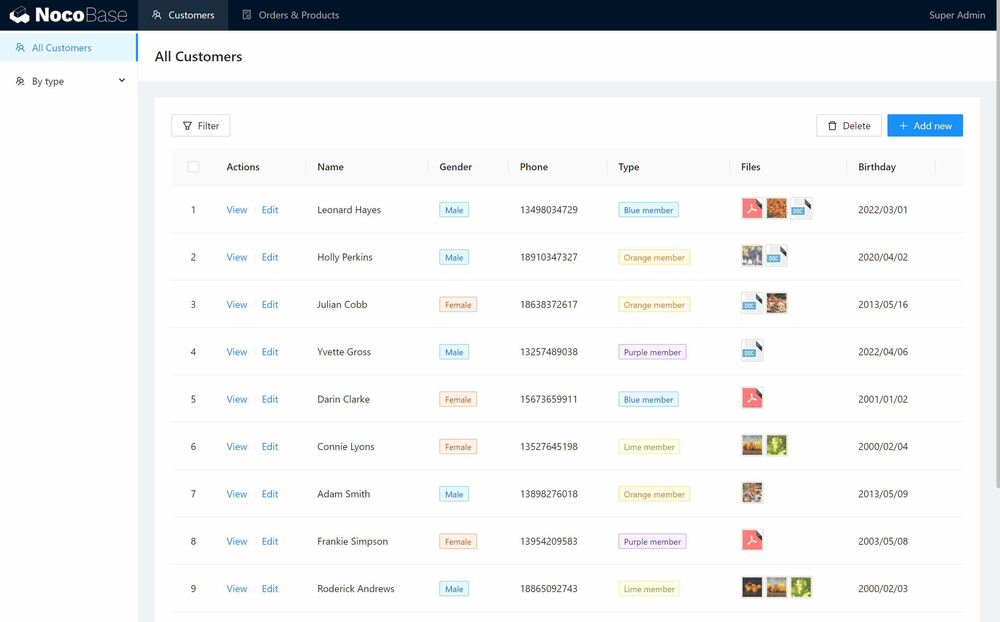

# NocoBase neden farklıdır?

## Ayrı "veri yapısı" ve "kullanıcı arayüzü"

Çoğu kodsuz(nocode) uygulamalar form, tablo veya süreç odaklıdır. bir tabloya yeni bir sütun eklemenin yeni bir alan eklemek anlamına geldiği Airtable gibi doğrudan kullanıcı arabiriminde veri yapıları oluşturur. Bu, kullanım kolaylığı avantajına sahiptir fakat daha karmaşık senaryoların ihtiyaçlarını karşılamak için sınırlı işlevsellik ve esneklik dezavantajına sahiptir.

NocoBase, veri yapısını kullanıcı arayüzünden ayırma tasarım fikrini benimser ve her blokta farklı tür, stil, içerik ve eylemlerle veri koleksiyonları için istediğiniz sayıda blok (veri görünümü) oluşturmanıza olanak tanır. Bu yapısal durum kodsuz işlemin basitliğini ve aynı zamanda yerel geliştirme gibi esnekliği de hesaba katar.

## 2. Ne görüyorsanız onu alırsınız

NocoBase, karmaşık ve farklı iş sistemlerinin geliştirilmesine olanak tanır, ancak bu karmaşık ve özel operasyonların gerekli olduğu anlamına gelmez. Tek bir tıklama ile kullanım arayüzünde yapılandırma seçenekleri görüntülenebilir. Bu da sistem yapılandırma haklarına sahip yöneticilerin kullanıcı arayüzünü doğrudan WYSIWYG işlemleri ile yapılandırılabileceği anlamına gelir.

## 3. Her şey bir eklenti

NocoBase eklenti mimarisini benimser, tüm yeni özellikler eklentiler geliştirip yükleyerek uygulanabilir. Gelecekte, işlevselliği genişletmenin telefonunuza bir uygulama yüklemek kadar kolay olduğu bir eklenti pazarı oluşturacağız.

