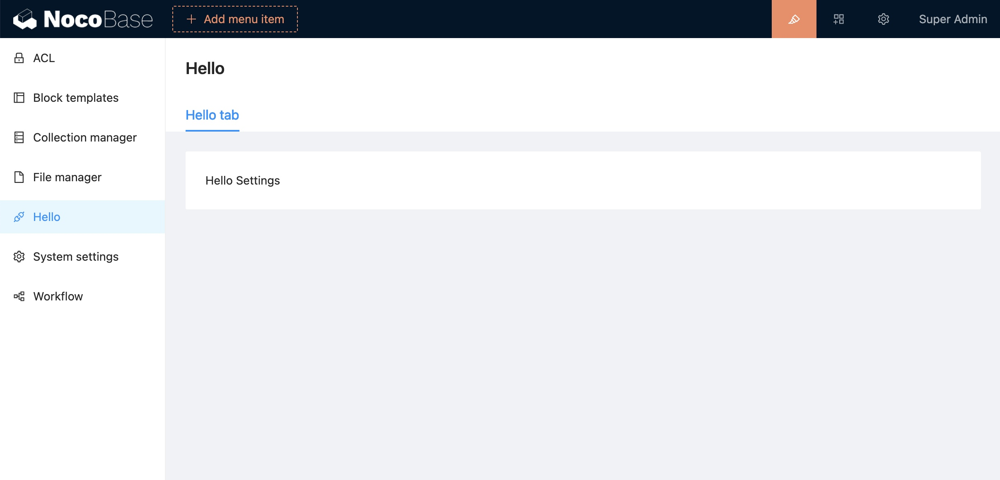

# 配置中心



## 示例

```tsx | pure
import { Plugin } from '@nocobase/client';
import React from 'react';

const HelloSettingPage = () => <div>Hello Setting page</div>;

export class HelloPlugin extends Plugin {
  async load() {
    this.app.settingsCenter.add('hello', {
      title: 'Hello',
      icon: 'ApiOutlined',
      component: HelloSettingPage,
    })
  }
}
```

完整示例查看 [samples/hello](https://github.com/nocobase/nocobase/blob/main/packages/plugins/%40nocobase/plugin-sample-hello/src/client/index.tsx)。
