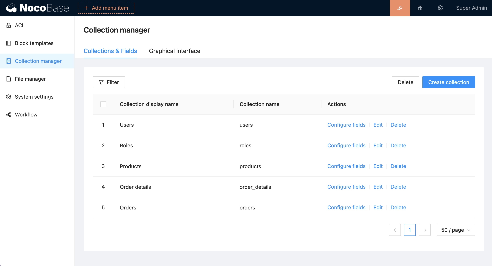
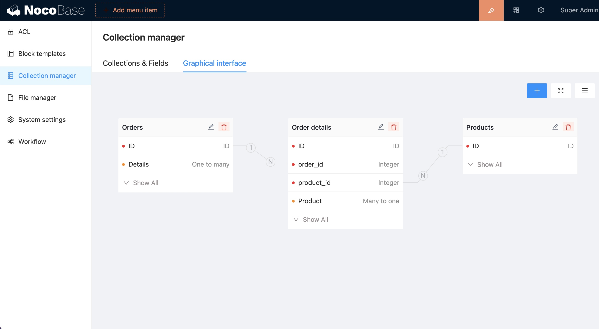

# 如何配置数据表？

NocoBase 有三种方式配置数据表：



## 通过界面配置数据表

业务数据一般建议使用界面配置，NocoBase 平台提供了两种界面配置数据表

### 常规的表格界面



### 图形化配置界面



## 在插件代码里定义

一般用于配置插件功能表或系统配置表，用户可以读写数据，但不能修改表结构。

```ts
export class MyPlugin extends Plugin {
  load() {
    this.db.collection();
    this.db.import();
  }
}
```

相关 API 参考

- [db.collection()](/api/database#collection)
- [db.import()](/api/database#import)

在插件里配置的 collection，插件激活时自动与数据库同步，生相对应的数据表和字段。

## 通过 REST API 管理数据表

第三方还可以通过 HTTP 接口管理数据表（需要开放权限）

### Collections

```bash
GET     /api/collections
POST    /api/collections
GET     /api/collections/<collectionName>
PUT     /api/collections/<collectionName>
DELETE  /api/collections/<collectionName>
```

### Collection fields

```bash
GET     /api/collections/<collectionName>/fields
POST    /api/collections/<collectionName>/fields
GET     /api/collections/<collectionName>/fields/<fieldName>
PUT     /api/collections/<collectionName>/fields/<fieldName>
DELETE  /api/collections/<collectionName>/fields/<fieldName>
```

