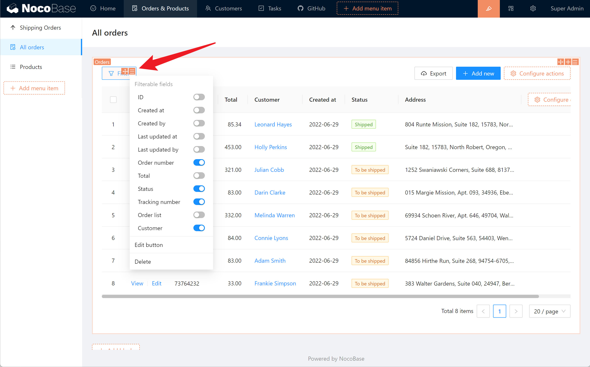

# 操作

`操作`是完成某个特定目标的动作集合。在 NocoBase 中通过 `操作`来处理数据或者与服务器通信。 操作通常会通过点击某个按钮触发。

## 操作类型

NocoBase 目前支持 10 几种操作，未来可以通过插件的方式支持更多种。

| 名称 | 描述 |
| --- | --- |
| 筛选 | 指定数据的显示范围 |
| 添加 | 打开添加新数据的弹窗，在弹窗里通常包含一个表单区块 |
| 查看 | 打开查看指定数据的弹窗，在弹窗里通常包含一个详情区块 |
| 编辑 | 打开修改指定数据的弹窗，在弹窗里通常包含一个表单区块 |
| 删除 | 打开删除指定数据的对话框，确认后删除 |
| 导出 | 将数据导出为 Excel，常和筛选组合使用 |
| 打印 | 打开浏览器打印窗口，打印指定的数据，常和详情区块组合使用 |
| 提交 | 将指定表单区块的数据提交到服务端 |
| 刷新 | 刷新当前区块内的数据 |
| 导入 | 从 Excel 模板中导入数据 |
| 批量编辑 | 批量编辑数据 |
| 批量更新 | 批量更新数据 |
| 打开弹窗 | 打开弹窗或抽屉，在里面可以放置区块 |
| 更新数据 | 点击后自动更新指定的字段 |
| 自定义请求 | 向第三方发送请求 |

## 配置操作

在界面配置模式下，将鼠标移到操作按钮上，右上角就会出现该操作支持的配置项。比如筛选操作：

