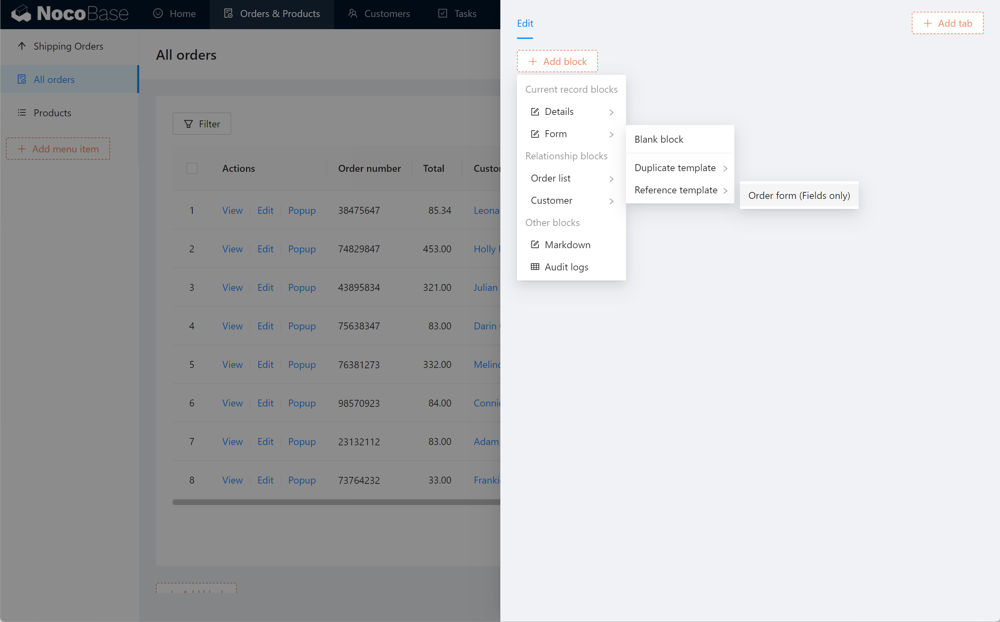

# 区块

区块是用来展示和操作数据的视图。在 NocoBase 里，将页面、弹窗、抽屉看作是区块的容器，容器就像一张画布，在里面可以放置各种各样的区块。

得益于 NocoBase 将数据与视图分离的设计，页面通过区块承载数据，并根据不同的区块类型，以不同的形式组织和管理数据。

## 区块结构

一个完整的区块由三部分组成：

1. 内容区：区块的主体
2. 操作区：可以放置各种操作按钮，用于操作区块数据
3. 配置区：操作区块配置的按钮

## 区块类型

NocoBase 目前内置 10 几种区块，未来可以通过插件的方式支持更多种。

- 数据区块：为组织数据而设计的区块。
    - 表格：以表格形式展示多条数据的区块，既可以展示一个数据表，也可以展示相互之间有关联关系的多个数据表。
    - 表单：以各种类型的输入框录入或编辑数据的区块，既可以为某一个数据表进行录入，也可以对相互之间有关联关系的多个数据表统一录入。
    - 详情：展示一条特定数据的区块，既可以对某一个数据表的某一条数据进行展示，也可以对相互之间有关联关系的多个数据表中的多条数据统一展示。
    - 日历：以日历的形式展示多条数据的区块，适合某些在日期上具备重要特征的数据。
    - 看板：以看板的形式展示多条数据的区块，适合用来对生产过程进行管理。
- 图表区块：为图形化展示统计数据而设计的区块。目前支持：柱状图、条形图、折线图、饼图、面积图等。
- 其他区块：为展示特殊数据而设计的区块。
    - Markdown：用 Markdown 书写的文本内容。
    - 操作记录：展示一个数据表中的所有数据的变更记录，包括新建、编辑和删除。

## 添加区块

进入界面配置模式，在页面和弹窗内点击 Add block 按钮即可添加区块。选项分为 4 步：

1. 选择区块类型：目前可用的区块类型包括表格、表单、详情、日历、看板、Markdown
2. 选择 Collection：此处会列出所有的 Collection
3. 选择创建方式：创建空白区块，或者从复制区块模板，或者引用区块模板
4. 选择模板：若第 3 步选择了从模板创建，则在第 4 步选择模板

## 配置区块

配置区块包括三方面的内容：

- 配置区块内容
- 配置区块操作
- 配置区块属性

### 配置区块内容

以表格区块为例，区块内容是指表格中要显示的列。点击 Configure columns 即可配置要显示的列：

### 配置区块操作

以表格区块为例，有筛选、添加、删除、查看、编辑、自定义等操作可选。点击 Configure actions 按钮可以配置操作。其中，每个操作按钮都可以单独配置属性：

### 配置区块属性

将光标移到区块右上角，会看到区块配置按钮。以表格区块为例，可以配置的属性有：

- Block title
- Drag & drop sorting
- Set the data scope
- Set default sorting rules
- Records per page

## 调整布局

页面内既可以只放一个区块，也可以放多个区块进行组合。你可以通过拖拽完成区块位置和宽度的调整。

## 区块模板

你可以将一个区块保存为模板，以后可以复制或引用这个模板。

比如，一个数据表的表单，既用于新增数据，又用于编辑数据，那就可以将这个表单保存为模板，在新增数据和编辑数据的界面里引用它。

